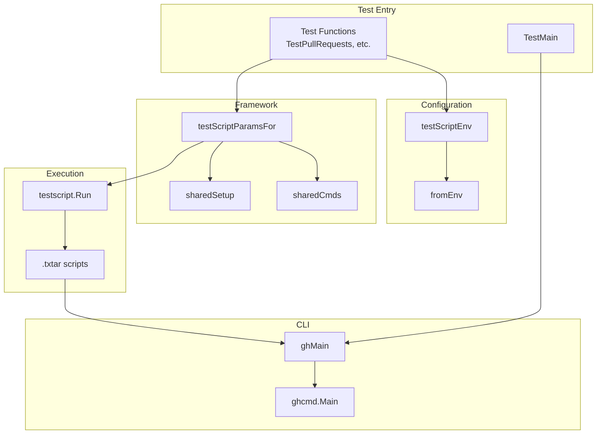
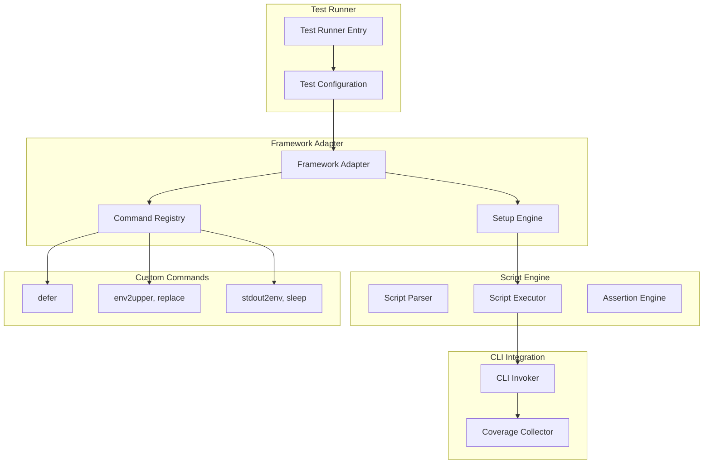
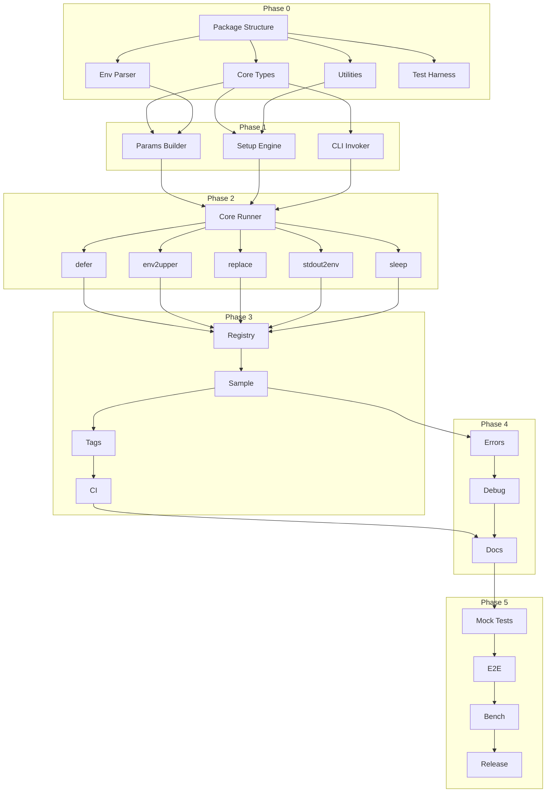

# Adaptation Guide: GitHub CLI Acceptance Testing

> **Source**: github.com/cli/cli (github-cli)
> **Generated**: 2026-01-27
> **Scope**: acceptance testing
> **Command**: `/feature-extractor acceptance testing @acceptance/`

---

## How to Use This Guide

This document is designed to be consumed by Claude Code (or similar AI coding assistants) to implement an adaptation of the analyzed software in your own project.

1. Copy this file to your target project
2. Provide it as context to Claude Code
3. Claude Code will use the requirements and design to guide implementation

---

<!-- SECTION: EXECUTIVE_SUMMARY -->
## Executive Summary

The GitHub CLI acceptance testing system is a production-proven framework for end-to-end testing of CLI tools against real APIs. It enables developers to write human-readable test scripts that create real resources, execute CLI commands, verify outputs, and automatically clean up - even on test failure.

**Key Capabilities:**
- Script-based tests in txtar format (readable, self-documenting)
- Real API integration testing (not mocked)
- Automatic resource cleanup via `defer` command
- Code coverage collection during acceptance tests
- Test isolation with unique identifiers (RANDOM_STRING)
- 5 custom commands: `defer`, `env2upper`, `replace`, `stdout2env`, `sleep`

**Why Adapt This:**
- Validates complete user workflows, not just unit behavior
- Catches integration issues that unit tests miss
- Tests are readable by non-developers
- Proven at scale (175+ tests, 17 command categories)

---

<!-- SECTION: SOURCE_ANALYSIS -->
## Source Analysis

### Codebase Overview

```
acceptance/
├── acceptance_test.go          # 422 lines - Main test harness
├── README.md                   # 196 lines - Complete documentation
└── testdata/                   # Test scripts organized by feature
    ├── api/                    # 2 test scripts
    ├── auth/                   # 4 test scripts
    ├── extension/              # 1 test script
    ├── gpg-key/                # 1 test script
    ├── issue/                  # 8 test scripts
    ├── label/                  # 1 test script
    ├── org/                    # 1 test script
    ├── pr/                     # 36 test scripts (largest)
    ├── project/                # 1 test script
    ├── release/                # 4 test scripts
    ├── repo/                   # 9 test scripts
    ├── ruleset/                # 1 test script
    ├── search/                 # 1 test script
    ├── secret/                 # 4 test scripts
    ├── ssh-key/                # 1 test script
    ├── variable/               # 3 test scripts
    └── workflow/               # 11 test scripts
```

**Language:** Go (100%)
**Framework:** `github.com/rogpeppe/go-internal/testscript`
**Build Constraint:** `//go:build acceptance`

### Architecture



**Entry Point Flow:**
```
TestMain()
  → testscript.RunMain(m, {"gh": ghMain})
    → TestPullRequests() (and 16 others)
      → testScriptEnv.fromEnv()
      → testscript.Run(t, testScriptParamsFor(tsEnv, "pr"))
        → sharedSetup() injects environment
        → Execute .txtar scripts
          → "exec gh" calls ghMain() → ghcmd.Main()
        → Run deferred cleanup commands
```

### Key Dependencies

| Dependency | Purpose | Alternatives |
|------------|---------|--------------|
| `github.com/cli/go-internal/testscript` | Script-based CLI testing | bats-core, pytest |
| Standard Go testing | Test framework | N/A |
| Real GitHub API | Integration target | Mock server |

### Patterns & Algorithms

**Design Patterns Used:**
1. **Template Method** - All test functions follow identical structure
2. **Builder** - `testScriptParamsFor` constructs configuration
3. **Command** - Custom commands as closures in registry
4. **Deferred Execution** - Cleanup via `ts.Defer`
5. **Test Fixture** - `sharedSetup` injects environment
6. **Strategy** - Environment-driven behavior changes

**Key Algorithms:**
- **Random String Generation**: 10-char alphabetic string for resource isolation
- **Script Name Extraction**: Parse from WORK variable, replace hyphens with underscores
- **Placeholder Replacement**: `$VAR` literal matching (not env expansion)

### I/O & Error Handling

**Error Strategy:**
- Fail-fast with clear messages
- Accumulate all missing env vars before failing
- Custom `missingEnvError` type

**Cleanup Guarantee:**
```go
ts.Defer(func() {
    if err := ts.Exec(args[0], args[1:]...); err != nil {
        tt.FailNow()  // Fail test if cleanup fails
    }
})
```

**No Retry Logic:** Uses fixed `sleep` delays for eventual consistency.

---

<!-- SECTION: PRODUCT_REQUIREMENTS -->
## Product Requirements

### Core Features

| Feature | Priority | Description |
|---------|----------|-------------|
| Script-Based Test Execution | Must Have | Execute .txtar scripts with shell-like syntax |
| Test Isolation | Must Have | Unique identifiers, separate work directories |
| Automatic Cleanup | Must Have | `defer` command runs even on failure |
| Output Assertions | Must Have | Regex matching on stdout/stderr |
| Inline Test Fixtures | Must Have | Embed files in .txtar format |
| Code Coverage | Should Have | Direct CLI invocation enables coverage |
| Environment Configuration | Must Have | Parse from env vars with validation |

### User Stories

**Test Author:**
- Write tests in human-readable script format
- Create resources with unique names
- Register cleanup that runs on failure
- Assert command output with regex
- Embed test fixtures inline

**CI Engineer:**
- Run all tests with required environment
- Filter to specific test categories
- Collect code coverage metrics
- See clear failure messages

### Non-Functional Requirements

- **Isolation**: Tests must not share state
- **Cleanup Reliability**: Deferred commands must execute even on failure
- **Security**: Tokens should not appear in logs (best effort)
- **Usability**: Tests should be readable without framework knowledge

### Acceptance Criteria

- [ ] Single test script can execute against real API
- [ ] Resource cleanup runs on both success and failure
- [ ] Random string prevents naming conflicts
- [ ] stdout/stderr regex assertions work
- [ ] Code coverage can be collected
- [ ] Environment validation fails fast with clear message

### Out of Scope

- Mocked GitHub API mode
- Token scope pre-validation
- Automatic retry on rate limits
- Cross-script resource sharing
- Interactive/prompt-based tests
- Comprehensive token redaction

---

<!-- SECTION: TECHNICAL_DESIGN -->
## Technical Design

### Recommended Architecture



### Component Design

**TestConfiguration:**
```go
type TestConfiguration struct {
    Host            string  // e.g., "github.com"
    Organization    string  // Namespace for resources
    Token           string  // Authentication
    Script          string  // Optional: specific script
    SkipDefer       bool    // Debug: skip cleanup
    PreserveWorkDir bool    // Debug: keep temp dirs
}
```

**SetupEngine:**
```go
func SharedSetup(config TestConfiguration) func(*testscript.Env) error {
    return func(ts *testscript.Env) error {
        ts.Setenv("SCRIPT_NAME", sanitizedScriptName)
        ts.Setenv("RANDOM_STRING", randomString(10))
        ts.Setenv("HOME", ts.Cd)
        ts.Setenv("GH_CONFIG_DIR", ts.Cd)
        ts.Setenv("GH_HOST", config.Host)
        ts.Setenv("ORG", config.Organization)
        ts.Setenv("GH_TOKEN", config.Token)
        ts.Values[keyT] = ts.T()  // Store for defer
        return nil
    }
}
```

**CommandRegistry:**
```go
type CommandHandler func(ts *testscript.TestScript, neg bool, args []string)

func SharedCommands(config TestConfiguration) map[string]CommandHandler {
    return map[string]CommandHandler{
        "defer":     deferCommand(config.SkipDefer),
        "env2upper": env2upperCommand(),
        "replace":   replaceCommand(),
        "stdout2env": stdout2envCommand(),
        "sleep":     sleepCommand(),
    }
}
```

### Data Models

**Test Script (.txtar):**
```
# Comment describing test
exec command args
stdout pattern
! exec command-that-fails
defer cleanup command

-- embedded-file.txt --
File content here
```

**Environment Variables:**
| Variable | Required | Purpose |
|----------|----------|---------|
| `<PREFIX>_HOST` | Yes | API host |
| `<PREFIX>_ORG` | Yes | Resource namespace |
| `<PREFIX>_TOKEN` | Yes | Authentication |
| `<PREFIX>_SCRIPT` | No | Run specific script |
| `<PREFIX>_PRESERVE_WORK_DIR` | No | Keep temp dir |
| `<PREFIX>_SKIP_DEFER` | No | Skip cleanup |

### Integration Points

**CLI Registration:**
```go
func TestMain(m *testing.M) {
    os.Exit(testscript.RunMain(m, map[string]func() int{
        "mycli": func() int { return int(mycmd.Main()) },
    }))
}
```

**Test Function Pattern:**
```go
func TestFeature(t *testing.T) {
    var tsEnv testScriptEnv
    if err := tsEnv.fromEnv(); err != nil {
        t.Fatal(err)
    }
    testscript.Run(t, testScriptParamsFor(tsEnv, "feature"))
}
```

### Technology Recommendations

| Need | Recommendation | Alternatives |
|------|----------------|--------------|
| Script Framework | go-internal/testscript | bats-core, custom |
| Script Format | txtar | YAML, shell |
| Assertions | Regex stdout/stderr | JSON path, golden files |
| CLI Invocation | Direct function call | Binary subprocess |

---

<!-- SECTION: IMPLEMENTATION_PLAN -->
## Implementation Plan

### Task Breakdown

| ID | Task | Phase | Complexity | Depends On |
|----|------|-------|------------|------------|
| T001 | Package structure | 0 | S | - |
| T002 | Core interface types | 0 | M | T001 |
| T003 | Environment parser | 0 | M | T001, T002 |
| T004 | Test utilities | 0 | S | T001 |
| T005 | Test harness | 0 | M | T001 |
| T006 | Params builder | 1 | M | T002, T003 |
| T007 | Setup engine | 1 | M | T002, T004 |
| T008 | CLI invoker | 1 | L | T002 |
| T009 | Core runner | 2 | L | T006-T008 |
| T010 | defer command | 2 | L | T004, T009 |
| T011 | env2upper command | 2 | S | T005, T009 |
| T012 | replace command | 2 | M | T009 |
| T013 | stdout2env command | 2 | S | T009 |
| T014 | sleep command | 2 | S | T009 |
| T015 | Command registry | 3 | M | T010-T014 |
| T016 | Sample adapter | 3 | L | T015 |
| T017 | Build tags | 3 | S | T016 |
| T018 | CI templates | 3 | M | T017 |
| T019 | Error handling | 4 | M | T016 |
| T020 | Debug mode | 4 | M | T016, T019 |
| T021 | Documentation | 4 | L | T018, T020 |
| T022 | Mock API tests | 5 | L | T021 |
| T023 | E2E validation | 5 | M | T022 |
| T024 | Benchmarks | 5 | M | T023 |
| T025 | Release prep | 5 | M | T024 |

### Dependency Graph



### Phased Roadmap

**Phase 0: Shared Infrastructure** (MUST complete first)
- Go module and package structure
- Core interfaces and types
- Environment configuration parser
- Utility functions (random strings)
- Test harness for framework itself

**Phase 1: Foundation**
- Params builder for testscript configuration
- Setup engine for environment injection
- CLI invoker registration

**Phase 2: Core Features**
- Core test runner
- All 5 custom commands (defer, env2upper, replace, stdout2env, sleep)

**Phase 3: Integration**
- Command registry
- Sample CLI adapter
- Build tag support
- CI workflow templates

**Phase 4: Polish**
- Enhanced error handling
- Debug/verbose mode
- Comprehensive documentation

**Phase 5: Validation**
- Mock API integration tests
- End-to-end validation suite
- Performance benchmarks
- Release preparation

### Build Order

**Solo Developer Sequence:**
1. T001 → T002 → T004 → T005 → T003
2. T006 → T007 → T008 → T009
3. T010 → T013 → T014 → T011 → T012
4. T015 → T016 → T017 → T019 → T020
5. T018 → T021 → T022 → T023 → T024 → T025

**Team Parallelization:**
- Stream A: T001 → T002 → T006 → T007 → T009 → T015 → T016
- Stream B: T004 → T005 → T011 → T013 → T014 → T010 → T012
- Stream C: T003 → T008 → T017 → T018
- Sync after T016, then T019 → T020 → T021 → validation

**Estimated Effort:**
- Solo: 8-12 weeks
- Team of 2-3: 4-6 weeks

---

<!-- SECTION: ADAPTATION_NOTES -->
## Adaptation Notes

### Key Decisions

| Decision | Options | Recommendation |
|----------|---------|----------------|
| CLI Invocation | Direct call vs subprocess | Direct call (enables coverage) |
| Cleanup Strategy | Inline vs deferred | Deferred (guaranteed execution) |
| Test Organization | Flat vs by-command | By-command (matches CLI structure) |
| Environment Prefix | Custom vs standard | Mixed (framework prefixed, test vars not) |
| Custom Commands | Minimal vs rich | Minimal (5 commands is sufficient) |

### What to Preserve vs Change

**Must Preserve:**
- `defer` command pattern (critical for cleanup)
- RANDOM_STRING for resource isolation
- Direct CLI invocation for coverage
- Environment-based configuration
- txtar script format

**Can Adapt:**
- Environment variable prefix
- Test category organization
- Custom command set
- Assertion patterns

**Consider Changing:**
- Add retry logic for flaky APIs
- Add pre-flight scope validation
- Add parallel test execution
- Use polling instead of sleep

### Common Pitfalls

1. **Forgetting defer cleanup** → Orphaned resources
2. **Hardcoded resource names** → Test conflicts
3. **Using subprocess for all tests** → Lose coverage
4. **Logging tokens** → Security vulnerability
5. **Complex custom commands** → Portability issues

### Risk Areas

| Risk | Likelihood | Impact | Mitigation |
|------|------------|--------|------------|
| Token exposure in logs | Medium | High | Redact patterns |
| Cleanup failure | Medium | Medium | Robust defer handling |
| Rate limiting | Medium | Medium | Add retry logic |
| Test interdependence | Low | High | Use RANDOM_STRING |

---

<!-- SECTION: APPENDICES -->
## Appendices

### A. Entry Points Reference

**TestMain (line 23):**
```go
func TestMain(m *testing.M) {
    os.Exit(testscript.RunMain(m, map[string]func() int{
        "gh": ghMain,
    }))
}
```

**Test Functions (17 total):**
- TestAPI, TestAuth, TestExtensions, TestGPGKeys
- TestIssues, TestLabels, TestOrg, TestProject
- TestPullRequests, TestReleases, TestRepo, TestRulesets
- TestSearches, TestSecrets, TestSSHKeys, TestVariables
- TestWorkflows

### B. API Surface Reference

**Custom Commands:**
| Command | Syntax | Purpose |
|---------|--------|---------|
| defer | `defer cmd [args...]` | Register cleanup |
| env2upper | `env2upper VAR=value` | Uppercase variable |
| replace | `replace file VAR=value...` | Replace in file |
| stdout2env | `stdout2env VAR` | Capture stdout |
| sleep | `sleep seconds` | Pause execution |

**Environment Variables (Injected):**
| Variable | Source |
|----------|--------|
| SCRIPT_NAME | Derived from filename |
| RANDOM_STRING | Generated (10 chars) |
| HOME | Work directory |
| GH_CONFIG_DIR | Work directory |
| GH_HOST | GH_ACCEPTANCE_HOST |
| ORG | GH_ACCEPTANCE_ORG |
| GH_TOKEN | GH_ACCEPTANCE_TOKEN |

### C. Testing Strategy

**Test Script Pattern:**
```txtar
# Setup
exec gh repo create $ORG/$SCRIPT_NAME-$RANDOM_STRING --private
defer gh repo delete --yes $ORG/$SCRIPT_NAME-$RANDOM_STRING

# Execute
exec gh issue create --title 'Test'
stdout2env ISSUE_URL

# Verify
exec gh issue view $ISSUE_URL
stdout 'Test'

-- optional-file.txt --
Inline fixture content
```

**Assertion Types:**
- `stdout 'pattern'` - Regex match stdout
- `stderr 'pattern'` - Regex match stderr
- `! exec cmd` - Command must fail
- `! stdout 'pattern'` - Pattern must not match
- `exists file` - File must exist

### D. Infrastructure Requirements

**Required:**
- Go 1.21+ (per go.mod)
- git CLI
- Network access to GitHub API
- Legacy Personal Access Token with scopes: repo, workflow, admin:*, delete_repo

**Running Tests:**
```bash
GH_ACCEPTANCE_HOST=github.com \
GH_ACCEPTANCE_ORG=<org> \
GH_ACCEPTANCE_TOKEN=<token> \
go test -tags=acceptance ./acceptance
```

**Debug Options:**
- `-v` for verbose output
- `GH_ACCEPTANCE_PRESERVE_WORK_DIR=true` to keep temp dirs
- `GH_ACCEPTANCE_SKIP_DEFER=true` to skip cleanup

### E. Full Dependency Catalog

**Go Dependencies:**
| Package | Version | Purpose |
|---------|---------|---------|
| github.com/cli/go-internal | v1.x | testscript framework |

**External Tools:**
| Tool | Required | Purpose |
|------|----------|---------|
| git | Yes | Repository operations |
| gh (self) | Yes | CLI under test |

**API Requirements:**
| Endpoint | Scopes |
|----------|--------|
| repos | repo, delete_repo |
| issues | repo |
| pull requests | repo |
| workflows | workflow |
| secrets | admin:org |
| keys | admin:public_key, admin:gpg_key |

---

## Quick Start

To adapt this to your CLI:

1. **Copy the framework structure:**
   ```
   acceptance/
   ├── acceptance_test.go
   ├── README.md
   └── testdata/<command>/
   ```

2. **Implement TestMain:**
   ```go
   func TestMain(m *testing.M) {
       os.Exit(testscript.RunMain(m, map[string]func() int{
           "mycli": func() int { return int(mycmd.Main()) },
       }))
   }
   ```

3. **Create test configuration:**
   ```go
   type testScriptEnv struct {
       host, org, token string
       // ... options
   }
   ```

4. **Implement custom commands** (at minimum: `defer`, `stdout2env`)

5. **Write test scripts:**
   ```txtar
   exec mycli create $ORG/$SCRIPT_NAME-$RANDOM_STRING
   defer mycli delete $ORG/$SCRIPT_NAME-$RANDOM_STRING
   exec mycli list
   stdout $SCRIPT_NAME
   ```

6. **Run tests:**
   ```bash
   MYCLI_ACCEPTANCE_HOST=api.example.com \
   MYCLI_ACCEPTANCE_TOKEN=$TOKEN \
   go test -tags=acceptance ./acceptance
   ```

---

*Generated by Feature Extractor for Claude Code*
