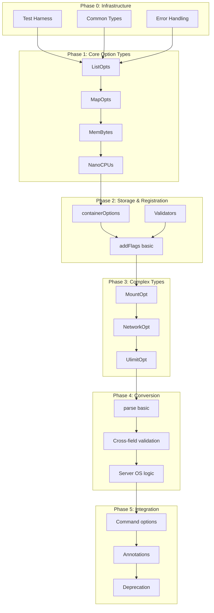

# Container Options DRY Pattern Adaptation PRD

> **Source**: Docker CLI (github.com/docker/cli)
> **Generated**: 2026-01-27
> **Scope**: Container options DRY pattern - shared flags for container-related commands
> **Command**: `/feature-extractor implementation of container options`

---

## How to Use This Guide

This document is designed to be consumed by Claude Code (or similar AI coding assistants) to implement an adaptation of Docker CLI's container options pattern in your own CLI project.

1. Copy this entire directory to your target project
2. Provide this PRD file as context to Claude Code
3. Claude Code will use the requirements, design, and supplemental documents to guide implementation

**Note:** All supplemental documents are linked with relative paths and will work when this directory is copied to any location.

---

## Supplemental Documents

Detailed analysis for each area is available in the linked documents:

| Document | Description |
|----------|-------------|
| [Codebase Structure](codebase-structure.md) | Repository structure, languages, organization |
| [Dependency Catalog](dependency-catalog.md) | External dependencies with purposes and alternatives |
| [Entry Points](entry-points.md) | Execution entry points and request flows |
| [Architecture](architecture.md) | High-level architecture and component relationships |
| [Patterns](patterns.md) | Code patterns, conventions, and algorithmic approaches |
| [I/O & Error Handling](io-error-handling.md) | Data flow, error strategies, resilience patterns |
| [Testing Strategy](testing-strategy.md) | Test organization, patterns, and coverage approach |
| [Infrastructure](infrastructure.md) | Build system, deployment, and operational requirements |
| [API Surface](api-surface.md) | Public interfaces, endpoints, and contracts |
| [Product Requirements](product-requirements.md) | Features, user stories, and acceptance criteria |
| [Technical Design](technical-design.md) | Architecture recommendations and component designs |
| [Implementation Plan](implementation-plan.md) | Task breakdown, dependencies, and phased roadmap |

---

## Executive Summary

The **Container Options DRY Pattern** is a battle-tested architectural pattern used by Docker CLI to manage **98+ command-line flags** that are shared across multiple container-related commands (`docker run`, `docker create`, `docker exec`, etc.).

### Key Capabilities

- **Single Source of Truth**: All container flags are defined exactly once
- **Type-Safe Parsing**: Custom option types with built-in validation
- **Command Composition**: Commands inherit shared flags via single function call
- **API Versioning**: Flags annotated with minimum daemon API version
- **Platform Specificity**: OS-specific flags (Windows-only, Linux-only)
- **Backward Compatibility**: Graceful deprecation and flag aliases

### Why Adapt This Pattern?

If you're building a CLI tool that:
- Has multiple commands sharing common flags
- Needs type-safe flag parsing with validation
- Wants consistent user experience across commands
- Requires extensibility for new flags and commands

This pattern provides a proven solution used in production by millions of Docker users.

---

## Source Analysis

### Codebase Overview

The Docker CLI repository (~3,500+ files) is a mature Go-based command-line tool built on **Cobra** (command framework) and **pflag** (flag parsing).

**Key Files**:
- `cli/command/container/opts.go` (1,155 lines) - Core pattern implementation
- `cli/command/container/run.go` - Example command integration
- `cli/command/container/create.go` - Another command using the pattern
- `opts/` package - Custom option types

See [codebase-structure.md](codebase-structure.md) for complete details.

### Architecture

The pattern implements a **three-layer abstraction**:

```
┌─────────────────────────────────────────────────────────────────┐
│                      Command Layer                               │
│   runOptions { createOptions, detach, sigProxy }                │
│   createOptions { name, platform, pull }                         │
└─────────────────────────┬───────────────────────────────────────┘
                          │ embeds / composes
                          ▼
┌─────────────────────────────────────────────────────────────────┐
│              Storage Layer: containerOptions                     │
│   98 fields: env, volumes, memory, cpus, network, mounts...     │
│   Uses: ListOpts, MapOpts, MemBytes, NanoCPUs, MountOpt...      │
└─────────────────────────┬───────────────────────────────────────┘
                          │ addFlags(flags) registers all flags
                          ▼
┌─────────────────────────────────────────────────────────────────┐
│                    Flag Layer (pflag)                            │
│   Flag definitions, help text, validators, annotations          │
└─────────────────────────┬───────────────────────────────────────┘
                          │ parse(flags, copts, serverOS) converts
                          ▼
┌─────────────────────────────────────────────────────────────────┐
│                    API Types Layer                               │
│   containerConfig { Config, HostConfig, NetworkingConfig }      │
└─────────────────────────────────────────────────────────────────┘
```

See [architecture.md](architecture.md) for complete details.

### Key Dependencies

| Dependency | Purpose | Replaceability |
|------------|---------|----------------|
| spf13/pflag | Flag parsing, Value interface | Hard (core) |
| spf13/cobra | Command framework | Medium |
| moby/moby/api/types | API structures | Hard (defines API) |
| docker/go-units | Memory/size parsing | Easy |

See [dependency-catalog.md](dependency-catalog.md) for complete details.

### Patterns & Algorithms

**Core Patterns**:
1. **Intermediate Storage Pattern** - `containerOptions` decouples parsing from conversion
2. **Strategy Pattern** - Validator functions injected at construction
3. **pflag.Value Interface** - Custom types implement `Set()`, `String()`, `Type()`
4. **Two-Phase Validation** - Immediate (parsing) + Deferred (cross-field)
5. **Factory Method** - `NewListOpts()`, `NewMapOpts()` for construction

See [patterns.md](patterns.md) for complete details.

### I/O & Error Handling

**Error Handling Strategy**:
- Validators return `(string, error)` for immediate feedback
- `parse()` returns first error encountered (fail-fast)
- `withHelp()` wrapper adds user-friendly hints
- `StatusError` provides scriptable exit codes

**File I/O**:
- `--env-file`: UTF-8 validated, line-number tracking
- `--label-file`: Same infrastructure
- `--security-opt seccomp=FILE`: JSON validation

See [io-error-handling.md](io-error-handling.md) for complete details.

---

## Product Requirements

### Core Features

1. **Centralized Flag Definition** - Single source of truth for all container flags
2. **Type-Safe Custom Options** - ListOpts, MapOpts, MemBytes, NanoCPUs, etc.
3. **Validation at Parse Time** - Immediate feedback on invalid values
4. **API Version Annotations** - Automatic compatibility checking
5. **Backward Compatibility** - Aliases, deprecation markers
6. **Clean API Conversion** - Transform to backend structures

### User Stories

**US-1**: As a CLI developer, I want to define container flags once and share them across run, create, and exec commands, so that I don't duplicate flag definitions.

**US-2**: As a CLI developer, I want custom types that parse and validate values like "512m" to bytes, so that users get immediate feedback on invalid values.

**US-3**: As a CLI developer, I want to annotate flags with minimum API versions, so that incompatible flags are automatically rejected for older daemons.

**US-4**: As a CLI developer, I want to deprecate flags gracefully with warnings, so that users have time to migrate.

See [product-requirements.md](product-requirements.md) for complete details with acceptance criteria.

### Non-Functional Requirements

- **Maintainability**: Flag changes require 1-3 code locations max
- **Extensibility**: New commands inherit flags via single function call
- **Testability**: Pure functions, table-driven tests, fake clients
- **Performance**: O(n) parsing, validation runs once per value

### Out of Scope

- Command execution logic (what happens after flags are parsed)
- API client implementation (how to call the daemon)
- Configuration file support (only covers CLI flags)
- Internationalization of error messages

---

## Technical Design

### Recommended Architecture

Implement the **Three-Layer Pipeline**:

```go
// Layer 1: Storage
type containerOptions struct {
    env     opts.ListOpts     // repeatable: -e KEY=val
    memory  opts.MemBytes     // typed: --memory 512m
    sysctls *opts.MapOpts     // key-value: --sysctl key=val
    // ... 95 more fields
}

// Layer 2: Registration
func addFlags(flags *pflag.FlagSet) *containerOptions {
    copts := &containerOptions{
        env:     opts.NewListOpts(opts.ValidateEnv),
        sysctls: opts.NewMapOpts(nil, opts.ValidateSysctl),
    }
    flags.VarP(&copts.env, "env", "e", "Set environment variables")
    flags.Var(&copts.memory, "memory", "Memory limit")
    // ... register all flags
    return copts
}

// Layer 3: Conversion
func parse(flags *pflag.FlagSet, copts *containerOptions, serverOS string) (*containerConfig, error) {
    // Cross-field validation
    // Type conversion
    // Build API structures
    return &containerConfig{
        Config:     config,
        HostConfig: hostConfig,
    }, nil
}
```

### Component Design

**Custom Option Types must implement pflag.Value**:

```go
type Value interface {
    String() string      // Current value as string
    Set(string) error    // Parse and validate input
    Type() string        // Type name for help text
}
```

**Validator Function Signature**:

```go
type ValidatorFctType func(val string) (string, error)
```

### Data Models

**Intermediate Storage** (`containerOptions`):
- Flat structure with 98 fields
- Uses custom types for complex parsing
- Unexported for encapsulation

**Output Structure** (`containerConfig`):
- Maps to backend API types
- Three components: Config, HostConfig, NetworkingConfig

See [technical-design.md](technical-design.md) for complete details.

### Technology Recommendations

**For Go Projects**:
- Use spf13/pflag and spf13/cobra
- Implement pflag.Value for custom types
- Use `opts.NewListOpts(validator)` pattern

**For Python Projects**:
- Use click or argparse with custom types
- Implement `ParamType` (click) or custom Action (argparse)
- Use dataclasses for intermediate storage

**For Rust Projects**:
- Use clap with derive macros
- Implement `FromStr` for custom types
- Use builder pattern for registration

**For TypeScript Projects**:
- Use commander or yargs
- Use Zod or io-ts for validation
- Use class-based storage with decorators

---

## Implementation Plan

### Task Breakdown

**35 tasks** organized across **6 phases** with **15-20 developer days** estimated effort.

### Dependency Graph



### Phased Roadmap

| Phase | Focus | Duration | Deliverables |
|-------|-------|----------|--------------|
| 0 | Infrastructure | 1-2 days | Test harness, types, errors |
| 1 | Core Types | 2-3 days | ListOpts, MapOpts, MemBytes |
| 2 | Storage | 2-3 days | containerOptions, addFlags |
| 3 | Complex Types | 3-4 days | MountOpt, NetworkOpt |
| 4 | Conversion | 3-4 days | parse(), validation |
| 5 | Integration | 2-3 days | Commands, annotations |
| 6 | Polish | 1-2 days | E2E tests, docs |

### Build Order

1. **Start with tests** - Build test infrastructure first
2. **Bottom-up types** - ListOpts → MapOpts → MemBytes → Complex
3. **Wire incrementally** - Add flags one category at a time
4. **Validate early** - Add parse() with basic types before complex
5. **Integrate last** - Command composition after core is solid

See [implementation-plan.md](implementation-plan.md) for complete details.

---

## Adaptation Notes

### Key Decisions

When adapting this pattern, you must decide:

1. **Which flags to share?** - Identify common flags across your commands
2. **What custom types?** - Determine parsing needs (memory, duration, lists)
3. **What validators?** - Define validation rules per flag type
4. **What output structure?** - Map to your backend API types
5. **How to compose commands?** - Embedding vs explicit composition

### What to Preserve vs Change

**Preserve**:
- Three-layer separation (storage → registration → conversion)
- Custom types implementing flag interface
- Validator injection at construction
- Single `addFlags()` function for all shared flags
- Explicit vs default detection via `flags.Changed()`

**Change/Adapt**:
- Field names to match your domain
- Custom types to match your parsing needs
- Output structures to match your API
- Validators to match your rules

### Common Pitfalls

1. **Don't skip the intermediate struct** - Direct flag-to-API conversion doesn't scale
2. **Don't validate in conversion only** - Users want immediate feedback
3. **Don't nest the options struct** - Flat is easier to maintain at scale
4. **Don't forget `flags.Changed()`** - Distinguishing explicit from default is critical
5. **Don't couple validators to types** - Inject them for flexibility

### Risk Areas

| Risk | Impact | Mitigation |
|------|--------|------------|
| Complex type parsing | Medium | Start simple, iterate |
| Cross-field conflicts | Medium | Document conflicts early |
| API compatibility | High | Use version annotations |
| Testing complexity | Medium | Invest in test helpers |

---

## Appendices

For detailed reference information, see the supplemental documents:

- **Entry Points**: [entry-points.md](entry-points.md) - Execution flow from command to API
- **API Surface**: [api-surface.md](api-surface.md) - Public interfaces and contracts
- **Testing Strategy**: [testing-strategy.md](testing-strategy.md) - Test patterns and helpers
- **Infrastructure**: [infrastructure.md](infrastructure.md) - Build system and tooling
- **Full Dependency Catalog**: [dependency-catalog.md](dependency-catalog.md) - All dependencies with alternatives

---

## Quick Reference

### Core Files in Docker CLI

```
cli/command/container/
├── opts.go          # containerOptions, addFlags(), parse()
├── opts_test.go     # Comprehensive unit tests
├── run.go           # docker run command
├── create.go        # docker create command
└── ...

opts/
├── opts.go          # ListOpts, MapOpts, validators
├── mount.go         # MountOpt
├── network.go       # NetworkOpt
├── ulimit.go        # UlimitOpt
└── ...
```

### Essential Code Patterns

**Custom Type (pflag.Value)**:
```go
type MemBytes int64

func (m *MemBytes) Set(value string) error {
    val, err := units.RAMInBytes(value)
    *m = MemBytes(val)
    return err
}
func (m *MemBytes) String() string { return fmt.Sprintf("%d", *m) }
func (m *MemBytes) Type() string   { return "bytes" }
func (m *MemBytes) Value() int64   { return int64(*m) }
```

**Validator Injection**:
```go
env := opts.NewListOpts(opts.ValidateEnv)
```

**Flag Registration**:
```go
flags.VarP(&copts.env, "env", "e", "Set environment variables")
flags.SetAnnotation("env", "version", []string{"1.25"})
```

**Command Integration**:
```go
copts := addFlags(cmd.Flags())
// ... in RunE:
cfg, err := parse(flags, copts, serverOS)
```

---

*Generated by Feature Extractor - a Claude Code skill for analyzing and documenting code patterns*
