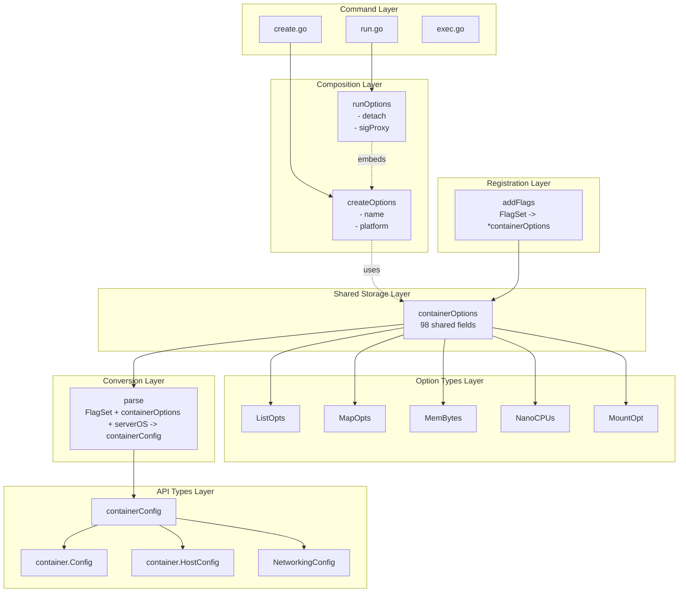
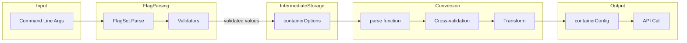

# Technical Design: Container Options DRY Pattern

> Generated by architect-synthesizer for docker/docker-cli
> Focus: Shared flags architecture for container-related CLI commands

---

## Design Overview

**Recommended Style:** Three-Layer Pipeline Architecture
**Organization Pattern:** Separation by concern (storage, registration, conversion) with shared options package
**Key Insight:** The pattern's power comes from validator injection at construction time, enabling immediate feedback during flag parsing while keeping type-safe conversion deferred.

The Docker CLI container options pattern is a **pipeline architecture** that transforms raw command-line strings through three distinct phases:

1. **Storage Layer** - Intermediate struct holding parsed values in custom types
2. **Registration Layer** - Single function that wires flags to storage with validators
3. **Conversion Layer** - Transform function producing API-ready structures

This separation enables 98+ flags to be defined once and shared across multiple commands (`run`, `create`, etc.) without duplication.

---

## Architectural Diagram



---

## Component Design

### Component: Option Types (opts package)

**Responsibility:** Provide type-safe custom flag types that implement the standard flag value interface with optional validation.

**Public Interface:**

```go
// Core interface all option types must implement (pflag.Value)
interface FlagValue {
    String() string           // String representation for display
    Set(value string) error   // Parse and store value, return error on failure
    Type() string             // Type name for help text (e.g., "bytes", "list")
}

// Extended interface for retrieving typed values
interface TypedValue<T> {
    Value() T                 // Return strongly-typed internal value
}

// Validator function signature
type ValidatorFctType func(val string) (string, error)

// ListOpts - repeatable string flags
interface ListOpts {
    NewListOpts(validator ValidatorFctType) ListOpts
    Set(value string) error
    GetSlice() []string
    GetMap() map[string]struct{}
    Len() int
}

// MapOpts - key=value pair flags
interface MapOpts {
    NewMapOpts(values map[string]string, validator ValidatorFctType) *MapOpts
    Set(value string) error
    GetAll() map[string]string
}

// MemBytes - human-readable memory (512m, 1g)
interface MemBytes {
    Set(value string) error   // Parses "512m" -> 536870912
    Value() int64             // Returns bytes as int64
}

// NanoCPUs - fractional CPU (1.5 -> 1500000000)
interface NanoCPUs {
    Set(value string) error   // Parses "1.5" -> 1500000000
    Value() int64             // Returns nanoseconds as int64
}
```

**Internal Structure:**

| Subcomponent | Purpose |
|--------------|---------|
| `values` field | Internal storage (slice, map, or primitive) |
| `validator` field | Optional validation function called during Set() |

**Dependencies:**
- Depends on: Standard library (`strings`, `fmt`), unit parsing library (`docker/go-units`)
- Depended on by: `containerOptions`, command implementations

**Implementation Notes:**
- Validators run during `Set()`, enabling immediate user feedback
- Validators can normalize values (e.g., lowercase, trim whitespace)
- Return empty/zero from `String()` to hide defaults in help output
- The `Type()` method determines the help text (e.g., "list", "bytes", "decimal")

---

### Component: Intermediate Storage (containerOptions)

**Responsibility:** Hold all parsed flag values in type-safe custom types, serving as the single source of truth for shared container configuration.

**Public Interface:**

```go
// containerOptions is the intermediate storage struct
// Note: fields are unexported for encapsulation
struct containerOptions {
    // Repeatable string flags (ListOpts)
    attach              ListOpts    // -a, --attach
    volumes             ListOpts    // -v, --volume
    env                 ListOpts    // -e, --env
    labels              ListOpts    // -l, --label
    publish             ListOpts    // -p, --publish
    dns                 ListOpts    // --dns
    // ... 20+ more ListOpts fields

    // Key-value pair flags (MapOpts)
    sysctls             *MapOpts    // --sysctl
    annotations         *MapOpts    // --annotation

    // Unit-aware types
    memory              MemBytes    // -m, --memory
    memoryReservation   MemBytes    // --memory-reservation
    cpus                NanoCPUs    // --cpus
    shmSize             MemBytes    // --shm-size

    // Complex structured types
    mounts              MountOpt    // --mount
    netMode             NetworkOpt  // --network
    ulimits             *UlimitOpt  // --ulimit
    gpus                GpuOpts     // --gpus

    // Simple primitives
    privileged          bool        // --privileged
    hostname            string      // -h, --hostname
    cpuShares           int64       // -c, --cpu-shares
    // ... 30+ more primitive fields

    // Positional arguments (exported for command access)
    Image               string
    Args                []string
}
```

**Internal Structure:**

| Category | Count | Examples |
|----------|-------|----------|
| ListOpts fields | ~25 | env, volumes, labels, dns |
| MapOpts fields | 2 | sysctls, annotations |
| MemBytes fields | 4 | memory, memoryReservation, shmSize |
| NanoCPUs fields | 1 | cpus |
| Complex types | 5 | mounts, netMode, ulimits, gpus, blkioWeightDevice |
| Primitive fields | ~60 | hostname, privileged, user, workingDir |

**Dependencies:**
- Depends on: Option types (ListOpts, MapOpts, MemBytes, etc.)
- Depended on by: `addFlags()`, `parse()`, command implementations

**Implementation Notes:**
- Keep fields unexported except `Image` and `Args` needed by commands
- Use flat structure (no nested structs) for simplicity
- Initialize all ListOpts/MapOpts in `addFlags()` with appropriate validators
- Pointers (`*MapOpts`, `*UlimitOpt`) used where nil vs empty matters

---

### Component: Flag Registration (addFlags)

**Responsibility:** Register all shared flags with a FlagSet, wire validators, add metadata annotations, and return initialized containerOptions.

**Public Interface:**

```go
// addFlags registers all shared container flags and returns initialized options
func addFlags(flags *pflag.FlagSet) *containerOptions

// The function performs these operations:
// 1. Initialize containerOptions with validators
// 2. Register flags with FlagSet
// 3. Add version annotations
// 4. Add platform annotations
// 5. Handle deprecated flags
// 6. Handle flag aliases
```

**Internal Structure:**

```go
func addFlags(flags *pflag.FlagSet) *containerOptions {
    // Phase 1: Initialize with validators
    copts := &containerOptions{
        attach:    opts.NewListOpts(validateAttach),
        dns:       opts.NewListOpts(opts.ValidateIPAddress),
        env:       opts.NewListOpts(opts.ValidateEnv),
        labels:    opts.NewListOpts(opts.ValidateLabel),
        sysctls:   opts.NewMapOpts(nil, opts.ValidateSysctl),
        // ... more initializations
    }

    // Phase 2: Register flags
    flags.VarP(&copts.env, "env", "e", "Set environment variables")
    flags.VarP(&copts.memory, "memory", "m", "Memory limit")
    flags.BoolVar(&copts.privileged, "privileged", false, "Extended privileges")

    // Phase 3: Version annotations
    flags.SetAnnotation("gpus", "version", []string{"1.40"})
    flags.SetAnnotation("cgroupns", "version", []string{"1.41"})

    // Phase 4: Platform annotations
    flags.SetAnnotation("cpu-count", "ostype", []string{"windows"})

    // Phase 5: Deprecated flags
    flags.Var(&stub, "kernel-memory", "Kernel memory limit (deprecated)")
    flags.MarkDeprecated("kernel-memory", "no longer supported")

    // Phase 6: Aliases
    flags.Var(&copts.netMode, "net", "Connect to a network")
    flags.Var(&copts.netMode, "network", "Connect to a network")
    flags.MarkHidden("net")

    return copts
}
```

**Dependencies:**
- Depends on: `pflag.FlagSet`, Option types, Validator functions
- Depended on by: Command constructors (newRunCommand, newCreateCommand)

**Implementation Notes:**
- Always initialize collection types (ListOpts, MapOpts) to avoid nil panics
- Use `VarP` for flags needing short forms (e.g., `-e` for `--env`)
- Version annotations enable automatic API compatibility checks
- Platform annotations (`ostype`) enable OS-specific flag filtering
- Aliases point to the same variable; hide the legacy name

---

### Component: Conversion Layer (parse)

**Responsibility:** Transform containerOptions into API-ready structures with cross-field validation and server-dependent logic.

**Public Interface:**

```go
// parse converts parsed options to API types
func parse(
    flags *pflag.FlagSet,      // For checking if flags were explicitly set
    copts *containerOptions,   // Intermediate storage
    serverOS string,           // Target OS for validation ("linux", "windows")
) (*containerConfig, error)

// Output structure
struct containerConfig {
    Config           *container.Config
    HostConfig       *container.HostConfig
    NetworkingConfig *network.NetworkingConfig
}
```

**Internal Structure:**

The parse function performs these phases:

| Phase | Purpose | Examples |
|-------|---------|----------|
| 1. Additional validation | Cross-field checks | MAC address format, swappiness range |
| 2. Value transformation | Convert collected values | Volume specs, port mappings |
| 3. Server-OS validation | Platform-specific checks | Device paths on Linux vs Windows |
| 4. Build API structures | Construct Config, HostConfig | Map fields to API types |
| 5. Conditional fields | Handle explicit vs default | `flags.Changed("init")` for tri-state |
| 6. Cross-field conflicts | Mutually exclusive options | `--rm` vs `--restart=always` |

**Dependencies:**
- Depends on: `pflag.FlagSet`, `containerOptions`, API types
- Depended on by: Command execution functions (runRun, runCreate)

**Implementation Notes:**
- Use `flags.Changed("flagname")` to detect explicit user input
- Return errors with clear messages including the invalid value
- Server OS is unknown at flag registration time; validate in parse()
- Complex transformations (volumes, ports) have dedicated helper functions

---

### Component: Command Composition

**Responsibility:** Enable commands to combine shared options with command-specific flags through struct embedding.

**Public Interface:**

```go
// Command-specific options embed shared options
struct runOptions {
    createOptions          // Embedded shared options
    detach     bool        // Run-specific
    sigProxy   bool        // Run-specific
    detachKeys string      // Run-specific
}

struct createOptions {
    name       string      // Create-specific
    platform   string      // Create-specific
    pull       string      // Create-specific
}

// Usage pattern in command constructor
func newRunCommand(dockerCLI command.Cli) *cobra.Command {
    var options runOptions
    var copts *containerOptions

    cmd := &cobra.Command{
        RunE: func(cmd *cobra.Command, args []string) error {
            copts.Image = args[0]
            return runRun(ctx, dockerCLI, cmd.Flags(), &options, copts)
        },
    }

    flags := cmd.Flags()

    // 1. Register command-specific flags
    flags.BoolVarP(&options.detach, "detach", "d", false, "Run in background")

    // 2. Register ALL shared flags via addFlags
    copts = addFlags(flags)

    return cmd
}
```

**Implementation Notes:**
- Embedding provides field access without explicit delegation
- Command-specific flags are registered before calling `addFlags()`
- Both `options` and `copts` are passed to execution function
- Commands can override shared flag defaults if needed

---

## Data Model

### Entity: containerOptions (Intermediate Storage)

```
containerOptions {
    // Collection types
    attach: ListOpts              // Repeatable: STDIN, STDOUT, STDERR
    volumes: ListOpts             // Repeatable: volume mounts
    env: ListOpts                 // Repeatable: KEY=value pairs
    labels: ListOpts              // Repeatable: metadata labels
    sysctls: *MapOpts             // Key-value: sysctl settings
    annotations: *MapOpts         // Key-value: OCI annotations

    // Unit-aware types
    memory: MemBytes              // Human-readable: "512m" -> 536870912
    cpus: NanoCPUs                // Fractional: "1.5" -> 1500000000

    // Complex structured types
    mounts: MountOpt              // Parsed: type=bind,src=/host,dst=/cnt
    netMode: NetworkOpt           // Parsed: name=mynet,ip=10.0.0.5
    ulimits: *UlimitOpt           // Parsed: nofile=1024:2048

    // Primitives
    privileged: bool              // Extended privileges
    hostname: string              // Container hostname
    user: string                  // User inside container

    // Positional (exported)
    Image: string                 // Image name/ID
    Args: []string                // Command arguments

    // Invariants:
    // - All ListOpts/MapOpts must be initialized before use
    // - Values are validated during Set() when validators provided
    // - Image is set by command, not flag parsing
}
```

**Relationships:**
- **Option Types**: containerOptions *contains* multiple option type instances
- **containerConfig**: containerOptions is *transformed into* containerConfig by parse()

### Entity: containerConfig (API Output)

```
containerConfig {
    Config: *container.Config {
        Hostname: string
        User: string
        Env: []string
        Cmd: []string
        Image: string
        Volumes: map[string]struct{}
        WorkingDir: string
        Labels: map[string]string
        Healthcheck: *HealthConfig
        // ... more fields
    }

    HostConfig: *container.HostConfig {
        Binds: []string
        NetworkMode: NetworkMode
        RestartPolicy: RestartPolicy
        Resources: Resources {
            Memory: int64
            NanoCPUs: int64
            Ulimits: []*Ulimit
            // ... more fields
        }
        // ... more fields
    }

    NetworkingConfig: *network.NetworkingConfig {
        EndpointsConfig: map[string]*EndpointSettings
    }

    // Invariants:
    // - All fields validated before construction
    // - API-compatible types (no custom option types)
}
```

### Data Flow



---

## Integration Design

### Internal Communication

| From | To | Pattern | Notes |
|------|-----|---------|-------|
| Command | addFlags | Sync function call | Returns *containerOptions |
| FlagSet | Option types | Interface (pflag.Value) | Set() called during parse |
| Command | parse | Sync function call | Returns *containerConfig or error |
| parse | Helper functions | Sync function call | Volume parsing, port parsing |

### External APIs

**Inbound (User Input):**
- Command-line arguments via spf13/pflag
- Flags in any order, repeatable flags multiple times
- Positional arguments after `--` or after image name

**Outbound (API Calls):**
- container.Config for container creation
- container.HostConfig for runtime configuration
- network.NetworkingConfig for networking setup

---

## Technology Recommendations

### Language-Agnostic Patterns

These patterns apply regardless of technology choice:

| Pattern | Why | How to Apply |
|---------|-----|--------------|
| **Value Object** | Encapsulate parsing/validation | Custom types with parse methods |
| **Builder Pattern** | Construct complex options | addFlags returns configured struct |
| **Validator Injection** | Flexible validation | Pass validator to constructor |
| **Intermediate Representation** | Decouple parsing from API | Separate storage and output types |
| **Annotation Metadata** | Store flag metadata | Key-value on flags for version/platform |

### Technology Options

#### Need: Flag Parsing Library

| Option | Pros | Cons | Best For |
|--------|------|------|----------|
| **spf13/pflag** (Go) | POSIX-compatible, Var interface, annotations | Go-only | Go CLIs |
| **argparse** (Python) | Built-in, flexible types | Less composition support | Python CLIs |
| **clap** (Rust) | Derive macros, strong typing | Learning curve | Rust CLIs |
| **commander/yargs** (TS) | Popular, middleware support | Less type-safe | Node CLIs |

**Recommendation:** Use the standard flag library for your language, extended with custom types.

#### Need: Custom Type Implementation

| Option | Pros | Cons | Best For |
|--------|------|------|----------|
| **Interface implementation** (Go) | Type-safe, standard | Verbose | Go |
| **Custom action/type** (Python) | Flexible | Less discoverable | Python |
| **ValueParser trait** (Rust) | Zero-cost, type-safe | Complex | Rust |
| **Coerce functions** (TS) | Simple | Runtime errors | TypeScript |

**Recommendation:** Implement the flag library's standard extension interface.

#### Need: Validation Framework

| Option | Pros | Cons | Best For |
|--------|------|------|----------|
| **Function injection** | Simple, testable | No composition | Single validators |
| **Validator chain** | Composable | More complex | Multiple validators |
| **Schema validation** | Declarative | Overhead | Complex schemas |

**Recommendation:** Function injection for per-field validation, explicit checks for cross-field.

---

## Key Decisions

### Decision 1: Flat vs Nested Options Struct

**Context:** With 98 fields, the options struct could be flat or organized into nested sub-structs.

| Option | Description | Pros | Cons |
|--------|-------------|------|------|
| A. Flat | All fields at one level | Simple access, easy grep | Long struct |
| B. Nested | Group by category | Organized | Complex access paths |

**Recommendation:** A (Flat) because Docker CLI proves it scales, grep-ability is valuable, and nested access paths complicate both registration and conversion.

**Impact:** Field access is `copts.memory` not `copts.resources.memory`.

### Decision 2: Validation Timing

**Context:** Validation can happen during flag parsing (immediate) or during conversion (deferred).

| Option | Description | Pros | Cons |
|--------|-------------|------|------|
| A. Parse-time | Validate in Set() | Immediate feedback | Can't validate cross-field |
| B. Conversion-time | Validate in parse() | Full context | Late errors |
| C. Hybrid | Per-field at parse, cross-field at conversion | Best of both | Two validation phases |

**Recommendation:** C (Hybrid) because users get immediate feedback on individual flags while cross-field and server-dependent validation happens with full context.

**Impact:** Validators are injected into option types; parse() handles complex validation.

### Decision 3: Explicit vs Default Value Detection

**Context:** Some API fields need to distinguish "not set" from "set to default value".

| Option | Description | Pros | Cons |
|--------|-------------|------|------|
| A. flags.Changed() | Query FlagSet for explicit setting | Standard, reliable | Requires FlagSet access |
| B. Pointer with nil | Use *bool, nil = unset | Clear semantics | Complicates all access |
| C. Sentinel values | Magic values for unset | Simple storage | Error-prone |

**Recommendation:** A (flags.Changed()) because it's the standard pattern, doesn't complicate storage, and is reliable.

**Impact:** parse() receives FlagSet to check `flags.Changed("init")` for tri-state fields.

### Decision 4: Server OS Handling

**Context:** Some validation depends on the target server's operating system (Linux vs Windows).

| Option | Description | Pros | Cons |
|--------|-------------|------|------|
| A. Parse-time annotation | Filter flags by ostype annotation | Early filtering | Can't validate values |
| B. Conversion-time parameter | Pass serverOS to parse() | Full validation | Late errors |
| C. Both | Annotations for visibility, parameter for validation | Complete | Two mechanisms |

**Recommendation:** B (Conversion-time parameter) because annotations handle visibility while parse() needs serverOS for device path validation.

**Impact:** parse() signature includes `serverOS string` parameter.

### Decision 5: Command Composition Strategy

**Context:** Commands need both shared and command-specific options.

| Option | Description | Pros | Cons |
|--------|-------------|------|------|
| A. Embedding | runOptions embeds createOptions | Go idiom, clean | Language-specific |
| B. Composition | runOptions has createOptions field | Explicit | More verbose |
| C. Inheritance | OOP inheritance | Familiar | Not idiomatic Go |

**Recommendation:** A (Embedding) for Go, B (Composition) for other languages.

**Impact:** `runOptions.name` works directly via embedding.

---

## Risk Areas

### Risk: Flag Count Scalability

**Description:** Adding more flags could make addFlags() unwieldy and increase cognitive load.
**Likelihood:** Medium
**Impact:** Medium
**Mitigation:**
- Group registrations with comments (// Security, // Networking)
- Consider splitting into helper functions if >150 flags
- Maintain alphabetical order within groups

### Risk: Validator Complexity

**Description:** Complex validators may have subtle bugs or performance issues.
**Likelihood:** Low
**Impact:** High (security validation)
**Mitigation:**
- Unit test every validator independently
- Keep validators pure functions
- Document edge cases in validator comments

### Risk: parse() Function Size

**Description:** At 400 lines, parse() could become difficult to maintain.
**Likelihood:** Medium
**Impact:** Medium
**Mitigation:**
- Extract complex transformations to helper functions
- Use table-driven tests for comprehensive coverage
- Consider splitting by output struct (parseConfig, parseHostConfig)

### Risk: Breaking Changes in Composition

**Description:** Adding/removing fields from embedded structs affects all composing types.
**Likelihood:** Low
**Impact:** High
**Mitigation:**
- Treat shared options as stable interface
- Document breaking change policy
- Version the options struct if necessary

---

## Design Patterns to Apply

| Pattern | Where | Purpose |
|---------|-------|---------|
| **Value Object** | ListOpts, MemBytes, NanoCPUs | Encapsulate parsing and validation |
| **Factory Function** | NewListOpts, NewMapOpts | Inject validators at construction |
| **Builder** | addFlags | Construct complex configured object |
| **Strategy** | ValidatorFctType | Pluggable validation algorithms |
| **Facade** | parse | Simplify complex transformation |
| **Composition** | runOptions embeds createOptions | Share structure without inheritance |
| **Null Object** | GetAllOrEmpty | Return empty slice instead of nil |

---

## Anti-Patterns to Avoid

| Anti-Pattern | Why | Alternative |
|--------------|-----|-------------|
| **Global validators** | Hard to test, implicit dependencies | Inject validators via constructor |
| **Stringly-typed values** | Lose type safety | Use custom types implementing pflag.Value |
| **Validation in multiple places** | Inconsistent behavior | Single validation point per field |
| **Nil collection returns** | Causes panics in range loops | Return empty slice/map |
| **Deep nesting** | Complicates access and registration | Keep flat with logical grouping |
| **Magic sentinel values** | Error-prone, undocumented | Use flags.Changed() for explicit detection |

---

## Migration/Adaptation Strategy

For adapters implementing this pattern incrementally:

### Phase 1: Foundation (1-2 days)

1. Create options struct with 5-10 most common flags
2. Implement addFlags() for basic registration
3. Implement parse() returning minimal output struct
4. Wire into one command as proof of concept
5. Write unit tests for round-trip parsing

### Phase 2: Custom Types (2-3 days)

1. Implement ListOpts for repeatable flags
2. Implement MapOpts for key-value flags
3. Implement unit-aware type (MemBytes or equivalent)
4. Add validator injection support
5. Unit test each type independently

### Phase 3: Full Flag Set (3-5 days)

1. Add remaining flags to options struct
2. Expand addFlags() with all registrations
3. Add version/platform annotations
4. Handle deprecated flags and aliases
5. Comprehensive parse() implementation

### Phase 4: Command Integration (1-2 days)

1. Create command-specific options structs
2. Integrate addFlags() into all commands
3. Wire parse() into command execution
4. Add shell completion support
5. Integration testing

### Phase 5: Polish (1-2 days)

1. Add cross-field validation
2. Improve error messages
3. Documentation and examples
4. Performance optimization if needed

---

## Testability Considerations

### Test Seams

| Seam | How to Test |
|------|-------------|
| Option types | Unit test Set/Get methods independently |
| Validators | Unit test with valid, invalid, edge case inputs |
| addFlags | Test flag registration produces expected FlagSet |
| parse | Test with mocked FlagSet, verify output struct |
| Commands | Use FakeCli pattern for integration tests |

### Test Helpers

```go
// setupRunFlags creates isolated FlagSet for testing
func setupRunFlags(args ...string) (*pflag.FlagSet, *containerOptions, error) {
    flags := pflag.NewFlagSet("test", pflag.ContinueOnError)
    copts := addFlags(flags)
    err := flags.Parse(args)
    return flags, copts, err
}

// parseRun exercises complete pipeline
func parseRun(args ...string) (*containerConfig, error) {
    flags, copts, err := setupRunFlags(args...)
    if err != nil {
        return nil, err
    }
    return parse(flags, copts, "linux")
}
```

### Test Categories

1. **Option type tests**: Each Set/String/Type method
2. **Validator tests**: Valid, invalid, normalized values
3. **Registration tests**: Flag existence, help text, defaults
4. **Parse tests**: Single flags, combinations, errors
5. **Integration tests**: Full command execution with FakeCli

---

## Language-Specific Adaptation Guides

### Go (Reference Implementation)

- Use `spf13/pflag` with custom types implementing `pflag.Value`
- Use struct embedding for composition
- Use `flags.Changed()` for explicit value detection
- Validators: `func(string) (string, error)`

### Python

```python
# Option type pattern
class ListOpts:
    def __init__(self, validator=None):
        self.values = []
        self.validator = validator

    def __call__(self, value):  # argparse type function
        if self.validator:
            value = self.validator(value)
        self.values.append(value)
        return value

# Registration pattern
def add_flags(parser):
    opts = ContainerOptions()
    parser.add_argument('-e', '--env', type=opts.env, action='append')
    parser.add_argument('-m', '--memory', type=MemBytes())
    return opts

# Validator pattern
def validate_ip(value: str) -> str:
    import ipaddress
    return str(ipaddress.ip_address(value.strip()))
```

### Rust

```rust
// Option type pattern with clap
#[derive(Debug)]
struct MemBytes(i64);

impl FromStr for MemBytes {
    type Err = String;
    fn from_str(s: &str) -> Result<Self, Self::Err> {
        parse_bytes(s).map(MemBytes)
    }
}

// Registration with derive macro
#[derive(Parser)]
struct ContainerOptions {
    #[arg(short, long, value_parser = validate_env)]
    env: Vec<String>,

    #[arg(short, long)]
    memory: Option<MemBytes>,
}

// Validator pattern
fn validate_env(s: &str) -> Result<String, String> {
    if s.contains('=') || !s.contains(char::is_whitespace) {
        Ok(s.to_string())
    } else {
        Err(format!("invalid env format: {}", s))
    }
}
```

### TypeScript

```typescript
// Option type pattern
class ListOpts<T = string> {
  private values: T[] = [];
  constructor(private validator?: (val: string) => T) {}

  set(value: string): void {
    const validated = this.validator ? this.validator(value) : value as T;
    this.values.push(validated);
  }

  getSlice(): T[] { return [...this.values]; }
}

// Registration pattern (yargs)
function addFlags(yargs: Argv): ContainerOptions {
  const opts = new ContainerOptions();
  return yargs
    .option('env', {
      alias: 'e',
      type: 'array',
      coerce: (vals) => vals.map(v => opts.env.set(v))
    })
    .option('memory', {
      alias: 'm',
      type: 'string',
      coerce: parseMemBytes
    });
}

// Validator pattern
const validateIP = (val: string): string => {
  const ip = val.trim();
  if (!isValidIP(ip)) throw new Error(`Invalid IP: ${val}`);
  return ip;
};
```

---

## Summary

The Container Options DRY Pattern provides a proven architecture for managing complex CLI flag configurations. Key architectural recommendations:

1. **Three-layer separation**: Storage, registration, and conversion layers with clear responsibilities
2. **Custom option types**: Implement the flag library's value interface for type-safe parsing
3. **Validator injection**: Pass validators at construction for immediate feedback
4. **Flat storage struct**: Scale to 100+ fields without nesting complexity
5. **Hybrid validation**: Per-field at parse time, cross-field at conversion time
6. **Composition over inheritance**: Embed shared options in command-specific structs

The pattern has been proven at scale in Docker CLI and provides clear extension points for customization across multiple programming languages.
