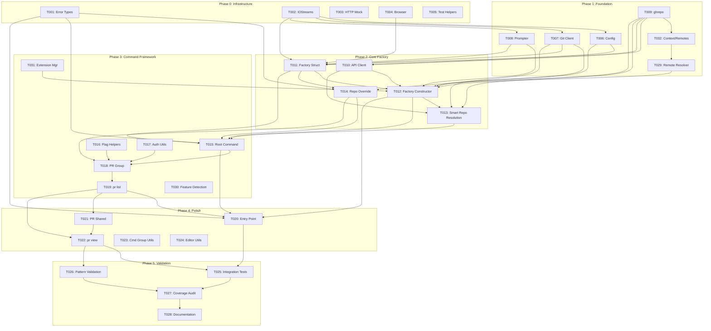

# Implementation Plan

> Generated by implementation-planner for github/cli
>
> Feature: Command Factory (`cmdutil.Factory`) dependency injection pattern adaptation
>
> Date: 2026-01-28

---

## Implementation Overview

```
Total Tasks: 32
Estimated Phases: 6 (0-5)
Critical Path Length: 14 sequential tasks
Parallelization Potential: Medium
Estimated Duration: Solo developer ~6-8 weeks; Team of 2 ~4-5 weeks
```

The plan adapts the GitHub CLI's `cmdutil.Factory` dependency injection pattern to a new codebase. The critical path runs through: error types -> IOStreams -> config provider -> HTTP client -> Factory struct -> Factory constructor -> root command -> first leaf command -> tests. Infrastructure and test utilities must be built first since every command depends on them.

---

## Task Breakdown

### Phase 0: Shared Infrastructure

---

#### Task T001: Error Types and Sentinel Values

**Phase:** 0
**Complexity:** S
**Component:** `pkg/cmdutil/errors.go`

**Description:**
Define the error type hierarchy used by all commands and the top-level error handler. This includes sentinel errors (`SilentError`, `CancelError`, `PendingError`), wrapper types (`FlagError` with `Unwrap()` support), and informational types (`NoResultsError`). Also implement helper functions: `FlagErrorf`, `FlagErrorWrap`, `IsUserCancellation`, `MutuallyExclusive`.

**Deliverable:**
Error types package with all sentinel values, wrapper types, and helper functions.

**Acceptance Criteria:**
- [ ] `FlagError` wraps an inner error and supports `errors.Is` / `errors.As`
- [ ] `SilentError`, `CancelError`, `PendingError` are distinct sentinel values
- [ ] `NoResultsError` carries a message string and satisfies the `error` interface
- [ ] `IsUserCancellation` returns true for both `CancelError` and terminal interrupt errors
- [ ] `MutuallyExclusive` returns `FlagError` when more than one condition is true
- [ ] All types have unit tests

**Dependencies:**
- Blocked by: none
- Blocks: T005, T012, T014, T015, T020

**Notes:**
- This is the simplest component and has zero dependencies on anything else
- Follow the sentinel error pattern from `pkg/cmdutil/errors.go` in the source
- `FlagError` must use a non-embedded `err` field (not `error` embedding) so that only `*FlagError` satisfies the error interface

---

#### Task T002: IOStreams Abstraction

**Phase:** 0
**Complexity:** M
**Component:** `pkg/iostreams/iostreams.go`

**Description:**
Implement the IOStreams struct that wraps stdin, stdout, and stderr with TTY detection, color support, pager management, and progress indicators. Provide both `System()` (production) and `Test()` (testing) constructors. The `Test()` constructor must return buffer-backed streams with TTY override capability.

**Deliverable:**
IOStreams package with System/Test constructors, TTY detection, pager support, progress indicators, and color scheme.

**Acceptance Criteria:**
- [ ] `System()` returns IOStreams backed by real OS file descriptors with TTY auto-detection
- [ ] `Test()` returns `(IOStreams, *bytes.Buffer, *bytes.Buffer, *bytes.Buffer)` for stdin/stdout/stderr capture
- [ ] `IsStdoutTTY()`, `IsStdinTTY()`, `IsStderrTTY()` respect override flags set by `SetStdoutTTY()`, etc.
- [ ] `CanPrompt()` returns true only when both stdin and stdout are TTY and prompting is not disabled
- [ ] `StartPager()` / `StopPager()` manage a pager subprocess, redirecting stdout through it
- [ ] `ErrClosedPagerPipe` wraps EPIPE errors from the pager writer for graceful handling
- [ ] `StartProgressIndicatorWithLabel()` / `StopProgressIndicator()` manage spinners on stderr
- [ ] `ColorEnabled()` and `ColorScheme()` provide color output support
- [ ] `ReadUserFile("-")` reads from stdin; other paths read from filesystem
- [ ] Unit tests verify TTY override, buffer capture, and pager EPIPE handling

**Dependencies:**
- Blocked by: none
- Blocks: T004, T006, T007, T008, T009, T010, T011

**Notes:**
- This is the most complex Phase 0 task due to platform-specific terminal handling
- Windows requires `go-colorable` wrapping and Cygwin detection
- Pager writer must wrap EPIPE as `ErrClosedPagerPipe` for the exit code handler
- The `fdWriter`/`fdReader` wrapper types preserve file descriptor for isatty checks even when wrapping with colorable

---

#### Task T003: HTTP Mock Registry (Test Infrastructure)

**Phase:** 0
**Complexity:** M
**Component:** `pkg/httpmock/`

**Description:**
Implement the HTTP mock registry that acts as an `http.RoundTripper`. It matches requests against registered patterns and returns stubbed responses. Include matchers (GraphQL regex, REST method+path), responders (file, string, JSON, status+body, GraphQL callback), and a `Verify(t)` method that fails if registered stubs were not matched.

**Deliverable:**
httpmock package with Registry, matchers, responders, and verification.

**Acceptance Criteria:**
- [ ] `Registry` implements `http.RoundTripper`
- [ ] `Register(matcher, responder)` queues a stub that is consumed on first match
- [ ] `GraphQL(pattern)` matcher matches GraphQL queries by regex against the query body
- [ ] `REST(method, path)` matcher matches REST requests by HTTP method and URL path
- [ ] `FileResponse(path)` responder reads response body from a fixture file
- [ ] `StringResponse(body)` responder returns inline string as response body
- [ ] `GraphQLQuery(body, callback)` responder calls callback with parsed query variables for assertion
- [ ] `Verify(t)` fails the test if any registered stubs were not consumed
- [ ] `Requests` slice captures all requests for post-hoc inspection
- [ ] Unit tests verify matching, ordering, and verification behavior

**Dependencies:**
- Blocked by: none
- Blocks: T016, T017

**Notes:**
- Stubs are consumed in FIFO order (first registered, first matched)
- Unmatched requests should return a clear error indicating what was expected
- This is critical test infrastructure -- every command test depends on it

---

#### Task T004: Browser Interface and Stub

**Phase:** 0
**Complexity:** S
**Component:** `internal/browser/`

**Description:**
Define the `Browser` interface with a `Browse(url string) error` method. Implement a production `browser.New(launcher, stdout, stderr)` that opens URLs using the system default browser (platform-specific). Implement a `browser.Stub` for testing that records the browsed URL.

**Deliverable:**
Browser interface, production implementation, and test stub.

**Acceptance Criteria:**
- [ ] `Browser` interface has `Browse(string) error` method
- [ ] `New("", stdout, stderr)` creates a browser using system default
- [ ] `New("firefox", stdout, stderr)` creates a browser using the specified launcher
- [ ] `Stub` records the URL passed to `Browse()` and returns it via `BrowsedURL()`
- [ ] Unit tests verify stub behavior

**Dependencies:**
- Blocked by: none (interface only needs IOStreams for the production constructor, but the interface definition and stub are independent)
- Blocks: T010, T011

**Notes:**
- Platform detection: `open` (macOS), `xdg-open` (Linux), `start` (Windows)
- The stub is essential for command testing -- browser operations must be verifiable

---

#### Task T005: Test Helpers Package

**Phase:** 0
**Complexity:** S
**Component:** `test/helpers.go`

**Description:**
Create shared test utility types: `CmdOut` (wraps stdout, stderr, and browsed URL buffers), `ExpectLines` (line-by-line output matching). These are used by all command tests.

**Deliverable:**
Test helpers package with CmdOut type and assertion utilities.

**Acceptance Criteria:**
- [ ] `CmdOut` has `OutBuf`, `ErrBuf` (*bytes.Buffer) and `BrowsedURL` (string) fields
- [ ] `CmdOut.String()` returns stdout content
- [ ] `CmdOut.Stderr()` returns stderr content
- [ ] Helpers integrate cleanly with testify assertions

**Dependencies:**
- Blocked by: none
- Blocks: T016, T017

**Notes:**
- Keep this package minimal -- it should only contain truly shared test utilities
- Avoid duplicating what testify already provides

---

### Phase 1: Foundation

---

#### Task T006: Config Interface and Provider

**Phase:** 1
**Complexity:** M
**Component:** `internal/config/`, `internal/gh/`

**Description:**
Define the `gh.Config` interface with methods for authentication, hosts, editor, pager, prompt settings, browser, color labels, and accessible prompter. Implement a production config loader that reads from `~/.config/gh/config.yml` (or platform-appropriate path). Implement a `NewBlankConfig()` / `NewFromString()` for testing. Implement the memoizing `configFunc()` closure pattern that caches after first call.

**Deliverable:**
Config interface, YAML-based implementation, test constructors, and cached provider function.

**Acceptance Criteria:**
- [ ] `gh.Config` interface exposes `Authentication()`, `Hosts()`, `Editor()`, `Pager()`, `Prompt()`, `Browser()`, `ColorLabels()`, `AccessiblePrompter()` methods
- [ ] `config.NewConfig()` loads from the filesystem and returns `gh.Config`
- [ ] `config.NewBlankConfig()` returns an empty config for testing
- [ ] `configFunc()` returns a closure that caches the config after first call
- [ ] Repeated calls to the closure return the cached config (not re-read)
- [ ] If `NewConfig()` fails, the error is cached and returned on subsequent calls
- [ ] Unit tests verify caching behavior and test constructors

**Dependencies:**
- Blocked by: T002 (IOStreams for environment detection)
- Blocks: T007, T008, T009, T010, T011, T012

**Notes:**
- The config interface should match `internal/gh/config.go` from the source
- YAML parsing uses `gopkg.in/yaml.v3`
- Credential storage may use `go-keyring` but should be abstracted behind the Authentication interface

---

#### Task T007: Git Client Wrapper

**Phase:** 1
**Complexity:** M
**Component:** `git/`

**Description:**
Implement the `git.Client` struct that wraps the system `git` binary for repository operations. The client needs: `Remotes()` (list git remotes), `CurrentBranch()`, `TrackingBranchNames()` (for shell completion), and `Command()` / `AuthenticatedCommand()` for raw git execution with gh as credential helper.

**Deliverable:**
Git client package with remote listing, branch detection, and command execution.

**Acceptance Criteria:**
- [ ] `Client` struct has `GhPath`, `RepoDir`, `Stderr`, `Stdin`, `Stdout` fields
- [ ] `Remotes(ctx)` returns `RemoteSet` from `git remote -v` output
- [ ] `CurrentBranch(ctx)` returns the current branch name or error if detached HEAD
- [ ] `TrackingBranchNames(ctx, prefix)` returns branch names matching prefix (for completion)
- [ ] `Command(ctx, args...)` creates a `*exec.Cmd` with proper environment
- [ ] `AuthenticatedCommand(ctx, pattern, args...)` configures gh as credential helper
- [ ] Unit tests verify remote parsing and branch detection (with mock git output)

**Dependencies:**
- Blocked by: T002 (IOStreams for stderr/stdin/stdout wiring)
- Blocks: T012, T013, T014

**Notes:**
- The client wraps the `git` CLI binary, not a Go library
- `GhPath` is used to configure `git` to use `gh` as a credential helper
- `newGitClient(f)` in the factory depends on `f.IOStreams` and `f.Executable()`

---

#### Task T008: Prompter Interface and Implementations

**Phase:** 1
**Complexity:** M
**Component:** `internal/prompter/`

**Description:**
Define the `Prompter` interface with methods: `Select`, `MultiSelect`, `Input`, `Password`, `Confirm`, `AuthToken`, `ConfirmDeletion`, `InputHostname`, `MarkdownEditor`. Implement two backends: survey-based (full TUI) and accessible (charmbracelet/huh). The `New(editorCmd, io)` constructor selects the backend based on accessibility settings.

**Deliverable:**
Prompter interface with survey and accessible implementations.

**Acceptance Criteria:**
- [ ] `Prompter` interface has all 9 methods defined
- [ ] `New(editor, io)` returns accessible prompter when `io.IsAccessiblePrompterEnabled()` is true
- [ ] `New(editor, io)` returns survey prompter otherwise
- [ ] Both implementations handle user cancellation (Ctrl+C) by returning appropriate error
- [ ] `MarkdownEditor` launches an external editor for content editing
- [ ] The interface is mockable for testing (tests inject mock prompters via Factory)

**Dependencies:**
- Blocked by: T002 (IOStreams for terminal detection), T006 (Config for editor preference)
- Blocks: T011

**Notes:**
- External dependencies: `survey/v2` and `charmbracelet/huh`
- The `EditPrompter` subset interface (Select, Input, MarkdownEditor, MultiSelect, Confirm) is used by shared editing utilities

---

#### Task T009: Repository Interface (`ghrepo`)

**Phase:** 1
**Complexity:** S
**Component:** `internal/ghrepo/`

**Description:**
Define the `ghrepo.Interface` with methods: `RepoName()`, `RepoOwner()`, `RepoHost()`. Implement concrete `repo` struct. Provide factory functions: `New(owner, name)`, `NewWithHost(owner, name, host)`, `FromFullName(nwo)`, `FromFullNameWithHost(nwo, host)`, `FromURL(url)`. Implement `FullName(r)` helper that returns `"owner/name"`.

**Deliverable:**
Repository abstraction package with interface, concrete type, and factory functions.

**Acceptance Criteria:**
- [ ] `Interface` exposes `RepoName()`, `RepoOwner()`, `RepoHost()` methods
- [ ] `New("cli", "cli")` creates a repo with default host "github.com"
- [ ] `NewWithHost("cli", "cli", "github.example.com")` creates a repo with custom host
- [ ] `FromFullName("cli/cli")` parses "owner/name" format
- [ ] `FromURL` parses GitHub repository URLs (HTTPS and SSH)
- [ ] `FullName(repo)` returns "owner/name" string
- [ ] Unit tests cover all factory functions and edge cases

**Dependencies:**
- Blocked by: none
- Blocks: T012, T013, T014

**Notes:**
- This is a simple data type with no external dependencies
- Used by `Factory.BaseRepo`, all commands that resolve repositories, and test setup code

---

### Phase 2: Core Factory

---

#### Task T010: API Client and HTTP Client Provider

**Phase:** 2
**Complexity:** L
**Component:** `api/`

**Description:**
Implement the API client layer: `api.NewHTTPClient(opts)` creates an authenticated HTTP client with User-Agent, auth headers, debug logging, and SSO header extraction middleware. `api.NewClientFromHTTP(client)` wraps an HTTP client with GraphQL/REST convenience methods. Implement `httpClientFunc(f, version)` and `plainHttpClientFunc(f, version)` factory provider closures. Implement `api.ExtractHeader(name, dest)` transport middleware for SSO capture.

**Deliverable:**
API client package with HTTP client factory, GraphQL/REST methods, and transport middleware.

**Acceptance Criteria:**
- [ ] `NewHTTPClient(opts)` creates client with auth headers from `opts.Config`
- [ ] `NewHTTPClient(opts)` adds User-Agent header with `opts.AppVersion`
- [ ] `NewHTTPClient(opts)` configures debug logging to `opts.Log` when `GH_DEBUG` is set
- [ ] `ExtractHeader("X-GitHub-SSO", &dest)` captures header value from any HTTP response
- [ ] `httpClientFunc(f, version)` returns a lazy closure that creates an authenticated client
- [ ] `plainHttpClientFunc(f, version)` returns a lazy closure with `SkipDefaultHeaders: true`
- [ ] `NewClientFromHTTP(client)` provides `GraphQL()` and `REST()` methods
- [ ] `HTTPError` wraps HTTP errors with `StatusCode`, `ScopesSuggestion`, and request URL
- [ ] `GraphQLError` wraps GraphQL errors
- [ ] Unit tests verify auth header injection, SSO extraction, and error wrapping

**Dependencies:**
- Blocked by: T002 (IOStreams for logging), T004 (Browser), T006 (Config for authentication), T009 (ghrepo for URL handling)
- Blocks: T012, T013

**Notes:**
- External dependency: `github.com/cli/go-gh/v2` for underlying API transport
- The SSO header is captured in a package-level variable -- a known weakness but required for the error handler
- `NewCachedHTTPClient` is used by the extension manager (Phase 3)

---

#### Task T011: Factory Struct Definition

**Phase:** 2
**Complexity:** S
**Component:** `pkg/cmdutil/factory.go`

**Description:**
Define the `Factory` struct with all 13 fields: metadata (AppVersion, ExecutableName), eager dependencies (Browser, ExtensionManager, GitClient, IOStreams, Prompter), and lazy closures (BaseRepo, Branch, Config, HttpClient, PlainHttpClient, Remotes). Implement the `Executable()` method that resolves the binary path respecting `GH_PATH`.

**Deliverable:**
Factory struct definition with all fields and the Executable() method.

**Acceptance Criteria:**
- [ ] Factory struct has all 13 fields with correct types
- [ ] Eager fields are concrete types (interfaces or pointers)
- [ ] Lazy fields are `func() (T, error)` function types
- [ ] `Executable()` returns `GH_PATH` env var if set, otherwise resolves `ExecutableName` via PATH
- [ ] The struct supports partial initialization (Go zero values for unused fields)
- [ ] Unit test verifies `Executable()` behavior with and without `GH_PATH`

**Dependencies:**
- Blocked by: T002 (IOStreams), T004 (Browser), T007 (GitClient), T008 (Prompter), T009 (ghrepo for BaseRepo return type)
- Blocks: T012, T014, T015, T016

**Notes:**
- This is the definition only; construction is in a separate package (T012)
- The struct is defined in `pkg/cmdutil/` but constructed in `pkg/cmd/factory/`
- This separation ensures leaf commands import only the definition, not construction logic

---

#### Task T012: Factory Constructor (`factory.New`)

**Phase:** 2
**Complexity:** L
**Component:** `pkg/cmd/factory/default.go`

**Description:**
Implement `factory.New(appVersion string) *cmdutil.Factory` that constructs the Factory with ordered dependency wiring. Implement all provider functions: `configFunc()` (cached config), `ioStreams(f)` (system IOStreams with config-driven settings), `httpClientFunc(f, version)`, `plainHttpClientFunc(f, version)`, `newGitClient(f)`, `remotesFunc(f)`, `BaseRepoFunc(f)`, `newPrompter(f)`, `newBrowser(f)`, `extensionManager(f)`, `branchFunc(f)`.

**Deliverable:**
Factory constructor with complete dependency wiring in topological order.

**Acceptance Criteria:**
- [ ] Dependencies are initialized in documented order: Config -> IOStreams -> HttpClient -> PlainHttpClient -> GitClient -> Remotes -> BaseRepo -> Prompter -> Browser -> ExtensionManager -> Branch
- [ ] `configFunc()` returns a memoizing closure (caches config and error after first call)
- [ ] `ioStreams(f)` applies environment and config settings: prompt disabled, spinner disabled, pager, accessible prompter, color labels
- [ ] Pager precedence: `GH_PAGER` > config `pager` > `PAGER` environment variable
- [ ] `remotesFunc(f)` resolves git remotes filtered by authenticated hosts
- [ ] `BaseRepoFunc(f)` returns the first remote sorted by priority
- [ ] No I/O or network operations occur during construction (all deferred to lazy closures)
- [ ] Integration test: construct factory and verify all fields are non-nil

**Dependencies:**
- Blocked by: T006 (Config), T007 (GitClient), T008 (Prompter), T010 (API client), T011 (Factory struct)
- Blocks: T013, T014, T015, T020

**Notes:**
- This is the most complex construction task; the ordering comments from `default.go` must be preserved
- The `remoteResolver` struct handles remote filtering with `readRemotes` and `getConfig` closures
- Extension manager creation gracefully degrades if Config or HttpClient fail

---

#### Task T013: Smart Repository Resolution

**Phase:** 2
**Complexity:** M
**Component:** `pkg/cmd/factory/default.go`

**Description:**
Implement `SmartBaseRepoFunc(f)` that provides API-aware repository resolution with fork handling. This resolver uses the GitHub API to determine fork relationships between remotes and selects the correct "base" repository. It respects the `resolved` git config key and prompts for disambiguation when needed.

**Deliverable:**
Smart repository resolution function and remote resolver logic.

**Acceptance Criteria:**
- [ ] `SmartBaseRepoFunc(f)` returns a closure that calls the GitHub API to resolve remotes
- [ ] When `resolved` git config is set to `base`, returns the upstream repository
- [ ] When multiple candidate repositories exist on an interactive terminal, instructs the user to run `gh repo set-default`
- [ ] When not interactive (piped), falls back to first remote without prompting
- [ ] The remote resolver filters remotes to only those matching authenticated GitHub hosts
- [ ] Unit tests verify resolution logic with mocked API responses

**Dependencies:**
- Blocked by: T007 (GitClient for remotes), T009 (ghrepo), T010 (API client for fork resolution), T012 (Factory constructor)
- Blocks: T015

**Notes:**
- This is used by repo-aware command groups (pr, issue, repo) via factory variant in root command
- The `context.ResolveRemotesToRepos()` function maps remotes to repository objects using the API

---

#### Task T014: Repository Override Mechanism

**Phase:** 2
**Complexity:** M
**Component:** `pkg/cmdutil/repo_override.go`

**Description:**
Implement `EnableRepoOverride(cmd, f)` that adds the `-R/--repo` persistent flag to a command group and installs a `PersistentPreRunE` hook that replaces `f.BaseRepo` with `OverrideBaseRepoFunc`. Implement `OverrideBaseRepoFunc(f, override)` that returns a closure resolving the override string (or `GH_REPO` env var) to a repository.

**Deliverable:**
Repo override mechanism with flag, hook, and override function.

**Acceptance Criteria:**
- [ ] `EnableRepoOverride(cmd, f)` adds `-R/--repo` flag to the command
- [ ] The `PersistentPreRunE` hook reads the `-R` flag value and replaces `f.BaseRepo`
- [ ] `OverrideBaseRepoFunc` checks `-R` flag value first, then `GH_REPO` env var, then falls back to original `f.BaseRepo`
- [ ] When `-R cli/cli` is provided, `f.BaseRepo()` returns `cli/cli` regardless of git remotes
- [ ] The hook executes parent hooks before its own logic (via `executeParentHooks` helper)
- [ ] Unit tests verify flag override, env var override, and fallback behavior

**Dependencies:**
- Blocked by: T001 (errors), T007 (GitClient), T009 (ghrepo), T011 (Factory struct)
- Blocks: T015

**Notes:**
- This mutates the Factory at runtime via the PersistentPreRunE hook
- The hook must execute before any leaf command's RunE
- Cobra ensures PersistentPreRunE hooks execute in parent-to-child order

---

### Phase 3: Command Framework

---

#### Task T015: Root Command Builder

**Phase:** 3
**Complexity:** L
**Component:** `pkg/cmd/root/root.go`

**Description:**
Implement `NewCmdRoot(f, version, buildDate)` that assembles the complete command tree. This includes: creating the root cobra command with help and version, installing the `PersistentPreRunE` auth check hook, registering command groups with the appropriate Factory variant (standard vs. repo-resolving), registering extensions and aliases from config.

**Deliverable:**
Root command builder with auth check, command registration, and factory specialization.

**Acceptance Criteria:**
- [ ] `NewCmdRoot` returns a configured root cobra command
- [ ] `PersistentPreRunE` checks authentication via `cmdutil.IsAuthCheckEnabled(cmd)` and `cmdutil.CheckAuth(cfg)`
- [ ] Commands that need smart repo resolution receive a Factory copy with `SmartBaseRepoFunc`
- [ ] Commands that do not need repo resolution receive the original Factory
- [ ] Extensions from `f.ExtensionManager.List()` are registered as commands (skipping conflicts)
- [ ] Aliases from config are registered as command shortcuts
- [ ] Command groups are organized with `cmd.AddGroup()` for clean help output
- [ ] Unit test verifies command tree structure and auth check behavior

**Dependencies:**
- Blocked by: T001 (errors), T011 (Factory), T012 (Factory constructor), T013 (SmartBaseRepoFunc), T014 (repo override)
- Blocks: T018, T019, T020

**Notes:**
- The dual factory strategy is the key architectural pattern: `repoResolvingCmdFactory := *f` (shallow copy) with replaced BaseRepo
- The `rootFlagErrorFunc` wraps cobra's flag errors as `FlagError`
- Auth check uses annotations on commands to opt in/out

---

#### Task T016: Custom Flag Helpers

**Phase:** 3
**Complexity:** M
**Component:** `pkg/cmdutil/flags.go`, `pkg/cmdutil/json_flags.go`

**Description:**
Implement custom flag types that reduce boilerplate and enforce consistency: `NilStringFlag` (distinguishes unset from empty), `NilBoolFlag` (distinguishes unset from false), `StringEnumFlag` (validates against allowed values with shell completion), `StringSliceEnumFlag`. Implement `AddJSONFlags` / `AddJSONFlagsWithoutShorthand` / `AddFormatFlags` for structured output (`--json`, `--jq`, `--template`). Implement `RegisterBranchCompletionFlags` for git branch completion.

**Deliverable:**
Custom flag type helpers and JSON export flag registration.

**Acceptance Criteria:**
- [ ] `NilBoolFlag` returns `nil` when unset, `*true` when `--flag`, `*false` when `--flag=false`
- [ ] `NilStringFlag` returns `nil` when unset, `""` when `--flag ""`, `"value"` when `--flag value`
- [ ] `StringEnumFlag` returns error for values not in the allowed set (case-insensitive)
- [ ] `StringEnumFlag` registers shell completion for allowed values
- [ ] `AddJSONFlags` registers `--json`, `--jq`, `--template` flags and validates field names in `PreRunE`
- [ ] `AddJSONFlags` sets `Exporter` to non-nil when JSON output is requested, nil otherwise
- [ ] `RegisterBranchCompletionFlags` enables tab completion for branch names on specified flags
- [ ] Unit tests verify all flag types with various input combinations

**Dependencies:**
- Blocked by: T003 (httpmock for Exporter tests), T005 (test helpers), T011 (Factory for branch completion)
- Blocks: T018, T019

**Notes:**
- `AddJSONFlags` uses a `PreRunE` hook to validate and configure the Exporter
- The Exporter interface (`Fields() []string`, `Write(io, data) error`) must also be defined here
- `StructExportData` provides reflection-based field export for simple types

---

#### Task T017: Auth Check Utilities

**Phase:** 3
**Complexity:** S
**Component:** `pkg/cmdutil/auth.go`

**Description:**
Implement `DisableAuthCheck(cmd)`, `DisableAuthCheckFlag(flag)`, `IsAuthCheckEnabled(cmd)`, and `CheckAuth(cfg)`. These control the authentication pre-check behavior per command and per flag.

**Deliverable:**
Auth check utility functions.

**Acceptance Criteria:**
- [ ] `DisableAuthCheck(cmd)` sets an annotation on the command
- [ ] `DisableAuthCheckFlag(flag)` sets an annotation on the flag
- [ ] `IsAuthCheckEnabled(cmd)` returns false for help, completion, and annotated commands/flags
- [ ] `CheckAuth(cfg)` returns true if the user has at least one authenticated host
- [ ] Unit tests verify annotation-based opt-out behavior

**Dependencies:**
- Blocked by: T003 (for testing), T005 (test helpers), T006 (Config interface for CheckAuth)
- Blocks: T015, T018

**Notes:**
- The annotations use string keys in cobra's `cmd.Annotations` map
- Flag-level opt-out checks if the specific annotated flag was `Changed()` by the user

---

#### Task T018: First Command Group (pr)

**Phase:** 3
**Complexity:** S
**Component:** `pkg/cmd/pr/pr.go`

**Description:**
Implement the PR command group builder `NewCmdPR(f)` that creates the parent `pr` command with subcommand groups. Register `EnableRepoOverride` for the `-R` flag. Register subcommands using `cmdutil.AddGroup` for organized help output.

**Deliverable:**
PR command group with subcommand registration and repo override support.

**Acceptance Criteria:**
- [ ] `NewCmdPR(f)` returns a cobra command with `Use: "pr <command>"`
- [ ] `EnableRepoOverride(cmd, f)` is called to add `-R` flag support
- [ ] At least one subcommand (list, from T019) is registered
- [ ] Subcommands are organized into groups ("General commands", "Targeted commands")
- [ ] Unit test verifies command structure and flag registration

**Dependencies:**
- Blocked by: T014 (repo override), T015 (root command for registration context), T016 (flag helpers), T017 (auth check)
- Blocks: T019

**Notes:**
- This is a thin orchestration layer; all logic is in the leaf commands
- Pass `f` and `nil` to each `NewCmd*` call: `list.NewCmdList(f, nil)`

---

#### Task T019: First Leaf Command (pr list)

**Phase:** 3
**Complexity:** L
**Component:** `pkg/cmd/pr/list/list.go`

**Description:**
Implement the complete `pr list` command following the three-phase pattern: (1) `ListOptions` struct with Factory dependencies and flags, (2) `NewCmdList(f, runF)` constructor with flag registration and RunE validation, (3) `listRun(opts)` business logic with API calls, output formatting, and web mode. This serves as the **reference implementation** for all future commands.

**Deliverable:**
Complete pr list command with Options, constructor, run function, and comprehensive tests.

**Acceptance Criteria:**
- [ ] `ListOptions` declares all dependencies: HttpClient, IO, BaseRepo, Browser, Detector, Exporter, Now
- [ ] `ListOptions` declares all flags: WebMode, LimitResults, State, BaseBranch, HeadBranch, Labels, Author, Assignee, Search, Draft
- [ ] `NewCmdList(f, runF)` extracts Factory dependencies into Options at construction time
- [ ] `BaseRepo` is assigned in `RunE` (late binding for -R support)
- [ ] `RunE` validates `LimitResults >= 1` and returns `FlagErrorf` on failure
- [ ] `RunE` delegates to `runF` when non-nil, `listRun` when nil
- [ ] `listRun` resolves lazy dependencies (`HttpClient()`, `BaseRepo()`) with error handling
- [ ] `listRun` supports web mode (opens browser with filter URL)
- [ ] `listRun` supports JSON export when `opts.Exporter != nil`
- [ ] `listRun` renders table output with TTY-adaptive formatting (headers in TTY, no headers in pipe)
- [ ] Flag tests verify parsing with `runF` capture pattern
- [ ] Output tests verify table rendering with httpmock fixtures
- [ ] Error tests verify flag validation without HTTP mocks
- [ ] TTY vs non-TTY tests verify format differences

**Dependencies:**
- Blocked by: T001 (errors), T002 (IOStreams), T003 (httpmock), T004 (Browser), T005 (test helpers), T010 (API client), T011 (Factory), T016 (flag helpers), T018 (PR group)
- Blocks: T020, T021, T022

**Notes:**
- This is the most critical implementation task -- it validates the entire pattern end-to-end
- Use the `runCommand` test helper pattern: create minimal factory, call `NewCmdList` with runF override, parse args with shlex, execute, assert on captured output
- Include a `fixtures/` directory with JSON GraphQL response files
- Time injection via `Now func() time.Time` enables deterministic timestamp output in tests

---

### Phase 4: Polish and Error Handling

---

#### Task T020: Application Entry Point and Error Handler

**Phase:** 4
**Complexity:** M
**Component:** `cmd/gh/main.go`, `internal/ghcmd/cmd.go`

**Description:**
Implement the application main function and the comprehensive error-to-exit-code handler. `main()` calls `ghcmd.Main()` which: creates the Factory, performs config migration, configures terminal settings, builds the root command, preprocesses arguments, executes via cobra, and maps errors to exit codes.

**Deliverable:**
Application entry point with complete error handling and exit code mapping.

**Acceptance Criteria:**
- [ ] `main()` calls `ghcmd.Main()` and exits with the returned code
- [ ] `Main()` constructs Factory via `factory.New(buildVersion)`
- [ ] `Main()` creates root command via `root.NewCmdRoot(factory, version, date)`
- [ ] Error handler maps: SilentError -> exit 1, PendingError -> exit 8, CancelError -> exit 2, AuthError -> exit 4, ErrClosedPagerPipe -> exit 0, NoResultsError -> exit 0 (message on stderr if TTY), ExternalCommandExitError -> child exit code, other errors -> exit 1
- [ ] `printError` provides DNS-specific error message with status page URL
- [ ] `printError` shows usage text for FlagError
- [ ] HTTP 401 errors suggest `gh auth login`
- [ ] SSO challenge URLs are displayed from captured header
- [ ] Missing OAuth scopes are suggested based on response headers
- [ ] Unit tests verify each error type produces correct exit code

**Dependencies:**
- Blocked by: T001 (error types), T012 (Factory constructor), T015 (root command)
- Blocks: T021

**Notes:**
- This is the single point where all errors are translated to exit codes
- The error switch order matters -- check specific types before generic ones
- `HasFailed()` global flag is set by help.go for certain failure conditions

---

#### Task T021: Shared Utilities Package (pr/shared)

**Phase:** 4
**Complexity:** M
**Component:** `pkg/cmd/pr/shared/`

**Description:**
Implement shared utilities for the PR command group: `FilterOptions` struct with `IsDefault()` method, `ListNoResults` helper for NoResultsError generation, display formatting helpers for table output, and the PR finder (`NewFinder(factory)`) that locates PRs by number, branch, or current context.

**Deliverable:**
PR shared utilities package with filtering, display, and finder components.

**Acceptance Criteria:**
- [ ] `FilterOptions` bundles common filter fields (state, author, labels, etc.)
- [ ] `FilterOptions.IsDefault()` returns true when only default state filter is applied
- [ ] `ListNoResults` generates appropriate `NoResultsError` messages with/without active filters
- [ ] Display helpers format PR data for table output (number, title, branch, timestamp)
- [ ] `NewFinder(factory)` creates a PR finder using Factory dependencies
- [ ] Unit tests verify filter defaults and error message formatting

**Dependencies:**
- Blocked by: T001 (NoResultsError), T011 (Factory), T019 (validates the pattern)
- Blocks: T023

**Notes:**
- The shared package is isolated to the PR domain -- do not share across command groups
- The finder is used by targeted commands (view, diff, merge) to locate the PR context

---

#### Task T022: Second Leaf Command (pr view)

**Phase:** 4
**Complexity:** M
**Component:** `pkg/cmd/pr/view/view.go`

**Description:**
Implement a second leaf command following the established pattern to validate that the pattern is repeatable. `pr view` displays detailed information about a pull request. This validates: argument parsing (PR number/URL/branch), the PR finder from shared utilities, and markdown rendering for body content.

**Deliverable:**
Complete pr view command with tests, validating the pattern is repeatable.

**Acceptance Criteria:**
- [ ] Follows the same three-phase pattern as pr list (Options, NewCmd, runFunc)
- [ ] Accepts PR identifier as positional argument (number, URL, or branch name)
- [ ] Uses `shared.NewFinder(f)` to locate the PR
- [ ] Supports `--web` flag to open in browser
- [ ] Supports `--json` flags for structured output
- [ ] Renders markdown body in TTY mode
- [ ] Comprehensive tests following established patterns
- [ ] Pattern replication validates: developer can create a new command by following the reference implementation

**Dependencies:**
- Blocked by: T019 (reference implementation), T021 (shared finder)
- Blocks: T025

**Notes:**
- This task validates that the pattern is learnable and repeatable
- If this task reveals friction points in the pattern, document them for improvement

---

#### Task T023: Command Group Organization Utilities

**Phase:** 4
**Complexity:** S
**Component:** `pkg/cmdutil/cmdgroup.go`

**Description:**
Implement `AddGroup(cmd, title, cmds...)` that registers commands under named groups for organized help output. Implement `NoArgsQuoteReminder` argument validator that provides a helpful error when users provide arguments that should be quoted.

**Deliverable:**
Command grouping and argument validation utilities.

**Acceptance Criteria:**
- [ ] `AddGroup(cmd, "General commands", list, create)` adds commands to a named group
- [ ] Help output shows commands organized under group headings
- [ ] `NoArgsQuoteReminder` returns FlagError when unexpected arguments are provided
- [ ] Error message suggests quoting if arguments contain special characters
- [ ] Unit tests verify grouping and error messages

**Dependencies:**
- Blocked by: T001 (FlagError), T011 (Factory)
- Blocks: T025

**Notes:**
- Uses cobra's `cmd.AddGroup()` and `cmd.GroupID` mechanisms
- The quote reminder helps users who type `gh issue list --label "bug fix"` without quotes

---

#### Task T024: DetermineEditor Utility

**Phase:** 4
**Complexity:** S
**Component:** `pkg/cmdutil/editor.go`

**Description:**
Implement `DetermineEditor(config)` that resolves the text editor from: `GH_EDITOR` env var > config `editor` > `VISUAL` env var > `EDITOR` env var > platform default.

**Deliverable:**
Editor resolution utility.

**Acceptance Criteria:**
- [ ] Precedence: `GH_EDITOR` > config editor > `VISUAL` > `EDITOR` > platform default
- [ ] Returns the resolved editor command string
- [ ] Unit tests verify precedence order

**Dependencies:**
- Blocked by: T006 (Config for editor setting)
- Blocks: none (used by prompter but not blocking)

**Notes:**
- Platform defaults: `nano` (Linux), `vim` (macOS), `notepad` (Windows)
- Used by `newPrompter(f)` in the factory constructor

---

### Phase 5: Validation

---

#### Task T025: Integration Test Suite

**Phase:** 5
**Complexity:** M
**Component:** Tests across all packages

**Description:**
Write integration tests that verify the complete flow from Factory construction through command execution. Test the full lifecycle: factory creation -> root command assembly -> command routing -> flag parsing -> lazy dependency resolution -> output formatting.

**Deliverable:**
Integration test suite covering the end-to-end factory pattern.

**Acceptance Criteria:**
- [ ] Test constructs a real Factory (via `factory.New`) and verifies all fields are populated
- [ ] Test builds root command tree and verifies command routing works
- [ ] Test executes `pr list` with httpmock and verifies output
- [ ] Test verifies `-R` flag overrides repository resolution
- [ ] Test verifies auth check blocks unauthenticated access
- [ ] Test verifies error-to-exit-code mapping for all error types
- [ ] Test verifies TTY vs non-TTY output differences
- [ ] Test verifies pager EPIPE handling exits cleanly (exit 0)

**Dependencies:**
- Blocked by: T019 (at least one working command), T020 (error handler), T022 (second command)
- Blocks: T028

**Notes:**
- These tests use real Factory construction (not partial mocks)
- HTTP is still mocked via httpmock, but the Factory wiring is real
- These tests catch initialization order bugs that unit tests miss

---

#### Task T026: Command Pattern Validation

**Phase:** 5
**Complexity:** S
**Component:** Documentation / tests

**Description:**
Validate that the command pattern is well-documented and repeatable by creating a third command (e.g., `issue list`) following only the reference documentation and the pr list example. Document any friction points or missing documentation.

**Deliverable:**
Third command implementation plus pattern documentation update.

**Acceptance Criteria:**
- [ ] `issue list` command implemented following the documented pattern
- [ ] Developer experience is smooth -- no undocumented steps required
- [ ] Pattern documentation updated with any lessons learned
- [ ] All three commands pass their test suites

**Dependencies:**
- Blocked by: T019 (reference implementation), T022 (second implementation)
- Blocks: T028

**Notes:**
- This task serves as user acceptance testing for the pattern itself
- If friction is found, update the pattern documentation, not just the code

---

#### Task T027: Test Coverage Audit

**Phase:** 5
**Complexity:** S
**Component:** All packages

**Description:**
Run coverage analysis across all packages. Identify untested code paths, especially in error handling, edge cases, and platform-specific behavior. Add tests for critical gaps.

**Deliverable:**
Coverage report and gap-filling tests.

**Acceptance Criteria:**
- [ ] Coverage report generated for all packages
- [ ] All error handling paths in the error handler (T020) are covered
- [ ] All lazy provider failure paths are tested
- [ ] Flag validation edge cases are tested (empty strings, boundary values)
- [ ] TTY and non-TTY paths both have coverage

**Dependencies:**
- Blocked by: T025 (integration tests), T026 (pattern validation)
- Blocks: T028

**Notes:**
- No explicit coverage threshold, but aim for 70%+ on core infrastructure
- Focus on error paths -- these are most likely to be undertested

---

#### Task T028: Final Documentation and Pattern Guide

**Phase:** 5
**Complexity:** S
**Component:** Documentation

**Description:**
Write the developer guide for using the command factory pattern. Cover: how to add a new command (step-by-step), how to add a new factory dependency, how to write tests using the runF pattern, and common pitfalls.

**Deliverable:**
Pattern guide document.

**Acceptance Criteria:**
- [ ] Step-by-step guide for adding a new leaf command
- [ ] Step-by-step guide for adding a new factory dependency
- [ ] Testing guide with examples of all three test patterns (flag capture, direct Options, error handling)
- [ ] Common pitfalls section (evaluating lazy providers in constructor, forgetting runF parameter, mutating Factory beyond BaseRepo)
- [ ] Architecture diagram showing the layer structure

**Dependencies:**
- Blocked by: T025, T026, T027
- Blocks: none

---

### Additional Tasks (Parallel Track)

---

#### Task T029: Remote Resolver

**Phase:** 1
**Complexity:** M
**Component:** `pkg/cmd/factory/remote_resolver.go`

**Description:**
Implement the `remoteResolver` struct that filters git remotes to only those matching authenticated GitHub hosts. This is used by `remotesFunc(f)` in the factory constructor to provide the `Remotes` lazy closure.

**Deliverable:**
Remote resolver with host filtering and priority sorting.

**Acceptance Criteria:**
- [ ] Remotes are sorted by name priority: `upstream` > `github` > `origin` > others
- [ ] Remotes not matching authenticated hosts in config are filtered out
- [ ] The resolver reads remotes from GitClient and config from Factory.Config
- [ ] Unit tests verify filtering and sorting with multiple remotes

**Dependencies:**
- Blocked by: T006 (Config), T007 (GitClient), T009 (ghrepo)
- Blocks: T012

---

#### Task T030: Feature Detection Interface

**Phase:** 3
**Complexity:** S
**Component:** `internal/featuredetection/`

**Description:**
Define the `Detector` interface for GitHub server feature detection. This enables commands to adapt behavior based on server capabilities (github.com vs GHES).

**Deliverable:**
Feature detection interface and mock implementation for testing.

**Acceptance Criteria:**
- [ ] `Detector` interface with `IssueFeatures()`, `PullRequestFeatures()`, `RepositoryFeatures()`, `SearchFeatures()` methods
- [ ] Mock detector for testing that returns configurable feature sets
- [ ] Production detector that queries server version via API

**Dependencies:**
- Blocked by: T010 (API client)
- Blocks: T019 (optional -- Detector is an optional field in ListOptions)

---

#### Task T031: Extension Manager Interface

**Phase:** 3
**Complexity:** S
**Component:** `pkg/extensions/`

**Description:**
Define the `ExtensionManager` interface and `Extension` interface. Implement a stub/no-op manager for initial development. The full implementation can be deferred to Phase 4+.

**Deliverable:**
Extension interfaces and stub implementation.

**Acceptance Criteria:**
- [ ] `ExtensionManager` interface with `List()`, `Install()`, `Remove()`, `Dispatch()` methods
- [ ] `Extension` interface with `Name()`, `Path()`, `URL()`, `CurrentVersion()` methods
- [ ] Stub manager returns empty list from `List()` and no-ops on other methods
- [ ] Factory can be constructed with the stub manager

**Dependencies:**
- Blocked by: none (interface only)
- Blocks: T012 (Factory constructor needs ExtensionManager field)

---

#### Task T032: Context Package (Remotes Type)

**Phase:** 1
**Complexity:** S
**Component:** `context/`

**Description:**
Define the `Remotes` type (slice of `*Remote`) and `Remote` struct (Name, FetchURL, PushURL plus embedded `ghrepo.Interface`). Implement `ResolveRemotesToRepos` for mapping remotes to repository objects.

**Deliverable:**
Context package with Remotes type and resolution utilities.

**Acceptance Criteria:**
- [ ] `Remotes` type is a named slice supporting indexing and iteration
- [ ] `Remote` embeds `ghrepo.Interface` and adds git-specific fields
- [ ] `ResolveRemotesToRepos` maps remotes to repositories using the API
- [ ] Unit tests verify remote-to-repo mapping

**Dependencies:**
- Blocked by: T009 (ghrepo)
- Blocks: T012, T013, T029

---

## Dependency Graph



---

## Phased Roadmap

### Phase 0: Shared Infrastructure
**Goal:** Establish foundation that all other work depends on
**Exit Criteria:** Can write and run tests, I/O streams available, HTTP mocking works

| Task ID | Task Name | Complexity | Parallel Group |
|---------|-----------|------------|----------------|
| T001 | Error Types and Sentinel Values | S | A |
| T002 | IOStreams Abstraction | M | A |
| T003 | HTTP Mock Registry | M | A |
| T004 | Browser Interface and Stub | S | A |
| T005 | Test Helpers Package | S | A |

**Why this must be first:** Every command imports error types and IOStreams. Every test imports httpmock, browser stub, and test helpers. Without these, no command code or test code can be written.

**All Phase 0 tasks are independent and can be built in parallel.**

---

### Phase 1: Foundation
**Goal:** Core domain types and provider interfaces in place
**Exit Criteria:** Config loads, git client works, repository abstraction exists

| Task ID | Task Name | Complexity | Parallel Group |
|---------|-----------|------------|----------------|
| T006 | Config Interface and Provider | M | B |
| T007 | Git Client Wrapper | M | B |
| T008 | Prompter Interface | M | B |
| T009 | Repository Interface (ghrepo) | S | A |
| T029 | Remote Resolver | M | C |
| T032 | Context/Remotes Type | S | B |

**Phase 1 dependencies on Phase 0:** T006, T007, T008 depend on T002 (IOStreams). T009 is independent. T032 depends on T009. T029 depends on T006, T007, T009, T032.

**Parallel groups:** T006, T007, T008, T032 can proceed in parallel (group B) once T002 is done. T009 can start immediately (group A). T029 starts after group B completes (group C).

---

### Phase 2: Core Factory
**Goal:** Factory struct defined, constructed, and fully wired
**Exit Criteria:** Factory.New() produces a working factory with all lazy providers

| Task ID | Task Name | Complexity | Parallel Group |
|---------|-----------|------------|----------------|
| T010 | API Client and HTTP Provider | L | D |
| T011 | Factory Struct Definition | S | D |
| T012 | Factory Constructor (New) | L | E |
| T013 | Smart Repo Resolution | M | F |
| T014 | Repository Override Mechanism | M | F |

**Phase 2 dependencies on Phase 1:** T010 depends on T006, T009. T011 depends on T002, T004, T007, T008, T009. T012 depends on nearly everything. T013 and T014 follow T012.

**Parallel groups:** T010 and T011 can proceed in parallel (group D). T012 starts when both complete (group E). T013 and T014 can then proceed in parallel (group F).

---

### Phase 3: Command Framework
**Goal:** First working command end-to-end
**Exit Criteria:** `gh pr list` runs with mocked API and passes all tests

| Task ID | Task Name | Complexity | Parallel Group |
|---------|-----------|------------|----------------|
| T015 | Root Command Builder | L | G |
| T016 | Custom Flag Helpers | M | G |
| T017 | Auth Check Utilities | S | G |
| T018 | PR Command Group | S | H |
| T019 | First Leaf Command (pr list) | L | I |
| T030 | Feature Detection Interface | S | G |
| T031 | Extension Manager Interface | S | G |

**Parallel groups:** T015, T016, T017, T030, T031 can proceed in parallel (group G). T018 follows when T015, T016, T017 complete (group H). T019 follows T018 (group I).

---

### Phase 4: Polish
**Goal:** Production-ready error handling, second command validates pattern
**Exit Criteria:** Two complete commands, full error handling, entry point working

| Task ID | Task Name | Complexity | Parallel Group |
|---------|-----------|------------|----------------|
| T020 | Application Entry Point | M | J |
| T021 | PR Shared Utilities | M | J |
| T022 | Second Leaf Command (pr view) | M | K |
| T023 | Command Group Organization | S | J |
| T024 | DetermineEditor Utility | S | J |

**Parallel groups:** T020, T021, T023, T024 can proceed in parallel (group J). T022 follows T021 (group K).

---

### Phase 5: Validation
**Goal:** Confidence the implementation is correct, documented, and maintainable
**Exit Criteria:** Integration tests pass, third command validates pattern, coverage meets targets

| Task ID | Task Name | Complexity | Parallel Group |
|---------|-----------|------------|----------------|
| T025 | Integration Test Suite | M | L |
| T026 | Command Pattern Validation | S | L |
| T027 | Test Coverage Audit | S | M |
| T028 | Final Documentation | S | N |

**Sequential:** T025 and T026 can run in parallel (group L). T027 follows both (group M). T028 follows T027 (group N).

---

## Build Order Recommendations

### Solo Developer Sequence

Recommended order for a single developer:

1. **T001**: Error types - simplest, zero deps, unblocks everything
2. **T009**: ghrepo - simple data type, no deps
3. **T002**: IOStreams - complex but critical, enables all future work
4. **T004**: Browser interface and stub - quick, needed for Factory
5. **T005**: Test helpers - quick, needed for tests
6. **T003**: HTTP mock registry - needed for command tests
7. **T032**: Context/Remotes type - depends on T009
8. **T006**: Config interface - depends on T002
9. **T007**: Git client - depends on T002
10. **T008**: Prompter - depends on T002, T006
11. **T029**: Remote resolver - depends on T006, T007, T032
12. **T031**: Extension manager interface - quick stub
13. **T010**: API client - depends on T006, T009
14. **T011**: Factory struct - depends on T002, T004, T007, T008, T009
15. **T012**: Factory constructor - the big wiring task
16. **T013**: Smart repo resolution - depends on T012
17. **T014**: Repo override mechanism - depends on T011
18. **T017**: Auth check utilities - small, needed for root command
19. **T016**: Custom flag helpers - needed for commands
20. **T015**: Root command builder - depends on T012-T014
21. **T030**: Feature detection - quick interface
22. **T018**: PR command group - depends on T015
23. **T019**: PR list command - reference implementation, critical milestone
24. **T020**: Entry point and error handler
25. **T021**: PR shared utilities
26. **T023**: Command group organization
27. **T024**: DetermineEditor utility
28. **T022**: PR view command - validates pattern
29. **T025**: Integration test suite
30. **T026**: Pattern validation (issue list)
31. **T027**: Coverage audit
32. **T028**: Documentation

### Team Parallelization

For a team of 2 developers:

**Stream A (Developer 1 - Infrastructure + Factory):**
1. T001 (Error types)
2. T002 (IOStreams)
3. T006 (Config)
4. T010 (API client)
5. T011 (Factory struct)
6. T012 (Factory constructor)
7. T013 (Smart repo resolution)
8. T015 (Root command)
9. T020 (Entry point)
10. T025 (Integration tests)

**Stream B (Developer 2 - Types + Commands):**
1. T009 (ghrepo)
2. T004 (Browser)
3. T003 (HTTP mock)
4. T005 (Test helpers)
5. T007 (Git client)
6. T008 (Prompter)
7. T029 (Remote resolver)
8. T032 (Context/Remotes)
9. T031 (Extension manager stub)
10. T014 (Repo override)
11. T016 (Flag helpers)
12. T017 (Auth check)
13. T018 (PR group)
14. T019 (pr list) -- after Stream A completes T012
15. T021 (PR shared)
16. T022 (pr view)
17. T026 (Pattern validation)

**Sync Points:**
- After Phase 0: Align on shared infrastructure decisions
- After T012 (Factory constructor): Stream B needs Factory to build commands
- After T019 (first command): Both developers review the reference implementation
- After Phase 4: Joint integration testing

---

## Milestones

| Milestone | After Tasks | What's Working |
|-----------|-------------|----------------|
| M1: Test Infrastructure | T001-T005 | Can write and run tests with mocked I/O, HTTP, and browser |
| M2: Domain Model | T006-T009, T029, T032 | Config loads, git client wraps CLI, repository abstraction exists |
| M3: Factory Operational | T010-T014 | `factory.New()` produces a fully wired Factory with all 13 fields |
| M4: First Command | T015-T019 | `gh pr list` executes end-to-end with mocked API |
| M5: Production Ready | T020-T024 | Entry point, error handling, second command, shared utilities |
| M6: Validated | T025-T028 | Integration tests pass, pattern documented, third command validates |

---

## Risk-Based Sequencing

**High-Risk Items (Scheduled Early):**

| Task ID | Risk | Why Early |
|---------|------|-----------|
| T002 | IOStreams platform complexity (Windows, Cygwin, color) | Every component depends on IOStreams; platform bugs discovered early save rework |
| T012 | Initialization order fragility; getting the dependency graph wrong causes runtime crashes | Must validate wiring correctness before building commands on top |
| T019 | Reference implementation; if the pattern has friction, discover it on the first command | All future commands copy this pattern; problems here multiply |
| T010 | API client auth complexity (token management, SSO, scopes) | HTTP client is the most externally-dependent component |

**External Dependencies:**

| Task ID | Dependency | Mitigation |
|---------|------------|------------|
| T002 | `go-isatty`, `go-colorable` (terminal detection) | Well-tested libraries; minimal risk |
| T008 | `survey/v2`, `charmbracelet/huh` (prompt libraries) | Can start with one backend; add second later |
| T010 | `go-gh/v2` (GitHub API transport) | Core dependency; no alternatives without significant rework |
| T007 | System `git` binary | Must be installed on dev/CI machines; test with git mocking |

---

## Complexity Summary

| Complexity | Count | Typical Effort | Tasks |
|------------|-------|----------------|-------|
| S (Small) | 14 | 2-4 hours | T001, T004, T005, T009, T011, T017, T023, T024, T026, T027, T028, T030, T031, T032 |
| M (Medium) | 13 | 1-2 days | T002, T003, T006, T007, T008, T013, T014, T016, T020, T021, T022, T025, T029 |
| L (Large) | 5 | 3-5 days | T010, T012, T015, T019 |
| XL (Extra Large) | 0 | - | - |

**Total estimated effort:** ~45-60 developer-days (6-8 weeks solo, 4-5 weeks with 2 developers)

---

## Validation Criteria by Phase

### Phase 0 Exit Criteria
- `go test ./pkg/cmdutil/...` passes (error types)
- `go test ./pkg/iostreams/...` passes (IOStreams with Test() and System())
- `go test ./pkg/httpmock/...` passes (mock registry)
- `go test ./internal/browser/...` passes (interface + stub)
- `go test ./test/...` passes (helpers)

### Phase 1 Exit Criteria
- `go test ./internal/config/...` passes (config loading and caching)
- `go test ./git/...` passes (git client remote and branch detection)
- `go test ./internal/prompter/...` passes (interface and construction)
- `go test ./internal/ghrepo/...` passes (all factory functions)
- `go test ./context/...` passes (Remotes type)

### Phase 2 Exit Criteria
- `go test ./api/...` passes (HTTP client, GraphQL/REST, error wrapping)
- `factory.New("test")` constructs without panic and all fields are non-nil
- Lazy providers are not evaluated during construction (verified by test)
- `SmartBaseRepoFunc` resolves with mocked API
- `-R` flag override replaces `BaseRepo`

### Phase 3 Exit Criteria
- Root command tree has all registered groups
- Auth check blocks unauthenticated commands
- `gh pr list` (with mocked HTTP) produces correct table output
- `gh pr list --json number,title` produces correct JSON output
- `gh pr list --web` records correct URL in browser stub
- All test patterns (flag capture, direct Options, error handling) are demonstrated

### Phase 4 Exit Criteria
- `ghcmd.Main()` maps all error types to correct exit codes
- Second command (`pr view`) passes all tests
- Shared utilities are used by both pr list and pr view
- Entry point handles DNS errors, auth errors, SSO, and pager EPIPE

### Phase 5 Exit Criteria
- Integration tests pass with real Factory construction
- Third command (`issue list`) implemented following documentation only
- Coverage report generated with 70%+ on core infrastructure
- Pattern guide document reviewed and complete

---

## Risk Mitigation Steps

1. **Initialization order bugs**: Write an integration test in Phase 2 that constructs the factory and calls every lazy provider. This catches circular dependencies and missing initialization early.

2. **Platform-specific IOStreams issues**: Build IOStreams in Phase 0 and test on all target platforms (macOS, Linux, Windows) before proceeding. Use CI matrix testing from the start.

3. **Pattern friction**: The first leaf command (T019) is the canary. If it reveals friction in the Options/Factory/runF pattern, refactor before building more commands. The second command (T022) validates the fix.

4. **Test infrastructure gaps**: Build httpmock, IOStreams.Test(), and browser.Stub before any command code. Missing test infrastructure creates pressure to skip tests.

5. **Factory growth**: Start with the minimum viable Factory (Config, IOStreams, HttpClient, BaseRepo). Add fields only as commands need them. This prevents over-engineering the Factory.

6. **Cobra hook ordering**: Write explicit tests for the PersistentPreRunE auth check and repo override hooks. Document the expected execution order.

---

## Critical Path

The critical path (longest sequential chain) is:

```
T002 (IOStreams) -> T006 (Config) -> T010 (API Client) -> T012 (Factory Constructor) -> T015 (Root Command) -> T018 (PR Group) -> T019 (pr list) -> T022 (pr view) -> T025 (Integration Tests) -> T027 (Coverage) -> T028 (Docs)
```

**Length: 11 sequential tasks**

Optimization opportunities:
- T010 (API Client) and T011 (Factory Struct) can be parallel
- T013 (Smart Repo) and T014 (Repo Override) can be parallel after T012
- T020 (Entry Point) and T021 (PR Shared) can be parallel after T019
- T025 (Integration) and T026 (Pattern Validation) can be parallel

With parallelization, the effective critical path reduces to approximately 9 sequential steps.
