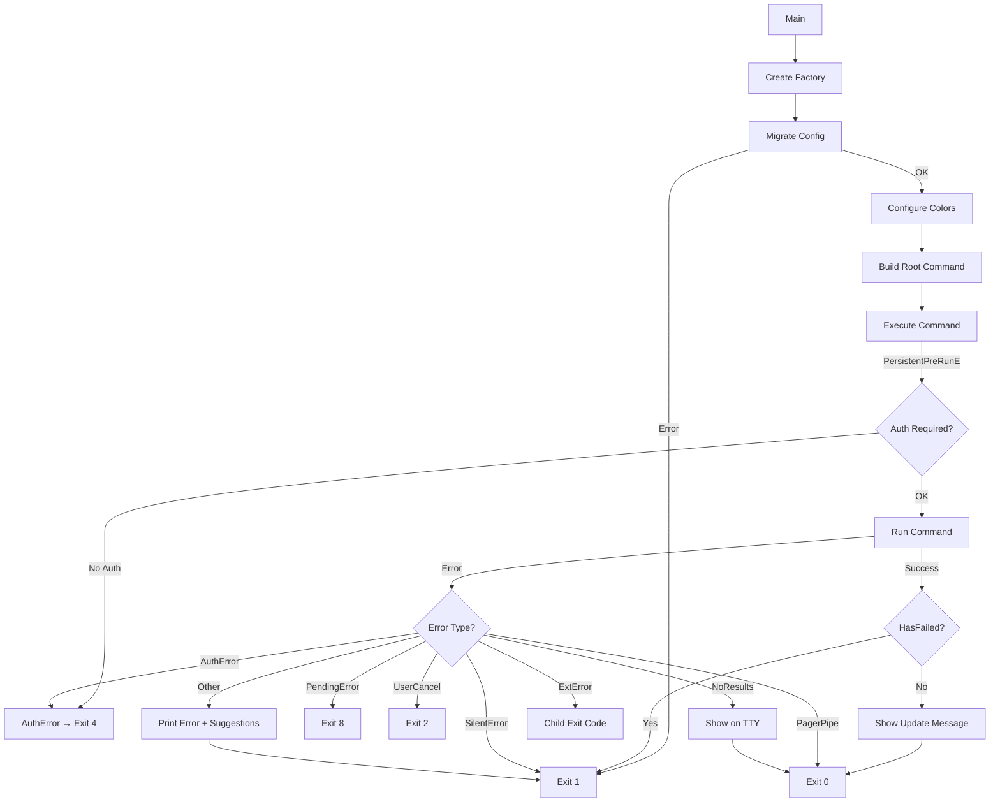
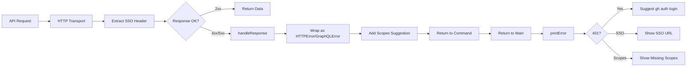

# I/O & Error Handling

> Generated by io-error-resilience for github/cli

## I/O Summary

```
Application Type: CLI
Primary I/O: Terminal (stdout/stderr), Network (HTTP/GraphQL to GitHub API)
Error Strategy: Custom error types with sentinel values + Go errors.As/errors.Is
Resilience Level: Moderate (SSO recovery, scopes suggestion, pager pipe tolerance, DNS error handling)
```

---

## Terminal I/O

### IOStreams Architecture

The `IOStreams` struct (`pkg/iostreams/iostreams.go`) is the central abstraction for all terminal I/O. It wraps stdin, stdout, and stderr with file-descriptor-preserving wrappers and provides TTY detection, color support, paging, progress indicators, and alternate screen buffer management.

**Key fields:**
```go
type IOStreams struct {
    term   term           // Terminal capability detection
    In     fileReader     // stdin (io.ReadCloser + Fd())
    Out    fileWriter     // stdout (io.Writer + Fd())
    ErrOut fileWriter     // stderr (io.Writer + Fd())

    pagerCommand string
    pagerProcess *os.Process

    progressIndicatorEnabled bool
    progressIndicator        *spinner.Spinner
    progressIndicatorMu      sync.Mutex

    alternateScreenBufferEnabled bool
    alternateScreenBufferActive  bool
    alternateScreenBufferMu      sync.Mutex

    neverPrompt bool
    // ... color and TTY override fields
}
```

### stdout vs stderr Separation

**stdout (`Out`):** Used exclusively for primary command output -- table data, JSON exports, formatted results. This is what gets piped or redirected.

**stderr (`ErrOut`):** Used for:
- Progress spinners (written to stderr so they don't pollute piped output)
- Status messages ("Opening ... in your browser")
- Warnings ("this query uses the Search API which is capped at 1000 results")
- Error messages (all error output goes to stderr)
- Update notifications (new version available)

**Example from `pr list`:**
```go
// Status message -> stderr
fmt.Fprintf(opts.IO.ErrOut, "Opening %s in your browser.\n", text.DisplayURL(openURL))

// Pager error -> stderr (non-fatal)
fmt.Fprintf(opts.IO.ErrOut, "error starting pager: %v\n", err)

// Warning -> stderr
fmt.Fprintln(opts.IO.ErrOut, "warning: this query uses the Search API...")

// Data output -> stdout (through pager when available)
fmt.Fprintf(opts.IO.Out, "\n%s\n\n", title)
table.Render() // writes to opts.IO.Out
```

### TTY Detection

TTY detection is layered with override capability for testing:

```go
func (s *IOStreams) IsStdoutTTY() bool {
    if s.stdoutTTYOverride {
        return s.stdoutIsTTY  // test override
    }
    if s.term.IsTerminalOutput() {
        return true  // supports GH_FORCE_TTY env var
    }
    stdout, ok := s.Out.(*os.File)
    return ok && isCygwinTerminal(stdout.Fd())  // Windows compatibility
}
```

TTY state drives multiple behavioral differences:
- **Pager activation**: Only starts when stdout is TTY
- **Progress indicators**: Only enabled when both stdout AND stderr are TTY
- **Prompting**: Requires both stdin AND stdout to be TTY (`CanPrompt()`)
- **Output formatting**: Headers shown only in TTY mode; extra columns (like STATE) added in non-TTY mode
- **NoResultsError display**: Message shown on stderr only when stdout is TTY
- **Color**: Tied to terminal capability detection

### System vs Test Construction

**Production (`System()`):**
```go
func System() *IOStreams {
    terminal := ghTerm.FromEnv()
    // Windows ANSI translation via colorable
    var stdout fileWriter = os.Stdout
    if colorableStdout := colorable.NewColorable(os.Stdout); colorableStdout != os.Stdout {
        stdout = &fdWriter{fd: os.Stdout.Fd(), Writer: colorableStdout}
    }
    io := &IOStreams{
        In: os.Stdin, Out: stdout, ErrOut: stderr,
        pagerCommand: os.Getenv("PAGER"),
        term: &terminal,
    }
    // Enable features based on terminal capabilities
    if stdoutIsTTY && stderrIsTTY { io.progressIndicatorEnabled = true }
    if stdoutIsTTY && hasAlternateScreenBuffer(...) { io.alternateScreenBufferEnabled = true }
    return io
}
```

**Testing (`Test()`):**
```go
func Test() (*IOStreams, *bytes.Buffer, *bytes.Buffer, *bytes.Buffer) {
    in, out, errOut := &bytes.Buffer{}, &bytes.Buffer{}, &bytes.Buffer{}
    io := &IOStreams{
        In:     &fdReader{fd: 0, ReadCloser: io.NopCloser(in)},
        Out:    &fdWriter{fd: 1, Writer: out},
        ErrOut: &fdWriter{fd: 2, Writer: errOut},
        term:   &fakeTerm{},
    }
    io.SetStdinTTY(false)
    io.SetStdoutTTY(false)
    io.SetStderrTTY(false)
    return io, in, out, errOut
}
```

### Pager Pattern

The pager is a critical I/O redirection mechanism:

**Starting:**
```go
func (s *IOStreams) StartPager() error {
    if s.pagerCommand == "" || s.pagerCommand == "cat" || !s.IsStdoutTTY() {
        return nil  // silently skip -- no-op is not an error
    }
    // Parse command, set LESS=FRX and LV=-c defaults
    // Redirect: command stdout → IOStreams.Out, IOStreams.Out → pager stdin pipe
    s.Out = &fdWriteCloser{
        fd:          s.Out.Fd(),
        WriteCloser: &pagerWriter{pagedOut},
    }
    s.pagerProcess = pagerCmd.Process
    return nil
}
```

**Stopping:**
```go
func (s *IOStreams) StopPager() {
    if s.pagerProcess == nil { return }
    _ = s.Out.(io.WriteCloser).Close()  // close pipe to signal EOF
    _, _ = s.pagerProcess.Wait()        // wait for pager to exit
    s.pagerProcess = nil
}
```

**Error Handling -- the pagerWriter pattern:**
```go
type pagerWriter struct { io.WriteCloser }

func (w *pagerWriter) Write(d []byte) (int, error) {
    n, err := w.WriteCloser.Write(d)
    if err != nil && (errors.Is(err, io.ErrClosedPipe) || isEpipeError(err)) {
        return n, &ErrClosedPagerPipe{err}  // wrap EPIPE for special handling
    }
    return n, err
}
```

The `ErrClosedPagerPipe` is caught at the top level in `Main()` and treated as `exitOK` -- if the user closes the pager (e.g., `q` in `less`), that is not an error.

**Usage pattern in commands:**
```go
err = opts.IO.StartPager()
if err != nil {
    fmt.Fprintf(opts.IO.ErrOut, "error starting pager: %v\n", err)
    // Continue without pager -- non-fatal
}
defer opts.IO.StopPager()
```

### Progress Indicators

Two modes: spinner (default) and textual (when spinner disabled for accessibility):

```go
func (s *IOStreams) StartProgressIndicatorWithLabel(label string) {
    if !s.progressIndicatorEnabled { return }  // silent no-op when not TTY
    if s.spinnerDisabled {
        s.startTextualProgressIndicator(label)  // prints "Working..." to stderr
        return
    }
    // Unicode braille spinner on stderr, 120ms interval, cyan color
    sp := spinner.New(spinnerStyle, 120*time.Millisecond,
        spinner.WithWriter(s.ErrOut), spinner.WithColor("fgCyan"))
}

func (s *IOStreams) RunWithProgress(label string, run func() error) error {
    s.StartProgressIndicatorWithLabel(label)
    defer s.StopProgressIndicator()
    return run()
}
```

### Alternate Screen Buffer

Used for TUI-like experiences (e.g., interactive views). Handles SIGINT to restore terminal:

```go
func (s *IOStreams) StartAlternateScreenBuffer() {
    if s.alternateScreenBufferEnabled {
        fmt.Fprint(s.Out, "\x1b[?1049h")
        s.alternateScreenBufferActive = true
        // Signal handler to restore on Ctrl+C
        ch := make(chan os.Signal, 1)
        signal.Notify(ch, os.Interrupt)
        go func() {
            <-ch
            s.StopAlternateScreenBuffer()
            os.Exit(1)
        }()
    }
}
```

### File I/O

**ReadUserFile** supports stdin via `-` convention:
```go
func (s *IOStreams) ReadUserFile(fn string) ([]byte, error) {
    if fn == "-" {
        r = s.In  // read from stdin
    } else {
        r, err = os.Open(fn)
    }
    defer r.Close()
    return io.ReadAll(r)
}
```

**TempFile** with test override:
```go
func (s *IOStreams) TempFile(dir, pattern string) (*os.File, error) {
    if s.TempFileOverride != nil {
        return s.TempFileOverride, nil
    }
    return os.CreateTemp(dir, pattern)
}
```

---

## Error Types and Hierarchy

### Error Classification

| Error Type | Package | Purpose | User-Facing? | Exit Code |
|------------|---------|---------|--------------|-----------|
| `FlagError` | `pkg/cmdutil` | Invalid flags/arguments | Yes (shows usage) | 1 |
| `SilentError` | `pkg/cmdutil` | Error already displayed | No (silent exit) | 1 |
| `CancelError` | `pkg/cmdutil` | User-initiated cancellation | No | 2 |
| `PendingError` | `pkg/cmdutil` | Operation pending, not failed | No | 8 |
| `NoResultsError` | `pkg/cmdutil` | Query returned no results | Conditional (TTY only) | 0 |
| `AuthError` | `pkg/cmd/root` | Authentication required | Yes (shows auth help) | 4 |
| `ErrClosedPagerPipe` | `pkg/iostreams` | Pager closed by user | No (suppressed) | 0 |
| `ExternalCommandExitError` | `pkg/cmd/root` | Extension/alias failed | Pass-through | From child |
| `HTTPError` | `api` | HTTP 4xx/5xx from GitHub | Yes (with suggestions) | 1 |
| `GraphQLError` | `api` | GraphQL errors from GitHub | Yes | 1 |

### Sentinel Error Values

```go
var SilentError = errors.New("SilentError")  // exit 1, no message
var CancelError = errors.New("CancelError")  // exit 2
var PendingError = errors.New("PendingError") // exit 8
```

### Error Wrapping

`FlagError` wraps inner errors and supports `Unwrap()`:
```go
type FlagError struct {
    err error  // not embedded -- only *FlagError satisfies error interface
}
func (fe *FlagError) Error() string { return fe.err.Error() }
func (fe *FlagError) Unwrap() error { return fe.err }
```

`NoResultsError` is a value type (not pointer receiver), carrying only a message:
```go
type NoResultsError struct { message string }
func (e NoResultsError) Error() string { return e.message }
```

### User Cancellation Detection

```go
func IsUserCancellation(err error) bool {
    return errors.Is(err, CancelError) || errors.Is(err, terminal.InterruptErr)
}
```

This handles both explicit cancellation via `CancelError` and survey/prompt interrupts (`Ctrl+C` during interactive prompts).

---

## Error Propagation and Exit Code Handling

### The Main() Error Switch

`ghcmd.Main()` is the single point where all errors are translated to exit codes. The order of checks matters:

```go
func Main() exitCode {
    // ... setup ...
    if cmd, err := rootCmd.ExecuteContextC(ctx); err != nil {
        // 1. Silent error -- already displayed
        if err == cmdutil.SilentError { return exitError }       // exit 1

        // 2. Pending state
        if err == cmdutil.PendingError { return exitPending }    // exit 8

        // 3. User cancellation (Ctrl+C or explicit cancel)
        if cmdutil.IsUserCancellation(err) {
            if errors.Is(err, terminal.InterruptErr) {
                fmt.Fprint(stderr, "\n")  // ensure clean shell prompt
            }
            return exitCancel                                    // exit 2
        }

        // 4. Auth error
        if errors.As(err, &authError) { return exitAuth }       // exit 4

        // 5. Closed pager -- not an error
        if errors.As(err, &pagerPipeError) { return exitOK }    // exit 0

        // 6. No results -- informational, not failure
        if errors.As(err, &noResultsError) {
            if cmdFactory.IOStreams.IsStdoutTTY() {
                fmt.Fprintln(stderr, noResultsError.Error())
            }
            return exitOK                                        // exit 0
        }

        // 7. Extension exit code passthrough
        if errors.As(err, &extError) {
            return exitCode(extError.ExitCode())                 // child's exit code
        }

        // 8. Generic error -- print and provide contextual help
        printError(stderr, err, cmd, hasDebug)
        // ... HTTP error suggestions ...
        return exitError                                         // exit 1
    }

    // 9. Global failure flag (set by help.go for certain conditions)
    if root.HasFailed() { return exitError }

    return exitOK
}
```

### The printError Function

Provides differentiated error display:

```go
func printError(out io.Writer, err error, cmd *cobra.Command, debug bool) {
    // DNS errors: simplified message + status page URL
    var dnsError *net.DNSError
    if errors.As(err, &dnsError) {
        fmt.Fprintf(out, "error connecting to %s\n", dnsError.Name)
        if debug { fmt.Fprintln(out, dnsError) }
        fmt.Fprintln(out, "check your internet connection or https://githubstatus.com")
        return
    }
    // Default: print error message
    fmt.Fprintln(out, err)
    // Flag errors: also show usage
    var flagError *cmdutil.FlagError
    if errors.As(err, &flagError) || strings.HasPrefix(err.Error(), "unknown command ") {
        fmt.Fprintln(out, cmd.UsageString())
    }
}
```

### "No Results" Pattern

Commands distinguish between "error" and "empty results":

```go
// In command run function:
if len(listResult.PullRequests) == 0 && opts.Exporter == nil {
    return shared.ListNoResults(ghrepo.FullName(baseRepo), "pull request", !filters.IsDefault())
}

// ListNoResults creates a NoResultsError with contextual message:
func ListNoResults(repoName string, itemName string, hasFilters bool) error {
    if hasFilters {
        return cmdutil.NewNoResultsError(fmt.Sprintf("no %ss match your search in %s", itemName, repoName))
    }
    return cmdutil.NewNoResultsError(fmt.Sprintf("no open %ss in %s", itemName, repoName))
}
```

This flows to `Main()` where it exits 0 (not a failure) and only prints the message when stdout is a TTY (so scripts checking exit codes are not misled, and piped output is clean).

---

## Network I/O and HTTP Error Handling

### HTTP Client Construction

The factory creates two HTTP clients with different capabilities:

**Authenticated client (`HttpClient`):**
```go
func httpClientFunc(f *cmdutil.Factory, appVersion string) func() (*http.Client, error) {
    return func() (*http.Client, error) {
        cfg, err := f.Config()  // lazy evaluation
        opts := api.HTTPClientOptions{
            Config:      cfg.Authentication(),
            Log:         io.ErrOut,         // HTTP debug logging → stderr
            LogColorize: io.ColorEnabled(),
            AppVersion:  appVersion,
        }
        client, err := api.NewHTTPClient(opts)
        // SSO header extraction middleware
        client.Transport = api.ExtractHeader("X-GitHub-SSO", &ssoHeader)(client.Transport)
        return client, nil
    }
}
```

**Plain client (`PlainHttpClient`):**
```go
func plainHttpClientFunc(f *cmdutil.Factory, appVersion string) func() (*http.Client, error) {
    return func() (*http.Client, error) {
        opts := api.HTTPClientOptions{
            Log:                io.ErrOut,
            LogColorize:       io.ColorEnabled(),
            AppVersion:        appVersion,
            SkipDefaultHeaders: true,  // no auth headers
        }
        return api.NewHTTPClient(opts)
    }
}
```

### SSO Header Extraction

A transport middleware captures SAML SSO challenge URLs from any HTTP response:

```go
// In factory/default.go
var ssoHeader string
var ssoURLRE = regexp.MustCompile(`\burl=([^;]+)`)

// Middleware wraps transport
func ExtractHeader(name string, dest *string) func(http.RoundTripper) http.RoundTripper {
    return func(tr http.RoundTripper) http.RoundTripper {
        return &funcTripper{roundTrip: func(req *http.Request) (*http.Response, error) {
            res, err := tr.RoundTrip(req)
            if err == nil {
                if value := res.Header.Get(name); value != "" {
                    *dest = value  // capture SSO header globally
                }
            }
            return res, err
        }}
    }
}

// Used in Main() error handling:
if u := factory.SSOURL(); u != "" {
    fmt.Fprintf(stderr, "Authorize in your web browser:  %s\n", u)
}
```

### API Error Enrichment

The `handleResponse` function wraps API errors with additional context:

```go
func handleResponse(err error) error {
    var restErr *ghAPI.HTTPError
    if errors.As(err, &restErr) {
        return HTTPError{
            HTTPError: restErr,
            scopesSuggestion: generateScopesSuggestion(
                restErr.StatusCode,
                restErr.Headers.Get("X-Accepted-Oauth-Scopes"),
                restErr.Headers.Get("X-Oauth-Scopes"),
                restErr.RequestURL.Hostname()),
        }
    }
    var gqlErr *ghAPI.GraphQLError
    if errors.As(err, &gqlErr) {
        return GraphQLError{GraphQLError: gqlErr}
    }
    return err
}
```

This enables `Main()` to provide actionable suggestions:
```go
var httpErr api.HTTPError
if errors.As(err, &httpErr) && httpErr.StatusCode == 401 {
    fmt.Fprintln(stderr, "Try authenticating with:  gh auth login")
} else if u := factory.SSOURL(); u != "" {
    fmt.Fprintf(stderr, "Authorize in your web browser:  %s\n", u)
} else if msg := httpErr.ScopesSuggestion(); msg != "" {
    fmt.Fprintln(stderr, msg)
}
```

---

## Factory Dependency Resolution

### Lazy Evaluation Pattern

All factory dependencies are functions (closures), not values. They are evaluated lazily on first use:

```go
type Factory struct {
    Config         func() (gh.Config, error)
    HttpClient     func() (*http.Client, error)
    PlainHttpClient func() (*http.Client, error)
    Remotes        func() (context.Remotes, error)
    BaseRepo       func() (ghrepo.Interface, error)
    Branch         func() (string, error)
    // Direct values (not lazy):
    IOStreams       *iostreams.IOStreams
    Browser        browser.Browser
    GitClient      *git.Client
    Prompter       prompter.Prompter
}
```

**Dependency chain:**
```
Config (no deps)
  └→ IOStreams (Config)
      ├→ HttpClient (Config, IOStreams)
      ├→ PlainHttpClient (IOStreams)
      ├→ GitClient (IOStreams)
      │   └→ Branch (GitClient)
      ├→ Prompter (Config, IOStreams)
      └→ Browser (Config, IOStreams)
          Config + GitClient
          └→ Remotes (Config, GitClient)
              └→ BaseRepo (Remotes)
```

**Failure propagation**: Each lazy function returns `error`. When a dependency fails, the error propagates up through the closure chain. For example, if `Config()` fails inside `HttpClient()`, the HTTP client function returns that config error to the calling command.

Commands request only the dependencies they need:
```go
func listRun(opts *ListOptions) error {
    httpClient, err := opts.HttpClient()  // triggers Config() + IOStreams evaluation
    if err != nil { return err }

    baseRepo, err := opts.BaseRepo()  // triggers Remotes() + GitClient evaluation
    if err != nil { return err }
    // ...
}
```

### Authentication Pre-Check

Before any command runs, `PersistentPreRunE` checks auth:

```go
PersistentPreRunE: func(cmd *cobra.Command, args []string) error {
    if cmdutil.IsAuthCheckEnabled(cmd) && !cmdutil.CheckAuth(cfg) {
        fmt.Fprint(io.ErrOut, authHelp())
        return &AuthError{}
    }
    return nil
}
```

Commands can opt out via annotations:
```go
func DisableAuthCheck(cmd *cobra.Command) {
    cmd.Annotations[skipAuthCheckAnnotation] = "true"
}
```

Or per-flag:
```go
func DisableAuthCheckFlag(flag *pflag.Flag) {
    flag.Annotations[skipAuthCheckAnnotation] = []string{"true"}
}
```

### Flag Validation

Cobra's flag errors are wrapped via `rootFlagErrorFunc`:
```go
func rootFlagErrorFunc(cmd *cobra.Command, err error) error {
    if err == pflag.ErrHelp { return err }
    return cmdutil.FlagErrorWrap(err)
}
```

And `MutuallyExclusive` provides a common validation pattern:
```go
func MutuallyExclusive(message string, conditions ...bool) error {
    numTrue := 0
    for _, ok := range conditions {
        if ok { numTrue++ }
    }
    if numTrue > 1 {
        return FlagErrorf("%s", message)
    }
    return nil
}
```

---

## Resource Management

### Cleanup Patterns

**Pager**: Always deferred immediately after start:
```go
err = opts.IO.StartPager()
if err != nil {
    fmt.Fprintf(opts.IO.ErrOut, "error starting pager: %v\n", err)
}
defer opts.IO.StopPager()
```

**Progress indicator**: Deferred or wrapped:
```go
s.StartProgressIndicatorWithLabel(label)
defer s.StopProgressIndicator()
```

**Alternate screen buffer**: Signal-aware cleanup:
```go
// Registers SIGINT handler that calls StopAlternateScreenBuffer()
// before os.Exit(1)
```

**Update checker**: Context cancellation:
```go
updateCtx, updateCancel := context.WithCancel(ctx)
defer updateCancel()
go func() { /* check for updates */ }()
// ... at end of Main():
updateCancel()  // abort if not done
newRelease := <-updateMessageChan
```

### Potential Leak Points

1. **Pager process**: If `StopPager()` is not called (e.g., panic before deferred call), the pager subprocess could be orphaned. Mitigated by defer pattern.
2. **Alternate screen buffer signal handler**: Creates a goroutine per `StartAlternateScreenBuffer()` call that waits on a signal channel. If `StopAlternateScreenBuffer()` is called without the signal, the goroutine persists until process exit.
3. **Update checker goroutine**: Always cleaned up via channel read in `Main()`, but the channel blocks until the goroutine completes or context is cancelled.

---

## Flow Diagrams

### Command Execution Flow



### HTTP Error Path



---

## Adaptation Recommendations

### Critical to Preserve

- **Exit code semantics**: The specific exit codes (0, 1, 2, 4, 8) are part of the CLI's contract with scripts and CI systems. Any adaptation must maintain identical exit code behavior.
- **stdout/stderr separation**: Commands must output data to stdout and everything else (progress, status, errors) to stderr. This enables piping and redirection.
- **TTY-conditional behavior**: Output format, headers, prompting, and progress all vary based on TTY detection. This is fundamental to the CLI's usability in both interactive and scripted contexts.
- **NoResultsError semantics**: "No results" is explicitly NOT a failure (exit 0). This is important for scripts that check exit codes.
- **Pager pipe tolerance**: The `ErrClosedPagerPipe` → exit 0 mapping prevents user confusion when quitting a pager mid-output.
- **Lazy dependency resolution**: Factory dependencies must remain lazy to avoid unnecessary work and to allow commands to request only what they need.

### Consider Improving

- **Alternate screen buffer signal handler**: The goroutine leak (one per `StartAlternateScreenBuffer` call) is minor but could be cleaned up with a cancellable context.
- **Global SSO state**: The `ssoHeader` package-level variable is a global side effect captured through transport middleware. Consider making this more explicit or scoped.
- **HasFailed global flag**: `root.HasFailed()` uses a package-level `hasFailed` boolean, which is fragile and hard to reason about.

### Risk Areas

- **Pager command injection**: The pager command comes from `PAGER` env var and is parsed with `shlex.Split`. While `safeexec.LookPath` is used, the command string itself is user-controlled.
- **DNS error detection**: Only `*net.DNSError` is caught. Other network errors (connection refused, TLS failures) fall through to the generic error path without the helpful "check your internet" message.
- **Platform differences**: Windows terminal handling (Cygwin detection, colorable wrapping) adds complexity. The `fd` preservation pattern (`fdWriter`, `fdWriteCloser`) exists specifically for Windows compatibility.
