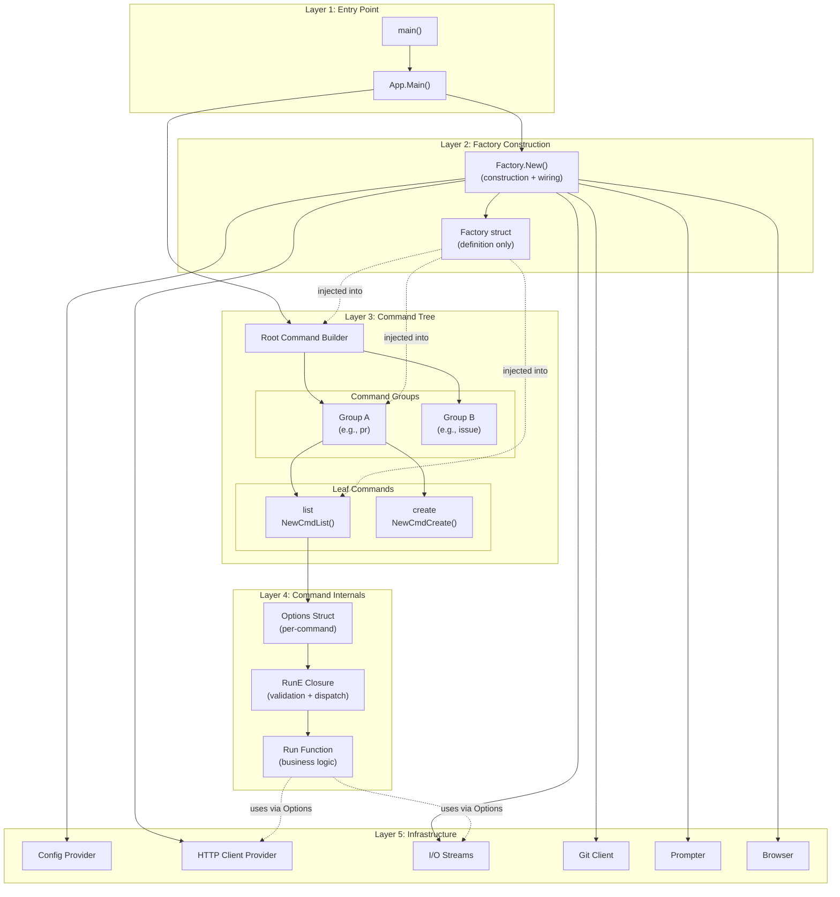

# Technical Design: Command Factory Pattern Adaptation

> Generated by architect-synthesizer for github/cli
>
> Feature: `cmdutil.Factory` dependency injection pattern for CLI command construction
>
> Date: 2026-01-28

---

## Design Overview

**Recommended Style:** Layered architecture with struct-based dependency injection and lazy initialization
**Organization Pattern:** Package-per-command with shared utility packages per domain group
**Key Insight:** The most valuable aspect of this pattern is not the Factory itself but the **two-struct separation** -- the Factory (DI container) paired with per-command Options structs (command configuration). This separation makes commands self-documenting, independently testable, and decoupled from the DI mechanism.

---

## Architectural Diagram



---

## Component Design

### Component: Factory (Dependency Injection Container)

**Responsibility:** Hold all shared dependencies needed by CLI commands. Provide a single, typed container that is constructed once at startup and passed through the command hierarchy.

**Public Interface:**
```
struct Factory {
    // Metadata
    appVersion:     String
    executableName: String

    // Eager dependencies (concrete instances, available immediately)
    ioStreams:       IOStreams
    gitClient:      GitClient
    browser:        Browser
    prompter:       Prompter
    extensionMgr:   ExtensionManager

    // Lazy dependencies (closures/providers, evaluated on demand)
    config:         () -> (Config, Error)
    httpClient:     () -> (HttpClient, Error)
    plainHttpClient:() -> (HttpClient, Error)
    baseRepo:       () -> (Repository, Error)
    remotes:        () -> (Remotes, Error)
    branch:         () -> (String, Error)
}
```

**Internal Structure:**
- **Metadata fields:** Simple values set at construction (version, executable name)
- **Eager fields:** Concrete instances created during construction. These are cheap to create and needed by nearly all commands (IOStreams, GitClient, Browser, Prompter)
- **Lazy fields:** Provider functions (closures) that defer expensive operations. Each returns `(value, error)` to handle failures at call time rather than construction time

**Dependencies:**
- Depends on: All infrastructure packages (config, api, git, iostreams, browser, prompter)
- Depended on by: Every command constructor (`NewCmd*` functions), root command builder

**Implementation Notes:**
- The Factory is a **concrete struct, not an interface**. In Go, this works well because partial initialization of a struct is valid (zero values for unused fields). In other languages, consider whether a concrete class, interface, or trait is more appropriate.
- The separation between "definition package" and "construction package" is deliberate. Commands import only the definition; they never import the construction logic. This keeps the dependency graph clean.
- **Decision point:** Whether to use a struct (Go style) or interface (more typical in Java/C#/TypeScript). See Key Decisions section.

---

### Component: Options Struct (Per-Command Configuration)

**Responsibility:** Declare the exact dependencies and configuration for a single command. Serve as the boundary between the CLI framework (flag parsing, validation) and business logic (the run function).

**Public Interface:**
```
struct ListOptions {
    // Dependencies extracted from Factory
    httpClient: () -> (HttpClient, Error)
    io:         IOStreams
    baseRepo:   () -> (Repository, Error)
    browser:    Browser

    // Command-specific flags (bound by CLI framework)
    webMode:     Bool
    limitResults: Int
    state:       String
    labels:      []String
    author:      String
    exporter:    Exporter   // nil if no JSON output requested

    // Test injection points
    now:         () -> Time
    detector:    FeatureDetector
}
```

**Internal Structure:**
- **Factory dependency fields:** Copied from Factory during command construction. Lazy closures are copied by reference (not evaluated).
- **Flag fields:** Bound directly to CLI framework flag variables. Populated during argument parsing.
- **Test injection fields:** Optional fields with production defaults that tests can override.

**Dependencies:**
- Depends on: Infrastructure interfaces (IOStreams, Browser, Repository, HttpClient)
- Depended on by: The command's run function exclusively

**Implementation Notes:**
- The Options struct is the **single parameter** to the run function. The run function should never receive the Factory directly.
- Flag values should be **bound directly** to Options fields during command construction, not extracted later.
- `BaseRepo` is intentionally assigned in `RunE` (not in the constructor) to support late binding via the `-R` repo override flag. This is the exception to the "assign in constructor" rule.

---

### Component: Command Constructor (`NewCmd*`)

**Responsibility:** Create a CLI command definition with flags registered, dependencies extracted from Factory, and execution logic wired up. Support test injection via an optional `runF` parameter.

**Public Interface:**
```
function NewCmdList(
    factory: Factory,
    runF:    (ListOptions) -> Error | null
) -> Command
```

**Internal Structure:**
- **Phase 1 - Construction:** Create Options struct, copy Factory dependencies
- **Phase 2 - Flag registration:** Bind cobra/CLI flags to Options fields
- **Phase 3 - RunE closure:** Validate flags, perform late binding, dispatch to runF or real run function

**Dependencies:**
- Depends on: Factory (for dependency extraction), CLI framework (for command definition)
- Depended on by: Parent command group (registers as subcommand)

**Implementation Notes:**
- The `runF` parameter enables the **Test Double Injection** pattern. When non-nil, it replaces the real run function. Tests use this to intercept after flag parsing but before business logic.
- Production code always passes `nil` for `runF`. Tests pass a closure that either captures options for assertion or wraps the real run function with additional test doubles.
- This is the **most important testing pattern** in the entire system. Every command must support it.

---

### Component: Run Function (Business Logic)

**Responsibility:** Execute the command's core logic using only the Options struct. Handle API calls, data transformation, and output formatting.

**Public Interface:**
```
function listRun(opts: ListOptions) -> Error
```

**Internal Structure:**
- **Dependency resolution:** Call lazy providers (e.g., `opts.HttpClient()`, `opts.BaseRepo()`)
- **Business logic:** API calls, data processing
- **Output:** Write to `opts.IO.Out` (data) and `opts.IO.ErrOut` (status messages)

**Dependencies:**
- Depends on: Options struct only (never Factory, never global state)
- Depended on by: `RunE` closure in command constructor

**Implementation Notes:**
- The run function should be a **package-private function** (unexported in Go, private in other languages). It is only called from `RunE` or `runF`.
- All output goes through IOStreams. Never write to `os.Stdout` or `os.Stderr` directly.
- Errors are returned, never printed directly. The top-level error handler maps error types to exit codes.

---

### Component: Root Command Builder

**Responsibility:** Assemble the complete command tree, register all command groups, apply Factory specialization (smart vs. basic repo resolution), and register extensions and aliases.

**Public Interface:**
```
function NewCmdRoot(
    factory:   Factory,
    version:   String,
    buildDate: String
) -> (Command, Error)
```

**Internal Structure:**
- **Standard commands:** Receive the original Factory
- **Repo-aware commands:** Receive a Factory copy with `SmartBaseRepoFunc` for intelligent fork resolution
- **Extensions:** Dynamically discovered and registered from ExtensionManager
- **Aliases:** Loaded from config and registered as command shortcuts
- **Auth hook:** `PersistentPreRunE` checks authentication before any command runs

**Dependencies:**
- Depends on: Factory, all command group packages
- Depended on by: Application main function

**Implementation Notes:**
- The **Factory specialization via struct copy** is a key pattern. The root command creates a shallow copy of the Factory and replaces `BaseRepo` with a smarter resolver. This avoids interfaces or builder patterns while allowing different command groups to have different resolution strategies.
- This approach works for one or two variants. If you need many variants, consider a builder or decorator pattern instead.

---

## Data Model

### Entity: Factory

```
Factory {
    appVersion:     String        // Build version for display and User-Agent
    executableName: String        // Binary name ("gh")

    ioStreams:       IOStreams     // Terminal I/O abstraction
    gitClient:      GitClient     // Git operations wrapper
    browser:        Browser       // URL opener
    prompter:       Prompter      // User interaction
    extensionMgr:   ExtensionManager // Plugin system

    config:         Provider<Config>      // Lazy, cached
    httpClient:     Provider<HttpClient>  // Lazy, per-call
    plainHttpClient:Provider<HttpClient>  // Lazy, no auth headers
    baseRepo:       Provider<Repository>  // Lazy, overridable
    remotes:        Provider<Remotes>     // Lazy, per-call
    branch:         Provider<String>      // Lazy, per-call

    // Invariants:
    // - Config is cached after first call (memoized)
    // - HttpClient creates a new client each call (but reads cached Config)
    // - BaseRepo can be replaced at runtime (repo override mechanism)
    // - All lazy providers return (value, error) -- never panic
}
```

**Relationships:**
- **Options structs:** Cherry-pick fields from Factory (partial projection)
- **Root command:** Receives Factory and may create specialized copies
- **Command groups:** Pass Factory through to leaf commands unchanged

### Entity: Options

```
Options {
    // Projected from Factory (subset)
    httpClient: Provider<HttpClient>
    io:         IOStreams
    baseRepo:   Provider<Repository>
    browser:    Browser

    // From CLI flags
    state:       String
    limit:       Int
    labels:      []String
    // ... command-specific fields

    // Test overrides
    now:         Provider<Time>     // Default: system clock
    detector:    FeatureDetector    // Default: nil (created in run function)

    // Invariants:
    // - All Factory-sourced fields are set by constructor
    // - BaseRepo is set in RunE (late binding)
    // - Flag fields are populated by CLI framework before RunE
    // - Test injection fields have production-safe defaults
}
```

### Data Flow

```mermaid
flowchart LR
    ARGS["CLI Arguments<br/>os.Args"] --> MAIN["main()"]
    MAIN --> CTOR["Factory.New()<br/>Wire dependencies"]
    CTOR --> ROOT["NewCmdRoot()<br/>Build command tree"]
    ROOT --> COBRA["CLI Framework<br/>Route + parse"]
    COBRA --> AUTH["PersistentPreRunE<br/>Auth check"]
    AUTH --> RUNE["RunE<br/>Validate + late bind"]
    RUNE --> RUN["runFunction(opts)<br/>Business logic"]
    RUN --> LAZY["opts.HttpClient()<br/>Lazy resolution"]
    LAZY --> API["API Client<br/>Network call"]
    API --> FORMAT["Format Output<br/>Table / JSON"]
    FORMAT --> OUTPUT["IOStreams.Out<br/>stdout"]
```



---

## Integration Design

### Internal Communication

| From | To | Pattern | Notes |
|------|-----|---------|-------|
| `main()` | `Factory.New()` | Synchronous call | One-time construction at startup |
| `main()` | `NewCmdRoot()` | Synchronous call | Assembles entire command tree |
| `NewCmdRoot()` | `NewCmdGroup()` | Synchronous, pass factory by reference | Factory pointer shared across groups |
| `NewCmdGroup()` | `NewCmdLeaf()` | Synchronous, pass factory + nil runF | Leaf commands receive factory and null test override |
| `RunE` closure | `runFunction(opts)` | Synchronous function call | Dispatch after validation |
| `runFunction` | `opts.HttpClient()` | Lazy closure invocation | Deferred resource acquisition |
| `runFunction` | `opts.IO.Out` | Direct write | Output to stdout via IOStreams |
| `EnableRepoOverride` | `factory.BaseRepo` | Field mutation in pre-run hook | Replaces lazy closure before RunE |

### External APIs

**Inbound:**
- CLI arguments via `os.Args` (parsed by CLI framework)
- Environment variables (`GH_TOKEN`, `GH_PAGER`, `GH_REPO`, etc.)
- Git configuration (remotes, branches, config values)
- Configuration files (`~/.config/gh/config.yml`)

**Outbound:**
- GitHub REST API (via authenticated HttpClient)
- GitHub GraphQL API (via authenticated HttpClient)
- Git CLI subprocess calls (via GitClient)
- System browser launch (via Browser)
- Terminal output (via IOStreams)

---

## Technology Recommendations

### Language-Agnostic Patterns

These patterns apply regardless of technology choice:

1. **Struct/Class-based DI Container:** Use a single typed container (struct, class, or record) rather than a service locator or generic map. The container's fields document available dependencies at the type level.

2. **Lazy Provider Pattern:** Wrap expensive dependencies in provider functions/lambdas that return `(value, error)`. This defers initialization and enables runtime replacement.

3. **Two-Struct Separation:** Separate the DI container (Factory) from per-command configuration (Options). The run function depends only on Options, never on Factory.

4. **Test Function Injection:** Accept an optional "run override" parameter in command constructors. This enables testing flag parsing and validation independently from business logic.

5. **Late Binding via Closures:** Assign some Options fields in the execution phase (not construction phase) to support runtime override mechanisms like the `-R` flag.

6. **Ordered Construction:** Initialize dependencies in topological order. Document the dependency graph explicitly (comments, or better, a build graph tool).

7. **Error Propagation from Providers:** Lazy providers return errors rather than panicking. The calling command handles the error at its own level.

### Technology Options

#### CLI Framework

| Option | Language | Pros | Cons | Best For |
|--------|----------|------|------|----------|
| Cobra | Go | Mature, subcommands, completions, help | Verbose setup | Go CLIs |
| Click | Python | Decorators, composable, testing support | Performance | Python CLIs |
| Clap | Rust | Derive macros, compile-time validation | Learning curve | Rust CLIs |
| Commander.js | Node | Simple, widespread | Less structured than Cobra | Node CLIs |
| Typer | Python | Type hints, auto-docs | Less flexible than Click | Simple Python CLIs |
| oclif | Node | Plugin architecture, TypeScript | Opinionated | Enterprise Node CLIs |

**Recommendation:** Choose the dominant CLI framework for your language. The Factory pattern adapts to any of these.

#### Dependency Injection Approach

| Option | Pros | Cons | Best For |
|--------|------|------|----------|
| Manual struct wiring (source pattern) | Simple, no framework, explicit | Manual ordering, no compile-time graph validation | Go, Rust, C |
| Constructor injection | Type-safe, testable | Verbose constructors | Java, C#, TypeScript |
| Wire (Go) | Compile-time DI, catches errors early | Code generation, learning curve | Large Go projects |
| inversify/tsyringe | Decorator-based, TypeScript-native | Runtime reflection | TypeScript |
| Python dataclasses | Clean syntax, type hints | No lazy evaluation built-in | Python |

**Recommendation:** Start with manual struct wiring (the source pattern). It is the simplest approach and works well up to ~20 dependencies. Move to a DI framework only if the dependency graph becomes unwieldy.

#### Lazy Evaluation Mechanism

| Language | Mechanism | Example |
|----------|-----------|---------|
| Go | Function fields `func() (T, error)` | `HttpClient func() (*http.Client, error)` |
| Python | `@cached_property` or lambda | `self._http_client = None; def http_client(self): ...` |
| Rust | `OnceCell<T>` or `Lazy<T>` | `Lazy::new(\|\| create_client())` |
| TypeScript | Getter with backing field | `get httpClient(): HttpClient { ... }` |
| Java | `Supplier<T>` or `Lazy<T>` | `Supplier<HttpClient> httpClientSupplier` |

---

## Key Decisions

### Decision 1: Factory as Concrete Struct vs. Interface

**Context:** The source uses a concrete struct. This means commands depend on a specific type, not an abstraction. The injection contract is implicit (public fields) rather than compiler-enforced.

**Options:**

| Option | Description | Pros | Cons |
|--------|-------------|------|------|
| A. Concrete struct (source pattern) | Factory is a plain struct with public fields | Simple, partial initialization valid in Go, no ceremony | Adding required field is not caught at compile time; harder in languages without zero-value semantics |
| B. Interface | Factory is an interface with getter methods | Compiler-enforced contract, easy to mock | Verbose, cannot partially implement, harder to add fields |
| C. Hybrid (struct + interface) | Define interface, implement with struct | Best of both: compiler enforcement + partial mocking | More code, potential for abstraction leak |

**Recommendation:** Option A (concrete struct) for Go. Option C (hybrid) for Java, TypeScript, or C# where interfaces are idiomatic and partial struct initialization is not ergonomic.

**Impact:** Affects every command constructor and all test setup code.

---

### Decision 2: Lazy Fields as Closures vs. Lazy Wrappers

**Context:** The source uses `func() (T, error)` closure fields for lazy dependencies. Some are cached (Config), others are fresh each call (HttpClient).

**Options:**

| Option | Description | Pros | Cons |
|--------|-------------|------|------|
| A. Closure fields (source pattern) | `httpClient func() (*http.Client, error)` | Simple, no dependencies, replaceable | No built-in caching, caller cannot distinguish cached vs. fresh |
| B. Lazy wrapper type | `Lazy<T>` that evaluates once and caches | Explicit caching semantics, thread-safe | Harder to replace for testing, more infrastructure code |
| C. Provider interface | `Provider<T>` with `Get() -> (T, Error)` | Abstracts caching strategy, testable | More indirection |

**Recommendation:** Option A for Go (idiomatic, simple). Option B or C for languages with generics and explicit null-safety (Rust, Kotlin, TypeScript).

**Impact:** Determines how commands access dependencies and how tests mock them.

---

### Decision 3: Factory Specialization Strategy

**Context:** The source creates Factory variants via shallow struct copy (`repoResolvingCmdFactory := *f`) with one field replaced. This works for one variant (smart BaseRepo) but does not scale.

**Options:**

| Option | Description | Pros | Cons |
|--------|-------------|------|------|
| A. Struct copy (source pattern) | `copy := *f; copy.BaseRepo = smartFunc` | Zero overhead, simple | Only works for one or two variants; fragile with reference fields |
| B. Builder pattern | `f.WithBaseRepo(smartFunc)` returns new Factory | Fluent API, composable | More infrastructure code |
| C. Decorator/wrapper | Wrap Factory with overriding behavior | Open/closed principle | Indirection, harder to debug |
| D. Configuration flags | Factory reads a mode enum to switch behavior | Centralized control | Factory becomes aware of command semantics |

**Recommendation:** Option A if you need 1-2 variants. Option B if you anticipate 3+ variants. The source needed only one variant in practice (smart vs. basic BaseRepo), so Option A was sufficient.

**Impact:** Affects root command construction and how command groups receive specialized dependencies.

---

### Decision 4: Options Struct Field Organization

**Context:** Options structs mix Factory dependencies, CLI flags, and test injection points. There is no enforced ordering convention.

**Options:**

| Option | Description | Pros | Cons |
|--------|-------------|------|------|
| A. Flat struct (source pattern) | All fields in one struct, grouped by comment | Simple, no ceremony | Less self-documenting; easy to add fields in wrong section |
| B. Embedded sub-structs | `type ListOptions struct { CommonDeps; Flags; TestOverrides }` | Clear boundaries, reusable CommonDeps | More verbose construction, embedding semantics vary by language |
| C. Builder pattern | `NewListOptions().WithIO(io).WithState("open")` | Self-documenting, validates at build time | Verbose, many methods |

**Recommendation:** Option A with disciplined commenting conventions. The flat struct is the simplest approach and matches Go idioms. Use Option B if your language supports composition/mixins elegantly (Rust traits, TypeScript intersection types).

**Impact:** Affects command readability and test ergonomics.

---

### Decision 5: Error Type Strategy

**Context:** The source defines sentinel errors (`SilentError`, `CancelError`), wrapper types (`FlagError`, `NoResultsError`), and maps them to exit codes in a central switch.

**Options:**

| Option | Description | Pros | Cons |
|--------|-------------|------|------|
| A. Sentinel + wrapper (source pattern) | Package-level error values + wrapping types | Go-idiomatic, `errors.Is`/`errors.As` compatible | No exhaustiveness checking |
| B. Error enum | Enum of error kinds with data payload | Exhaustive matching (Rust, TypeScript union) | Less flexible for wrapping |
| C. Exception hierarchy | Typed exceptions with inheritance | Language-native in Java/Python/C# | Control flow via exceptions is controversial |
| D. Result type | `Result<T, CommandError>` with typed errors | Functional, composable | Can be verbose |

**Recommendation:** Follow your language's conventions. Option A for Go. Option B for Rust. Option C for Java/Python. Option D for Rust/Kotlin.

**Impact:** Affects every command's error handling and the top-level error-to-exit-code mapping.

---

## Risk Areas

### Risk: Factory Growth (God Object)

**Description:** The Factory currently has 13+ fields and grows with each new shared dependency. As the number of commands increases, the pressure to add fields grows, pushing the Factory toward "God Object" anti-pattern territory.
**Likelihood:** High
**Impact:** Medium
**Mitigation:** Consider splitting into sub-factories (e.g., `UIFactory` for IOStreams/Browser/Prompter, `RepoFactory` for BaseRepo/Remotes/Branch, `APIFactory` for HttpClient/Config) when the field count exceeds ~20. Commands would receive only the sub-factories they need.

### Risk: Initialization Order Fragility

**Description:** The `New()` function relies on manual ordering and comments to express the dependency graph. Changing the order could cause runtime errors (nil pointer, missing data) that are not caught at compile time.
**Likelihood:** Medium
**Impact:** High
**Mitigation:** Document the dependency graph explicitly. Consider using a DAG-based initialization framework or compile-time DI tool (e.g., Google Wire for Go). At minimum, add integration tests that construct the factory and verify all fields are populated.

### Risk: Runtime Factory Mutation

**Description:** `EnableRepoOverride` mutates `Factory.BaseRepo` via a `PersistentPreRunE` hook. This depends on Cobra's hook execution order and is an implicit coupling. If hook ordering changes, the override breaks silently.
**Likelihood:** Low
**Impact:** High
**Mitigation:** Document the mutation contract explicitly. Consider making the override explicit in RunE rather than relying on pre-run hooks. Alternatively, use an immutable Factory and pass the override as a separate parameter.

### Risk: Lazy Provider Error Handling Confusion

**Description:** Lazy providers can fail (network, filesystem, auth). Errors propagate at call time, which may be far from where the provider was constructed. Developers may forget to handle these errors.
**Likelihood:** Medium
**Impact:** Medium
**Mitigation:** Establish a convention: every lazy provider call must have explicit error handling with early return. Lint rules can enforce this (e.g., `errcheck` linter in Go).

### Risk: Test Double Leakage

**Description:** The `runF` parameter and Options struct test injection points make testing powerful but also complex. Tests that modify Options in `runF` and then call the real run function may introduce subtle ordering dependencies.
**Likelihood:** Low
**Impact:** Low
**Mitigation:** Establish testing conventions in documentation. Prefer capturing Options for assertion over modifying-then-forwarding.

---

## Design Patterns to Apply

| Pattern | Where | Purpose |
|---------|-------|---------|
| **Dependency Injection (Struct)** | Factory struct | Centralize dependency management, enable testability |
| **Lazy Initialization (Closure)** | Factory lazy fields | Defer expensive operations until needed |
| **Memoization** | Config provider | Cache config after first load |
| **Options/Parameter Object** | Per-command Options struct | Bundle command configuration for single-parameter run functions |
| **Template Method** | `NewCmd*` + `RunE` + `runFunc` | Standardize command construction with customizable execution |
| **Strategy** | `BaseRepoFunc` vs `SmartBaseRepoFunc` | Pluggable repository resolution algorithms |
| **Test Double Injection** | `runF` parameter | Enable surgical test interception without mocking frameworks |
| **Shallow Copy Specialization** | Factory variant in root command | Create specialized factory without deep cloning |
| **Facade** | IOStreams | Unify terminal capabilities (TTY, color, pager, progress) behind single interface |
| **Chain of Responsibility** | Error type hierarchy + Main() switch | Map typed errors to exit codes and user-facing messages |

---

## Anti-Patterns to Avoid

| Anti-Pattern | Why | Alternative |
|--------------|-----|-------------|
| **Run function depending on Factory** | Couples business logic to DI container; hard to test | Run function receives Options struct only |
| **Evaluating lazy providers in constructor** | Defeats lazy initialization; slows startup | Evaluate only in `RunE` or run function |
| **Global mutable state** | The `ssoHeader` package variable is a known weakness | Pass via Options or context parameter |
| **Mutating Factory fields from multiple locations** | Creates implicit ordering dependencies | Limit mutation to one well-documented point (repo override) |
| **Large Options structs (>25 fields)** | Indicates command is doing too much | Split into subcommands or extract helper services |
| **Skipping runF parameter** | Makes command untestable at the flag-parsing level | Always include runF even if current tests do not use it |
| **Deep nesting in run functions** | Hard to test and reason about | Extract helper functions; prefer early returns |
| **Package-level test state** | Shared mutable state between tests causes flakiness | Use function-scoped test setup |

---

## Testing Architecture Recommendations

### Test Pyramid

```
                    /\
                   /  \
                  / E2E \        Acceptance tests (real API, txtar scripts)
                 /--------\
                / Integration\   HTTP mock tests (httpmock.Registry)
               /--------------\
              /   Unit Tests    \  Options + runF injection, table-driven
             /--------------------\
```

### Test Infrastructure Components

**Phase 0 - Foundation (must build first):**

1. **IOStreams Test Helper:** `IOStreams.Test()` returns test instance + stdin/stdout/stderr buffers
2. **HTTP Mock Registry:** Matches requests by pattern, returns stubbed responses, verifies all stubs used
3. **Browser Stub:** Records opened URLs for assertion
4. **Factory Partial Construction:** Tests create Factory with only needed fields populated

**Phase 1 - Per-Command Testing:**

1. **`runCommand` Helper:** Per-package helper that constructs minimal Factory, calls `NewCmd*` with `runF` override, executes with parsed args, returns captured output
2. **JSON Fixtures:** GraphQL/REST response fixtures stored as files alongside tests
3. **Table-Driven Tests:** Flag combinations, TTY vs. non-TTY behavior, error cases

**Phase 2 - Integration Testing:**

1. **HTTP-Level Tests:** Direct API client tests with httpmock, verifying request construction, pagination, and error handling
2. **Cross-Command Tests:** Verify command interactions (e.g., create then view)

**Phase 3 - Acceptance Testing:**

1. **End-to-End Workflows:** Full CLI invocations against real (test) API
2. **Script-Based Tests:** txtar/shell script format for sequential command verification

### Testing Patterns

**Pattern 1: Flag Parsing Test (via runF capture)**
```
// Pseudocode
test "parses state flag" {
    var capturedOpts Options
    factory = minimalFactory()
    cmd = NewCmdList(factory, opts => { capturedOpts = opts; return null })
    cmd.setArgs(["--state", "closed"])
    cmd.execute()
    assert capturedOpts.state == "closed"
}
```

**Pattern 2: Business Logic Test (via Options direct construction)**
```
// Pseudocode
test "lists pull requests" {
    httpMock = new HttpMockRegistry()
    httpMock.register(graphqlMatcher("PullRequestList"), fixtureResponse("prList.json"))

    opts = ListOptions {
        io: testIOStreams(),
        httpClient: () => httpMock.client(),
        baseRepo: () => repo("OWNER", "REPO"),
        state: "open",
        limit: 30,
        now: () => fixedTime,
    }

    err = listRun(opts)
    assertNoError(err)
    assertContains(stdout.string(), "New feature")
    httpMock.verifyAll()
}
```

**Pattern 3: Error Handling Test**
```
// Pseudocode
test "rejects invalid limit" {
    factory = minimalFactory()
    cmd = NewCmdList(factory, null)
    cmd.setArgs(["--limit", "0"])
    err = cmd.execute()
    assertIsFlagError(err)
    assertContains(err.message(), "invalid value for --limit")
}
```

---

## Migration/Adaptation Strategy

### Phase 1: Core Infrastructure (Week 1-2)

Build the foundation that all commands depend on:

1. **Factory struct definition** with eager and lazy fields
2. **IOStreams abstraction** with System() and Test() constructors
3. **HTTP client provider** with authentication support
4. **Config loading** with caching/memoization
5. **Error types** (FlagError, SilentError, CancelError, NoResultsError)
6. **Test utilities** (IOStreams.Test, HTTP mock registry, browser stub)

### Phase 2: First Command (Week 2-3)

Implement one complete command to validate the pattern end-to-end:

1. **Root command builder** with auth check hook
2. **One command group** (e.g., `pr`) with one leaf command (e.g., `list`)
3. **Options struct** with Factory extraction, flag binding, and run function
4. **Full test coverage** using all three test patterns (flag capture, direct Options, error handling)
5. **JSON export support** with `--json`, `--jq`, `--template` flags

### Phase 3: Scale to Multiple Commands (Week 3-6)

Apply the validated pattern to additional commands:

1. **Additional command groups** following the established pattern
2. **Shared utility packages** per domain group
3. **Custom flag helpers** (StringEnumFlag, NilBoolFlag, etc.)
4. **Repository override mechanism** (`-R` flag, EnableRepoOverride)
5. **Smart repository resolution** (SmartBaseRepoFunc with API-aware fork handling)

### Phase 4: Advanced Features (Week 6+)

Add polish and extensibility:

1. **Extension system** for external commands
2. **Alias support** from configuration
3. **Shell completion** for custom flag types
4. **Acceptance test framework** for end-to-end validation

---

## Testability Considerations

- **Key seam: Factory fields.** Every Factory field is a test seam. Tests replace lazy closures with canned-value providers and eager fields with test doubles.
- **Key seam: runF parameter.** Every `NewCmd*` function has a test injection point. This separates flag parsing testing from business logic testing.
- **Key seam: Options struct.** The run function depends only on Options, making it testable without any CLI framework involvement.
- **Integration test approach:** Use HTTP mock registries at the transport layer. Register expected requests, execute the command, verify all expectations were met.
- **TTY testing:** IOStreams.Test() defaults to non-TTY. Tests explicitly set TTY mode to verify TTY-specific behavior (headers, colors, progress).
- **Time testing:** Inject time providers via Options fields. Use fixed timestamps for deterministic output assertions.

---

## Language-Specific Adaptation Guidance

### Go

The source is Go. Use the pattern as-is:
- Concrete struct for Factory
- `func() (T, error)` for lazy fields
- Package-per-command organization
- `*_test.go` co-located with source

### Python

```python
from dataclasses import dataclass, field
from typing import Callable, Optional

@dataclass
class Factory:
    app_version: str
    io_streams: IOStreams
    git_client: GitClient
    browser: Browser
    prompter: Prompter

    # Lazy providers (callables)
    config: Callable[[], Config] = field(default=None)
    http_client: Callable[[], HttpClient] = field(default=None)
    base_repo: Callable[[], Repository] = field(default=None)

@dataclass
class ListOptions:
    io: IOStreams
    http_client: Callable[[], HttpClient]
    base_repo: Callable[[], Repository]
    browser: Browser
    state: str = "open"
    limit: int = 30
    now: Callable[[], datetime] = field(default_factory=lambda: datetime.now)

def new_cmd_list(factory: Factory, run_f=None):
    opts = ListOptions(
        io=factory.io_streams,
        http_client=factory.http_client,
        base_repo=factory.base_repo,
        browser=factory.browser,
    )
    # ... click/typer command registration ...
    # In handler: if run_f: return run_f(opts) else: return list_run(opts)

def list_run(opts: ListOptions) -> None:
    client = opts.http_client()
    repo = opts.base_repo()
    # ... business logic ...
```

### TypeScript/Node

```typescript
interface Factory {
    readonly appVersion: string;
    readonly ioStreams: IOStreams;
    readonly gitClient: GitClient;
    readonly browser: Browser;
    readonly prompter: Prompter;

    // Lazy providers
    config(): Promise<Config>;
    httpClient(): Promise<HttpClient>;
    baseRepo(): Promise<Repository>;
}

interface ListOptions {
    readonly io: IOStreams;
    readonly httpClient: () => Promise<HttpClient>;
    readonly baseRepo: () => Promise<Repository>;
    readonly browser: Browser;

    state: string;
    limit: number;
    now: () => Date;
}

function newCmdList(
    factory: Factory,
    runF?: (opts: ListOptions) => Promise<void>
): Command {
    const opts: ListOptions = {
        io: factory.ioStreams,
        httpClient: () => factory.httpClient(),
        baseRepo: () => factory.baseRepo(),
        browser: factory.browser,
        state: "open",
        limit: 30,
        now: () => new Date(),
    };
    // ... commander.js / yargs registration ...
    // In handler: return runF ? runF(opts) : listRun(opts);
}
```

### Rust

```rust
pub struct Factory {
    pub app_version: String,
    pub io_streams: IOStreams,
    pub git_client: GitClient,
    pub browser: Box<dyn Browser>,
    pub prompter: Box<dyn Prompter>,

    // Lazy providers
    pub config: Box<dyn Fn() -> Result<Config, Error>>,
    pub http_client: Box<dyn Fn() -> Result<HttpClient, Error>>,
    pub base_repo: Box<dyn Fn() -> Result<Repository, Error>>,
}

pub struct ListOptions {
    pub io: IOStreams,
    pub http_client: Box<dyn Fn() -> Result<HttpClient, Error>>,
    pub base_repo: Box<dyn Fn() -> Result<Repository, Error>>,
    pub browser: Box<dyn Browser>,
    pub state: String,
    pub limit: usize,
    pub now: Box<dyn Fn() -> DateTime<Utc>>,
}

pub fn list_run(opts: &ListOptions) -> Result<(), Error> {
    let client = (opts.http_client)()?;
    let repo = (opts.base_repo)()?;
    // ... business logic ...
}
```

---

## Summary

The GitHub CLI's Command Factory pattern is a mature, production-proven approach to dependency injection in CLI applications. Its core innovations are:

1. **Two-struct separation** (Factory + Options) that decouples dependency lifecycle from command logic
2. **Lazy closure providers** that defer expensive operations and enable runtime replacement
3. **Test function injection** (`runF` parameter) that enables surgical testing without mocking frameworks
4. **Ordered construction** with explicit dependency graph documentation
5. **Factory specialization via shallow copy** for per-group behavior customization

When adapting this pattern, prioritize preserving the two-struct separation and the `runF` test injection mechanism -- these are the patterns that provide the most value. The specific lazy evaluation mechanism, Factory field organization, and error type strategy should be adapted to your target language's idioms.

The pattern scales well to 100+ commands, as demonstrated by the GitHub CLI codebase, with the primary scaling concern being Factory field growth, which can be mitigated by splitting into sub-factories when the field count becomes unwieldy.
