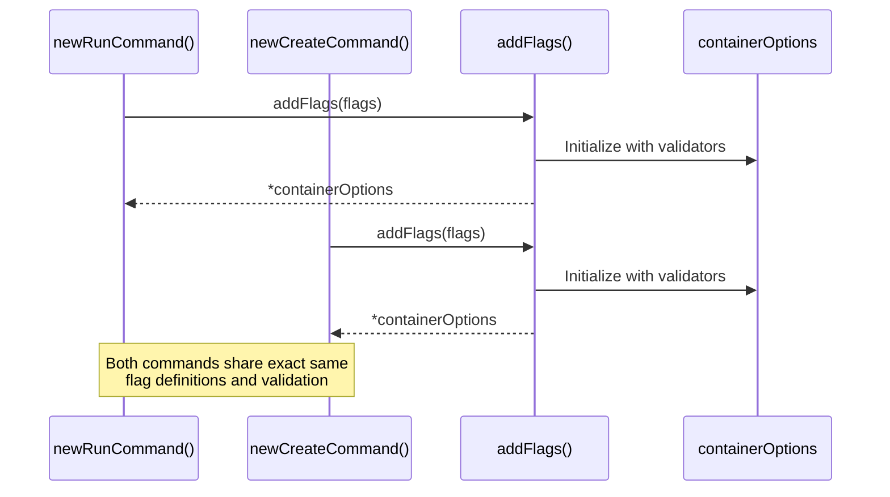

# Architecture Analysis: Docker CLI Container Options DRY Pattern

> Generated by architecture-analyzer for docker/docker-cli

## Architecture Overview

```
Style: Layered with Composition
Deployment: Single CLI binary with plugin support
Key Pattern: Three-Layer Flag Abstraction (Storage -> Registration -> Conversion)
```

The Docker CLI container options pattern implements a sophisticated three-layer architecture that enables **98+ flags** to be defined once and shared across multiple container-related commands (`docker run`, `docker create`). This pattern eliminates duplication, ensures consistency, and provides clean separation between flag parsing, storage, and API conversion.

---

## High-Level Component Diagram

```mermaid
graph TB
    subgraph "Command Layer"
        RUN[run.go<br/>runOptions]
        CREATE[create.go<br/>createOptions]
    end

    subgraph "Shared Options Layer"
        COPTS[containerOptions<br/>98 fields]
        ADDFLAGS[addFlags&#40;&#41;<br/>Flag Registration]
        PARSE[parse&#40;&#41;<br/>API Conversion]
    end

    subgraph "Custom Types Layer"
        LIST[ListOpts<br/>Repeatable Flags]
        MAP[MapOpts<br/>Key-Value Pairs]
        MEM[MemBytes<br/>Memory Units]
        CPU[NanoCPUs<br/>CPU Fractions]
        MOUNT[MountOpt<br/>Mount Specs]
        NET[NetworkOpt<br/>Network Specs]
        ULIMIT[UlimitOpt<br/>Resource Limits]
    end

    subgraph "API Types Layer"
        CONFIG[container.Config]
        HOST[container.HostConfig]
        NETWORK[network.NetworkingConfig]
    end

    RUN -->|embeds| CREATE
    RUN -->|calls| ADDFLAGS
    CREATE -->|calls| ADDFLAGS
    ADDFLAGS -->|returns| COPTS
    COPTS -->|uses| LIST
    COPTS -->|uses| MAP
    COPTS -->|uses| MEM
    COPTS -->|uses| CPU
    COPTS -->|uses| MOUNT
    COPTS -->|uses| NET
    COPTS -->|uses| ULIMIT
    RUN -->|calls| PARSE
    CREATE -->|calls| PARSE
    PARSE -->|produces| CONFIG
    PARSE -->|produces| HOST
    PARSE -->|produces| NETWORK
```



---

## Layer Architecture

```mermaid
graph TB
    subgraph "Layer 1: Command Interface"
        L1A[newRunCommand&#40;&#41;]
        L1B[newCreateCommand&#40;&#41;]
        L1C[runOptions struct]
        L1D[createOptions struct]
    end

    subgraph "Layer 2: Flag Registration"
        L2A[addFlags&#40;*pflag.FlagSet&#41;]
        L2B[API Version Annotations]
        L2C[Platform Annotations]
        L2D[Deprecation Markers]
    end

    subgraph "Layer 3: Intermediate Storage"
        L3A[containerOptions struct]
        L3B[98 typed fields]
        L3C[Validation via custom types]
    end

    subgraph "Layer 4: Conversion"
        L4A[parse&#40;flags, copts, serverOS&#41;]
        L4B[Cross-field validation]
        L4C[Platform-specific logic]
    end

    subgraph "Layer 5: API Output"
        L5A[containerConfig struct]
        L5B[Config + HostConfig + NetworkingConfig]
    end

    L1A --> L2A
    L1B --> L2A
    L2A --> L3A
    L3A --> L4A
    L4A --> L5A
```



**Layer Boundaries:**
- **Layer 1 -> Layer 2**: Commands call `addFlags()` during construction, passing their `*pflag.FlagSet`
- **Layer 2 -> Layer 3**: `addFlags()` initializes and returns `*containerOptions` with all validators wired
- **Layer 3 -> Layer 4**: Commands call `parse()` with flags, copts, and serverOS during execution
- **Layer 4 -> Layer 5**: `parse()` returns `*containerConfig` ready for Docker API calls

---

## Component Catalog

### containerOptions (Intermediate Storage Struct)

- **Location**: `cli/command/container/opts.go:48-145`
- **Responsibility**: Holds all parsed flag values before conversion to API types
- **Dependencies**: Custom types from `opts` package (ListOpts, MapOpts, MemBytes, etc.)
- **Dependents**: `addFlags()` initializes it; `parse()` reads from it; commands access `Image` and `Args`
- **Public Interface**:
  - `Image string` - Container image name (exported for command access)
  - `Args []string` - Container command arguments (exported for command access)
  - All other 96 fields are unexported for encapsulation

**Key Design Decision**: Fields are unexported to enforce that all access goes through `addFlags()` initialization and `parse()` conversion. Only `Image` and `Args` are exported for positional argument handling.

### addFlags() (Flag Registration Function)

- **Location**: `cli/command/container/opts.go:148-328`
- **Responsibility**: Registers all 98 container flags with pflag.FlagSet, initializes validators
- **Dependencies**: `*pflag.FlagSet`, `opts` package types
- **Dependents**: All container commands (run, create)
- **Public Interface**: `func addFlags(flags *pflag.FlagSet) *containerOptions`

**Key Features**:
1. Initializes `containerOptions` with validation functions
2. Registers flags with help text and shorthand names
3. Adds API version annotations (`flags.SetAnnotation("flag", "version", ...)`)
4. Adds platform annotations (`flags.SetAnnotation("flag", "ostype", ...)`)
5. Handles deprecated flags with `MarkDeprecated()`
6. Supports flag aliases (e.g., `--net` and `--network` point to same variable)

### parse() (Conversion Function)

- **Location**: `cli/command/container/opts.go:341-740`
- **Responsibility**: Converts `containerOptions` to API-compatible structures with validation
- **Dependencies**: `*pflag.FlagSet`, `*containerOptions`, `serverOS string`
- **Dependents**: All container commands during execution
- **Public Interface**: `func parse(flags *pflag.FlagSet, copts *containerOptions, serverOS string) (*containerConfig, error)`

**Key Features**:
1. Cross-field validation (e.g., MAC address format)
2. Server OS-dependent validation (e.g., Linux vs Windows device paths)
3. Environment variable merging from files and flags
4. Conditional field handling via `flags.Changed()`
5. Complex type conversions (mounts, networks, ulimits)

### containerConfig (API Output Struct)

- **Location**: `cli/command/container/opts.go:330-334`
- **Responsibility**: Clean API-ready structures for Docker daemon
- **Dependencies**: `container.Config`, `container.HostConfig`, `network.NetworkingConfig`
- **Dependents**: Container commands pass this to Docker API
- **Public Interface**:
  ```go
  containerConfig struct {
      Config           *container.Config
      HostConfig       *container.HostConfig
      NetworkingConfig *network.NetworkingConfig
  }
  ```

### runOptions / createOptions (Command-Specific Options)

- **Location**:
  - `cli/command/container/run.go:24-29` (runOptions)
  - `cli/command/container/create.go:38-44` (createOptions)
- **Responsibility**: Hold command-specific flags separate from shared container options
- **Dependencies**: `runOptions` embeds `createOptions`
- **Public Interface**:
  ```go
  // createOptions - base for container creation
  createOptions struct {
      name         string
      platform     string
      pull         string  // "always", "missing", "never"
      quiet        bool
      useAPISocket bool
  }

  // runOptions - extends createOptions with run-specific flags
  runOptions struct {
      createOptions      // Embedded
      detach     bool
      sigProxy   bool
      detachKeys string
  }
  ```

---

## Custom Option Types (opts package)

The `opts` package provides reusable flag types implementing `pflag.Value` interface.

```mermaid
classDiagram
    class pflagValue {
        <<interface>>
        +String() string
        +Set(string) error
        +Type() string
    }

    class ListOpts {
        -values *[]string
        -validator ValidatorFctType
        +Set(val string) error
        +GetSlice() []string
        +GetMap() map[string]struct{}
    }

    class MapOpts {
        -values map[string]string
        -validator ValidatorFctType
        +Set(val string) error
        +GetAll() map[string]string
    }

    class MemBytes {
        +Set(val string) error
        +Value() int64
    }

    class NanoCPUs {
        +Set(val string) error
        +Value() int64
    }

    class MountOpt {
        -values []mount.Mount
        +Set(val string) error
        +Value() []mount.Mount
    }

    class NetworkOpt {
        -options []NetworkAttachmentOpts
        +Set(val string) error
        +Value() []NetworkAttachmentOpts
        +NetworkMode() string
    }

    class UlimitOpt {
        -values map[string]*Ulimit
        +Set(val string) error
        +GetList() []*Ulimit
    }

    pflagValue <|.. ListOpts
    pflagValue <|.. MapOpts
    pflagValue <|.. MemBytes
    pflagValue <|.. NanoCPUs
    pflagValue <|.. MountOpt
    pflagValue <|.. NetworkOpt
    pflagValue <|.. UlimitOpt
```

### Type Catalog

| Type | Location | Use Case | Parsing Example |
|------|----------|----------|-----------------|
| `ListOpts` | `opts/opts.go:22-25` | Repeatable flags (`-e`, `-v`, `-p`) | `-e KEY=val -e KEY2=val2` |
| `MapOpts` | `opts/opts.go:90-93` | Key-value pair flags | `--sysctl net.ipv4.ip_forward=1` |
| `MemBytes` | `opts/opts.go` | Memory with units | `--memory 512m`, `--memory 1g` |
| `NanoCPUs` | `opts/opts.go` | CPU fractions | `--cpus 1.5` -> 1500000000 nanoseconds |
| `MountOpt` | `opts/mount.go` | Structured mount specs | `--mount type=bind,src=/host,dst=/cnt` |
| `NetworkOpt` | `opts/network.go` | Network attachment | `--network name=mynet,ip=10.0.0.5` |
| `UlimitOpt` | `opts/ulimit.go` | Resource limits | `--ulimit nofile=1024:2048` |

---

## Data Flow

```mermaid
flowchart LR
    subgraph Input
        CLI[CLI Arguments<br/>-e KEY=val --memory 1g]
    end

    subgraph "Flag Parsing"
        PFLAG[pflag.Parse&#40;&#41;]
        VALIDATE[Custom Type<br/>Validators]
    end

    subgraph "Intermediate Storage"
        COPTS[containerOptions<br/>Typed Values]
    end

    subgraph "Conversion"
        PARSE[parse&#40;&#41;]
        XVAL[Cross-field<br/>Validation]
        OSVAL[Server OS<br/>Validation]
    end

    subgraph Output
        CCFG[containerConfig]
        API[Docker API Call]
    end

    CLI --> PFLAG
    PFLAG --> VALIDATE
    VALIDATE --> COPTS
    COPTS --> PARSE
    PARSE --> XVAL
    XVAL --> OSVAL
    OSVAL --> CCFG
    CCFG --> API
```



**Key Flows:**

1. **Flag Registration Flow**: `newXxxCommand()` -> `addFlags(flags)` -> `*containerOptions` returned
2. **Flag Parsing Flow**: User input -> `pflag.Parse()` -> `CustomType.Set()` -> validation -> storage
3. **Conversion Flow**: `runXxx()` -> `parse(flags, copts, serverOS)` -> cross-validation -> `*containerConfig`
4. **API Call Flow**: `containerConfig.Config` + `containerConfig.HostConfig` + `containerConfig.NetworkingConfig` -> `ContainerCreate()`

---

## Communication Patterns

| From | To | Pattern | Purpose |
|------|-----|---------|---------|
| `newRunCommand` | `addFlags` | Sync function call | Register shared flags at construction |
| `addFlags` | `pflag.FlagSet` | Method calls | Wire flag definitions to cobra |
| `pflag.FlagSet` | Custom types | Interface call (`Set()`) | Parse and validate input |
| `runRun` | `parse` | Sync function call | Convert options to API types |
| `parse` | `containerOptions` | Field access | Read validated flag values |
| `parse` | `pflag.FlagSet` | Method call (`Changed()`) | Detect explicit vs default values |
| `runContainer` | Docker API | HTTP/gRPC | Send configuration to daemon |

---

## Cross-Cutting Concerns

### Validation

**Edge Validation (at parse time)**:
```go
// Validators injected at construction
copts := &containerOptions{
    attach:    opts.NewListOpts(validateAttach),
    dns:       opts.NewListOpts(opts.ValidateIPAddress),
    env:       opts.NewListOpts(opts.ValidateEnv),
    labels:    opts.NewListOpts(opts.ValidateLabel),
    sysctls:   opts.NewMapOpts(nil, opts.ValidateSysctl),
}
```

**Cross-field Validation (in parse())**:
```go
if copts.macAddress != "" {
    if _, err := net.ParseMAC(copts.macAddress); err != nil {
        return nil, fmt.Errorf("%s is not a valid mac address", copts.macAddress)
    }
}
```

### API Version Compatibility

```go
flags.StringVar(&copts.cgroupnsMode, "cgroupns", "", "...")
flags.SetAnnotation("cgroupns", "version", []string{"1.41"})

flags.Var(&copts.gpus, "gpus", "GPU devices to add")
flags.SetAnnotation("gpus", "version", []string{"1.40"})
```

The CLI framework automatically validates these against the connected daemon's API version.

### Platform-Specific Handling

```go
// Windows-only flags
flags.Int64Var(&copts.cpuCount, "cpu-count", 0, "CPU count (Windows only)")
flags.SetAnnotation("cpu-count", "ostype", []string{"windows"})

// In parse(), serverOS parameter enables conditional logic
func parse(flags *pflag.FlagSet, copts *containerOptions, serverOS string) (*containerConfig, error) {
    // ...
    validated, err := validateDevice(device, serverOS)
}
```

### Deprecation

```go
var stub opts.MemBytes
flags.Var(&stub, "kernel-memory", "Kernel memory limit (deprecated)")
_ = flags.MarkDeprecated("kernel-memory", "and no longer supported by the kernel")
```

### Flag Aliases

```go
// Both flags point to same variable
flags.Var(&copts.netMode, "net", "Connect to a network")
flags.Var(&copts.netMode, "network", "Connect to a network")
flags.MarkHidden("net")  // Hide legacy name
```

---

## DRY Pattern Implementation

The three-layer architecture achieves DRY through composition and delegation.

### How Commands Share Options



### Composition Pattern

```go
// createOptions is standalone
type createOptions struct {
    name         string
    platform     string
    pull         string
    quiet        bool
    useAPISocket bool
}

// runOptions embeds createOptions
type runOptions struct {
    createOptions      // Embed base options
    detach     bool    // Run-specific flag
    sigProxy   bool    // Run-specific flag
    detachKeys string  // Run-specific flag
}
```

### Single Source of Truth

1. **Flag Definitions**: All 98 container flags defined exactly once in `addFlags()`
2. **Validation Logic**: Validators defined once per type in `opts` package
3. **Conversion Logic**: All flag-to-API mapping in single `parse()` function
4. **Help Text**: Defined once during flag registration

---

## Extension Points and Flexibility

### Adding a New Flag

1. Add field to `containerOptions` struct
2. Initialize in `addFlags()` with validator if needed
3. Register with `flags.Var()` or `flags.StringVar()` etc.
4. Add API version annotation if applicable
5. Handle in `parse()` to map to appropriate API type

### Adding a New Command Using Shared Options

```go
func newMyCommand(dockerCLI command.Cli) *cobra.Command {
    var options myOptions
    var copts *containerOptions

    cmd := &cobra.Command{
        RunE: func(cmd *cobra.Command, args []string) error {
            copts.Image = args[0]
            return runMy(ctx, dockerCLI, cmd.Flags(), &options, copts)
        },
    }

    flags := cmd.Flags()

    // Add command-specific flags
    flags.BoolVar(&options.myFlag, "my-flag", false, "My specific option")

    // Inherit all shared container flags
    copts = addFlags(flags)

    return cmd
}
```

### Adding a New Custom Type

1. Create struct implementing `pflag.Value` interface:
   ```go
   type MyOpt struct { values []MyType }
   func (m *MyOpt) String() string { ... }
   func (m *MyOpt) Set(value string) error { ... }  // Parse and validate
   func (m *MyOpt) Type() string { return "mytype" }
   func (m *MyOpt) Value() []MyType { return m.values }
   ```
2. Add to `containerOptions` struct
3. Use in `addFlags()`: `flags.Var(&copts.myOpt, "my-opt", "Description")`
4. Read in `parse()`: `copts.myOpt.Value()`

---

## Quality Assessment

| Attribute | Rating | Notes |
|-----------|--------|-------|
| **Modularity** | 9/10 | Clear separation between storage, registration, and conversion layers. Custom types are independently reusable. |
| **Testability** | 8/10 | Each layer can be tested in isolation. `parse()` is a pure function given inputs. FakeCli pattern enables command testing. |
| **Extensibility** | 9/10 | Adding flags requires minimal changes in well-defined locations. New commands inherit all shared options via single function call. |
| **Maintainability** | 8/10 | Single source of truth for flags. However, 740-line `parse()` function could benefit from decomposition. |
| **Scalability** | 9/10 | Pattern has scaled to 98+ flags without degradation. Annotation system handles version/platform concerns elegantly. |

---

## Architectural Decisions

### 1. Unexported Fields with Exported Access Pattern

**Decision**: All `containerOptions` fields are unexported except `Image` and `Args`.

**Rationale**: Forces all flag access through controlled channels (`addFlags()` and `parse()`), preventing direct manipulation that could bypass validation.

### 2. Validator Injection at Construction

**Decision**: Validators are passed to constructors like `opts.NewListOpts(validateAttach)`.

**Rationale**: Validation happens automatically during `pflag.Parse()` when `Set()` is called, providing immediate user feedback without explicit validation code in commands.

### 3. Flat Structure Over Nested

**Decision**: `containerOptions` is a flat struct with 98 fields rather than nested structs.

**Rationale**: Simplifies flag registration (direct field reference) and avoids complex initialization. Trade-off is long struct definition but clearer flag-to-field mapping.

### 4. Separate Registration and Conversion

**Decision**: `addFlags()` and `parse()` are separate functions called at different times.

**Rationale**: Registration happens at command construction (before knowing daemon version/OS), conversion happens at execution (with daemon context). Enables lazy API client initialization.

### 5. Server OS as Parse Parameter

**Decision**: `parse()` accepts `serverOS string` rather than detecting it internally.

**Rationale**: Keeps `parse()` as a pure function, improves testability, allows validation without daemon connection when OS is known.

---

## Adaptation Recommendations

### Preserve

1. **Three-layer architecture**: Storage -> Registration -> Conversion provides excellent separation of concerns
2. **Custom types implementing pflag.Value**: Encapsulates parsing and validation elegantly
3. **Validator injection pattern**: Enables reusable validation without coupling to flag definitions
4. **Annotation system**: API version and platform annotations are a clean metadata approach
5. **Composition pattern**: `runOptions` embedding `createOptions` is idiomatic Go

### Consider Changing

1. **Large parse() function**: 400 lines could be decomposed into smaller conversion functions
2. **Field count in containerOptions**: Consider grouping related fields into sub-structs for better organization
3. **Error message consistency**: Standardize error message format across all validators
4. **Documentation**: Add godoc comments explaining the three-layer pattern

### Risk Areas

1. **parse() complexity**: High cyclomatic complexity makes modifications risky
2. **Cross-field dependencies**: Some validations depend on multiple fields, adding coupling
3. **API type evolution**: Changes to `container.Config` or `HostConfig` require parse() updates
4. **Platform-specific logic**: Scattered throughout parse(), could benefit from strategy pattern

---

## File Reference

| File | Purpose | Lines of Interest |
|------|---------|-------------------|
| `cli/command/container/opts.go` | Core pattern implementation | 48-145 (struct), 148-328 (addFlags), 330-334 (output), 341-740 (parse) |
| `cli/command/container/run.go` | Run command integration | 24-29 (runOptions), 32-84 (newRunCommand), 86-117 (runRun) |
| `cli/command/container/create.go` | Create command integration | 38-44 (createOptions), 47-95 (newCreateCommand) |
| `opts/opts.go` | ListOpts, MapOpts, MemBytes, NanoCPUs | Core reusable types |
| `opts/mount.go` | MountOpt | Complex mount parsing |
| `opts/network.go` | NetworkOpt, NetworkAttachmentOpts | Network mode parsing |
| `opts/ulimit.go` | UlimitOpt | Ulimit parsing |

---

## Summary

The Docker CLI container options pattern demonstrates a mature, battle-tested approach to managing complex CLI flag configurations. The three-layer architecture (Storage -> Registration -> Conversion) combined with custom types implementing `pflag.Value` creates a system that:

1. **Eliminates duplication** through centralized flag definitions
2. **Ensures consistency** via shared validation logic
3. **Enables extensibility** without modifying existing code
4. **Provides clean separation** between parsing, storage, and API mapping

The pattern has successfully scaled to 98+ flags while maintaining code quality and enabling multiple commands to share the same configuration surface. Teams adopting this pattern should focus on preserving the three-layer separation while potentially improving the decomposition of the conversion layer for better maintainability.
