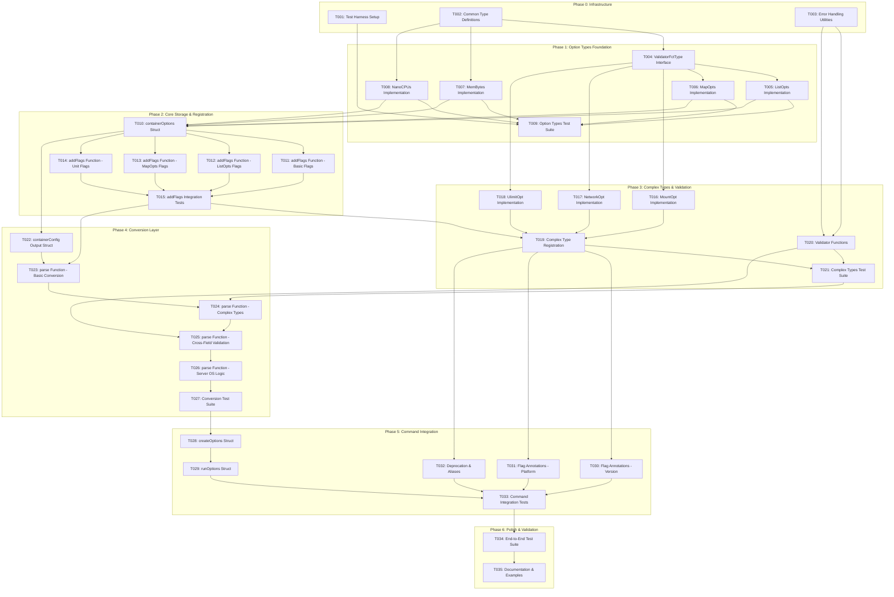

# Implementation Plan: Container Options DRY Pattern

> Generated by implementation-planner for docker/docker-cli
> Focus: Shared flags architecture for container-related CLI commands

---

## Implementation Overview

```
Total Tasks: 35
Estimated Phases: 6 (Phase 0-5)
Critical Path Length: 12 sequential tasks
Parallelization Potential: Medium-High (many tasks can run in parallel within phases)
```

The Container Options DRY Pattern implementation follows the three-layer architecture (Storage -> Registration -> Conversion) identified in the technical design. This plan breaks down the implementation into discrete, testable tasks with clear dependencies and acceptance criteria.

---

## Dependency Graph



---

## Task Breakdown

### Phase 0: Shared Infrastructure

**Goal:** Establish foundation that all other work depends on
**Exit Criteria:** Can write and run tests, common utilities available
**Estimated Duration:** 0.5-1 day

---

#### Task T001: Test Harness Setup

**Phase:** 0
**Complexity:** S (Small)
**Component:** Testing Infrastructure

**Description:**
Set up the test framework foundation including test helpers and utilities that will be used throughout implementation. Create the three-tier test helper pattern: `setupFlags()`, `parseFlags()`, and `mustParse()`.

**Deliverable:**
- Test helper file with `setupFlags()` function
- `parseFlags()` helper for error-handling test cases
- `mustParse()` helper for success-expecting test cases
- Platform-aware test utility for Windows/Unix differences

**Acceptance Criteria:**
- [ ] `setupFlags()` creates isolated `*pflag.FlagSet` for each test
- [ ] `parseFlags()` returns config and error for validation testing
- [ ] `mustParse()` auto-fails test on parse errors
- [ ] `t.Helper()` used in all helpers for correct error line reporting
- [ ] Platform helpers detect and handle OS differences

**Dependencies:**
- Blocked by: none
- Blocks: T009, T015, T021, T027

**Notes:**
- Model after Docker CLI's `opts_test.go` helper pattern
- Ensure helpers suppress pflag error output during tests
- Consider adding `mustParseMAC()` and similar typed helpers

---

#### Task T002: Common Type Definitions

**Phase:** 0
**Complexity:** S (Small)
**Component:** Core Types

**Description:**
Define the core interfaces and type aliases that will be used throughout the option types implementation. This includes the `pflag.Value` interface contract documentation and any shared constants.

**Deliverable:**
- Type alias or documentation for `pflag.Value` interface contract
- Constants for common values (type names, default values)
- Base error types for validation failures

**Acceptance Criteria:**
- [ ] Interface contract clearly documented for custom types
- [ ] Type name constants defined (e.g., `"list"`, `"map"`, `"bytes"`)
- [ ] All types follow consistent naming convention

**Dependencies:**
- Blocked by: none
- Blocks: T004, T007, T008

**Notes:**
- These are foundational types referenced throughout
- Keep minimal - avoid over-engineering at this stage

---

#### Task T003: Error Handling Utilities

**Phase:** 0
**Complexity:** S (Small)
**Component:** Error Handling

**Description:**
Create standardized error types and formatting utilities for validation errors. Errors should include the invalid value for clear user feedback.

**Deliverable:**
- Validation error type with value inclusion
- Error formatting helpers
- Standard error message templates

**Acceptance Criteria:**
- [ ] Validation errors include the invalid value in message
- [ ] Error messages follow consistent format
- [ ] Errors are wrapped appropriately for context
- [ ] Error types support `errors.Is()` checks

**Dependencies:**
- Blocked by: none
- Blocks: T020

**Notes:**
- Error messages should be user-friendly
- Consider format: `invalid argument "VALUE" for "FLAG": REASON`

---

### Phase 1: Option Types Foundation

**Goal:** Core custom types that implement pflag.Value with validation
**Exit Criteria:** All basic option types passing unit tests
**Estimated Duration:** 2-3 days

---

#### Task T004: ValidatorFctType Interface

**Phase:** 1
**Complexity:** S (Small)
**Component:** Option Types

**Description:**
Define the validator function type signature and create factory functions for common validator patterns.

**Deliverable:**
- `ValidatorFctType` function type definition
- No-op validator for optional validation
- Composition helper for chaining validators

**Acceptance Criteria:**
- [ ] `ValidatorFctType` defined as `func(string) (string, error)`
- [ ] Return value allows validator to normalize input
- [ ] Nil validator is handled gracefully (pass-through)
- [ ] Unit tests verify validator composition

**Dependencies:**
- Blocked by: T002
- Blocks: T005, T006, T016, T017, T018

**Notes:**
- Signature allows validators to both validate AND normalize values
- e.g., `validateAttach("STDIN")` returns `("stdin", nil)`

---

#### Task T005: ListOpts Implementation

**Phase:** 1
**Complexity:** M (Medium)
**Component:** Option Types

**Description:**
Implement `ListOpts` type for repeatable string flags (e.g., `-e VAR1 -e VAR2`). Must implement `pflag.Value` interface with optional validator injection.

**Deliverable:**
- `ListOpts` struct with values slice and validator
- `NewListOpts(validator)` constructor
- `pflag.Value` interface implementation (String, Set, Type)
- `GetSlice()` and `GetMap()` retrieval methods
- `Len()` for count checking

**Acceptance Criteria:**
- [ ] Implements `pflag.Value` interface completely
- [ ] `Set()` appends values, enabling `-e A -e B`
- [ ] Validator runs during `Set()` if provided
- [ ] `GetSlice()` returns copy, not internal slice
- [ ] `GetMap()` returns set for duplicate checking
- [ ] `GetSlice()` returns empty slice (not nil) when empty
- [ ] `String()` returns comma-separated values

**Dependencies:**
- Blocked by: T004
- Blocks: T009, T010

**Notes:**
- Order preservation is important for env vars, labels
- Consider thread safety if concurrent Set() is possible

---

#### Task T006: MapOpts Implementation

**Phase:** 1
**Complexity:** M (Medium)
**Component:** Option Types

**Description:**
Implement `MapOpts` type for key-value pair flags (e.g., `--sysctl key=value`). Must handle `key=value` parsing with optional validation.

**Deliverable:**
- `MapOpts` struct with values map and validator
- `NewMapOpts(values, validator)` constructor
- `pflag.Value` interface implementation
- `GetAll()` retrieval method

**Acceptance Criteria:**
- [ ] Implements `pflag.Value` interface completely
- [ ] `Set()` parses `key=value` format correctly
- [ ] Values without `=` return clear error
- [ ] Values with multiple `=` (e.g., `key=val=ue`) preserve all after first `=`
- [ ] Last value wins for duplicate keys
- [ ] Validator runs on both key and value if provided
- [ ] `GetAll()` returns copy of map

**Dependencies:**
- Blocked by: T004
- Blocks: T009, T010

**Notes:**
- Parser must handle edge case: `key=` (empty value is valid)
- Consider whether to trim whitespace

---

#### Task T007: MemBytes Implementation

**Phase:** 1
**Complexity:** M (Medium)
**Component:** Option Types

**Description:**
Implement `MemBytes` type for human-readable memory values (e.g., `512m`, `1g`). Must parse unit suffixes and convert to bytes.

**Deliverable:**
- `MemBytes` type (int64-based)
- `pflag.Value` interface implementation
- `Value()` method returning int64 bytes
- Support for k, m, g, t suffixes (case-insensitive)

**Acceptance Criteria:**
- [ ] Implements `pflag.Value` interface
- [ ] Parses `512m` -> 536870912
- [ ] Parses `1g` -> 1073741824
- [ ] Case-insensitive suffixes (m, M, mb, MB all work)
- [ ] Clear error for invalid format
- [ ] Zero is valid and distinct from unset
- [ ] `Type()` returns `"bytes"`

**Dependencies:**
- Blocked by: T002
- Blocks: T009, T010

**Notes:**
- Consider using `docker/go-units` for parsing consistency
- Must handle both decimal (1000) and binary (1024) conventions

---

#### Task T008: NanoCPUs Implementation

**Phase:** 1
**Complexity:** M (Medium)
**Component:** Option Types

**Description:**
Implement `NanoCPUs` type for CPU fraction values (e.g., `1.5` CPUs). Converts to nanoseconds for API.

**Deliverable:**
- `NanoCPUs` type (int64-based)
- `pflag.Value` interface implementation
- `Value()` method returning nanoseconds

**Acceptance Criteria:**
- [ ] Implements `pflag.Value` interface
- [ ] Parses `1.5` -> 1500000000 (nanoseconds)
- [ ] Parses integer `2` -> 2000000000
- [ ] Handles decimal precision correctly
- [ ] Clear error for invalid format
- [ ] Zero is valid
- [ ] `Type()` returns `"decimal"`

**Dependencies:**
- Blocked by: T002
- Blocks: T009, T010

**Notes:**
- 1 CPU = 1e9 nanoseconds
- Consider precision limits (e.g., max 3 decimal places)

---

#### Task T009: Option Types Test Suite

**Phase:** 1
**Complexity:** M (Medium)
**Component:** Testing

**Description:**
Create comprehensive table-driven tests for all basic option types. Cover valid inputs, invalid inputs, edge cases, and error messages.

**Deliverable:**
- `listopts_test.go` with table-driven tests
- `mapopts_test.go` with table-driven tests
- `membytes_test.go` with table-driven tests
- `nanocpus_test.go` with table-driven tests

**Acceptance Criteria:**
- [ ] Each type has >=10 test cases
- [ ] Tests cover: valid input, invalid input, edge cases
- [ ] Error message content verified
- [ ] `pflag.Value` interface compliance tested
- [ ] Thread safety tested if applicable
- [ ] Tests use `t.Run()` for subtests

**Dependencies:**
- Blocked by: T001, T005, T006, T007, T008
- Blocks: none (parallel group end)

**Notes:**
- Use table-driven pattern from Docker CLI
- Test both `Set()` and retrieval methods

---

### Phase 2: Core Storage and Registration

**Goal:** Intermediate storage struct and flag registration function
**Exit Criteria:** `addFlags()` returns populated `containerOptions` with basic flags
**Estimated Duration:** 2-3 days

---

#### Task T010: containerOptions Struct

**Phase:** 2
**Complexity:** L (Large)
**Component:** Storage Layer

**Description:**
Create the intermediate storage struct that holds all parsed flag values. Use custom option types for appropriate fields.

**Deliverable:**
- `containerOptions` struct definition
- Unexported fields for encapsulation
- Exported `Image` and `Args` fields for positional args
- Logical grouping via comments

**Acceptance Criteria:**
- [ ] Struct contains all required fields (start with 20-30 core flags)
- [ ] Fields use appropriate types (ListOpts, MapOpts, MemBytes, etc.)
- [ ] Only `Image` and `Args` are exported
- [ ] Fields grouped logically with comments (// Resource limits, // Networking, etc.)
- [ ] No nested structs (flat structure)

**Dependencies:**
- Blocked by: T005, T006, T007, T008
- Blocks: T011, T012, T013, T014, T022

**Notes:**
- Start with essential flags, expand in later tasks
- Match Docker CLI field naming for familiarity

---

#### Task T011: addFlags Function - Basic Flags

**Phase:** 2
**Complexity:** M (Medium)
**Component:** Registration Layer

**Description:**
Implement the `addFlags()` function for basic primitive flags (bool, string, int). Establishes the pattern for flag registration.

**Deliverable:**
- `addFlags(flags *pflag.FlagSet) *containerOptions` function signature
- Registration of bool flags (e.g., `--privileged`, `--rm`)
- Registration of string flags (e.g., `--hostname`, `--user`)
- Registration of int64 flags (e.g., `--cpu-shares`)

**Acceptance Criteria:**
- [ ] Function returns initialized `*containerOptions`
- [ ] All basic flags registered with help text
- [ ] Shorthand flags work (e.g., `-h` for `--hostname`)
- [ ] Default values set correctly
- [ ] Help text is user-friendly

**Dependencies:**
- Blocked by: T010
- Blocks: T015

**Notes:**
- This establishes the addFlags pattern
- Test with `flags.Parse()` to verify registration

---

#### Task T012: addFlags Function - ListOpts Flags

**Phase:** 2
**Complexity:** M (Medium)
**Component:** Registration Layer

**Description:**
Extend `addFlags()` to register repeatable flags using ListOpts (e.g., `--env`, `--volume`, `--label`).

**Deliverable:**
- ListOpts initialization with validators
- Flag registration using `flags.Var()` and `flags.VarP()`
- Support for shorthand repeatable flags

**Acceptance Criteria:**
- [ ] `--env/-e` registered with `ValidateEnv` validator
- [ ] `--volume/-v` registered with appropriate validator
- [ ] `--label/-l` registered with `ValidateLabel` validator
- [ ] Multiple specifications work (`-e A -e B`)
- [ ] Validators run during parse

**Dependencies:**
- Blocked by: T010
- Blocks: T015

**Notes:**
- Validators are injected during `NewListOpts()` call
- Order of flag registration affects help text order

---

#### Task T013: addFlags Function - MapOpts Flags

**Phase:** 2
**Complexity:** M (Medium)
**Component:** Registration Layer

**Description:**
Extend `addFlags()` to register key-value pair flags using MapOpts (e.g., `--sysctl`, `--annotation`).

**Deliverable:**
- MapOpts initialization with validators
- Flag registration for map-style flags

**Acceptance Criteria:**
- [ ] `--sysctl` registered with `ValidateSysctl` validator
- [ ] `--annotation` registered for OCI annotations
- [ ] Key-value parsing works correctly
- [ ] Invalid format produces clear error

**Dependencies:**
- Blocked by: T010
- Blocks: T015

**Notes:**
- MapOpts requires pointer initialization (`*MapOpts`)
- Consider nil vs empty map semantics

---

#### Task T014: addFlags Function - Unit Flags

**Phase:** 2
**Complexity:** M (Medium)
**Component:** Registration Layer

**Description:**
Extend `addFlags()` to register unit-aware flags using MemBytes and NanoCPUs (e.g., `--memory`, `--cpus`).

**Deliverable:**
- MemBytes flag registration (`--memory`, `--memory-reservation`, `--shm-size`)
- NanoCPUs flag registration (`--cpus`)

**Acceptance Criteria:**
- [ ] `--memory/-m` parses human-readable values
- [ ] `--memory-reservation` parses correctly
- [ ] `--cpus` parses decimal CPU count
- [ ] Invalid units produce clear errors
- [ ] Help text includes format examples

**Dependencies:**
- Blocked by: T010
- Blocks: T015

**Notes:**
- Help text should mention valid units (e.g., "Memory limit (format: <number>[<unit>])")

---

#### Task T015: addFlags Integration Tests

**Phase:** 2
**Complexity:** M (Medium)
**Component:** Testing

**Description:**
Create integration tests for `addFlags()` that verify the complete flag registration and parsing pipeline.

**Deliverable:**
- Test file with table-driven tests
- Tests for each flag category
- Tests for flag combinations
- Tests for invalid input handling

**Acceptance Criteria:**
- [ ] All registered flags parse correctly
- [ ] Shorthand flags work as expected
- [ ] Validators reject invalid input
- [ ] Default values applied correctly
- [ ] Help text generation works
- [ ] Tests use `setupFlags()` helper

**Dependencies:**
- Blocked by: T011, T012, T013, T014
- Blocks: T019, T023

**Notes:**
- Use table-driven tests with descriptive names
- Test both positive and negative cases

---

### Phase 3: Complex Types and Validation

**Goal:** Implement complex structured types and validation functions
**Exit Criteria:** All complex types working with full validation
**Estimated Duration:** 3-4 days

---

#### Task T016: MountOpt Implementation

**Phase:** 3
**Complexity:** L (Large)
**Component:** Option Types

**Description:**
Implement `MountOpt` type for structured mount specifications (e.g., `type=bind,src=/host,dst=/container,readonly`).

**Deliverable:**
- `MountOpt` struct with mount slice
- Parser for mount specification format
- `pflag.Value` interface implementation
- `Value()` method returning mount slice

**Acceptance Criteria:**
- [ ] Parses `type=bind,src=/host,dst=/container`
- [ ] Supports `readonly` boolean option
- [ ] Supports all mount types (bind, volume, tmpfs)
- [ ] Fields can appear in any order
- [ ] Missing required fields produce specific errors
- [ ] Repeatable for multiple mounts

**Dependencies:**
- Blocked by: T004
- Blocks: T019

**Notes:**
- Complex parsing with multiple key-value pairs
- Consider using existing mount parsing from Docker CLI

---

#### Task T017: NetworkOpt Implementation

**Phase:** 3
**Complexity:** L (Large)
**Component:** Option Types

**Description:**
Implement `NetworkOpt` type for network attachment specifications (e.g., `name=mynet,ip=10.0.0.5,alias=web`).

**Deliverable:**
- `NetworkOpt` struct with network options
- Parser for network specification format
- `pflag.Value` interface implementation
- `NetworkMode()` helper method

**Acceptance Criteria:**
- [ ] Parses `name=mynet,ip=10.0.0.5`
- [ ] Supports aliases, IP addresses, MAC addresses
- [ ] Handles legacy single-value format (just network name)
- [ ] Fields can appear in any order
- [ ] IP address format validated
- [ ] Repeatable for multiple networks

**Dependencies:**
- Blocked by: T004
- Blocks: T019

**Notes:**
- Must support both legacy `--network mynet` and new `--network name=mynet,ip=...`
- Network mode detection is important for compatibility

---

#### Task T018: UlimitOpt Implementation

**Phase:** 3
**Complexity:** M (Medium)
**Component:** Option Types

**Description:**
Implement `UlimitOpt` type for resource limit specifications (e.g., `nofile=1024:2048`).

**Deliverable:**
- `UlimitOpt` struct with ulimit map
- Parser for ulimit specification format
- `pflag.Value` interface implementation
- `GetList()` method for API conversion

**Acceptance Criteria:**
- [ ] Parses `nofile=1024:2048` (soft:hard limits)
- [ ] Parses `nofile=1024` (single value for both)
- [ ] Validates ulimit names
- [ ] Validates limit values are positive
- [ ] Repeatable for multiple ulimits
- [ ] `GetList()` returns sorted list

**Dependencies:**
- Blocked by: T004
- Blocks: T019

**Notes:**
- Format is `name=soft:hard` or `name=value`
- Common names: nofile, nproc, core, memlock

---

#### Task T019: Complex Type Registration

**Phase:** 3
**Complexity:** M (Medium)
**Component:** Registration Layer

**Description:**
Extend `addFlags()` to register complex structured types (MountOpt, NetworkOpt, UlimitOpt).

**Deliverable:**
- Add complex type fields to `containerOptions`
- Register `--mount`, `--network`, `--ulimit` flags

**Acceptance Criteria:**
- [ ] `--mount` flag registered and parses correctly
- [ ] `--network` flag registered with alias `--net`
- [ ] `--ulimit` flag registered and parses correctly
- [ ] Complex type validators run during parse
- [ ] Help text explains format

**Dependencies:**
- Blocked by: T015, T016, T017, T018
- Blocks: T021, T030, T031, T032

**Notes:**
- These flags have complex help text explaining format
- Consider adding examples in help text

---

#### Task T020: Validator Functions

**Phase:** 3
**Complexity:** M (Medium)
**Component:** Validation

**Description:**
Implement all validator functions used by option types. These run during flag parsing to provide immediate feedback.

**Deliverable:**
- `validateAttach` - STDIN, STDOUT, STDERR
- `ValidateIPAddress` - IP address format
- `ValidateEnv` - Environment variable format
- `ValidateLabel` - Label format
- `ValidateSysctl` - Sysctl key format
- `ValidateDNSSearch` - DNS search domain format
- `ValidateLink` - Container link format

**Acceptance Criteria:**
- [ ] All validators return normalized values
- [ ] Invalid input produces specific error messages
- [ ] Case normalization where appropriate
- [ ] Edge cases handled (empty strings, whitespace)
- [ ] Error messages include the invalid value

**Dependencies:**
- Blocked by: T003
- Blocks: T021, T025

**Notes:**
- Validators should be pure functions for testability
- Consider reusing validators from Docker CLI's opts package

---

#### Task T021: Complex Types Test Suite

**Phase:** 3
**Complexity:** L (Large)
**Component:** Testing

**Description:**
Create comprehensive tests for complex types and validators. Cover all parsing variations and edge cases.

**Deliverable:**
- `mountopt_test.go` with table-driven tests
- `networkopt_test.go` with table-driven tests
- `ulimitopt_test.go` with table-driven tests
- `validators_test.go` for all validator functions

**Acceptance Criteria:**
- [ ] Each complex type has >=15 test cases
- [ ] Tests cover all valid formats
- [ ] Tests cover all error conditions
- [ ] Tests verify error message quality
- [ ] Field order independence tested
- [ ] Repeatable flag behavior tested

**Dependencies:**
- Blocked by: T019, T020
- Blocks: T024

**Notes:**
- Complex types have many edge cases
- Test interaction between fields (e.g., network name + ip)

---

### Phase 4: Conversion Layer

**Goal:** Transform intermediate options to API-ready structures
**Exit Criteria:** `parse()` produces valid API configurations
**Estimated Duration:** 3-4 days

---

#### Task T022: containerConfig Output Struct

**Phase:** 4
**Complexity:** S (Small)
**Component:** API Types

**Description:**
Define the output struct that contains API-ready configurations.

**Deliverable:**
- `containerConfig` struct definition
- Contains `*container.Config`, `*container.HostConfig`, `*network.NetworkingConfig`

**Acceptance Criteria:**
- [ ] Struct contains all three API config types
- [ ] All fields are pointers (can be nil)
- [ ] Clean separation from intermediate storage

**Dependencies:**
- Blocked by: T010
- Blocks: T023

**Notes:**
- This is a simple aggregation struct
- Matches Docker daemon API expectations

---

#### Task T023: parse Function - Basic Conversion

**Phase:** 4
**Complexity:** L (Large)
**Component:** Conversion Layer

**Description:**
Implement the core `parse()` function that converts basic flags from `containerOptions` to API types.

**Deliverable:**
- `parse(flags *pflag.FlagSet, copts *containerOptions, serverOS string) (*containerConfig, error)`
- Basic field mapping to Config and HostConfig
- Environment variable handling (files + flags)
- Label handling

**Acceptance Criteria:**
- [ ] Function signature includes `flags`, `copts`, `serverOS`
- [ ] Basic string/bool/int fields mapped correctly
- [ ] Environment variables merged from files and flags
- [ ] Labels converted to map format
- [ ] Returns error on validation failure
- [ ] `flags.Changed()` used for optional fields

**Dependencies:**
- Blocked by: T015, T022
- Blocks: T024

**Notes:**
- Start with basic fields, add complex in T024
- Environment file reading adds complexity

---

#### Task T024: parse Function - Complex Types

**Phase:** 4
**Complexity:** L (Large)
**Component:** Conversion Layer

**Description:**
Extend `parse()` to handle complex type conversion (mounts, networks, ulimits).

**Deliverable:**
- Mount spec to `[]mount.Mount` conversion
- Network spec to `NetworkingConfig` conversion
- Ulimit spec to `[]*units.Ulimit` conversion
- Port mapping conversion

**Acceptance Criteria:**
- [ ] Mounts converted to API format correctly
- [ ] Network configuration built properly
- [ ] Ulimits converted to list format
- [ ] Port mappings parsed and converted
- [ ] Complex type defaults handled
- [ ] Helper functions extracted for clarity

**Dependencies:**
- Blocked by: T021, T023
- Blocks: T025

**Notes:**
- Consider extracting helper functions to keep parse() manageable
- E.g., `parseNetworkConfig()`, `parseMounts()`

---

#### Task T025: parse Function - Cross-Field Validation

**Phase:** 4
**Complexity:** M (Medium)
**Component:** Validation

**Description:**
Add cross-field validation logic to `parse()` for mutually exclusive and dependent flags.

**Deliverable:**
- Mutual exclusion checks (e.g., `--rm` vs `--restart=always`)
- Dependency checks (e.g., healthcheck fields)
- Conflict detection with clear error messages

**Acceptance Criteria:**
- [ ] `--rm` and `--restart=always` conflict detected
- [ ] `--no-healthcheck` and `--health-cmd` conflict detected
- [ ] `--network-alias` and per-network alias conflict detected
- [ ] Error messages identify conflicting flags
- [ ] All conflicts documented in code comments

**Dependencies:**
- Blocked by: T020, T024
- Blocks: T026

**Notes:**
- Cross-field validation happens after all flags parsed
- List all known conflicts in implementation

---

#### Task T026: parse Function - Server OS Logic

**Phase:** 4
**Complexity:** M (Medium)
**Component:** Validation

**Description:**
Add server OS-dependent validation and conversion logic to `parse()`.

**Deliverable:**
- Linux-specific device validation
- Windows-specific option handling
- Platform-appropriate defaults

**Acceptance Criteria:**
- [ ] Device paths validated for Linux format
- [ ] Windows-only options handled when `serverOS == "windows"`
- [ ] Platform-specific defaults applied
- [ ] Clear errors for platform mismatches

**Dependencies:**
- Blocked by: T025
- Blocks: T027

**Notes:**
- `serverOS` parameter enables testability
- Unknown OS defaults to Linux behavior

---

#### Task T027: Conversion Test Suite

**Phase:** 4
**Complexity:** L (Large)
**Component:** Testing

**Description:**
Create comprehensive tests for the `parse()` function covering all conversion paths.

**Deliverable:**
- `parse_test.go` with table-driven tests
- Tests for each field category
- Cross-field validation tests
- Platform-specific tests

**Acceptance Criteria:**
- [ ] Each conversion path tested
- [ ] Error conditions tested
- [ ] Cross-field conflicts detected
- [ ] Platform-specific logic tested
- [ ] `flags.Changed()` behavior tested
- [ ] Tests use `parseRun()` helper

**Dependencies:**
- Blocked by: T026
- Blocks: T028

**Notes:**
- Use `mustParse()` for success cases
- Use `parseRun()` for error cases

---

### Phase 5: Command Integration

**Goal:** Integrate pattern into command structures
**Exit Criteria:** Commands use shared options correctly
**Estimated Duration:** 2-3 days

---

#### Task T028: createOptions Struct

**Phase:** 5
**Complexity:** S (Small)
**Component:** Command Layer

**Description:**
Create the `createOptions` struct for create command-specific flags.

**Deliverable:**
- `createOptions` struct definition
- Fields for name, platform, pull policy, quiet

**Acceptance Criteria:**
- [ ] Contains `name string` for container name
- [ ] Contains `platform string` for platform spec
- [ ] Contains `pull string` for pull policy
- [ ] Contains `quiet bool` for quiet mode

**Dependencies:**
- Blocked by: T027
- Blocks: T029

**Notes:**
- This is the base for composition
- Keep focused on create-specific flags only

---

#### Task T029: runOptions Struct

**Phase:** 5
**Complexity:** S (Small)
**Component:** Command Layer

**Description:**
Create the `runOptions` struct that embeds `createOptions` and adds run-specific flags.

**Deliverable:**
- `runOptions` struct with embedded `createOptions`
- Fields for detach, sigProxy, detachKeys

**Acceptance Criteria:**
- [ ] Embeds `createOptions` for shared access
- [ ] Contains `detach bool` for background mode
- [ ] Contains `sigProxy bool` for signal proxying
- [ ] Contains `detachKeys string` for detach key sequence
- [ ] Embedded fields accessible directly

**Dependencies:**
- Blocked by: T028
- Blocks: T033

**Notes:**
- Go embedding pattern enables clean composition
- Run-specific flags are orthogonal to container options

---

#### Task T030: Flag Annotations - Version

**Phase:** 5
**Complexity:** M (Medium)
**Component:** Metadata

**Description:**
Add API version annotations to flags that require minimum daemon API versions.

**Deliverable:**
- Version annotations for applicable flags
- Documentation of version requirements

**Acceptance Criteria:**
- [ ] `--gpus` annotated with version 1.40
- [ ] `--cgroupns` annotated with version 1.41
- [ ] `--health-start-period` annotated with version 1.29
- [ ] Annotations use `flags.SetAnnotation("flag", "version", []string{"1.XX"})`
- [ ] Version requirements documented

**Dependencies:**
- Blocked by: T019
- Blocks: T033

**Notes:**
- CLI framework handles version validation automatically
- Document which flags have version requirements

---

#### Task T031: Flag Annotations - Platform

**Phase:** 5
**Complexity:** M (Medium)
**Component:** Metadata

**Description:**
Add platform (OS type) annotations to flags that are platform-specific.

**Deliverable:**
- Platform annotations for applicable flags
- Documentation of platform restrictions

**Acceptance Criteria:**
- [ ] `--cpu-count` annotated as Windows-only
- [ ] `--io-maxbandwidth` annotated as Windows-only
- [ ] `--io-maxiops` annotated as Windows-only
- [ ] Annotations use `flags.SetAnnotation("flag", "ostype", []string{"windows"})`
- [ ] Platform requirements documented

**Dependencies:**
- Blocked by: T019
- Blocks: T033

**Notes:**
- Platform annotations help filter flags in help output
- Most flags are Linux-compatible

---

#### Task T032: Deprecation and Aliases

**Phase:** 5
**Complexity:** M (Medium)
**Component:** Metadata

**Description:**
Handle deprecated flags and flag aliases for backward compatibility.

**Deliverable:**
- Deprecated flag handling with warnings
- Flag aliases (e.g., `--net` for `--network`)
- Hidden legacy flag names

**Acceptance Criteria:**
- [ ] `--kernel-memory` marked deprecated with reason
- [ ] `--net` aliased to `--network` and hidden
- [ ] `--net-alias` aliased to `--network-alias` and hidden
- [ ] Deprecated flags produce stderr warning
- [ ] Aliases work transparently

**Dependencies:**
- Blocked by: T019
- Blocks: T033

**Notes:**
- Use `flags.MarkDeprecated()` and `flags.MarkHidden()`
- Both alias names point to same variable

---

#### Task T033: Command Integration Tests

**Phase:** 5
**Complexity:** L (Large)
**Component:** Testing

**Description:**
Create integration tests verifying command-level functionality using the FakeCli pattern.

**Deliverable:**
- Command-level integration tests
- FakeCli usage for API mocking
- Tests for option inheritance

**Acceptance Criteria:**
- [ ] `newRunCommand()` integration tested
- [ ] `newCreateCommand()` integration tested
- [ ] Shared options inherited correctly
- [ ] Command-specific options work
- [ ] FakeCli captures API calls
- [ ] Warning output captured and verified

**Dependencies:**
- Blocked by: T029, T030, T031, T032
- Blocks: T034

**Notes:**
- Use `test.NewFakeCli()` pattern
- Verify both stdout and stderr output

---

### Phase 6: Polish and Validation

**Goal:** Ensure production readiness
**Exit Criteria:** All acceptance criteria verified, documentation complete
**Estimated Duration:** 1-2 days

---

#### Task T034: End-to-End Test Suite

**Phase:** 6
**Complexity:** L (Large)
**Component:** Testing

**Description:**
Create end-to-end tests that exercise the complete flag parsing pipeline from CLI input to API output.

**Deliverable:**
- E2E test file covering full workflows
- Tests for realistic flag combinations
- Performance baseline tests

**Acceptance Criteria:**
- [ ] Common flag combinations tested
- [ ] Edge case combinations tested
- [ ] Error recovery tested
- [ ] Performance acceptable (< 50ms for typical parse)
- [ ] Memory usage reasonable

**Dependencies:**
- Blocked by: T033
- Blocks: T035

**Notes:**
- Focus on real-world usage patterns
- Include stress tests with many flags

---

#### Task T035: Documentation and Examples

**Phase:** 6
**Complexity:** M (Medium)
**Component:** Documentation

**Description:**
Create documentation explaining the pattern and providing usage examples.

**Deliverable:**
- Pattern overview documentation
- Code comments explaining key decisions
- Example command implementation
- Integration guide

**Acceptance Criteria:**
- [ ] Three-layer architecture documented
- [ ] Each component has godoc comments
- [ ] Example command shows integration pattern
- [ ] Extension guide for adding new flags
- [ ] Extension guide for adding new commands

**Dependencies:**
- Blocked by: T034
- Blocks: none (final task)

**Notes:**
- Documentation enables future maintainers
- Examples should be copy-paste ready

---

## Phased Roadmap

### Phase 0: Shared Infrastructure
**Goal:** Establish foundation that all other work depends on
**Exit Criteria:** Can write and run tests, common utilities available

| Task ID | Task Name | Complexity | Parallel Group |
|---------|-----------|------------|----------------|
| T001 | Test Harness Setup | S | A |
| T002 | Common Type Definitions | S | A |
| T003 | Error Handling Utilities | S | A |

**Why this must be first:** Test infrastructure enables TDD approach for all subsequent tasks. Common types and errors are referenced throughout.

---

### Phase 1: Option Types Foundation
**Goal:** Core custom types that implement pflag.Value with validation
**Exit Criteria:** All basic option types passing unit tests

| Task ID | Task Name | Complexity | Parallel Group |
|---------|-----------|------------|----------------|
| T004 | ValidatorFctType Interface | S | B |
| T005 | ListOpts Implementation | M | C |
| T006 | MapOpts Implementation | M | C |
| T007 | MemBytes Implementation | M | C |
| T008 | NanoCPUs Implementation | M | C |
| T009 | Option Types Test Suite | M | D |

**Phase 1 includes:**
- Core type definitions and interfaces
- All basic option types (list, map, memory, CPU)
- Comprehensive unit tests

---

### Phase 2: Core Storage and Registration
**Goal:** Intermediate storage struct and flag registration function
**Exit Criteria:** `addFlags()` returns populated `containerOptions` with basic flags

| Task ID | Task Name | Complexity | Parallel Group |
|---------|-----------|------------|----------------|
| T010 | containerOptions Struct | L | E |
| T011 | addFlags - Basic Flags | M | F |
| T012 | addFlags - ListOpts Flags | M | F |
| T013 | addFlags - MapOpts Flags | M | F |
| T014 | addFlags - Unit Flags | M | F |
| T015 | addFlags Integration Tests | M | G |

**Phase 2 includes:**
- Intermediate storage struct
- Flag registration for all basic types
- Integration tests for registration

---

### Phase 3: Complex Types and Validation
**Goal:** Implement complex structured types and validation functions
**Exit Criteria:** All complex types working with full validation

| Task ID | Task Name | Complexity | Parallel Group |
|---------|-----------|------------|----------------|
| T016 | MountOpt Implementation | L | H |
| T017 | NetworkOpt Implementation | L | H |
| T018 | UlimitOpt Implementation | M | H |
| T019 | Complex Type Registration | M | I |
| T020 | Validator Functions | M | I |
| T021 | Complex Types Test Suite | L | J |

**Phase 3 includes:**
- Complex structured types (mount, network, ulimit)
- All validator functions
- Complex type tests

---

### Phase 4: Conversion Layer
**Goal:** Transform intermediate options to API-ready structures
**Exit Criteria:** `parse()` produces valid API configurations

| Task ID | Task Name | Complexity | Parallel Group |
|---------|-----------|------------|----------------|
| T022 | containerConfig Output Struct | S | K |
| T023 | parse - Basic Conversion | L | L |
| T024 | parse - Complex Types | L | M |
| T025 | parse - Cross-Field Validation | M | N |
| T026 | parse - Server OS Logic | M | O |
| T027 | Conversion Test Suite | L | P |

**Phase 4 includes:**
- Output struct definition
- Complete parse() implementation
- Cross-field and platform validation
- Conversion tests

---

### Phase 5: Command Integration
**Goal:** Integrate pattern into command structures
**Exit Criteria:** Commands use shared options correctly

| Task ID | Task Name | Complexity | Parallel Group |
|---------|-----------|------------|----------------|
| T028 | createOptions Struct | S | Q |
| T029 | runOptions Struct | S | R |
| T030 | Flag Annotations - Version | M | S |
| T031 | Flag Annotations - Platform | M | S |
| T032 | Deprecation and Aliases | M | S |
| T033 | Command Integration Tests | L | T |

**Phase 5 includes:**
- Command-specific option structs
- Flag annotations for version/platform
- Deprecation and alias handling
- Integration tests

---

### Phase 6: Polish and Validation
**Goal:** Ensure production readiness
**Exit Criteria:** All acceptance criteria verified, documentation complete

| Task ID | Task Name | Complexity | Parallel Group |
|---------|-----------|------------|----------------|
| T034 | End-to-End Test Suite | L | U |
| T035 | Documentation and Examples | M | V |

**Phase 6 includes:**
- End-to-end testing
- Documentation and examples

---

## Build Order Recommendations

### Solo Developer Sequence

Recommended order for a single developer (35 tasks, ~15-20 days):

**Week 1: Foundation**
1. T001: Test Harness Setup - establishes testing capability
2. T002: Common Type Definitions - defines shared interfaces
3. T003: Error Handling Utilities - standardizes errors
4. T004: ValidatorFctType Interface - enables validation
5. T005: ListOpts Implementation - first custom type
6. T006: MapOpts Implementation - key-value type
7. T007: MemBytes Implementation - memory parsing
8. T008: NanoCPUs Implementation - CPU parsing
9. T009: Option Types Test Suite - validates foundation

**Week 2: Core Pattern**
10. T010: containerOptions Struct - central storage
11. T011: addFlags - Basic Flags - core registration
12. T012: addFlags - ListOpts Flags - repeatable flags
13. T013: addFlags - MapOpts Flags - map flags
14. T014: addFlags - Unit Flags - unit-aware flags
15. T015: addFlags Integration Tests - verify registration

**Week 3: Complex Features**
16. T016: MountOpt Implementation - mount specs
17. T017: NetworkOpt Implementation - network specs
18. T018: UlimitOpt Implementation - resource limits
19. T019: Complex Type Registration - extend addFlags
20. T020: Validator Functions - all validators
21. T021: Complex Types Test Suite - validate complex types

**Week 4: Conversion & Integration**
22. T022: containerConfig Output Struct - API output
23. T023: parse - Basic Conversion - core conversion
24. T024: parse - Complex Types - complex conversion
25. T025: parse - Cross-Field Validation - conflict detection
26. T026: parse - Server OS Logic - platform handling
27. T027: Conversion Test Suite - validate conversion
28. T028: createOptions Struct - create command
29. T029: runOptions Struct - run command
30. T030-T032: Annotations, Deprecation, Aliases
31. T033: Command Integration Tests - verify integration
32. T034: End-to-End Test Suite - full validation
33. T035: Documentation and Examples - finish

### Team Parallelization

For teams of 2-3 developers, these work streams can proceed in parallel:

**Stream A (Developer 1): Option Types**
- T004 -> T005 -> T006 -> T016 -> T017
- Focus: Custom type implementations

**Stream B (Developer 2): Storage & Registration**
- T010 -> T011 -> T012 -> T013 -> T014 -> T019
- Focus: containerOptions and addFlags

**Stream C (Developer 3): Testing & Validation**
- T001 -> T009 -> T015 -> T021 -> T027 -> T034
- Focus: Test suites and validation

**Sync Points:**
- After Phase 0: Align on shared infrastructure
- After T009: Option types ready for integration
- After T015: Storage layer ready for conversion
- After T027: Full pattern functional
- After T033: Ready for final validation

---

## Milestones

| Milestone | After Tasks | What's Working |
|-----------|-------------|----------------|
| M1: Testable | T001-T003 | Can write and run tests, errors standardized |
| M2: Basic Types | T004-T009 | ListOpts, MapOpts, MemBytes, NanoCPUs with tests |
| M3: Flag Registration | T010-T015 | Basic flags parse and store correctly |
| M4: Complex Types | T016-T021 | Mounts, networks, ulimits parse correctly |
| M5: Conversion | T022-T027 | Full parse() produces API configs |
| M6: Integration | T028-T033 | Commands use shared options correctly |
| M7: Production Ready | T034-T035 | All tests pass, documented |

---

## Risk-Based Sequencing

**High-Risk Items (Schedule Early):**

| Task ID | Risk | Why Early |
|---------|------|-----------|
| T017 | NetworkOpt complexity | Network parsing has many edge cases, affects multiple flags |
| T024 | Complex type conversion | parse() for complex types is intricate |
| T025 | Cross-field validation | Conflict detection logic is error-prone |
| T016 | MountOpt complexity | Mount specs have many variations |

**External Dependencies:**

| Task ID | Dependency | Mitigation |
|---------|------------|------------|
| All | pflag library | Well-established, stable API |
| T007 | go-units library | Can implement minimal parser if needed |
| T022-T027 | Docker API types | Types are stable, version-pinned |

---

## Complexity Summary

| Complexity | Count | Typical Effort | Tasks |
|------------|-------|----------------|-------|
| S (Small) | 8 | A few hours | T001, T002, T003, T004, T022, T028, T029 |
| M (Medium) | 17 | A day or two | T005-T008, T011-T015, T018-T020, T025, T026, T030-T032, T035 |
| L (Large) | 10 | Several days | T009, T010, T016, T017, T021, T023, T024, T027, T033, T034 |
| XL (Extra Large) | 0 | A week or more | None |

**Total Estimated Effort:** 15-20 developer days

---

## Implementation Hints

### Critical Patterns

1. **Test Helper Pattern** (from Docker CLI):
   ```go
   func setupFlags() (*pflag.FlagSet, *containerOptions) {
       flags := pflag.NewFlagSet("test", pflag.ContinueOnError)
       flags.SetOutput(io.Discard)
       copts := addFlags(flags)
       return flags, copts
   }
   ```

2. **Validator Injection** (enables testability):
   ```go
   copts := &containerOptions{
       env: opts.NewListOpts(opts.ValidateEnv),
   }
   ```

3. **flags.Changed() for Optional Fields**:
   ```go
   if flags.Changed("init") {
       hostConfig.Init = &copts.init
   }
   ```

4. **Table-Driven Test Structure**:
   ```go
   tests := []struct {
       name     string
       args     []string
       expected *container.Config
       err      string
   }{...}
   ```

### Anti-Patterns to Avoid

1. **Global state** - Each test should have isolated FlagSet
2. **Nil collection returns** - Always return empty slice/map
3. **Magic sentinel values** - Use flags.Changed() instead
4. **Validation in multiple places** - Single validation point per field
5. **Deep nesting in containerOptions** - Keep flat with logical grouping

---

## Summary

This implementation plan breaks down the Container Options DRY Pattern into 35 discrete tasks across 6 phases. The critical path runs through:

1. **Infrastructure** (T001-T003)
2. **Core Types** (T004-T008)
3. **Storage/Registration** (T010-T015)
4. **Complex Types** (T016-T021)
5. **Conversion** (T022-T027)
6. **Integration** (T028-T035)

Key success factors:
- **Phase 0 is non-negotiable** - test infrastructure enables everything
- **Risk items early** - NetworkOpt and parse() complexity addressed in middle phases
- **Parallel opportunities** - Teams can split by concern (types, storage, testing)
- **Milestones matter** - Each milestone produces working, testable software

Total estimated effort: **15-20 developer days** for complete implementation with comprehensive tests.
