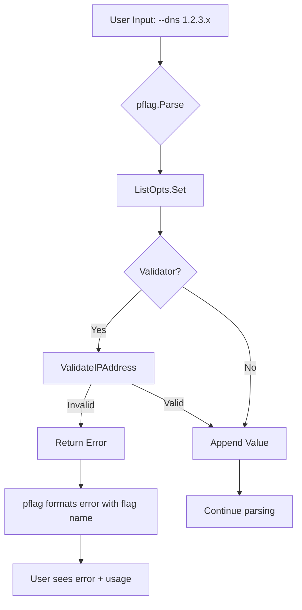
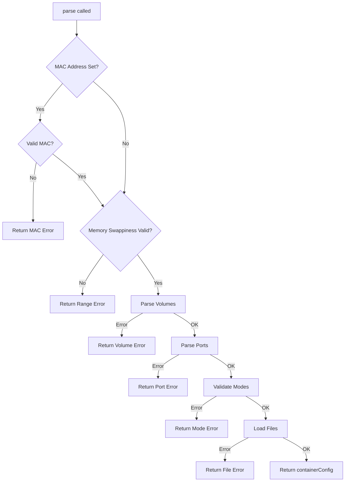
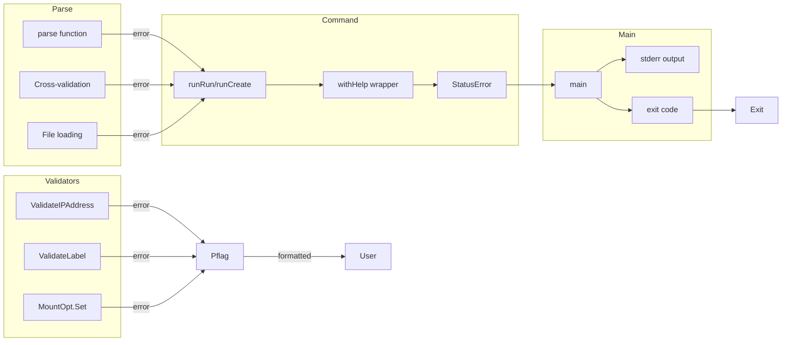

# I/O & Error Handling

> Generated by io-error-resilience for docker/docker-cli container options pattern

## I/O Summary

```
Application Type: CLI
Primary I/O: Terminal (stdout/stderr), Files (env-file, label-file, seccomp)
Error Strategy: Errors with fail-fast, no aggregation
Resilience Level: Moderate (validation at boundaries, clean error messages)
```

## Error Architecture Overview

Docker CLI's container options pattern uses a layered error handling approach:

```
User Input (flags)
    |
    v
+-------------------+
| pflag.Value.Set() |  <-- Immediate validation via validators
+-------------------+
    | (validation errors returned immediately)
    v
+------------------+
| parse() function |  <-- Cross-field validation, file loading
+------------------+
    | (first error wins, fail-fast)
    v
+------------------+
| Command layer    |  <-- Wraps errors with user-friendly messages
| (runRun, etc.)   |
+------------------+
    | (StatusError with exit codes)
    v
+----------------+
| main() / CLI   |  <-- Final error presentation to user
+----------------+
```

---

## 1. Validation Error Handling

### 1.1 Validator Function Signature

All validators follow a consistent signature pattern:

```go
// Validator type for transforming/validating values
type ValidatorFctType func(val string) (string, error)

// Validator type for complex types that return a struct
type ValidatorThrottleFctType func(val string) (*blkiodev.ThrottleDevice, error)
type ValidatorWeightFctType func(val string) (*blkiodev.WeightDevice, error)
```

### 1.2 ListOpts Validation Pattern

Validation happens at flag parse time through the `pflag.Value` interface:

```go
// opts/opts.go - ListOpts.Set()
func (opts *ListOpts) Set(value string) error {
    if opts.validator != nil {
        v, err := opts.validator(value)
        if err != nil {
            return err  // Immediate error return to pflag
        }
        value = v  // Validator can transform the value
    }
    *opts.values = append(*opts.values, value)
    return nil
}
```

**Key characteristics:**
- Validation runs during `flags.Parse()`, before command execution
- Errors stop parsing immediately (fail-fast)
- Validators can transform input (e.g., canonicalize IP addresses)
- User sees error immediately with flag name context from pflag

### 1.3 Validator Examples

**IP Address Validation:**
```go
// opts/opts.go
func ValidateIPAddress(val string) (string, error) {
    if ip := net.ParseIP(strings.TrimSpace(val)); ip != nil {
        return ip.String(), nil  // Returns canonical form
    }
    return "", fmt.Errorf("IP address is not correctly formatted: %s", val)
}
```

**Label Validation:**
```go
// opts/opts.go
func ValidateLabel(value string) (string, error) {
    key, _, _ := strings.Cut(value, "=")
    key = strings.TrimLeft(key, whiteSpaces)
    if key == "" {
        return "", fmt.Errorf("invalid label '%s': empty name", value)
    }
    if strings.ContainsAny(key, whiteSpaces) {
        return "", fmt.Errorf("label '%s' contains whitespaces", key)
    }
    return value, nil
}
```

**DNS Search Validation:**
```go
// opts/opts.go
func ValidateDNSSearch(val string) (string, error) {
    if val = strings.Trim(val, " "); val == "." {
        return val, nil
    }
    return validateDomain(val)
}

func validateDomain(val string) (string, error) {
    if alphaRegexp.FindString(val) == "" {
        return "", fmt.Errorf("%s is not a valid domain", val)
    }
    ns := domainRegexp.FindSubmatch([]byte(val))
    if len(ns) > 0 && len(ns[1]) < 255 {
        return string(ns[1]), nil
    }
    return "", fmt.Errorf("%s is not a valid domain", val)
}
```

**Sysctl Validation (allowlist-based):**
```go
// opts/opts.go
func ValidateSysctl(val string) (string, error) {
    validSysctlMap := map[string]bool{
        "kernel.msgmax":          true,
        "kernel.msgmnb":          true,
        // ... more allowed sysctls
    }
    validSysctlPrefixes := []string{
        "net.",
        "fs.mqueue.",
    }
    k, _, ok := strings.Cut(val, "=")
    if !ok || k == "" {
        return "", fmt.Errorf("sysctl '%s' is not allowed", val)
    }
    if validSysctlMap[k] {
        return val, nil
    }
    for _, vp := range validSysctlPrefixes {
        if strings.HasPrefix(k, vp) {
            return val, nil
        }
    }
    return "", fmt.Errorf("sysctl '%s' is not allowed", val)
}
```

### 1.4 Complex Option Types

Complex options implement `pflag.Value` directly with inline validation:

**Mount Options:**
```go
// opts/mount.go - MountOpt.Set()
func (m *MountOpt) Set(value string) error {
    csvReader := csv.NewReader(strings.NewReader(value))
    fields, err := csvReader.Read()
    if err != nil {
        return err
    }

    mount := mounttypes.Mount{}
    mount.Type = mounttypes.TypeVolume // default

    for _, field := range fields {
        key, val, ok := strings.Cut(field, "=")
        key = strings.ToLower(key)

        if !ok {
            switch key {
            case "readonly", "ro":
                mount.ReadOnly = true
                continue
            case "bind-nonrecursive":
                return errors.New("bind-nonrecursive is deprecated, use bind-recursive=disabled instead")
            default:
                return fmt.Errorf("invalid field '%s' must be a key=value pair", field)
            }
        }

        switch key {
        case "type":
            mount.Type = mounttypes.Type(strings.ToLower(val))
        case "readonly", "ro":
            mount.ReadOnly, err = strconv.ParseBool(val)
            if err != nil {
                return fmt.Errorf("invalid value for %s: %s", key, val)
            }
        // ... more cases with similar error handling
        default:
            return fmt.Errorf("unexpected key '%s' in '%s'", key, field)
        }
    }

    // Cross-field validation
    if mount.Type == "" {
        return errors.New("type is required")
    }
    if mount.Target == "" {
        return errors.New("target is required")
    }
    if mount.VolumeOptions != nil && mount.Type != mounttypes.TypeVolume {
        return fmt.Errorf("cannot mix 'volume-*' options with mount type '%s'", mount.Type)
    }
    // ... more cross-field checks

    m.values = append(m.values, mount)
    return nil
}
```

**Network Options:**
```go
// opts/network.go - NetworkOpt.Set()
func (n *NetworkOpt) Set(value string) error {
    longSyntax, err := regexp.MatchString(`\w+=\w+(,\w+=\w+)*`, value)
    if err != nil {
        return err
    }

    var netOpt NetworkAttachmentOpts
    if longSyntax {
        csvReader := csv.NewReader(strings.NewReader(value))
        fields, err := csvReader.Read()
        if err != nil {
            return err
        }

        for _, field := range fields {
            key, val, ok := strings.Cut(strings.ToLower(field), "=")
            if !ok || key == "" {
                return fmt.Errorf("invalid field %s", field)
            }

            switch key {
            case networkOptIPv4Address:
                netOpt.IPv4Address, err = netip.ParseAddr(val)
                if err != nil {
                    return err  // Pass through stdlib error
                }
            case gwPriorityOpt:
                netOpt.GwPriority, err = strconv.Atoi(val)
                if err != nil {
                    var numErr *strconv.NumError
                    if errors.As(err, &numErr) {
                        err = numErr.Err  // Unwrap for cleaner message
                    }
                    return fmt.Errorf("invalid gw-priority (%s): %w", val, err)
                }
            default:
                return errors.New("invalid field key " + key)
            }
        }
        if len(netOpt.Target) == 0 {
            return errors.New("network name/id is not specified")
        }
    } else {
        netOpt.Target = value
    }
    n.options = append(n.options, netOpt)
    return nil
}
```

---

## 2. Parse-Time Error Handling

### 2.1 The parse() Function Pattern

The `parse()` function in `cli/command/container/opts.go` converts flag values to API types with extensive validation:

```go
// cli/command/container/opts.go
func parse(flags *pflag.FlagSet, copts *containerOptions, serverOS string) (*containerConfig, error) {
    // MAC address validation
    if copts.macAddress != "" {
        if _, err := net.ParseMAC(strings.TrimSpace(copts.macAddress)); err != nil {
            return nil, fmt.Errorf("%s is not a valid mac address", copts.macAddress)
        }
    }

    // Range validation
    swappiness := copts.swappiness
    if swappiness != -1 && (swappiness < 0 || swappiness > 100) {
        return nil, fmt.Errorf("invalid value: %d. Valid memory swappiness range is 0-100", swappiness)
    }

    // Delegated parsing with error propagation
    for bind := range copts.volumes.GetMap() {
        parsed, err := volumespec.Parse(bind)
        if err != nil {
            return nil, err  // Propagate parse errors
        }
        // ...
    }

    // Mode validation (fail-fast)
    pidMode := container.PidMode(copts.pidMode)
    if !pidMode.Valid() {
        return nil, errors.New("--pid: invalid PID mode")
    }

    utsMode := container.UTSMode(copts.utsMode)
    if !utsMode.Valid() {
        return nil, errors.New("--uts: invalid UTS mode")
    }

    // Health check validation with conflict detection
    if copts.noHealthcheck {
        if haveHealthSettings {
            return nil, errors.New("--no-healthcheck conflicts with --health-* options")
        }
    } else if haveHealthSettings {
        if copts.healthInterval < 0 {
            return nil, errors.New("--health-interval cannot be negative")
        }
        if copts.healthTimeout < 0 {
            return nil, errors.New("--health-timeout cannot be negative")
        }
        // ... more negative checks
    }

    // Post-construction validation
    if copts.autoRemove && !hostConfig.RestartPolicy.IsNone() {
        return nil, errors.New("conflicting options: cannot specify both --restart and --rm")
    }

    return &containerConfig{...}, nil
}
```

**Key characteristics:**
- Fail-fast: first error terminates parsing
- No error aggregation (single error returned)
- Server OS awareness for platform-specific validation
- Clear error messages with flag names included

### 2.2 Server-Dependent Validation

Some validation requires knowing the target OS:

```go
// cli/command/container/opts.go - Device validation
devices := copts.devices.GetSlice()
deviceMappings := make([]container.DeviceMapping, 0, len(devices))
for _, device := range devices {
    if cdi.IsQualifiedName(device) {
        cdiDeviceNames = append(cdiDeviceNames, device)
        continue
    }
    // Late validation - serverOS required
    validated, err := validateDevice(device, serverOS)
    if err != nil {
        return nil, err
    }
    deviceMapping, err := parseDevice(validated, serverOS)
    if err != nil {
        return nil, err
    }
    deviceMappings = append(deviceMappings, deviceMapping)
}
```

---

## 3. File I/O

### 3.1 Environment File Loading

```go
// pkg/kvfile/kvfile.go
func Parse(filename string, lookupFn func(key string) (value string, found bool)) ([]string, error) {
    fh, err := os.Open(filename)
    if err != nil {
        return []string{}, err  // Pass through OS error
    }
    out, err := parseKeyValueFile(fh, lookupFn)
    _ = fh.Close()  // Close regardless of parse result
    if err != nil {
        return []string{}, fmt.Errorf("invalid env file (%s): %v", filename, err)
    }
    return out, nil
}

func parseKeyValueFile(r io.Reader, lookupFn func(string) (string, bool)) ([]string, error) {
    lines := []string{}
    scanner := bufio.NewScanner(r)
    utf8bom := []byte{0xEF, 0xBB, 0xBF}

    for currentLine := 1; scanner.Scan(); currentLine++ {
        scannedBytes := scanner.Bytes()

        // UTF-8 validation
        if !utf8.Valid(scannedBytes) {
            return []string{}, fmt.Errorf("invalid utf8 bytes at line %d: %v", currentLine, scannedBytes)
        }

        // BOM handling
        if currentLine == 1 {
            scannedBytes = bytes.TrimPrefix(scannedBytes, utf8bom)
        }

        line := strings.TrimLeftFunc(string(scannedBytes), unicode.IsSpace)

        // Skip empty lines and comments
        if len(line) == 0 || line[0] == '#' {
            continue
        }

        key, _, hasValue := strings.Cut(line, "=")
        if len(key) == 0 {
            return []string{}, fmt.Errorf("no variable name on line '%s'", line)
        }
        if strings.ContainsAny(key, whiteSpaces) {
            return []string{}, fmt.Errorf("variable '%s' contains whitespaces", key)
        }

        if hasValue {
            lines = append(lines, line)
            continue
        }

        // Environment variable lookup for bare keys
        if lookupFn != nil {
            if value, found := lookupFn(line); found {
                lines = append(lines, key+"="+value)
            }
        }
    }
    return lines, scanner.Err()  // Propagate scanner errors
}
```

**File I/O characteristics:**
- Reads entire file into memory via scanner
- UTF-8 validation with BOM handling
- Line-by-line parsing with line number tracking for errors
- Environment variable substitution for bare keys
- Clean error messages with filename and line context

### 3.2 Seccomp Profile Loading

```go
// cli/command/container/opts.go
func parseSecurityOpts(securityOpts []string) ([]string, error) {
    for key, opt := range securityOpts {
        k, v, ok := strings.Cut(opt, "=")
        if !ok && k != "no-new-privileges" {
            k, v, ok = strings.Cut(opt, ":")
        }
        if (!ok || v == "") && k != "no-new-privileges" {
            return securityOpts, fmt.Errorf("invalid --security-opt: %q", opt)
        }

        if k == "seccomp" {
            switch v {
            case seccompProfileDefault, seccompProfileUnconfined:
                // Built-in profiles, nothing to do
            default:
                // Load and validate JSON file
                f, err := os.ReadFile(v)
                if err != nil {
                    return securityOpts, fmt.Errorf("opening seccomp profile (%s) failed: %w", v, err)
                }
                var b bytes.Buffer
                if err := json.Compact(&b, f); err != nil {
                    return securityOpts, fmt.Errorf("compacting json for seccomp profile (%s) failed: %w", v, err)
                }
                securityOpts[key] = "seccomp=" + b.String()
            }
        }
    }
    return securityOpts, nil
}
```

**Seccomp file handling:**
- Reads entire file with `os.ReadFile`
- Validates JSON syntax via `json.Compact`
- Inlines file content into the option value
- Error wrapping with `%w` for error chain preservation

---

## 4. Error Types and Classification

### 4.1 StatusError (Exit Code Carrier)

```go
// cli/error.go
type StatusError struct {
    Cause      error
    Status     string
    StatusCode int
}

func (e StatusError) Error() string {
    if e.Status != "" {
        return e.Status
    }
    if e.Cause != nil {
        return e.Cause.Error()
    }
    return ""
}

func (e StatusError) Unwrap() error {
    return e.Cause
}
```

**Usage pattern:**
```go
// cli/command/container/run.go
if err := validatePullOpt(ropts.pull); err != nil {
    return cli.StatusError{
        Status:     withHelp(err, "run").Error(),
        StatusCode: 125,  // Docker convention for CLI errors
    }
}

containerCfg, err := parse(flags, copts, serverInfo.OSType)
if err != nil {
    return cli.StatusError{
        Status:     withHelp(err, "run").Error(),
        StatusCode: 125,
    }
}
```

### 4.2 invalidParameterErr (Semantic Error Type)

```go
// cli/command/container/errors.go
import "github.com/containerd/errdefs"

func invalidParameter(err error) error {
    if err == nil || errdefs.IsInvalidArgument(err) {
        return err
    }
    return invalidParameterErr{err}
}

type invalidParameterErr struct{ error }

func (invalidParameterErr) InvalidParameter() {}
func (e invalidParameterErr) Unwrap() error {
    return e.error
}
```

**Usage pattern:**
```go
// cli/command/container/opts.go
if _, ok := endpoints[n.Target]; ok {
    return nil, invalidParameter(fmt.Errorf("network %q is specified multiple times", n.Target))
}

if hasUserDefined && hasNonUserDefined {
    return nil, invalidParameter(errors.New("conflicting options: cannot attach both user-defined and non-user-defined network-modes"))
}
```

### 4.3 notFoundErr (Semantic Error Type)

```go
// cli/command/container/errors.go
func notFound(err error) error {
    if err == nil || errdefs.IsNotFound(err) {
        return err
    }
    return notFoundErr{err}
}

type notFoundErr struct{ error }

func (notFoundErr) NotFound() {}
func (e notFoundErr) Unwrap() error {
    return e.error
}
```

### 4.4 Error Type Classification

| Error Type | Purpose | User-Facing? | Exit Code |
|------------|---------|--------------|-----------|
| `StatusError` | CLI exit code carrier | Yes | Configurable (125 for CLI errors) |
| `invalidParameterErr` | Invalid user input | Yes | 125 via StatusError |
| `notFoundErr` | Resource not found | Yes | Varies |
| Validator errors | Flag validation | Yes | 1 (via pflag) |
| Parse errors | Option parsing | Yes | 125 via StatusError |

---

## 5. User-Facing Error Formatting

### 5.1 withHelp Pattern

Errors are wrapped with help suggestions:

```go
// cli/command/container/run.go
func withHelp(err error, commandName string) error {
    return fmt.Errorf("docker: %w\n\nRun 'docker %s --help' for more information", err, commandName)
}
```

**Example output:**
```
docker: invalid value: 150. Valid memory swappiness range is 0-100

Run 'docker run --help' for more information
```

### 5.2 Main Entry Point Error Handling

```go
// cmd/docker/docker.go
func main() {
    err := dockerMain(context.Background())
    if errors.As(err, &errCtxSignalTerminated{}) {
        os.Exit(getExitCode(err))
    }

    if err != nil && !errdefs.IsCanceled(err) {
        if err.Error() != "" {
            _, _ = fmt.Fprintln(os.Stderr, err)  // Print to stderr
        }
        os.Exit(getExitCode(err))
    }
}

func getExitCode(err error) int {
    if err == nil {
        return 0
    }

    var userTerminatedErr errCtxSignalTerminated
    if errors.As(err, &userTerminatedErr) {
        s, ok := userTerminatedErr.signal.(syscall.Signal)
        if !ok {
            return 1
        }
        return 128 + int(s)  // Unix convention for signal termination
    }

    var stErr cli.StatusError
    if errors.As(err, &stErr) && stErr.StatusCode != 0 {
        return stErr.StatusCode
    }

    return 1  // Default non-zero exit
}
```

### 5.3 Error Message Patterns

**Format consistency across validators:**

| Validator | Error Format |
|-----------|-------------|
| IP Address | `"IP address is not correctly formatted: %s"` |
| Label | `"invalid label '%s': empty name"` or `"label '%s' contains whitespaces"` |
| DNS Search | `"%s is not a valid domain"` |
| Sysctl | `"sysctl '%s' is not allowed"` |
| Extra Host | `"bad format for add-host: %q"` or `"invalid IP address in add-host: %q"` |
| Mount | `"invalid field '%s' must be a key=value pair"` |
| Network | `"invalid field %s"` |

**Error message characteristics:**
- Include the invalid value in the message
- Use quoted format (`%q`) for values that may have special characters
- Include expected format hints where helpful
- Prefix with option name for context

---

## 6. Error Propagation Flow

### 6.1 Validation Layer to Command Layer

```
User: docker run -e "=invalid" myimage

1. pflag parses "--env" flag
2. ListOpts.Set("=invalid") called
3. ValidateEnv("=invalid") returns error
4. pflag returns: "invalid argument \"=invalid\" for \"-e, --env\" flag: invalid environment variable: =invalid"
5. cobra.Command shows error with usage hint
```

### 6.2 Parse Layer to Command Layer

```
User: docker run --memory-swappiness 150 myimage

1. pflag parses flags successfully (no validator on swappiness)
2. runRun() calls parse()
3. parse() checks range: swappiness != -1 && (swappiness < 0 || swappiness > 100)
4. Returns error: "invalid value: 150. Valid memory swappiness range is 0-100"
5. runRun() wraps with StatusError{Status: withHelp(err, "run").Error(), StatusCode: 125}
6. User sees:
   docker: invalid value: 150. Valid memory swappiness range is 0-100

   Run 'docker run --help' for more information
```

### 6.3 File I/O to Parse Layer

```
User: docker run --env-file /nonexistent myimage

1. parse() calls opts.ReadKVEnvStrings()
2. ReadKVEnvStrings calls kvfile.Parse()
3. os.Open() returns error
4. Error propagates up unchanged
5. User sees: "open /nonexistent: no such file or directory"
```

---

## 7. Flow Diagrams

### 7.1 Validation Flow



### 7.2 Parse Function Flow



### 7.3 Error Propagation Flow



---

## 8. Resilience Patterns

### 8.1 No Retry Logic

The container options pattern does not implement retries. Validation and parsing are deterministic operations that either succeed or fail immediately.

### 8.2 No Circuit Breakers

Not applicable for CLI option parsing.

### 8.3 Fail-Fast Strategy

All validation uses fail-fast:
- First error terminates processing
- No error aggregation
- Clear, immediate feedback to user

### 8.4 Resource Cleanup

File handles are closed immediately after use:

```go
// pkg/kvfile/kvfile.go
fh, err := os.Open(filename)
if err != nil {
    return []string{}, err
}
out, err := parseKeyValueFile(fh, lookupFn)
_ = fh.Close()  // Always close, ignore close error
```

---

## 9. Adaptation Recommendations

### 9.1 Critical to Preserve

| Pattern | Why It Matters |
|---------|---------------|
| Validator signature `func(string) (string, error)` | Enables consistent validation interface |
| Fail-fast error handling | Users get immediate, clear feedback |
| Error message format with value inclusion | Helps users identify what went wrong |
| `withHelp` wrapper pattern | Points users to documentation |
| StatusError with exit codes | Enables scripting and automation |
| File context in errors (filename, line number) | Essential for debugging env files |
| Server OS parameter | Enables cross-platform validation |

### 9.2 Consider Improving

| Area | Potential Improvement |
|------|----------------------|
| Error aggregation | Could collect multiple validation errors instead of fail-fast |
| Structured errors | Could use error codes for programmatic handling |
| i18n support | Error messages are hardcoded in English |
| Validation timing | Some validations could move earlier (e.g., device paths) |

### 9.3 Risk Areas

| Location | Risk |
|----------|------|
| Seccomp file loading | Reads entire file into memory; large files could cause issues |
| UTF-8 validation | Happens per-line, not entire file; partial valid files may be processed |
| Environment variable lookup | `os.LookupEnv` in file parsing could expose sensitive data |
| Error wrapping | Some errors lose context when wrapped; `%w` not used consistently |

---

## 10. Integration with Other Analyses

### 10.1 Entry Points Integration

Error handling integrates with the Cobra command structure:
- Commands wrap `parse()` errors with `StatusError`
- Exit codes propagate through `main()`
- Flag errors handled by pflag/cobra automatically

### 10.2 Infrastructure Integration

- File paths in errors are absolute when provided by the user
- OS errors propagate unchanged for system error handling
- Signal handling is separate from option parsing

### 10.3 Dependency Catalog Integration

Key dependencies for error handling:
- `github.com/spf13/pflag` - Flag parsing and error formatting
- `github.com/containerd/errdefs` - Semantic error types
- `fmt` - Error message formatting with `%w` support

---

## 11. Code Examples for Adaptation

### 11.1 Implementing a New Validator

```go
// Example: ValidatePort for your CLI
func ValidatePort(val string) (string, error) {
    port, err := strconv.Atoi(val)
    if err != nil {
        return "", fmt.Errorf("invalid port number: %s", val)
    }
    if port < 1 || port > 65535 {
        return "", fmt.Errorf("port %d out of range (1-65535)", port)
    }
    return val, nil
}

// Usage in addFlags:
copts.ports = opts.NewListOpts(ValidatePort)
flags.Var(&copts.ports, "port", "Ports to expose")
```

### 11.2 Implementing a Complex Option Type

```go
// Example: BindingOpt for key=value with validation
type BindingOpt struct {
    values []Binding
}

func (b *BindingOpt) Set(value string) error {
    key, val, ok := strings.Cut(value, "=")
    if !ok {
        return fmt.Errorf("invalid binding format: %s (expected key=value)", value)
    }
    if key == "" {
        return errors.New("binding key cannot be empty")
    }
    b.values = append(b.values, Binding{Key: key, Value: val})
    return nil
}

func (b *BindingOpt) Type() string { return "binding" }
func (b *BindingOpt) String() string { return fmt.Sprintf("%v", b.values) }
```

### 11.3 Implementing withHelp Pattern

```go
// Error wrapper for your CLI
func withHelp(err error, commandName string) error {
    return fmt.Errorf("mycli: %w\n\nRun 'mycli %s --help' for more information", err, commandName)
}

// StatusError for exit codes
type StatusError struct {
    Status     string
    StatusCode int
}

func (e StatusError) Error() string {
    return e.Status
}

// Usage in command:
func runCommand(opts *options) error {
    cfg, err := parse(opts)
    if err != nil {
        return StatusError{
            Status:     withHelp(err, "run").Error(),
            StatusCode: 1,
        }
    }
    // ...
}
```
