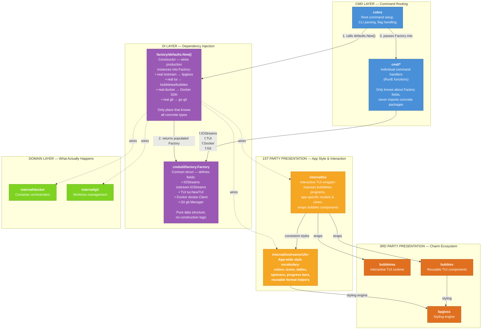

**Status: IMPLEMENTED** — All components built and tested. See `internal/iostreams/CLAUDE.md` and `internal/tui/CLAUDE.md` for API references.

```mermaid
graph TD
    subgraph "CMD LAYER — Command Routing"
        COBRA["<b>cobra</b><br/>Root command setup,<br/>CLI parsing, flag handling"]

        COMMANDS["<b>cmd/*</b><br/>Individual command handlers<br/>(RunE functions)<br/><br/>Only knows about Factory fields,<br/>never imports concrete packages"]
    end

    subgraph "DI LAYER — Dependency Injection"
        FACTORY["<b>cmdutil/factory.Factory</b><br/>Contract struct — defines fields:<br/>• IOStreams iostream.IOStreams<br/>• TUI tui.NewTUI<br/>• Docker docker.Client<br/>• Git git.Manager<br/><br/>Pure data structure,<br/>no construction logic"]

        DEFAULTS["<b>factory/defaults.New()</b><br/>Constructor — wires production<br/>instances into Factory:<br/>• real iostream → lipgloss<br/>• real tui → bubbletea/bubbles<br/>• real docker → Docker SDK<br/>• real git → go-git<br/><br/>Only place that knows<br/>all concrete types"]
    end

    subgraph "1ST PARTY PRESENTATION — App Style & Interaction"
        IOSTREAM["<b>internal/iostreams\1/b><br/>App-wide style vocabulary:<br/>colors, icons, tables,<br/>spinners, progress bars,<br/>reusable format helpers"]

        TUI["<b>internal/tui</b><br/>Interactive TUI wrapper:<br/>exposes bubbletea programs,<br/>app-specific models & views,<br/>wraps bubbles components"]
    end

    subgraph "3RD PARTY PRESENTATION — Charm Ecosystem"
        LIPGLOSS["<b>lipgloss</b><br/>Styling engine"]

        BUBBLETEA["<b>bubbletea</b><br/>Interactive TUI runtime"]

        BUBBLES["<b>bubbles</b><br/>Reusable TUI components"]
    end

    subgraph "DOMAIN LAYER — What Actually Happens"
        DOCKER["<b>internal/docker</b><br/>Container orchestration"]
        GIT["<b>internal/git</b><br/>Worktree management"]
    end

    %% App init: cobra calls New(), gets factory, passes to commands
    COBRA -- "1. calls defaults.New()" --> DEFAULTS
    DEFAULTS -- "2. returns populated Factory" --> FACTORY
    COBRA -- "3. passes Factory into" --> COMMANDS

    %% Commands access EVERYTHING through factory fields
    COMMANDS -- "f.IOStreams<br/>f.TUI<br/>f.Docker<br/>f.Git" --> FACTORY

    %% defaults.New() is the ONLY thing that knows concrete types
    DEFAULTS -. "wires" .-> IOSTREAM
    DEFAULTS -. "wires" .-> TUI
    DEFAULTS -. "wires" .-> DOCKER
    DEFAULTS -. "wires" .-> GIT

    %% Internal wiring within presentation
    TUI -- "wraps" --> BUBBLETEA
    TUI -- "wraps" --> BUBBLES
    TUI -- "consistent styles" --> IOSTREAM
    IOSTREAM -- "styling engine" --> LIPGLOSS
    BUBBLES -- "styling" --> LIPGLOSS

    %% Styling
    classDef cmd fill:#4a90d9,stroke:#2c5f8a,color:#fff
    classDef factory fill:#9b59b6,stroke:#6c3483,color:#fff
    classDef firstParty fill:#f5a623,stroke:#c47d12,color:#fff
    classDef thirdParty fill:#e07020,stroke:#a04d10,color:#fff
    classDef domain fill:#7ed321,stroke:#5a9a18,color:#fff

    class COBRA,COMMANDS cmd
    class FACTORY,DEFAULTS factory
    class IOSTREAM,TUI firstParty
    class LIPGLOSS,BUBBLETEA,BUBBLES thirdParty
    class DOCKER,GIT domain
```
