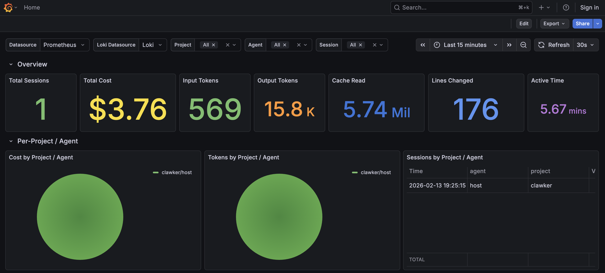
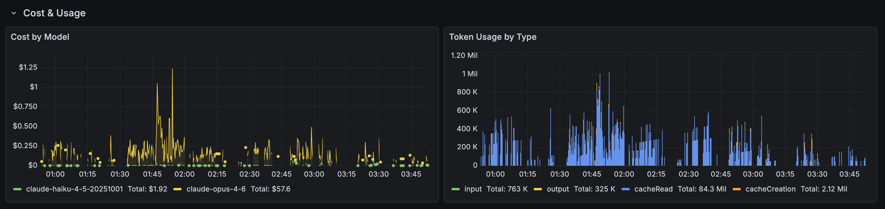
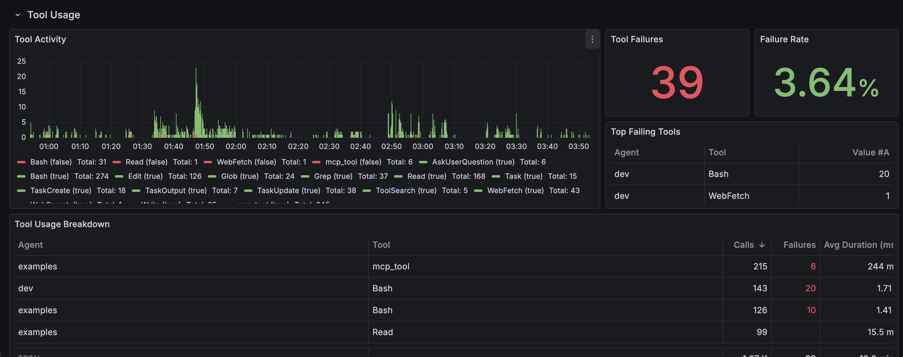
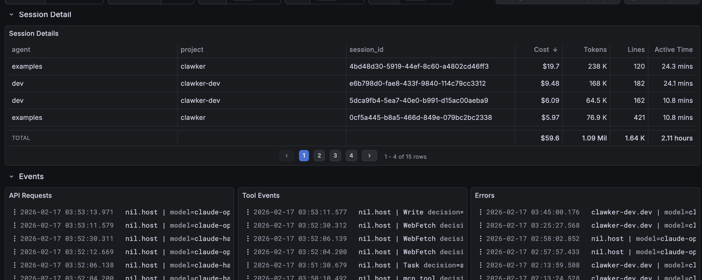
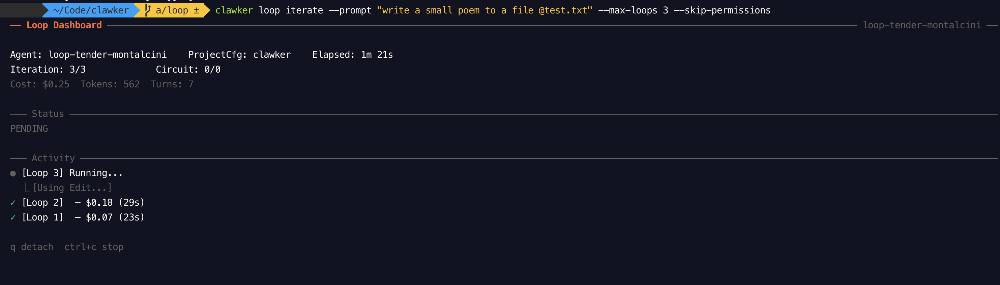

# Clawker

<p align="center">
  <a href="https://golang.org"></a>
  <a href="LICENSE"></a>
  <a href="#"></a>
  <a href="#"></a>
</p>

When I began experimenting with Claude Code to keep up with the Agentic AI trend, I was surprised by the total absence of local development container offerings for using it. Claude Code's sandbox mode is lackluster; the only other options for isolation and orchestration involve paid remote services, which seems silly to me—we've had containers for over a decade now. The Claude Code docs recommend using containers, but they only offer a devcontainer example, which is a step in the right direction but leaves you coupled to the IDE. The DIY approach results in managing multiple Claude Code Dockerfiles, maybe a container registry, per language stack/project, which also sucks, and there are a lot of internals that devcontainers offer that vanilla containers don't have. So I decided to build something that abstracts away all the complexity of creating, managing, automating, and running Claude Code in containers with Docker. It served as a good project to learn the ways of "Agentic Engineering" and "vibing" (exhausting btw, beware of some hilarious slop I've been cleaning up in this code base), but Clawker has become very useful for me, so I've decided to open source it for anyone yearning for a better local development container experience.

> Clawker is in a very early stage, but it's already quite usable and has a lot of features. I'm actively developing it and adding new features, so expect some breaking changes and rough edges. If you want to contribute or have any feedback, please open an issue or a pull request! Give it a star if you find it useful so I can brag about them at parties

## High-Level Feature Overview

- **Embedded parameterized Dockerfile template** inspired by the official devcontainer image, supporting Alpine or Debian base images with common tools preinstalled: git, curl, vim, zsh, ripgrep, etc. An entrypoint script that lets you bypass Claude Code or just pass flags as the default command, unprivileged `claude` user, and more
- **Static Dockerfile generation** if you desire a tangible Dockerfile to build and customize yourself (this repo was at first going to just be a docker image packaging repo for my private dockerhub lol so I kept this in here)
- **Injectable build-time instructions** to customize images per project: packages, environment variables, root run commands, user run commands, and more
- **Bind or snapshot workspace modes**: mount your repository to the container for live editing, or copy it at runtime for pure isolation
- **Fresh or copy agent mode**: start with a clean Claude Code install, or copy all your Claude Code settings, plugins, authentication, skills, etc. into the container at runtime for a seamless transition from doing work in a host instance to a container
- **Seamless Git credential forwarding**: toggleable SSH agent, GPG agent forwarding from the host using muxrpc (just like devcontainers) for zero-config access to private repositories and commit signing
- **Host proxy service** copies git ssh keys into the container and sends events like "browser open" from the container to your host for browser authentication, then proxies the callback back to the container. Great for when you have to authenticate with `claude` or `gh`
- **Configurable environment variables**: set or copy environment variables and env files from the host into containers at runtime
- **Injectable post-initialization bash script** that runs after the container starts but before Claude Code launches, letting you set up MCPs, etc.
- **Default-configured firewall** to prevent agents from accessing most of the internet except GitHub and common package managers; add domains, IP list services, and pre-created addons (GCP) per project, or disable it entirely. This is a great security layer to mitigate runaway agents or prompt injections from doing damage while still giving them the network access they need to be useful.
- **Toggleable read-only global share**: volume mount from the host giving all containers real-time access to files you place in it
- **Project-based namespace isolation** of container resources. Clawker detects if it's in a project directory and automatically, via docker label prefixes, lets you filter for resources with re-usable names like "dev" or "main" that are scoped to the project. So you can have a "dev" container in multiple projects without conflict, and you can easily filter `clawker ps --filter agent=dev` to see all your dev containers across projects or `clawker ps --project myapp` to see all containers for a specific project.
- **Dedicated Docker network** that all containers run in
- **Jailed from host Docker resources** via `pkg/whail` (whale jail), a standalone package that decorates the moby SDK to prevent callers from seeing resources without the automatically applied management labels. I might use this package in other "agent in container" solutions. So I don't have to worry about accidentally deleting non-clawker managed containers/volumes/images, etc.
- **Docker CLI-esque commands** for managing containers, Clawker isn't a passthrough to Docker CLI; it uses the moby SDK (via `pkg/whail`). This allowed me to add more flags, modify the behavior, etc over what docker cli offers
- **Git worktree management and commands**: pass a worktree flag to container run or create commands to automatically create a git worktree in the Clawker home project directory and bind mount it to the container workdir. Also has cli commands and flags to list and manage worktrees created by clawker, uses `go-git` under the hood to avoid relying on the host git binary
- **Optional monitoring stack** with Prometheus, Loki, and Grafana to monitor agents and containers; every container has the environment variables needed to communicate with it
- **Looping mode (experimental)**: pass a prompt, file, or task list to Clawker and it runs an autonomous loop with a fresh container each iteration with stagnation detection, circuit breaker protection, max loops, tracking container agent output, progress, costs, token usage, etc.

> I feel obligated to state this... **Clawker** is a portmanteau of Claude + Docker. The project was at first named `claucker`, but reading it, saying it, and especially typing it always felt awkward to my brain because it violates the phonetic rules of English. Before I was aware of the whole `clawdbot` `openclaw` `clawthis` `clawthat` naming craze, I changed it to be the "correct" phonetic spelling, `clawker`, purely because it just rolls off the fingers when typing it. For those reasons I'm not going to change the name, but I want to make it clear the decision wasn't to chase a trend  

## Installation

**Prerequisites:** Docker must be installed and running on your machine. I've only tested on macOS so far, but it should work on Linux as well. Windows is not currently supported but I might in the future (yucky).

```bash
curl -fsSL https://raw.githubusercontent.com/schmitthub/clawker/main/scripts/install.sh | bash
```

<details>
<summary>Other installation methods</summary>

**Specific version:**
```bash
curl -fsSL https://raw.githubusercontent.com/schmitthub/clawker/main/scripts/install.sh | CLAWKER_VERSION=v0.1.3 bash
```

**Custom directory:**
```bash
curl -fsSL https://raw.githubusercontent.com/schmitthub/clawker/main/scripts/install.sh | CLAWKER_INSTALL_DIR=$HOME/.local/bin bash
```

**Build from source** (requires Go 1.25+):
```bash
git clone https://github.com/schmitthub/clawker.git
cd clawker && make clawker
export PATH="$PWD/bin:$PATH"
```
</details>

## Walkthrough

Instead of giving you a wall of text here I'll just go over how I'm using `clawker` today and how I'm finding it useful. 

### Initialize 

```bash
clawker init
```

This is going to create a `~/.local/clawker` directory (configurable with `CLAWKER_HOME`) where all of Clawker's files live: logs, clawker settings, generated Dockerfiles, project registry, project folders with bind-mounted worktree directories, etc. It is also going to ask you if you want to create a default fallback image to use when you aren't in a project directory with a clawker.yaml in the project root.  

#### Start a project

```bash
cd your-project # this changes directories to your project, that is what `cd` stands for. If you didn't already know this then you might want to stop here and just install claude cowork. trust me you're gonna enjoy it more   
clawker project init    # Creates a clawker.yaml, .clawkerignore, and registers your project in the $CLAWKER_HOME registry
# Customize your clawker.yaml (see examples/ for language-specific configs) or let claude take a stab at it. I dogfood clawker to build clawker so you can check out my clawker.yaml to see how I customized the image for golang development and other config strats
clawker build           # Builds your project's image. This image's latest build can now be referenced using a reserved special character "@" when you are in a project directory path. Or you can give a full image name or ID
```

#### Run a container 

My workflow is a hybrid approach. I like having a claude code instance running on the host for real intensive interactive work while at the same time launching a few clawker managed containers in separate tabs and worktrees using `--dangerously-skip-permissions`. 

So to do that let's say you're working on a feature branch with host claude code and inspiration strikes or you notice an issue / bug and say "shit i should address this". Or you've finished up a few PRDs and want to bang them out in parallel. I just quickly open a tab and have another claude agent via clawker get after it on the side without me having to approve anything over and over again so...

```bash
clawker run -it --agent example --worktree hotfix/example:main @ --dangerously-skip-permissions
```

This creates and attaches my terminal to a new claude instance isolated in a container environment with a git worktree dir created under `CLAWKER_HOME` off of my main branch. Since it has all my plugins, skills, auth tokens, git creds, mcps installed, build deps instantly, it's just a matter of telling the little rascal what to do and letting it go bananas and create a pr about it. I'll periodically check in on it to see how it's doing in another tab. Or you can detach `ctrl p+q` and return to your terminal; to reattach to the same session use `clawker attach --agent example`. Ez pz no ssh/tmux bullshit, no vscode devcontainer window, no VPS with heavy IO latency, or setting up dedicated servers, or having to pay someone to do it for you. For free.  

I can see my worktree paths and open them in an IDE if I want to do some manual work or review the code.  

```bash
$ clawker worktree list
BRANCH     PATH                                                                   HEAD     MODIFIED     STATUS
a/example  /Users/schmitthub/.local/clawker/projects/clawker/worktrees/a-example  f20aa37  1 hour ago   healthy
```

When I'm done I easily remove the worktree 

```bash
clawker worktree remove a/example --delete-branch  # this deletes the worktree and the branch since it was only for this worktree, if you want to keep the branch just omit the flag. Delete won't work if the branch isn't fully merged
```

If I have too many agents ripping through features and fixes and want a high level overview of my coding armada I start the monitoring stack

```bash
clawker monitor init
clawker monitor up
clawker monitor status 
# stop it later on 
clawker monitor down
```

Now I can go to the grafana dashboard at http://localhost:3000 and see all my agents, containers, resource usage, costs, tool executions, decisions, prompts, api calls, etc from every agent. (you can also set env vars in your host shell and it will report to this stack)

```bash
# Add this to your shell profile 
OTEL_EXPORTER_OTLP_PROTOCOL=http/protobuf
OTEL_METRICS_EXPORTER=otlp
OTEL_LOGS_EXPORT_INTERVAL=5000
OTEL_EXPORTER_OTLP_METRICS_ENDPOINT=http://localhost:4318/v1/metrics
OTEL_EXPORTER_OTLP_LOGS_ENDPOINT=http://localhost:4318/v1/logs
OTEL_METRIC_EXPORT_INTERVAL=10000
OTEL_LOGS_EXPORTER=otlp
OTEL_METRICS_INCLUDE_ACCOUNT_UUID=true
OTEL_METRICS_INCLUDE_SESSION_ID=true
CLAUDE_CODE_ENABLE_TELEMETRY=1
OTEL_LOG_TOOL_DETAILS=1
OTEL_LOG_USER_PROMPTS=1

# Add this to a project level .env 
PROJECT_NAME=MyGroundbreakingTodoApp
OTEL_RESOURCE_ATTRIBUTES=project=$PROJECT_NAME,agent=host
```

When I'm done I can commit / push / open a PR right in the container terminal with all my creds and git access set up, or I can open the worktree in my IDE and do it from there. I can `/exit` out and the container will stop (or `ctrl c` in the terminal). I can use `--rm` flags just like docker cli to automatically remove containers when they stop, or I can start the same one back up again with `clawker start -a -i --agent example` to pick up right where I left off. 

Or you can get cute with some ralph loops 

```bash
#!/bin/bash

PROMPT="start or expand upon the dramatic story written in @ralph.txt by adding a single paragraph. If the file doesn't exist create it and start the story with a dramatic opening"

for i in {1..5}; do
  echo "Starting loop iteration $i..."
  cclawker run --rm --agent ralph @ -p "$PROMPT" --output-format=stream-json --verbose --include-partial-messages
  echo "Finished loop iteration $i."
done

```

All containers get named volume mounts for their claude config directories and command history for persistence.

```bash
$ clawker volume ls
VOLUME NAME                                  DRIVER  MOUNTPOINT
clawker.clawker.example-config               local   ...er/volumes/clawker.clawker.example-config/_data
clawker.clawker.example-history              local   ...r/volumes/clawker.clawker.example-history/_data
# You can see the resources naming conventions here (clawker.{project}.{agent}). Labeling works similarly
```

You can also see how clawker is jailed from other docker resource access...

```bash
$ docker create alpine:latest
6c6896073eb1a2baa91450d0b5b795808f0ea4a052f729383a2d166d87fa0c17
$ clawker ps -a
NAME                     STATUS                  PROJECT                AGENT                  IMAGE                   CREATED
clawker.clawker.example  exited                  clawker                example                clawker-clawker:latest  9 hours ago
$ docker ps -a 
CONTAINER ID   IMAGE                    COMMAND                  CREATED         STATUS                    PORTS     NAMES
6c6896073eb1   alpine:latest            "/bin/sh"                7 seconds ago   Created                             great_dubinsky
73b4ac14c2b3   clawker-clawker:latest   "entrypoint.sh --dan…"   10 hours ago    Exited (0) 10 hours ago             clawker.clawker.example
```

## Creating and Using Containers

```bash
# Create a fresh container and connect interactively
# The @ symbol auto-resolves your project image (clawker-<project>:latest)
clawker run -it --agent main @

# Detach without stopping: Ctrl+P, Ctrl+Q

# Re-attach to the agent
clawker attach --agent main

# Stop the agent (Ctrl+C exits Claude Code and stops the container)
# Or from another terminal:
clawker stop --agent main

# Start a stopped agent and attach
clawker start -a -i --agent main
```

## The `@` Image Shortcut

Use `@` anywhere an image argument is expected to auto-resolve your project's image:

```bash
clawker run -it @                     # Uses clawker-<project>:latest
clawker run -it --agent dev @         # Same, with agent name
clawker container create --agent test @
```

## Working with Worktrees

Run separate agents per git worktree for parallel development:

```bash
# Create worktrees manually
clawker worktree add feature/todo-apps-are-dope
clawker worktree add feat-feet --base main

# list your worktrees
clawker worktree list

# Run agents in worktree containers
clawker run --worktree feature/todo-apps-are-dope -it --agent todo-apps @ --dangerously-skip-permissions
```

## Managing Resources

As close to docker CLI and its flags as I could make it, but remember they do different things under the hood. Adding all features is also still a WIP

```bash
clawker ps                          # List all clawker containers
clawker container ls                # Same thing
clawker container stop --agent NAME
clawker image ls                    # List clawker images
clawker volume ls                   # List clawker volumes
```

## Monitoring 

All containers have the necessary environment variables to send metrics and logs to an OpenTelemetry collector by default. When you start the optional monitoring stack, it automatically collects and visualizes these metrics and logs in Grafana dashboards. This gives you real-time insights into your agents' performance, decisions, tool calls, costs, token usage, and more. 

```bash
clawker monitor init
clawker monitor up
clawker monitor status 
# stop it later on 
clawker monitor down
```








## Autonomous Loops (Experimental)

Loop runs Claude Code in autonomous loops with stagnation detection and circuit breaker protection:

```bash
# Start a new autonomous loop; this prints a generated agent name like "loop-abc123"
clawker loop iterate --prompt "write a small poem to a file @test.txt" --max-loops 3 --skip-permissions
```

### A TUI will open showing you the agent's progress, decisions, tool calls, and more in real time



See `clawker loop --help` for all options and configuration.

## Known Issues

See [GitHub Issues](https://github.com/schmitthub/clawker/issues?q=is%3Aissue+is%3Aopen+label%3Aknown-issue) for current known issues and limitations.

## Contributing

Contributions welcome! See [CONTRIBUTING.md](CONTRIBUTING.md) for development setup, testing, and PR process.

Please read our [Code of Conduct](CODE_OF_CONDUCT.md) before participating.

## License

MIT — see [LICENSE](LICENSE)
