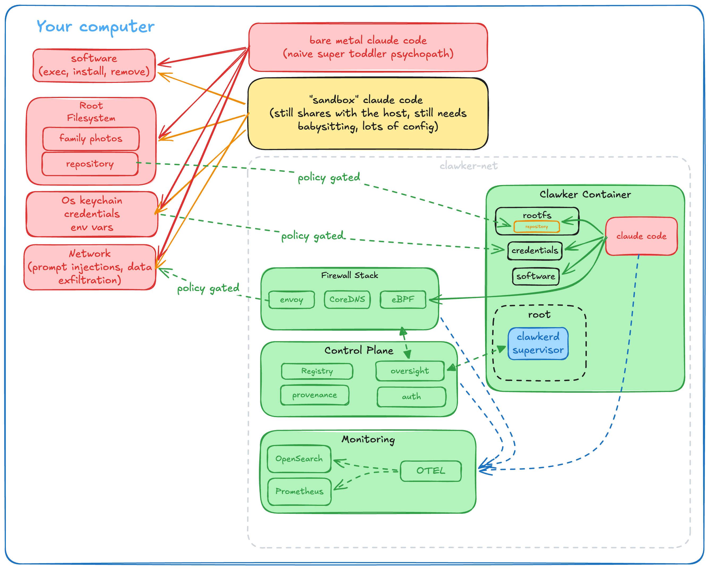

# Clawker — self-hosted AI coding agent sandbox (run Claude Code, Codex & more in Docker)

<p align="center">
  <a href="https://golang.org"></a>
  <a href="LICENSE"></a>
  <a href="https://deepwiki.com/schmitthub/clawker"></a>
  <a href="#"></a>
  <a href="#"></a>
  <a href="#"></a>
  <a href="#"></a>
  
</p>

<p align="center">
<code>clawker</code> is a free, open-source, self-hosted <strong>AI coding agent sandbox</strong> — a cli that runs coding-agent harnesses (<code>Claude Code</code> and <code>OpenAI Codex</code> ship built-in, more on the way, and you can bring your own via harness bundles) in isolated <code>Docker</code> containers on your own machine, no cloud and no subscription. It pairs a deny-by-default egress firewall (Envoy + custom CoreDNS + eBPF) for prompt-injection and data-exfiltration protection with the convenience features you actually want: image building, monitoring, parallel git-worktree agents, and credential forwarding — a devcontainer alternative that's local, free, <em>and</em> security-deep, whatever model your harness talks to (including Anthropic's latest mythos-class <code>Fable 5</code>). It works on any MacOS/Linux host with docker installed. I wrote this because I didn't want to have to pay someone to run coding agents with <code>--dangerously-skip-permissions</code> when containers have been around for a decade, and the sandbox modes these harnesses ship are the temu version of a container. <code>clawker</code> offers many convenience features beyond just building and running an agent in a container (you never even have to write a Dockerfile, it's got you covered).
</p>

<div align="center">
  
</div>

> Read more about clawker's threat model and security philosophy at [docs.clawker.dev/threat-model](https://docs.clawker.dev/threat-model)

> ! Clawker is in an early development stage, but it's usable and has a lot of features. Expect breaking changes and rough edges. I quickly patch regressions that were missed. If you want to contribute or have any feedback, please open an issue or a pull request! Give it a star if you find it useful so I can brag about them at parties

---

## Table of Contents

- [Clawker — self-hosted AI coding agent sandbox (run Claude Code, Codex \& more in Docker)](#clawker--self-hosted-ai-coding-agent-sandbox-run-claude-code-codex--more-in-docker)
  - [Table of Contents](#table-of-contents)
  - [High-Level Feature Overview](#high-level-feature-overview)
  - [Installation](#installation)
  - [Quick Start](#quick-start)
  - [Walkthrough](#walkthrough)
    - [Initialize a project](#initialize-a-project)
      - [Run a container](#run-a-container)
  - [Creating and Using Containers](#creating-and-using-containers)
  - [The `@` Image Shortcut](#the--image-shortcut)
  - [Command Aliases](#command-aliases)
  - [Working with Worktrees](#working-with-worktrees)
  - [Managing Resources](#managing-resources)
  - [Monitoring](#monitoring)
  - [Roadmap / Known Issues](#roadmap--known-issues)
  - [Contributing](#contributing)
  - [License](#license)

---

<details>
<summary>Boring TLDR manifesto</summary>
The rise of Agentic AI has been meteoric, but in the rush to ship model harnesses, the industry is skipping the risks and responsibilities that come with them. They’re avoiding dependency pain by shipping bare-metal software, when the harness itself needs a harness. LLMs are powerful, but they’re also unpredictable, naive, and easy to coerce—and handing one unrestricted code execution, network access, software install rights, internet reach, and full filesystem access to unsuspecting users is reckless. As a security engineer, I want my own machine protected, so clawker is the harness for the harness: an "agent-in-container" solution and a practical example of secure-by-default guardrails for agentic software. I hope this project inspires the industry to prioritize containerization natively in their agentic software offerings, and to build more tools that make it easy and seamless for users to run agents in containers with strong security defaults.
</details>

## High-Level Feature Overview

- **Multi-harness by design** — `Claude Code` and `OpenAI Codex` ship as embedded **harness bundles**, and any coding-agent CLI can be added by authoring a bundle (a manifest + Dockerfile fragment + optional assets) and declaring it in your project's `clawker.yaml`. Images are harness-keyed: `clawker build -t codex` builds a specific harness, `clawker run @:codex` runs it, and the default harness carries a `:default` alias so bare `@` just works
- **No Dockerfile to write** — images build on a pinned Debian substrate with common tools preinstalled (git, curl, vim, zsh, ripgrep, etc.): a shared per-project base image carries your `build.packages`, language **stacks** (go, node, python, rust), and custom instructions, with a thin per-harness image layered on top. The per-container `clawkerd` daemon runs as PID 1, handles signal forwarding, drops privilege to the unprivileged `claude` user kernel-side, and supervises the harness for the container's lifetime
- **Per-host clawker control plane** (`clawker-controlplane` container) runs as a long-lived supervisor — it owns the firewall lifecycle, eBPF program lifetime, agent identity registry (sqlite), mTLS auth, and the command channel to every agent's `clawkerd`. The CLI talks to it over mTLS gRPC + OAuth2; see `clawker controlplane status`, `clawker controlplane agents`
- **Injectable build-time instructions** to customize images per project: packages, environment variables, root run commands, user run commands, and more
- **Bind or snapshot workspace modes**: mount your repository to the container for live editing, or copy it at runtime for pure isolation
- **Fresh or copy agent mode**: start the harness with a clean slate, or stage your host settings, plugins, and skills into the container at create time for a seamless transition from doing work in a host instance to a container (the claude harness stages settings, CLAUDE.md, agents, skills, commands, and plugins). Credentials are never copied — you authenticate once inside the container (browser flows are proxied to your host) and the login persists in the harness's config volume across restarts and recreates
- **Seamless Git credential forwarding**: toggleable SSH agent, GPG agent forwarding from the host using muxrpc (just like devcontainers) for zero-config access to private repositories and commit signing
- **Host proxy service** sends events like "browser open" from the container to your host for browser authentication, then proxies the callback back to the container. Great for when you have to authenticate with your harness (`claude`, `codex`) or `gh`
- **Configurable environment variables**: set or copy environment variables and env files from the host into containers at runtime
- **Injectable post-initialization bash script** that runs after the container starts but before the harness launches, letting you set up MCPs, etc.
- **Envoy + custom CoreDNS + eBPF network firewall** enabled by default — Envoy and a custom CoreDNS build run as managed Docker containers on the shared `clawker-net` network, while eBPF cgroup programs (loaded and attached from outside agent containers by the control plane) redirect TCP to Envoy and DNS to CoreDNS. Provides DNS-level deny-by-default (unlisted domains return NXDOMAIN), per-domain TCP routing via a real-time BPF DNS cache, and TLS inspection with per-domain MITM certificates for path-level filtering. Agent containers themselves get **no Linux capabilities** — all enforcement happens kernel-side, outside the container's privilege scope. Each harness bundle ships its own egress floor (the claude harness allows the Anthropic API + OAuth domains, codex the OpenAI ones); project rules merge additively. Manage rules dynamically with `clawker firewall add/remove/list/status` (or `clawker firewall refresh` to live-apply project config egress edits), temporarily bypass with `clawker firewall bypass 5m --agent <agent_name>`, or disable entirely. A great security layer to mitigate runaway agents or prompt injections while giving them the network access they need.
- **Toggleable read-only global share**: volume mount from the host giving all containers real-time access to files you place in it
- **Project-based namespace isolation** of container resources. Clawker detects if it's in a project directory and automatically, via docker label prefixes, lets you filter for resources with re-usable names like "dev" or "main" that are scoped to the project. So you can have a "dev" container in multiple projects without conflict, and you can easily filter `clawker ps --filter agent=dev` to see all your dev containers across projects or `clawker ps --project myapp` to see all containers for a specific project.
- **Dedicated Docker network** that all containers run in
- **Jailed from host Docker resources** via `pkg/whail` (whale jail), a standalone package that decorates the moby SDK to prevent callers from seeing resources without the automatically applied management labels. I might use this package in other "agent in container" solutions. So I don't have to worry about accidentally deleting non-clawker managed containers/volumes/images, etc.
- **Command aliases** — one-word shortcuts expanded to full clawker invocations with `$1..$N` positional placeholders. Ships with `go` (disposable agent: `clawker go dev`) and `wt` (agent on a fresh worktree: `clawker wt auth feature/auth:main`) out of the box; define your own with `clawker alias set` and commit them to the project config with `clawker alias export` so the whole team gets them
- **Docker CLI-esque commands** for managing containers, Clawker isn't a passthrough to Docker CLI; it uses the moby SDK (via `pkg/whail`). This allowed me to add more flags, modify the behavior, etc over what docker cli offers
- **Git worktree management and commands**: pass a worktree flag to container run or create commands to automatically create a git worktree in the Clawker home project directory and bind mount it to the container workdir. Also has cli commands and flags to list and manage worktrees created by clawker, uses `go-git` under the hood to avoid relying on the host git binary. Worktree containers ship extra security lockdown for unattended sessions — see [worktree caveats](https://docs.clawker.dev/worktrees#worktree-caveats)
- **Optional monitoring stack** — OTel Collector + OpenSearch (logs) + OpenSearch Dashboards + Prometheus (metrics) on `clawker-net`. Every container has the environment variables baked in to push OTLP telemetry when the stack is running, and is silenced when it isn't
- **Interactive configuration editing**: TUI-based editors for project config (`clawker project edit`) and user settings (`clawker settings edit`) with tabbed field browsing, per-field type-appropriate editors (text, boolean, list, multiline), layer-aware provenance display showing which file each value comes from, and per-field save targeting to choose which config layer to write to

## Installation

**Prerequisites:** Docker must be installed and running on your machine. I've tested all features on macOS. I have confirmed it works on Linux just not extensively. Windows is not currently supported but I might in the future (yucky).

**Homebrew** (macOS):
```bash
brew install schmitthub/tap/clawker
```

**Install script** (macOS / Linux):
```bash
curl -fsSL https://raw.githubusercontent.com/schmitthub/clawker/main/scripts/install.sh | bash
```

<details>
<summary>More options</summary>

**Specific version:**
```bash
curl -fsSL https://raw.githubusercontent.com/schmitthub/clawker/main/scripts/install.sh | CLAWKER_VERSION=v0.1.3 bash
```

**Custom directory:**
```bash
curl -fsSL https://raw.githubusercontent.com/schmitthub/clawker/main/scripts/install.sh | CLAWKER_INSTALL_DIR=$HOME/.local/bin bash
```

**Build from source** (requires Go 1.25+):
```bash
git clone https://github.com/schmitthub/clawker.git
cd clawker && make clawker
export PATH="$PWD/bin:$PATH"
```
</details>

## Quick Start

The fastest path to a seamless containerized coding agent, with your host settings, plugins, and skills staged in so you can get to work right away. On first run you authenticate inside the container — the browser flow pops on your host automatically, and the login persists in the agent's config volume from then on.

```bash
cd your-project

# Optional but recommended: set up monitoring to get logs and metrics from your containers
clawker monitor init && clawker monitor up

clawker init 
clawker build
clawker go dev
```

> [!NOTE]
> The `go` command is a built-in alias for:  
>
> ```bash
> clawker run --rm -it --agent $1 @ --dangerously-skip-permissions
> ```
>
> So `clawker go dev` expands to the full command above with `$1=dev`. The flags mean:  
>
> - `-it` — interactive mode with a terminal attached
> - `--rm` — removes the container when it finishes (recommended, volumes are preserved)
> - `--agent dev` — names this container `clawker.<project>.dev`
> - `@` — shortcut that resolves to your built default-harness image (`clawker-<project>:default`; outside a project it resolves to the global image from a global `clawker build`). Use `@:codex` to pick a specific harness instead
> - `--dangerously-skip-permissions` — the infamous Claude Code yolo flag (the shipped aliases assume the claude harness). Anything after the `@` is passed straight to the harness CLI — treat it as a normal `claude` invocation, including `-c` to continue your previous session. You can also pass arguments after an alias, like `clawker go dev -c`.
>
> The other built-in alias `wt` spawns an agent container in a worktree automatically. For example: `clawker wt feat feat/feat` (worktree off currently checked out branch) or `clawker wt auth feature/auth:main` (to specify a base branch)
>
> Clawker ships [command aliases](/aliases) that expand to full invocations, and you can define your own with `clawker alias set`. See the [Command Aliases](/aliases) guide.

If you want to learn more about image customization, worktree support, monitoring, and other bells and whistles, keep reading for the walkthrough below.

You can ask claude code to assist you in writing a more appropriate config file for the project using the support skill `clawker skill install` (recommended) or this prompt:  

```bash
create a `./.clawker.yaml` file appropriate for this repos stack. Clawker configuration can be understood here: https://docs.clawker.dev/configuration.md
```

## Walkthrough

Here are ways I'm using `clawker` today and how I'm finding it useful. 

### Initialize a project

```bash
cd your-project
clawker init            # Guided setup: pick a language preset → creates .clawker.yaml, .clawkerignore, registers project
```

`clawker init` walks you through a guided setup with language-based presets (Python, Go, Rust, TypeScript, Java, Ruby, C/C++, C#/.NET, Bare). Choose a preset or "Build from scratch" to customize every field. User settings (`~/.config/clawker/settings.yaml`) and XDG directories are bootstrapped automatically on first run.

> **Tip:** Install the **clawker-support plugin** to get hands-on help from a clawker specialist agent. It can walk you through configuration, MCP wiring, firewall rules, troubleshooting, and more — it reads the real build templates and config schema and gives you the exact YAML you need.
> ```bash
> # Via clawker CLI (recommended)
> clawker skill install
>
> # Or manually
> claude plugin marketplace add schmitthub/claude-plugins
> claude plugin install clawker-support@schmitthub-plugins
> ```
> You can also customize your image using `clawker project edit` or point Claude Code at the LLM-friendly [docs site](https://docs.clawker.dev/configuration) for the full config reference. I dogfood clawker to build clawker, so also check out my `clawker.yaml` to see how I customized the build config for golang development.

> **Tip** You can alternatively use `.clawker/clawker.yaml` (which takes precedence). You can also split the configs up into multiple files through your repository for merging, good for monorepos. A global clawker.yaml can also be created in `$CLAWKER_CONFIG_DIR` for system wide defaults. You can also create an uncomitted `.clawker.local.yaml|.clawker/clawker.local.yaml` for local-only overrides.

```bash
clawker build           # Builds your project's default-harness image (referenced as "@" when within a project directory)
clawker build -t codex  # Builds a specific harness instead; run it with @:codex
```

Builds are two-stage: a shared `clawker-<project>:base` image holds your packages, stacks, and custom instructions, and each harness image (`clawker-<project>:claude`, `clawker-<project>:codex`, ...) layers on top of it. The default harness build also stamps the `:default` alias that bare `@` resolves.

#### Run a container 

My workflow is a hybrid approach. I like having a claude code instance running on the host for real intensive interactive work while at the same time launching a few clawker managed containers in separate tabs and worktrees using `--dangerously-skip-permissions`. 

So to do that let's say you're working on a feature branch with host claude code and inspiration strikes or you notice an issue / bug and say "shit i should address this". Or you've finished up a few PRDs and want to bang them out in parallel. I just quickly open a tab and have another claude agent via clawker get after it on the side without me having to approve anything over and over again so...

```bash
clawker run -it --rm --agent dev --worktree hotfix/example:main @ --dangerously-skip-permissions
# or the shipped alias for exactly that:
clawker wt dev hotfix/example:main
```

This creates and attaches my terminal to a new claude instance isolated in a container environment with a git worktree dir created under `~/.local/share/clawker/worktrees/` (or honors the override `$CLAWKER_DATA_DIR`) off of my main branch. Since it has all my plugins, skills, git creds, mcps, build deps instantly (and my in-container login persisted in its config volume), it's just a matter of telling the little rascal what to do and letting it go bananas and create a pr about it. I'll periodically check in on it to see how it's doing in another tab. Or you can detach `ctrl p+q` and return to your terminal; to reattach to the same session use `clawker attach --agent dev`. Ez pz no ssh/tmux bullshit, no vscode devcontainer window, no VPS with heavy IO latency, or setting up dedicated servers, or having to pay someone to do it for you.  

> Worktree containers mask `.git/hooks` and `.git/config` read-only — a security measure that keeps unattended agents from planting host-executable git hooks/config. It changes a few git behaviors inside the container (notably `git push -u` won't persist upstream tracking). Read the [worktree caveats](https://docs.clawker.dev/worktrees#worktree-caveats) before your first session.

I can see my worktree paths and open them in an IDE if I want to do some manual work or review the code... or never care about where they are, `clawker` remembers and auto mounts them using branches as an identifier. You can use `clawker worktree` commands to manage them, or `git worktree`. 

```bash
$ clawker worktree list
BRANCH     PATH                                                                      HEAD     MODIFIED     STATUS
a/example  /Users/schmitthub/.local/share/clawker/worktrees/repo-project-uuidsha256  f20aa37  1 hour ago   healthy
```

When I'm done I easily remove the worktree 

```bash
clawker worktree remove a/example --delete-branch  # this deletes the worktree and the branch since it was only for this worktree, if you want to keep the branch just omit the flag. Delete won't work if the branch isn't fully merged
```

If I plan on having long sessions with many agents ripping through features and fixes and want a high level overview of my coding armada I start the monitoring stack (need to do this before starting the containers — Claude Code, notably, doesn't retry if it can't establish a telemetry connection)

```bash
clawker monitor init
clawker monitor up
clawker monitor status 
# stop it later on 
clawker monitor down
```

Now I can go to OpenSearch Dashboards at http://localhost:5601 and inspect logs from every agent — costs, tokens, tool executions, decisions, prompts, api calls — and pull metrics from Prometheus at http://localhost:9090. (you can also set env vars in your host shell and it will report to this stack)

```bash
# Host ENV var example
# Add these to your shell profile / .env etc
OTEL_EXPORTER_OTLP_PROTOCOL=http/protobuf
OTEL_EXPORTER_OTLP_ENDPOINT=http://localhost:4318
OTEL_METRICS_EXPORTER=otlp
OTEL_LOGS_EXPORTER=otlp
OTEL_TRACES_EXPORTER=otlp
OTEL_LOGS_EXPORT_INTERVAL=5000
OTEL_METRIC_EXPORT_INTERVAL=10000
OTEL_METRICS_INCLUDE_ACCOUNT_UUID=true
OTEL_METRICS_INCLUDE_SESSION_ID=true
CLAUDE_CODE_ENABLE_TELEMETRY=1
CLAUDE_CODE_ENHANCED_TELEMETRY_BETA=1
OTEL_LOG_TOOL_DETAILS=1
OTEL_LOG_USER_PROMPTS=1

# Add this to a project level .env 
PROJECT_NAME=MyGroundbreakingTodoApp
OTEL_RESOURCE_ATTRIBUTES=service.name=claude-code,project=$PROJECT_NAME,agent=host
```

When I'm done I can commit / push / open a PR right in the container terminal with all my creds and git access set up, or I can open the worktree in my IDE and do it from there. I can `/exit` out and the container will stop (or `ctrl c` in the terminal). I can use `--rm` flags just like docker cli to automatically remove containers when they stop, or I can start the same one back up again with `clawker start -a -i --agent example` to pick up right where I left off.

All containers get named volume mounts for the harness's config directories (declared by its bundle — `~/.claude` for claude, `~/.codex` for codex) and command history for persistence.

```bash
$ clawker volume ls
VOLUME NAME                                  DRIVER  MOUNTPOINT
clawker.clawker.example-claude.config        local   ...volumes/clawker.clawker.example-claude.config/_data
clawker.clawker.example-history              local   ...r/volumes/clawker.clawker.example-history/_data
# You can see the resources naming conventions here (clawker.{project}.{agent}). Labeling works
# similarly. Volumes a harness owns carry its name too, so each harness keeps its own config.
```

You can also see how clawker is jailed from other docker resource access...

```bash
$ docker create alpine:latest
6c6896073eb1a2baa91450d0b5b795808f0ea4a052f729383a2d166d87fa0c17
$ clawker ps -a
NAME                     STATUS                  PROJECT                AGENT                  IMAGE                    CREATED
clawker.clawker.example  exited                  clawker                example                clawker-clawker:default  9 hours ago
$ docker ps -a 
CONTAINER ID   IMAGE                     COMMAND                  CREATED         STATUS                    PORTS     NAMES
6c6896073eb1   alpine:latest             "/bin/sh"                7 seconds ago   Created                             great_dubinsky
73b4ac14c2b3   clawker-clawker:default   "/usr/local/bin/clawk…"   10 hours ago    Exited (0) 10 hours ago             clawker.clawker.example
```

## Creating and Using Containers

```bash
# Create a fresh container and connect interactively
# The @ symbol auto-resolves your project's default-harness image (clawker-<project>:default)
clawker run -it --agent main @

# Detach without stopping: Ctrl+P, Ctrl+Q

# Re-attach to the agent
clawker attach --agent main

# Stop the agent (Ctrl+C exits the agent and stops the container)
# Or from another terminal:
clawker stop --agent main

# Start a stopped agent and attach
clawker start -a -i --agent main
```

## The `@` Image Shortcut

Use `@` anywhere an image argument is expected to auto-resolve your project's image:

```bash
clawker run -it @                     # Uses clawker-<project>:default (the default harness)
clawker run -it --agent dev @         # Same, with agent name
clawker run -it --agent dev @:codex   # Pick a specific harness
clawker container create --agent test @
```

## Command Aliases

Aliases are shortcuts expanded before execution — the alias value is appended to `clawker` in place of the alias name, with `$1`..`$N` positional placeholders and extra arguments appended. Two ship as defaults:

```bash
clawker go dev                       # → clawker run --rm -it --agent dev @ --dangerously-skip-permissions
clawker wt auth feature/auth:main    # → clawker run --rm -it --agent auth --worktree feature/auth:main @ --dangerously-skip-permissions
```

Define your own and share them with your team via the project config:

```bash
clawker alias set lg "logs \$1 --tail \$2"   # personal alias (user-level clawker.yaml)
clawker lg web 50                            # → clawker logs web --tail 50

clawker alias list                           # NAME / EXPANSION / SOURCE
clawker alias export                         # publish active aliases into the project's .clawker.yaml
clawker alias delete lg                      # remove from every config file that defines it
```

Aliases defined in a repository's project config apply automatically to everyone working in that project. Full guide: [docs.clawker.dev/aliases](https://docs.clawker.dev/aliases)

## Working with Worktrees

Run separate agents per git worktree for parallel development. Worktree containers apply extra security lockdown (read-only `.git/hooks` + `.git/config` masks) to make unattended sessions safer — see [worktree caveats](https://docs.clawker.dev/worktrees#worktree-caveats) for the behavioral differences:

```bash
# Use the --worktree flag for automatic worktree creation and mounting in containers
clawker run --worktree feature/todo-apps-are-dope:main -it --agent todo-apps @ --dangerously-skip-permissions

# Create worktrees manually
clawker worktree add feature/todo-apps-are-dope
clawker worktree add feat-feet --base main

# list your worktrees
clawker worktree list
```

## Managing Resources

As close to docker CLI and its flags as I could make it, but remember they do different things under the hood. Adding all features is also still a WIP

```bash
clawker ps                          # List all clawker containers
clawker container ls                # Same thing
clawker container stop --agent NAME
clawker image ls                    # List clawker images
clawker volume ls                   # List clawker volumes

# Firewall management
clawker firewall status             # Health, rule count, running containers
clawker firewall list               # List active egress rules
clawker firewall add docs.clawker.dev # Allow a domain
clawker firewall remove docs.clawker.dev
clawker firewall refresh            # Live-apply project config egress edits (no restart)
clawker firewall disable --agent dev   # Unrestricted egress for one agent
clawker firewall enable --agent dev    # Re-apply firewall rules
clawker firewall bypass 5m --agent dev      # Temporary unrestricted egress with auto-re-enable
clawker firewall bypass --stop --agent dev  # End bypass early, re-enable firewall

# Control plane (break-glass — normally bootstrapped automatically)
clawker controlplane status             # Show CP health + firewall subsystem state
clawker controlplane up                 # Bring CP up (idempotent)
clawker controlplane down               # Stop CP cleanly (drains eBPF + Envoy/CoreDNS)
clawker controlplane agents             # List agents registered with the CP

# Auth material
clawker auth rotate                     # Rotate CA, server certs, and OAuth2 signing key

# Configuration editing
clawker project edit                    # Interactive TUI editor for .clawker.yaml
clawker settings edit                   # Interactive TUI editor for settings.yaml

# Skill plugin management
clawker skill install                   # Install the clawker-support agent skills plugin
clawker skill install --scope project   # Install with project scope
clawker skill show                      # Show manual install commands
clawker skill remove                    # Remove the clawker-support plugin
```

## Monitoring 

All containers have the environment variables to push logs and metrics to an OpenTelemetry collector by default. The optional monitoring stack runs four Docker Compose services on `clawker-net`: the **OTEL Collector** (receivers + routing), **OpenSearch** (logs), **OpenSearch Dashboards** (UI over OpenSearch), and **Prometheus** (metrics + UI). Agent containers push OTLP/HTTP to the collector (Claude Code ships first-class OTel telemetry), which writes logs to OpenSearch and exposes a Prometheus scrape endpoint. See [`docs/monitoring.mdx`](docs/monitoring.mdx) for the full pipeline reference.

```bash
clawker monitor init
clawker monitor up
clawker monitor status 
# stop it later on 
clawker monitor down
```

Once the stack is up:

- **OpenSearch Dashboards** — http://localhost:5601 — Discover view for log exploration
- **Prometheus UI** — http://localhost:9090 — metrics + ad-hoc PromQL
- **OpenSearch API** — http://localhost:9200 — REST access to the `claude-code` (Claude Code logs), `clawker-cli` (host CLI logs), `clawkercp` (control-plane logs), `clawker-envoy` (firewall egress access logs), `clawker-coredns` (firewall DNS query logs), and `clawker-ebpf-egress` (eBPF egress decisions) indices

> **Preconfigured out-of-box.** Every `monitor up` runs a one-shot `clawker-opensearch-bootstrap` container that applies index templates (with explicit field mappings per source), ingest pipelines, a default 7-day ISM retention policy, a `clawker_prometheus` direct-query datasource, and a **`Clawker` analytics workspace** with index patterns + example visualizations imported. `otel-collector` and `prometheus` don't start until bootstrap exits cleanly.
>
> **Get into the workspace:** from the OSD splash / welcome screen click **Clawker** under the **Analytics** panel on the far right. **See logs or metrics:** in the workspace UI's left navbar, under **Explore**, click **Logs** or **Metrics**.
>
> Three dashboards ship preinstalled under the workspace's **Dashboards** view: **Claude Code Cost & Usage** (sessions, cost, token counters), **Claude Code Activity** (tool usage, code edits, hooks, MCP, plugins), and **Clawker Networking** (Envoy access logs, CoreDNS query log, eBPF egress decisions). Build additional dashboards off the index patterns and Prometheus datasource as needed.

## Roadmap / Known Issues

- More shipped harness bundles are on the way (opencode, pi) — and you can author your own bundle today
- Linux works but hasn't been exercised as extensively as macOS

See [GitHub Issues](https://github.com/schmitthub/clawker/issues?q=is%3Aissue+is%3Aopen) for current known issues and limitations.

## Contributing

Contributions welcome! See [CONTRIBUTING.md](CONTRIBUTING.md) for development setup, testing, and PR process.

Please read our [Code of Conduct](CODE_OF_CONDUCT.md) before participating.

## License

Clawker is free software: GNU Affero General Public License v3.0 or later (AGPL-3.0-or-later) — see [LICENSE](LICENSE).

One subproject is the exception: the `claude-plugin/clawker-support/` plugin is licensed separately under the MIT License — see [its LICENSE](claude-plugin/clawker-support/LICENSE). Everything else in this repository is AGPL-3.0-or-later as described below.

The AGPL's network-use clause (section 13) is deliberate: if you run a modified Clawker as a network service, you must offer its source to users of that service. This keeps Clawker free and open — for learning from and building on, not for closed SaaS wrappers.

**Commercial licensing.** Don't want the AGPL's copyleft and network-use obligations — for example, to embed Clawker in a closed-source product or service? A commercial license is available. Contact andrew@ajschmitt.io.

**Contributing.** Contributions are accepted under a Contributor License Agreement ([CLA.md](CLA.md)): you keep your copyright, your work is published under the AGPL, and you grant the maintainer the right to also offer it under a commercial license. This is what keeps dual-licensing possible.

> I feel obligated to state this... **Clawker** is a portmanteau of Claude + Docker, spelled phonetically because `claucker` violates the phonetic rules of English and just doesn't roll off the fingers. The name predates the `clawdbot` `openclaw` `clawthis` `clawthat` naming craze and has no relation to openclaw.  
