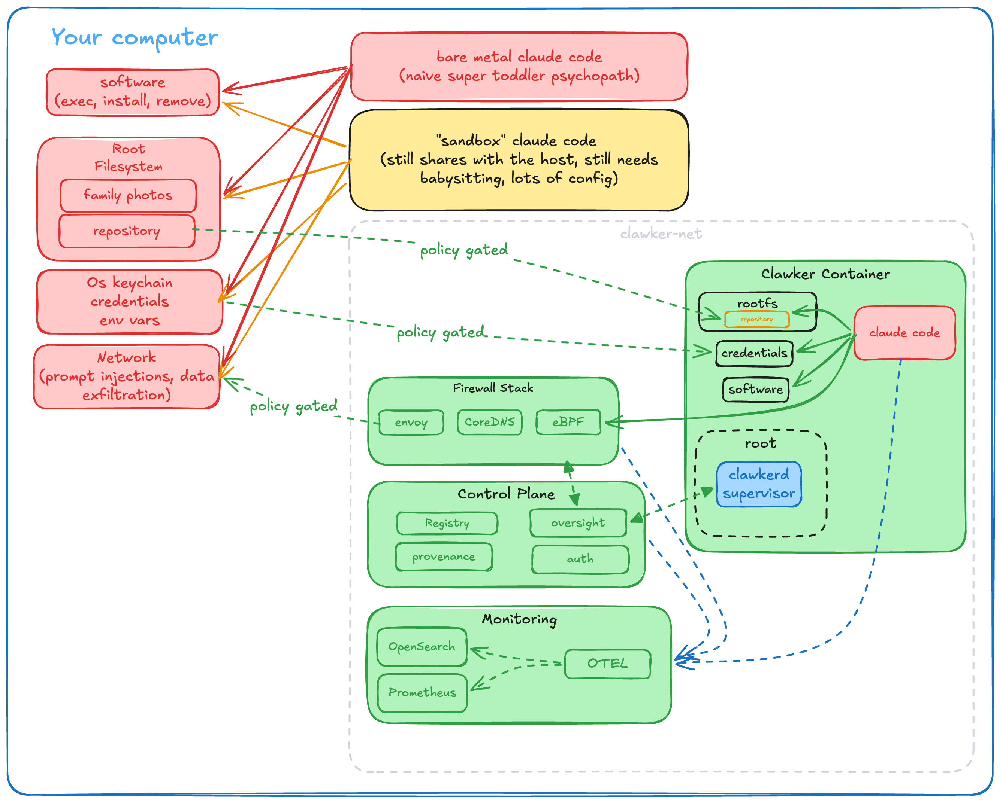

# clawker 

<p align="center">
<code>clawker</code> is a free, open-source, self-hosted <strong>AI coding agent sandbox</strong> — a cli that runs agent harnesses like <code>Claude Code</code> or <code>Codex</code> in isolated <code>Docker</code> containers on any MacOS/Linux host with docker installed.
</p>

<div align="center">
  
</div>

---

## Table of Contents

- [clawker](#clawker)
  - [Table of Contents](#table-of-contents)
  - [High-Level Feature Overview](#high-level-feature-overview)
  - [Installation](#installation)
  - [Quick Start](#quick-start)
  - [Walkthrough](#walkthrough)
    - [Initialize a project](#initialize-a-project)
      - [Run a container](#run-a-container)
  - [Creating and Using Containers](#creating-and-using-containers)
  - [The `@` Image Shortcut](#the--image-shortcut)
  - [Command Aliases](#command-aliases)
  - [Working with Worktrees](#working-with-worktrees)
  - [Managing Resources](#managing-resources)
  - [Monitoring](#monitoring)

---

## High-Level Feature Overview

- **Multi-harness by design** — `Claude Code` and `OpenAI Codex` ship as embedded **harness bundles**, and any coding-agent CLI can be added by authoring a bundle
- **No Dockerfile to write** — images build on a pinned Debian substrate with common tools preinstalled (git, curl, vim, zsh, ripgrep, etc.): a shared per-project base image carries your `build.packages`, authorable language **stacks** (go, node, python, rust, java, ruby, cpp, dotnet), and custom instructions, with a thin per-harness image layered on top.
- **Per-host clawker control plane** (`clawker-controlplane` container) runs as a long-lived supervisor — it owns the firewall lifecycle, eBPF program lifetime, agent identity registry, and the command channel to every agent's `clawkerd`.
- **Per-container supervision** — each container runs a `clawkerd` daemon as PID 1, which handles signal forwarding, drops privileges to the unprivileged `clawker` user kernel-side, and supervises the harness for the container's lifetime
- **Injectable build-time instructions** to customize images per project: packages, environment variables, root run commands, user run commands, and more
- **Bind or snapshot workspace modes**: mount your repository to the container for live editing, or copy it at runtime for pure isolation
- **Fresh or copy agent mode**: start the harness with a clean slate, or stage your host settings, plugins, and skills into the container at create time for a seamless transition from doing work in a host instance to a container (the claude harness stages settings, CLAUDE.md, agents, skills, commands, and plugins). Credentials are never copied — you authenticate once inside the container (browser flows are proxied to your host) and the login persists in the harness's config volume across restarts and recreates
- **Seamless Git credential forwarding**: toggleable SSH agent, GPG agent forwarding from the host using muxrpc (just like devcontainers) for zero-config access to private repositories and commit signing
- **Host proxy service** sends events like "browser open" from the container to your host for browser authentication, then proxies the callback back to the container. Great for when you have to authenticate with your harness (`claude`, `codex`) or `gh`
- **Configurable environment variables**: set or copy environment variables and env files from the host into containers at runtime
- **Injectable post-initialization bash script** that runs after the container starts but before the harness launches, letting you set up MCPs, etc.
- **Dedicated Docker network** `clawker-net` that all containers run in
- **L4-L7 firewall stack** enabled by default — eBPF cgroup programs attached from outside the container get a verdict on every outbound TCP, UDP, and raw socket. Unlisted domains never resolve (custom CoreDNS, NXDOMAIN). Allowed traffic goes through Envoy: TLS terminated with per-domain MITM certificates for path-and method-level rules on HTTPS, WebSocket, and HTTP/3; raw TCP, SSH, and UDP pinned to the host each rule names. Deny by default at every layer, IPv4 and dual-stack IPv6.
- **Toggleable read-only global share**: volume mount from the host giving all containers real-time access to files you place in it
- **Project-based namespace isolation** of container resources. Clawker detects if it's in a project directory and automatically, via docker label prefixes, lets you filter for resources with re-usable names.
- **Jailed from host Docker resources** Prevents the CLI from operating on resources without the automatically applied management labels.
- **Command aliases** — one-word shortcuts expanded to full clawker invocations with `$1..$N` positional placeholders.
- **Docker CLI-esque commands** for managing containers, Clawker isn't a passthrough to Docker CLI; it uses the moby SDK (via `pkg/whail`).
- **Git worktree management and commands**: pass a worktree flag to container run or create commands to automatically create a git worktree in the Clawker home project directory and bind mount it to the container workdir. Also has cli commands and flags to list and manage worktrees created by clawker, uses `go-git` under the hood to avoid relying on the host git binary.
- **Optional monitoring stack** — OTel Collector + OpenSearch (logs) + OpenSearch Dashboards + Prometheus (metrics)
- **Interactive configuration editing**: TUI-based editors for project config and user settings with tabbed field browsing, layer-aware provenance display showing which file each value comes from, and per-field save targeting to choose which config layer to write to
- **Rootless Docker Support** — Clawker can operate with rootless Docker, allowing you to run containers without requiring root privileges on the host system.

## Installation

**Prerequisites:** Docker must be installed and running on your machine. I've tested all features on macOS. I have confirmed it works on Linux just not extensively. Windows is not currently supported but I might in the future (yucky).

**Homebrew** (macOS):
```bash
brew install schmitthub/tap/clawker
```

**Install script** (macOS / Linux):
```bash
curl -fsSL https://raw.githubusercontent.com/schmitthub/clawker/main/scripts/install.sh | bash
```

<details>
<summary>More options</summary>

**Specific version:**
```bash
curl -fsSL https://raw.githubusercontent.com/schmitthub/clawker/main/scripts/install.sh | CLAWKER_VERSION=v0.1.3 bash
```

**Custom directory:**
```bash
curl -fsSL https://raw.githubusercontent.com/schmitthub/clawker/main/scripts/install.sh | CLAWKER_INSTALL_DIR=$HOME/.local/bin bash
```

**Build from source** (requires Go 1.27.1+):
```bash
git clone https://github.com/schmitthub/clawker.git
cd clawker && make clawker
export PATH="$PWD/bin:$PATH"
```
</details>

## Quick Start

The fastest path to a seamless containerized coding agent, with your host settings, plugins, and skills staged in so you can get to work right away. On first run you authenticate inside the container — the browser flow pops on your host automatically, and the login persists in the agent's config volume from then on.

```bash
cd your-project

# Optional but recommended: set up monitoring to get logs and metrics from your containers
clawker monitor init && clawker monitor up

clawker init 
clawker build
clawker go dev
```

> [!NOTE]
> The `go` command is a built-in alias for:  
>
> ```bash
> clawker run --rm -it --agent $1 @
> ```
>
> So `clawker go dev` expands to the full command above with `$1=dev`. The flags mean:  
>
> - `-it` — interactive mode with a terminal attached
> - `--rm` — removes the container when it finishes (recommended, volumes are preserved)
> - `--agent dev` — names this container `clawker.<project>.dev`
> - `@` — shortcut that resolves to your built default-harness image (`clawker-<project>:default`; outside a project it resolves to the global image from a global `clawker build`). Use `@:codex` to pick a specific harness instead
>
> Anything after the `@` is passed straight to the harness CLI, and arguments after an alias are appended — with the out-of-box claude default, `clawker go dev -c` continues your previous Claude Code session and `clawker go dev --dangerously-skip-permissions` hands it the infamous yolo flag, safe inside the container's isolation.
>
> The per-harness aliases `claude` and `codex` pick their harness and skip its permission prompts in one word: `clawker claude dev`, `clawker codex dev`. The other built-in alias `wt` spawns an agent container in a worktree automatically. For example: `clawker wt feat feat/feat` (use or create branch `feat/feat`, tracking a matching remote branch when one exists) or `clawker wt auth feature/auth:main` (to create it off a base branch)
>
> Clawker ships [command aliases](/aliases) that expand to full invocations, and you can define your own with `clawker alias set`. See the [Command Aliases](/aliases) guide.

If you want to learn more about image customization, worktree support, monitoring, and other bells and whistles, keep reading for the walkthrough below.

You can ask your coding agent to assist you in writing a more appropriate config file for the project using the support skill `clawker plugin install` (recommended) or this prompt:  

```text
create a `./.clawker.yaml` file appropriate for this repos stack. Clawker configuration can be understood here: https://docs.clawker.dev/configuration.md
```

## Walkthrough

Here are ways I'm using `clawker` today and how I'm finding it useful. 

### Initialize a project

```bash
cd your-project
clawker init            # Guided setup: pick a language preset → creates .clawker.yaml, .clawkerignore, registers project
```

`clawker init` walks you through a guided setup with language-based presets (Python, Go, Rust, TypeScript, Java, Ruby, C/C++, C#/.NET, Bare). Choose a preset or "Build from scratch" to customize every field. User settings (`~/.config/clawker/settings.yaml`) and XDG directories are bootstrapped automatically on first run.

> **Tip:** Install the **clawker-support plugin** to get hands-on help from a clawker specialist agent. It can walk you through configuration, MCP wiring, firewall rules, troubleshooting, and more — it reads the real build templates and config schema and gives you the exact YAML you need.
> ```bash
> # Via clawker CLI (recommended)
> clawker plugin install
>
> # Or manually
> claude plugin marketplace add schmitthub/clawker-plugin
> claude plugin install clawker-support@schmitthub-plugins
> ```
> You can also customize your image using `clawker project edit` or point your agent at the LLM-friendly [docs site](https://docs.clawker.dev/configuration) for the full config reference. I dogfood clawker to build clawker, so also check out my `clawker.yaml` to see how I customized the build config for golang development.

> **Tip** You can alternatively use `.clawker/clawker.yaml` (which takes precedence). You can also split the configs up into multiple files through your repository for merging, good for monorepos. A global clawker.yaml can also be created in `$CLAWKER_CONFIG_DIR` for system wide defaults. You can also create an uncomitted `.clawker.local.yaml|.clawker/clawker.local.yaml` for local-only overrides.

```bash
clawker build           # Builds your project's default-harness image (referenced as "@" when within a project directory)
clawker build -t codex  # Builds a specific harness instead; run it with @:codex
```

Builds are two-stage: a shared `clawker-<project>:base` image holds your packages, stacks, and custom instructions, and each harness image (`clawker-<project>:claude`, `clawker-<project>:codex`, ...) layers on top of it. The default harness build also stamps the `:default` alias that bare `@` resolves.

#### Run a container 

My workflow is a hybrid approach. I like having a claude code instance running on the host for real intensive interactive work while at the same time launching a few clawker managed containers in separate tabs and worktrees using `--dangerously-skip-permissions`. (Claude Code is my daily driver, so the walkthrough is narrated in claude terms — swap in `@:codex` / `clawker codex` and everything below works the same.)

So to do that let's say you're working on a feature branch with host claude code and inspiration strikes or you notice an issue / bug and say "shit i should address this". Or you've finished up a few PRDs and want to bang them out in parallel. I just quickly open a tab and have another claude agent via clawker get after it on the side without me having to approve anything over and over again so...

```bash
clawker run -it --rm --agent dev --worktree hotfix/example:main @ --dangerously-skip-permissions
# or with the shipped alias — arguments after it pass straight through to the harness:
clawker wt dev hotfix/example:main --dangerously-skip-permissions
```

This creates and attaches my terminal to a new claude instance isolated in a container environment with a git worktree dir created under `~/.local/share/clawker/worktrees/` (or honors the override `$CLAWKER_DATA_DIR`) off of my main branch. Since it has all my plugins, skills, git creds, mcps, build deps instantly (and my in-container login persisted in its config volume), it's just a matter of telling the little rascal what to do and letting it go bananas and create a pr about it. I'll periodically check in on it to see how it's doing in another tab. Or you can detach `ctrl p+q` and return to your terminal; to reattach to the same session use `clawker attach --agent dev`. Ez pz no ssh/tmux bullshit, no vscode devcontainer window, no VPS with heavy IO latency, or setting up dedicated servers, or having to pay someone to do it for you.  

I can see my worktree paths and open them in an IDE if I want to do some manual work or review the code... or never care about where they are, `clawker` remembers and auto mounts them using branches as an identifier. You can use `clawker worktree` commands to manage them, or `git worktree`. 

```bash
$ clawker worktree list
BRANCH     PATH                                                                      HEAD     MODIFIED     STATUS
a/example  /Users/schmitthub/.local/share/clawker/worktrees/repo-project-uuidsha256  f20aa37  1 hour ago   healthy
```

When I'm done I easily remove the worktree 

```bash
clawker worktree remove a/example --delete-branch  # this deletes the worktree and the branch since it was only for this worktree, if you want to keep the branch just omit the flag. Delete won't work if the branch isn't fully merged
```

If I plan on having long sessions with many agents ripping through features and fixes and want a high level overview of my coding armada I start the monitoring stack (need to do this before starting the containers — Claude Code, notably, doesn't retry if it can't establish a telemetry connection)

```bash
clawker monitor init
clawker monitor up
clawker monitor status 
# stop it later on 
clawker monitor down
```

Now I can go to OpenSearch Dashboards at http://localhost:5601 and inspect logs from every agent — costs, tokens, tool executions, decisions, prompts, api calls — and pull metrics from Prometheus at http://localhost:9090. (you can also set env vars in your host shell and it will report to this stack)

```bash
# Host ENV var example
# Add these to your shell profile / .env etc
OTEL_EXPORTER_OTLP_PROTOCOL=http/protobuf
OTEL_EXPORTER_OTLP_ENDPOINT=http://localhost:4318
OTEL_METRICS_EXPORTER=otlp
OTEL_LOGS_EXPORTER=otlp
OTEL_TRACES_EXPORTER=otlp
OTEL_LOGS_EXPORT_INTERVAL=5000
OTEL_METRIC_EXPORT_INTERVAL=10000
OTEL_METRICS_INCLUDE_ACCOUNT_UUID=true
OTEL_METRICS_INCLUDE_SESSION_ID=true
CLAUDE_CODE_ENABLE_TELEMETRY=1
CLAUDE_CODE_ENHANCED_TELEMETRY_BETA=1
OTEL_LOG_TOOL_DETAILS=1
OTEL_LOG_USER_PROMPTS=1

# Add this to a project level .env 
PROJECT_NAME=MyGroundbreakingTodoApp
OTEL_RESOURCE_ATTRIBUTES=service.name=claude-code,project=$PROJECT_NAME,agent=host
```

When I'm done I can commit / push / open a PR right in the container terminal with all my creds and git access set up, or I can open the worktree in my IDE and do it from there. I can `/exit` out and the container will stop (or `ctrl c` in the terminal). I can use `--rm` flags just like docker cli to automatically remove containers when they stop, or I can start the same one back up again with `clawker start -a -i --agent example` to pick up right where I left off.

All containers get named volume mounts for the harness's config directories (declared by its bundle — `~/.claude` for claude, `~/.codex` for codex) and command history for persistence.

```bash
$ clawker volume ls
VOLUME NAME                                  DRIVER  MOUNTPOINT
clawker.clawker.example-claude.config        local   ...volumes/clawker.clawker.example-claude.config/_data
clawker.clawker.example-history              local   ...r/volumes/clawker.clawker.example-history/_data
# You can see the resources naming conventions here (clawker.{project}.{agent}). Labeling works
# similarly. Volumes a harness owns carry its name too, so each harness keeps its own config.
```

You can also see how clawker is jailed from other docker resource access...

```bash
$ docker create alpine:latest
6c6896073eb1a2baa91450d0b5b795808f0ea4a052f729383a2d166d87fa0c17
$ clawker ps -a
NAME                     STATUS                  PROJECT                AGENT                  IMAGE                    CREATED
clawker.clawker.example  exited                  clawker                example                clawker-clawker:default  9 hours ago
$ docker ps -a 
CONTAINER ID   IMAGE                     COMMAND                  CREATED         STATUS                    PORTS     NAMES
6c6896073eb1   alpine:latest             "/bin/sh"                7 seconds ago   Created                             great_dubinsky
73b4ac14c2b3   clawker-clawker:default   "/usr/local/bin/clawk…"   10 hours ago    Exited (0) 10 hours ago             clawker.clawker.example
```

## Creating and Using Containers

```bash
# Create a fresh container and connect interactively
# The @ symbol auto-resolves your project's default-harness image (clawker-<project>:default)
clawker run -it --agent main @

# Detach without stopping: Ctrl+P, Ctrl+Q

# Re-attach to the agent
clawker attach --agent main

# Stop the agent (Ctrl+C exits the agent and stops the container)
# Or from another terminal:
clawker stop --agent main

# Start a stopped agent and attach
clawker start -a -i --agent main
```

## The `@` Image Shortcut

Use `@` anywhere an image argument is expected to auto-resolve your project's image:

```bash
clawker run -it @                     # Uses clawker-<project>:default (the default harness)
clawker run -it --agent dev @         # Same, with agent name
clawker run -it --agent dev @:codex   # Pick a specific harness
clawker container create --agent test @
```

## Command Aliases

Aliases are shortcuts expanded before execution — the alias value is appended to `clawker` in place of the alias name, with `$1`..`$N` positional placeholders and extra arguments appended. Four ship as defaults:

```bash
clawker go dev                       # → clawker run --rm -it --agent dev @
clawker wt auth feature/auth:main    # → clawker run --rm -it --agent auth --worktree feature/auth:main @
clawker claude dev                   # → clawker run --rm -it --agent dev @:claude --dangerously-skip-permissions
clawker codex dev                    # → clawker run --rm -it --agent dev @:codex --yolo
```

Define your own and share them with your team via the project config:

```bash
clawker alias set lg "logs \$1 --tail \$2"   # personal alias (user-level clawker.yaml)
clawker lg web 50                            # → clawker logs web --tail 50

clawker alias list                           # NAME / EXPANSION / SOURCE
clawker alias export                         # publish active aliases into the project's .clawker.yaml
clawker alias delete lg                      # remove from every config file that defines it
```

Aliases defined in a repository's project config apply automatically to everyone working in that project. Full guide: [docs.clawker.dev/aliases](https://docs.clawker.dev/aliases)

## Working with Worktrees

Run separate agents per git worktree for parallel development:

```bash
# Use the --worktree flag for automatic worktree creation and mounting in containers
clawker run --worktree feature/todo-apps-are-dope:main -it --agent todo-apps @ --dangerously-skip-permissions

# Create worktrees manually
clawker worktree add feature/todo-apps-are-dope
clawker worktree add feat-feet --base main

# list your worktrees
clawker worktree list
```

## Managing Resources

As close to docker CLI and its flags as I could make it, but remember they do different things under the hood. Adding all features is also still a WIP

```bash
clawker ps                          # List all clawker containers
clawker container ls                # Same thing
clawker container stop --agent NAME
clawker image ls                    # List clawker images
clawker volume ls                   # List clawker volumes

# Firewall management
clawker firewall status             # Health, rule count, running containers
clawker firewall list               # List active egress rules
clawker firewall add docs.clawker.dev # Allow a domain
clawker firewall remove docs.clawker.dev
clawker firewall refresh            # Live-apply project config egress edits (no restart)
clawker firewall disable --agent dev   # Unrestricted egress for one agent
clawker firewall enable --agent dev    # Re-apply firewall rules
clawker firewall bypass 5m --agent dev      # Temporary unrestricted egress with auto-re-enable
clawker firewall bypass --stop --agent dev  # End bypass early, re-enable firewall

# Control plane (break-glass — normally bootstrapped automatically)
clawker controlplane status             # Show CP health + firewall subsystem state
clawker controlplane up                 # Bring CP up (idempotent)
clawker controlplane down               # Stop CP cleanly (drains eBPF + Envoy/CoreDNS)
clawker controlplane agents             # List agents registered with the CP

# Auth material
clawker auth rotate                     # Rotate CA, server certs, and OAuth2 signing key

# Configuration editing
clawker project edit                    # Interactive TUI editor for .clawker.yaml
clawker settings edit                   # Interactive TUI editor for settings.yaml

# Plugin management (alias: clawker skill)
clawker plugin install                  # Install the clawker-support agent skills plugin
clawker plugin install --scope project  # Install with project scope
clawker plugin show                     # Show manual install commands
clawker plugin remove                   # Remove the clawker-support plugin
```

## Monitoring 

All containers have the environment variables to push logs and metrics to an OpenTelemetry collector by default. The optional monitoring stack runs four Docker Compose services on `clawker-net`: the **OTEL Collector** (receivers + routing), **OpenSearch** (logs), **OpenSearch Dashboards** (UI over OpenSearch), and **Prometheus** (metrics + UI). Agent containers push OTLP/HTTP to the collector (Claude Code ships first-class OTel telemetry), which writes logs to OpenSearch and exposes a Prometheus scrape endpoint. See [`docs/monitoring.mdx`](docs/monitoring.mdx) for the full pipeline reference.

```bash
clawker monitor init
clawker monitor up
clawker monitor status 
# stop it later on 
clawker monitor down
```

Once the stack is up:

- **OpenSearch Dashboards** — http://localhost:5601 — Discover view for log exploration
- **Prometheus UI** — http://localhost:9090 — metrics + ad-hoc PromQL
- **OpenSearch API** — http://localhost:9200 — REST access to the `claude-code` (Claude Code logs), `clawker-cli` (host CLI logs), `clawkercp` (control-plane logs), `clawker-envoy` (firewall egress access logs), `clawker-coredns` (firewall DNS query logs), and `clawker-ebpf-egress` (eBPF egress decisions) indices
