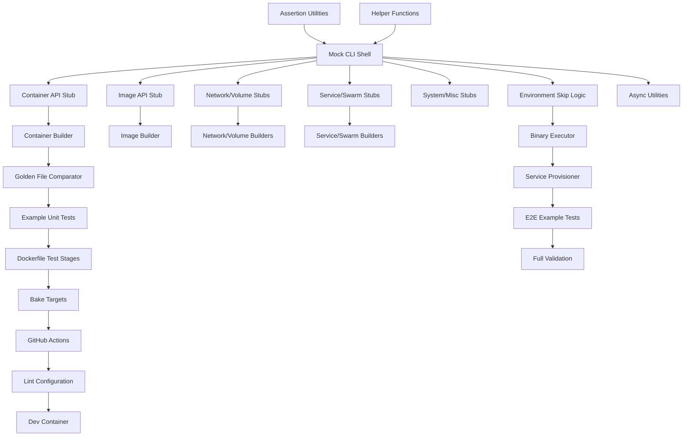

# CLI Testing Adaptation PRD

> **Source**: docker/cli (https://github.com/docker/cli)
> **Generated**: 2026-01-30
> **Scope**: Testing implementation — all tiers of testing for a resource-management CLI
> **Command**: `/feature-extractor testing implementation`

---

## How to Use This Guide

This document is designed to be consumed by Claude Code (or similar AI coding assistants)
to implement a comprehensive testing system for a CLI application that manages remote resources.

1. Copy this entire directory to your target project
2. Provide this PRD file as context to Claude Code
3. Claude Code will use the requirements, design, and supplemental documents to guide implementation

**Note:** All supplemental documents are linked with relative paths and will work when
this directory is copied to any location.

---

## Supplemental Documents

> **Two-layer model:** Source Reference documents (Phase 1-2) are intentionally concrete and source-specific.
> Adaptation Guidance documents (Phase 3) are abstract and portable — they describe capabilities to build,
> not source artifacts to copy.

### Source Reference (Phase 1-2)

Concrete analysis of the source codebase — file paths, class names, code patterns, and structure:

| Document | Description |
|----------|-------------|
| [Codebase Structure](./codebase-structure.md) | Repository structure, languages, organization |
| [Dependency Catalog](./dependency-catalog.md) | External dependencies with purposes and alternatives |
| [Entry Points](./entry-points.md) | Execution entry points and test invocation flows |
| [Architecture](./architecture.md) | Test architecture layers and component relationships |
| [Patterns](./patterns.md) | Testing patterns, conventions, and coding approaches |
| [I/O & Error Handling](./io-error-handling.md) | Stream capture, error simulation, resilience patterns |
| [Testing Strategy](./testing-strategy.md) | Test tiers, tools, mocking, CI/CD pipeline |
| [Infrastructure](./infrastructure.md) | Build system, CI/CD, containerized test execution |
| [API Surface](./api-surface.md) | Test infrastructure APIs, builder interfaces, assertion patterns |

### Adaptation Guidance (Phase 3)

Abstract, portable guidance — capabilities to build, roles to fill, decisions to make:

| Document | Description |
|----------|-------------|
| [Product Requirements](./product-requirements.md) | Features, user stories, and acceptance criteria |
| [Technical Design](./technical-design.md) | Architecture recommendations and component designs |
| [Implementation Plan](./implementation-plan.md) | Task breakdown, dependencies, and phased roadmap |

---

## Executive Summary

This adaptation guide documents how to build a comprehensive, multi-tier testing system for a CLI application that manages remote resources (containers, images, networks, volumes, services, etc.) through an API client. The design is extracted from the Docker CLI — a mature, production-grade Go CLI with 300+ test files, 100+ golden files, and a 16-combination E2E matrix.

The core innovation is a **zero-dependency mocking strategy** using function-field API stubs and a Mock CLI Shell with in-memory I/O capture. This eliminates external mock frameworks, code generation, and reflection-based approaches, while providing explicit, type-safe, and composable test doubles. Combined with functional-options test data builders, golden file snapshot testing, and containerized E2E testing against real backend services, this system achieves comprehensive coverage with minimal complexity.

**Key characteristics:**
- Two test tiers (unit + E2E) with clear separation of concerns
- Single assertion library (no mixing of test frameworks)
- Function-field mocking pattern (no gomock, testify, or mockery)
- 9 resource builders with functional options
- Golden file testing with one-command update workflow
- 16-combination E2E matrix (backend versions × OS variants × connection types)
- Containerized test execution for CI reproducibility
- 50% patch coverage enforcement

---

## Source Analysis

### Codebase Overview

The Docker CLI is a Go application (~200K LOC) using the cobra command framework. Testing infrastructure lives in `internal/test/` (shared helpers, FakeCli, builders) with tests co-located alongside source files in `*_test.go`. E2E tests are in a separate `e2e/` directory mirroring the source structure. See [codebase-structure.md](./codebase-structure.md) for details.

### Architecture

The testing architecture is a three-layer system: (1) unit tests using FakeCli + function-field fakeClients for isolated command testing, (2) E2E tests executing the real binary against Docker-in-Docker environments, and (3) a build system integrating both tiers via docker buildx bake and GitHub Actions. See [architecture.md](./architecture.md) for details.

### Key Dependencies

The project uses a deliberately minimal dependency set:
- **gotest.tools/v3** (v3.5.2) — Primary test framework (8 sub-packages: assert, golden, icmd, fs, poll, skip, env, cmp)
- **gotestsum** (v1.13.0) — Enhanced test runner with formatted output and coverage
- **google/go-cmp** (v0.7.0) — Deep comparison with unexported field support
- **creack/pty** — PTY operations for terminal tests

No external mocking libraries. See [dependency-catalog.md](./dependency-catalog.md) for details.

### Patterns & Algorithms

Eight core patterns with HIGH consistency across 400+ test files:
1. FakeCli with function-field injection
2. Builder pattern with functional options
3. Golden file snapshot testing
4. Table-driven tests with subtests
5. Stream capture (buffer-backed I/O)
6. E2E testing with icmd subprocess execution
7. Error simulation via mock function returns
8. Async testing with channels and timeouts

See [patterns.md](./patterns.md) for details.

### I/O & Error Handling

Two-tier I/O strategy: unit tests capture output via in-memory buffers in the Mock CLI Shell; E2E tests capture process stdout/stderr via subprocess execution. Error simulation uses function-field returns with typed Docker API errors (NotFound, InvalidParameter, Conflict, Forbidden). Resilience uses channel+select timeouts, polling with configurable delays, and write-hook synchronization. See [io-error-handling.md](./io-error-handling.md) for details.

---

## Product Requirements

The testing system must provide 10 core capabilities. See [product-requirements.md](./product-requirements.md) for full details.

### Core Features

1. **Mock CLI Infrastructure** — Test double for the CLI interface with in-memory I/O buffers, pluggable API client, and access to configuration/context
2. **Function-Field API Mocking** — Per-resource-domain fake clients with overridable function fields; no external mock libraries
3. **Test Data Builders** — Functional-options builders for all resource types (containers, networks, volumes, services, nodes, tasks, configs, secrets)
4. **Golden File Snapshot Testing** — Output comparison against version-controlled reference files with environment-variable update workflow
5. **E2E Testing Against Real Services** — Compiled binary execution against backend services provisioned via container orchestration
6. **Async Test Patterns** — Channel-based synchronization, polling for eventual consistency, write-hook synchronization
7. **CI/CD Pipeline** — Containerized execution, coverage enforcement, static analysis, multi-platform validation
8. **Environment-Aware Skipping** — Platform, daemon capabilities, API versions, experimental features
9. **Test Organization Conventions** — Table-driven subtests, co-located tests, golden files in testdata/
10. **Contributor Experience** — Pattern learnable from single example, fast unit feedback, dev container

### User Stories

- **As a developer**, I can write a unit test for any CLI command by creating a fake client with only the methods I need, without understanding the full API surface
- **As a developer**, I can validate command output by comparing against golden files, and update them with a single environment variable when output intentionally changes
- **As a CI system**, I can run the full test suite in containers with deterministic results regardless of the host environment
- **As a contributor**, I can understand the testing pattern from reading a single test file and replicate it for new commands

### Non-Functional Requirements

- Unit test execution under 2 minutes for full suite
- 50% minimum patch coverage on PRs
- Zero external mocking dependencies
- Deterministic results (no flaky unit tests)
- Cross-platform support (Linux, macOS ARM64/Intel)

---

## Technical Design

The recommended architecture is a **three-tier layered testing system**. See [technical-design.md](./technical-design.md) for full details.

### Recommended Architecture

```
┌────────────────────────────────────────────────────┐
│                  CI/CD Pipeline                     │
│  Containerized execution, coverage, linting        │
├────────────────────────────────────────────────────┤
│                                                     │
│  Tier 1: Unit Tests                                │
│  ┌─────────────┐  ┌──────────────┐  ┌──────────┐  │
│  │ Mock CLI    │  │ API Stubs    │  │ Builders  │  │
│  │ Shell       │  │ (per-domain) │  │ (9 types) │  │
│  └─────────────┘  └──────────────┘  └──────────┘  │
│  ┌─────────────┐  ┌──────────────┐                 │
│  │ Golden      │  │ Table-Driven │                 │
│  │ Files       │  │ Tests        │                 │
│  └─────────────┘  └──────────────┘                 │
│                                                     │
│  Tier 2: E2E Tests                                 │
│  ┌─────────────┐  ┌──────────────┐  ┌──────────┐  │
│  │ Binary      │  │ Service      │  │ Polling & │  │
│  │ Executor    │  │ Provisioner  │  │ Async     │  │
│  └─────────────┘  └──────────────┘  └──────────┘  │
│                                                     │
└────────────────────────────────────────────────────┘
```

### Component Design

| Component | Role | Key Decision |
|-----------|------|-------------|
| Mock CLI Shell | In-memory CLI double | Implements full CLI interface, wraps buffers |
| Function-Field API Stubs | Per-domain fake clients | Defined per-package (not centralized) |
| Test Data Builders | Resource construction | Functional options pattern |
| Golden File Comparator | Output snapshot testing | ENV var for updates, testdata/ dirs |
| Environment Skip Logic | Conditional test execution | Capability-based, not platform-based |
| Binary Executor | E2E subprocess runner | Real compiled binary, icmd wrapper |
| Service Provisioner | Backend orchestration | Docker Compose with version matrix |
| Async Utilities | Concurrent test support | Polling + channel/select patterns |

### Technology Recommendations

| Concern | Recommended | Alternative |
|---------|-------------|-------------|
| Assertions | gotest.tools/v3 | testify/assert (more popular, less focused) |
| Test runner | gotestsum | go test (built-in, less output formatting) |
| Comparisons | google/go-cmp | reflect.DeepEqual (less flexible) |
| E2E execution | gotest.tools/v3/icmd | os/exec (lower-level) |
| E2E environment | Docker Compose | Testcontainers (more Go-native) |
| Coverage | Codecov | Coveralls, native go tool cover |
| Linting | golangci-lint | individual linters |

---

## Implementation Plan

25 tasks across 6 phases. See [implementation-plan.md](./implementation-plan.md) for full details.

### Task Breakdown

| Phase | Tasks | Description |
|-------|-------|-------------|
| Phase 0: Infrastructure | 3 | Assertion utilities, helper functions, Mock CLI Shell |
| Phase 1: Foundation | 5 | Function-field API stubs for all 17 resource domains |
| Phase 2: Builders & Golden | 4 | 9 resource builders + golden file comparator |
| Phase 3: E2E & Async | 6 | Environment detection, binary executor, service provisioner, async utilities |
| Phase 4: CI/CD | 5 | Dockerfile, bake targets, GitHub Actions, linting, dev container |
| Phase 5: Validation | 2 | Example tests, coverage enforcement, documentation |

### Dependency Graph



### Phased Roadmap

- **Phase 0: Shared Infrastructure** — Assertion library setup, random ID generation, string comparison helpers, and the Mock CLI Shell (most critical component — everything depends on it)
- **Phase 1: API Stubs** — Function-field fake clients for all resource domains, starting with the largest (container, ~28 operations)
- **Phase 2: Builders & Snapshots** — 9 resource builders with functional options + golden file comparison system
- **Phase 3: E2E Foundation** — Environment detection, binary execution, Docker Compose provisioning, async patterns, example tests
- **Phase 4: CI/CD Pipeline** — Multi-stage Dockerfile, buildx bake targets, GitHub Actions (unit + E2E matrix), linting, dev container
- **Phase 5: Validation** — Full system validation, coverage enforcement, conventions documentation

### Build Order

1. Start with Phase 0 (Mock CLI Shell is the critical dependency)
2. Phase 1 can be parallelized across team members (each stub is independent)
3. Phase 2 builders depend on their corresponding Phase 1 stubs
4. Phase 3 E2E work can start in parallel with Phase 2 builders
5. Phase 4 CI/CD depends on having example tests from Phase 3
6. Phase 5 is final validation

**Critical path:** T001 → T003 → T004 → T009 → T013 → T014 → T020 → T021 → T022 → T025

---

## Adaptation Notes

### Key Decisions

When adapting this testing system, you must decide:

1. **Assertion library** — gotest.tools/v3 (focused, lightweight) vs testify (popular, broader) vs standard library only
2. **Centralized vs per-package stubs** — Per-package keeps stubs minimal but creates boilerplate; centralized reduces duplication but grows large
3. **E2E environment** — Docker Compose (proven) vs Testcontainers (Go-native) vs custom scripts
4. **Coverage threshold** — 50% patch (pragmatic starting point) vs higher (aspirational)
5. **Golden file format** — Plain text (simple) vs JSON (structured) vs mixed
6. **CI platform** — GitHub Actions (reference) vs GitLab CI, CircleCI, etc.

### What to Preserve vs Change

**Preserve (proven patterns):**
- Function-field mocking (elegant, zero-dependency)
- Mock CLI Shell with buffer capture
- Builder pattern with functional options
- Golden file workflow with env-var updates
- Table-driven test structure
- Co-located tests (same package as source)
- E2E tests in separate directory mirroring source

**Adapt to your needs:**
- Number and shape of resource builders (match your domain)
- API stub method sets (match your backend API)
- E2E matrix dimensions (match your deployment targets)
- CI/CD platform and workflow structure
- Lint rules (match your team's standards)
- Coverage thresholds (start low, increase over time)

### Common Pitfalls

1. **Over-centralizing stubs** — Don't create one giant fake client. Per-package stubs keep each test file self-documenting about which API methods it exercises.
2. **Golden file churn** — Only use golden files for stable, user-facing output. Don't golden-file internal debug output or logs.
3. **Skipping E2E investment** — E2E tests are expensive to set up but catch integration bugs that unit tests miss. Budget for the Docker Compose infrastructure early.
4. **Ignoring async patterns** — Streaming operations (attach, logs, pull) need channel+select or polling patterns from day one. Retrofitting is painful.
5. **Coverage theater** — 50% patch coverage is a floor, not a ceiling. Focus on testing complex logic and error paths, not inflating numbers with trivial tests.

### Risk Areas

| Risk | Mitigation |
|------|-----------|
| Mock CLI Shell interface changes | Design the CLI interface carefully upfront; changes ripple to all tests |
| E2E environment flakiness | Use polling with generous timeouts; implement retry logic in CI |
| Golden file platform differences | Normalize line endings; avoid platform-specific output in golden files |
| Function-field boilerplate | Consider code generation for stub scaffolding (but keep overrides manual) |
| CI cost scaling | Use caching aggressively (Docker layers, Go modules); parallelize matrix jobs |

---

## Appendices

For detailed reference information, see the supplemental documents:

- **Entry Points**: [entry-points.md](./entry-points.md)
- **API Surface**: [api-surface.md](./api-surface.md)
- **Testing Strategy**: [testing-strategy.md](./testing-strategy.md)
- **Infrastructure**: [infrastructure.md](./infrastructure.md)
- **Full Dependency Catalog**: [dependency-catalog.md](./dependency-catalog.md)
