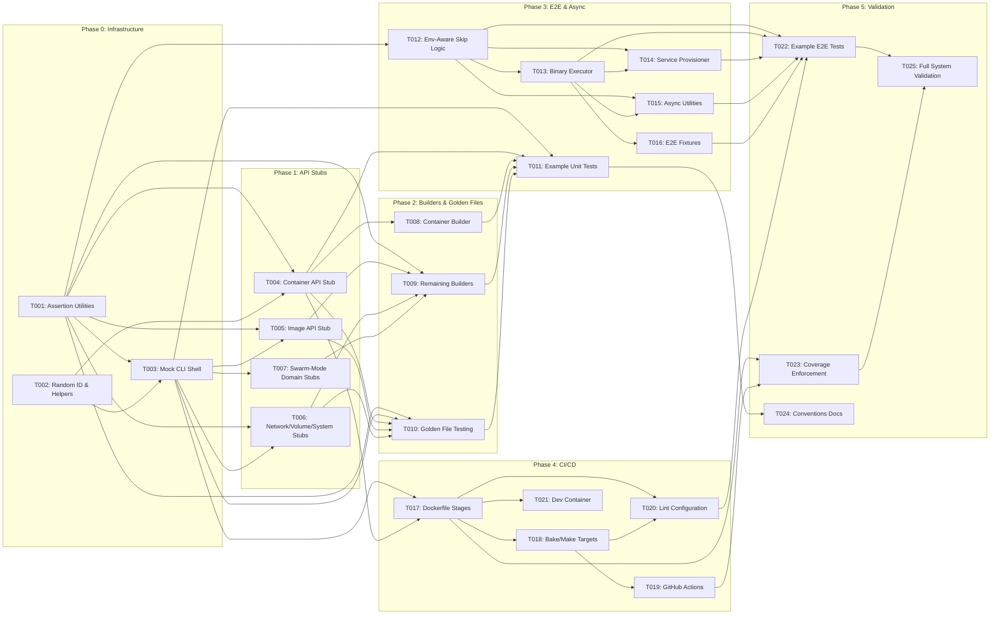

# Implementation Plan

> Generated by implementation-planner for a resource-management CLI testing system

## Implementation Overview

```
Total Tasks: 25
Estimated Phases: 6 (0-5)
Critical Path Length: 10 sequential tasks
Parallelization Potential: High
```

The plan builds a three-tier testing system (unit, E2E, CI/CD) in dependency order. Phase 0 establishes the test harness and assertion utilities that everything else depends on. Phase 1 lays down the mock infrastructure (fake CLI shell and function-field API stubs). Phase 2 adds test data builders and golden file support. Phase 3 delivers E2E infrastructure and async utilities. Phase 4 covers CI/CD pipeline and dev experience. Phase 5 validates the entire system with integration tests and documentation.

---

## Task Breakdown

### Phase 0: Shared Infrastructure

#### Task T001: Implement Test Assertion and Comparison Utilities

**Phase:** 0
**Complexity:** S
**Component:** Test Utilities

**Description:**
Create foundational assertion helpers that all test code will use. This includes output comparison functions (prefix, suffix, contains, equals) and multi-value comparison utilities. These wrap the underlying assertion library to provide domain-specific comparisons.

**Deliverable:**
A `testutil` package exporting `Assert`, `Prefix`, `Suffix`, `Contains`, `Equals`, and `CompareMultipleValues` functions.

**Acceptance Criteria:**
- [ ] All assertion helpers compile and pass self-tests
- [ ] Supports string comparison with clear diff output on failure
- [ ] Multi-value comparison handles ordered and unordered lists

**Dependencies:**
- Blocked by: none
- Blocks: T003, T004, T005, T006, T009, T010

**Notes:**
- Use `gotest.tools/v3/assert` as the underlying assertion engine
- **Source Reference:** `internal/test/output/output.go`, `internal/test/strings.go`

---

#### Task T002: Implement Random ID Generator and Test Helper Utilities

**Phase:** 0
**Complexity:** S
**Component:** Test Utilities

**Description:**
Build small utility functions needed across tests: random ID generation for unique resource naming, prompt termination helpers for interactive CLI testing, and a test writer that can simulate slow or erroring I/O.

**Deliverable:**
Utility functions for random IDs, prompt termination, and configurable test writers.

**Acceptance Criteria:**
- [ ] Random IDs are unique across concurrent calls
- [ ] Prompt terminator can feed input to interactive CLI commands
- [ ] Test writer supports configurable error injection

**Dependencies:**
- Blocked by: none
- Blocks: T003, T004

**Notes:**
- **Source Reference:** `internal/test/randomid.go`, `internal/test/cmd.go`, `internal/test/writer.go`

---

#### Task T003: Implement Mock CLI Shell with Buffer Capture

**Phase:** 0
**Complexity:** L
**Component:** Mock CLI Infrastructure

**Description:**
Build the central test double for the CLI application. This is an in-memory implementation of the CLI interface that captures stdout, stderr, and accepts programmatic stdin. It wraps buffer-backed streams so tests can inspect output without subprocess execution. Must support swapping the underlying API client, config file, context store, and registry client.

**Deliverable:**
A `FakeCli` struct implementing the full CLI interface with:
- Buffer-backed `Out()`, `Err()`, `In()` streams
- `OutBuffer()` / `ErrBuffer()` accessors for raw bytes
- `ResetOutputBuffers()` for multi-step test scenarios
- Setter methods for all pluggable dependencies (client, config, context store, manifest store, registry client)

**Acceptance Criteria:**
- [ ] Implements the same interface as the production CLI
- [ ] stdout/stderr captured in `bytes.Buffer` accessible via `OutBuffer()`/`ErrBuffer()`
- [ ] stdin injectable via `SetIn()`
- [ ] API client swappable via constructor parameter
- [ ] Config, context store, manifest store, registry client all injectable
- [ ] `ResetOutputBuffers()` clears both buffers
- [ ] Constructor returns fully initialized instance with sensible defaults

**Dependencies:**
- Blocked by: T001, T002
- Blocks: T005, T006, T007, T008, T009, T010, T011

**Notes:**
- The mock CLI shell is the single most important piece of infrastructure -- nearly every unit test depends on it
- Must mirror the production CLI interface exactly so commands can be tested without modification
- **Source Reference:** `internal/test/cli.go` (FakeCli struct with 14 fields and 25 methods)

---

### Phase 1: Foundation -- API Stubs and Resource Domain Mocking

#### Task T004: Implement Function-Field Container API Stub

**Phase:** 1
**Complexity:** L
**Component:** API Stubs

**Description:**
Build a fake API client for the container resource domain using the function-field pattern. Each API method is backed by a struct field of matching function type. When a test needs to customize behavior, it sets the function field; otherwise a sensible zero-value default applies. This is the largest stub with ~25 operations (list, inspect, create, start, stop, kill, remove, restart, pause, unpause, rename, commit, diff, export, logs, wait, attach, exec create/start/inspect/resize, stat path, copy from, prune).

**Deliverable:**
A `fakeClient` struct with function fields for all container operations, plus methods that delegate to those fields.

**Acceptance Criteria:**
- [ ] Covers all container CRUD operations (create, inspect, list, remove)
- [ ] Covers lifecycle operations (start, stop, kill, restart, pause, unpause)
- [ ] Covers exec operations (create, start, inspect, resize)
- [ ] Covers streaming operations (logs, attach, wait, export)
- [ ] Covers file operations (stat path, copy from)
- [ ] Covers maintenance (prune, rename, commit, diff)
- [ ] Each method delegates to its function field when set, returns zero value otherwise
- [ ] Embeds the real client interface for forward compatibility
- [ ] Includes stream result helpers (fakeReadCloser)

**Dependencies:**
- Blocked by: T001, T002
- Blocks: T009, T010, T011

**Notes:**
- This is the largest stub (~28 function fields). Other resource stubs follow the same pattern but are smaller.
- **Source Reference:** `cli/command/container/client_test.go` (fakeClient with 25 function fields)

---

#### Task T005: Implement Function-Field Image API Stub

**Phase:** 1
**Complexity:** M
**Component:** API Stubs

**Description:**
Build the function-field fake client for image operations: list, inspect, pull, push, build, tag, remove, save, load, import, history, search, prune.

**Deliverable:**
A fake image client struct with function fields for all image operations.

**Acceptance Criteria:**
- [ ] Covers image CRUD (list, inspect, remove, tag)
- [ ] Covers image transfer (pull, push, save, load, import)
- [ ] Covers image build
- [ ] Covers image metadata (history, search, prune)

**Dependencies:**
- Blocked by: T001, T003
- Blocks: T009, T010

**Notes:**
- **Source Reference:** `cli/command/image/client_test.go`

---

#### Task T006: Implement Function-Field Stubs for Network, Volume, and System Domains

**Phase:** 1
**Complexity:** M
**Component:** API Stubs

**Description:**
Build function-field fake clients for three resource domains:
- **Network:** create, inspect, list, remove, connect, disconnect, prune
- **Volume:** create, inspect, list, remove, prune, update
- **System:** info, ping, version, events, disk usage, server version

**Deliverable:**
Three fake client structs, one per domain, each following the function-field pattern.

**Acceptance Criteria:**
- [ ] Network stub covers all CRUD and connectivity operations
- [ ] Volume stub covers all CRUD and maintenance operations
- [ ] System stub covers info, version, events, and disk usage
- [ ] All stubs delegate to function fields with zero-value defaults

**Dependencies:**
- Blocked by: T001, T003
- Blocks: T009, T010

**Notes:**
- These three stubs are grouped because they are moderate size and share the same pattern
- **Source Reference:** `cli/command/network/client_test.go`, `cli/command/volume/client_test.go`, `cli/command/system/client_test.go`

---

#### Task T007: Implement Function-Field Stubs for Swarm-Mode Domains (Service, Node, Config, Secret, Swarm, Task)

**Phase:** 1
**Complexity:** M
**Component:** API Stubs

**Description:**
Build function-field fake clients for the swarm-mode resource domains:
- **Service:** create, inspect, list, update, remove, logs
- **Node:** inspect, list, update, remove
- **Config:** create, inspect, list, update, remove
- **Secret:** create, inspect, list, update, remove
- **Swarm:** init, join, leave, inspect, update, unlock, unlock-key
- **Task:** inspect, list

Additional domain stubs as needed:
- **Builder:** build, prune
- **Checkpoint:** create, list, delete
- **Plugin:** install, inspect, list, enable, disable, remove, set
- **Manifest:** inspect, annotate, push
- **Stack:** deploy, list, remove, services, ps
- **ID Resolver:** resolve service/node IDs to names

**Deliverable:**
Function-field fake client structs for all swarm-mode and auxiliary domains.

**Acceptance Criteria:**
- [ ] Each domain stub covers its full API surface
- [ ] Pattern consistent with container and image stubs
- [ ] All stubs usable with the Mock CLI Shell

**Dependencies:**
- Blocked by: T003
- Blocks: T009, T010

**Notes:**
- Grouped because each individual stub is small (3-10 function fields)
- **Source Reference:** `cli/command/service/client_test.go`, `cli/command/node/client_test.go`, `cli/command/config/client_test.go`, `cli/command/secret/client_test.go`, `cli/command/swarm/client_test.go`, `cli/command/task/client_test.go`, plus builder, checkpoint, plugin, manifest, stack, idresolver

---

### Phase 2: Test Data and Comparison Infrastructure

#### Task T008: Implement Container Test Data Builder

**Phase:** 2
**Complexity:** M
**Component:** Test Data Builders

**Description:**
Create a functional-options builder for container test data. The builder produces fully populated container structs using a `Container(opts ...Option)` constructor. Each option is a function that modifies the container (e.g., `WithLabel`, `WithName`, `WithPort`, `WithSize`). Include network-related helpers (`IP`, `TCP`, `UDP` for port mapping).

**Deliverable:**
A `builders` package exporting `Container()` constructor and option functions.

**Acceptance Criteria:**
- [ ] `Container()` returns a valid container struct with defaults
- [ ] `WithLabel(key, value)` adds labels
- [ ] `WithName(name)` sets container name
- [ ] `WithPort(mapping)` adds port bindings
- [ ] `WithSize(size)` sets container size info
- [ ] `IP()`, `TCP()`, `UDP()` helpers for network configuration
- [ ] Options compose correctly when multiple are applied

**Dependencies:**
- Blocked by: T004
- Blocks: T010, T011

**Notes:**
- **Source Reference:** `internal/test/builders/container.go`

---

#### Task T009: Implement Test Data Builders for All Remaining Resource Types

**Phase:** 2
**Complexity:** L
**Component:** Test Data Builders

**Description:**
Create functional-options builders for all remaining resource types:
- **Service:** `Service()`, `ServiceID`, `ServiceName`, `ServiceLabels`, `GlobalService`, `ReplicatedService`, `ServiceStatus`, `ServiceImage`, `ServicePort`
- **Node:** `Node()`, `NodeID`, `NodeName`, `NodeLabels`, `Hostname`, `Leader`, `Manager`, `ManagerStatus`, `EngineVersion`
- **Volume:** `Volume()`, `VolumeLabels`, `VolumeName`, `VolumeDriver`
- **Network:** `NetworkResource()`, `NetworkResourceName`, `NetworkResourceID`, `NetworkResourceDriver`, `NetworkResourceScope`
- **Secret:** `Secret()`, `SecretLabels`, `SecretName`, `SecretDriver`, `SecretID`, `SecretVersion`, `SecretCreatedAt`, `SecretUpdatedAt`
- **Config:** `Config()`, `ConfigLabels`, `ConfigName`, `ConfigID`, `ConfigVersion`, `ConfigCreatedAt`, `ConfigUpdatedAt`, `ConfigData`
- **Task:** `Task()`, `TaskID`, `TaskName`, `TaskServiceID`, `TaskNodeID`, `TaskDesiredState`, `TaskSlot`, `WithStatus`, `TaskStatus`, `Timestamp`, `StatusErr`, `TaskState`, `PortStatus`, `WithTaskSpec`, `TaskSpec`, `TaskImage`
- **Swarm:** `Swarm()`, `Autolock`

**Deliverable:**
Builder functions for 8 resource types in the `builders` package, plus a `doc.go` documenting the pattern.

**Acceptance Criteria:**
- [ ] Each builder produces valid, populated resource structs
- [ ] Options pattern consistent across all builders
- [ ] All builders documented in `doc.go`
- [ ] Task builder supports nested options (`WithStatus`, `WithTaskSpec`)

**Dependencies:**
- Blocked by: T001, T005, T006, T007
- Blocks: T010, T011

**Notes:**
- **Source Reference:** `internal/test/builders/` (service.go, node.go, volume.go, network.go, secret.go, config.go, task.go, swarm.go, doc.go)

---

#### Task T010: Implement Golden File Snapshot Testing

**Phase:** 2
**Complexity:** M
**Component:** Golden Files

**Description:**
Integrate golden file comparison for output-heavy tests. Tests capture CLI output and compare against stored `.golden` files. Support an `UPDATE_FIXTURES` (or `UPDATE_GOLDEN`) environment variable that overwrites golden files with current output, enabling easy snapshot updates when output intentionally changes.

**Deliverable:**
Golden file assertion functions and a convention for `.golden` file storage in `testdata/` directories.

**Acceptance Criteria:**
- [ ] `golden.Assert(t, actual, filename)` compares output against `testdata/<filename>`
- [ ] When `UPDATE_FIXTURES=true`, golden files are overwritten with actual output
- [ ] Clear diff output on mismatch showing expected vs actual
- [ ] Works with both stdout and stderr buffer content
- [ ] Convention documented: golden files live in `testdata/` adjacent to test files

**Dependencies:**
- Blocked by: T001, T003, T004, T005, T006
- Blocks: T011

**Notes:**
- Leverage `gotest.tools/v3/golden` which already provides this functionality
- The implementation task is primarily about establishing conventions and demonstrating the pattern
- **Source Reference:** `cli/command/container/create_test.go` (golden.Assert usage), `cli/command/container/testdata/*.golden`

---

### Phase 3: E2E Infrastructure and Async Patterns

#### Task T011: Implement Example Unit Tests Demonstrating All Patterns

**Phase:** 3
**Complexity:** M
**Component:** Test Patterns

**Description:**
Create a suite of example unit tests that demonstrate all testing patterns working together: table-driven tests with subtests, mock CLI shell usage, function-field stubs, test data builders, golden file assertions. These serve as both validation that the infrastructure works and as templates for contributors.

**Deliverable:**
A set of example tests covering:
- Table-driven test with `t.Run()` subtests
- Mock CLI shell capturing stdout/stderr
- Function-field stub customization
- Builder-constructed test data
- Golden file comparison

**Acceptance Criteria:**
- [ ] At least one test per pattern (5 total minimum)
- [ ] All tests pass
- [ ] Tests demonstrate composition of multiple patterns
- [ ] Table-driven test has at least 3 sub-cases

**Dependencies:**
- Blocked by: T003, T004, T008, T009, T010
- Blocks: T018

**Notes:**
- These are "proof of concept" tests that validate the infrastructure
- They also serve as copy-paste templates for contributors

---

#### Task T012: Implement Environment-Aware Test Skip Logic

**Phase:** 3
**Complexity:** M
**Component:** Environment Detection

**Description:**
Build an environment detection and setup system for E2E tests. This includes:
- A `Setup()` function called from `TestMain` that initializes environment state
- Skip functions for capability-based gating: `SkipIfNotExperimentalDaemon`, `SkipIfDaemonNotLinux`, `SkipIfCgroupNamespacesNotSupported`, `SkipIfNotPlatform`
- Detection of remote daemon connections
- Plugin test skip logic
- Configurable default poll settings for async operations
- API version detection from the running daemon

**Deliverable:**
An `environment` package with `Setup()`, skip functions, and `DefaultPollSettings`.

**Acceptance Criteria:**
- [ ] `Setup()` detects daemon capabilities and caches results
- [ ] Each skip function calls `t.Skip()` with descriptive message when condition not met
- [ ] `RemoteDaemon()` returns true when daemon is not local
- [ ] `DaemonAPIVersion()` returns the detected API version string
- [ ] `DefaultPollSettings` provides sensible timeout and interval defaults
- [ ] Boolean environment variables parsed correctly (`SKIP_PLUGIN_TESTS`, etc.)

**Dependencies:**
- Blocked by: T001
- Blocks: T013, T014, T015

**Notes:**
- **Source Reference:** `internal/test/environment/testenv.go`

---

#### Task T013: Implement Binary Executor for E2E Tests

**Phase:** 3
**Complexity:** M
**Component:** E2E Infrastructure

**Description:**
Build a subprocess executor that runs the compiled CLI binary and captures results. This wraps command execution with timeout handling, exit code capture, stdout/stderr separation, and environment variable injection. E2E tests use this instead of the mock CLI shell to test the real binary.

**Deliverable:**
An executor that runs CLI commands as subprocesses with full result capture.

**Acceptance Criteria:**
- [ ] Executes compiled binary with arbitrary arguments
- [ ] Captures stdout, stderr, and exit code separately
- [ ] Supports timeout with clean process termination
- [ ] Supports environment variable injection per-command
- [ ] Supports working directory specification
- [ ] Provides assertion helpers for exit code checking

**Dependencies:**
- Blocked by: T012
- Blocks: T014, T015

**Notes:**
- Use `gotest.tools/v3/icmd` as the execution engine
- **Source Reference:** `e2e/` tests use `icmd.RunCommand` pattern

---

#### Task T014: Implement Service Environment Provisioner

**Phase:** 3
**Complexity:** L
**Component:** E2E Infrastructure

**Description:**
Build the Docker Compose-based environment provisioner for E2E tests. This manages backend services (daemon, registry) needed for integration testing. Includes:
- Compose file for local environment (daemon + registry)
- Compose file for SSH connection helper variant
- TLS certificate generation for secure registry testing
- `TestMain` pattern that calls `environment.Setup()` before test execution

**Deliverable:**
Compose configurations, certificate generation tooling, and `TestMain` entrypoint pattern.

**Acceptance Criteria:**
- [ ] Local environment starts daemon and registry via Compose
- [ ] SSH connection helper variant starts additional SSH proxy
- [ ] TLS certificates generated for registry authentication testing
- [ ] `TestMain` pattern initializes environment and exits with proper code
- [ ] Environment teardown on test completion

**Dependencies:**
- Blocked by: T012, T013
- Blocks: T015, T020

**Notes:**
- **Source Reference:** `e2e/compose-env.yaml`, `e2e/compose-env.connhelper-ssh.yaml`, `e2e/testdata/Dockerfile.gencerts`, `e2e/container/main_test.go`

---

#### Task T015: Implement Async Test Synchronization Utilities

**Phase:** 3
**Complexity:** M
**Component:** Async Testing

**Description:**
Build utilities for testing asynchronous CLI operations:
- **Polling:** Repeatedly check a condition with configurable timeout and interval, used for waiting on container state changes, service convergence, etc.
- **Channel-based synchronization:** Helpers for tests that need to coordinate goroutines (e.g., testing `docker wait`, streaming operations)
- **Write hooks:** Wrappers that trigger actions on write (e.g., detect when a certain output appears, then send a signal)

**Deliverable:**
Async synchronization utilities: `Poll()`, channel helpers, and write-hook wrappers.

**Acceptance Criteria:**
- [ ] `Poll()` retries a check function until success or timeout
- [ ] Poll settings configurable (timeout, interval, delay)
- [ ] Channel helpers support typed result channels with timeout
- [ ] Write hook triggers callback when specific pattern appears in output
- [ ] All utilities respect `context.Context` cancellation

**Dependencies:**
- Blocked by: T012, T013
- Blocks: T020

**Notes:**
- `gotest.tools/v3/poll` provides the polling foundation
- Write hooks are useful for interactive command testing
- **Source Reference:** `internal/test/environment/testenv.go` (DefaultPollSettings), `internal/test/writer.go`

---

#### Task T016: Implement E2E Test Fixtures and Test Data Management

**Phase:** 3
**Complexity:** S
**Component:** E2E Infrastructure

**Description:**
Build the fixtures system for E2E tests: pre-built images, compose files, plugin binaries, and other static test data that E2E tests depend on. Includes a plugin test helper that builds and installs test plugins.

**Deliverable:**
Fixtures directory structure, plugin builder, and test data loader utilities.

**Acceptance Criteria:**
- [ ] Fixtures organized in `testdata/` and `internal/fixtures/` directories
- [ ] Plugin builder compiles and installs test plugins for plugin E2E tests
- [ ] Test data loader provides path resolution for fixture files
- [ ] Fixtures versioned in repository (not generated at test time, except plugins)

**Dependencies:**
- Blocked by: T013
- Blocks: T020

**Notes:**
- **Source Reference:** `e2e/internal/fixtures/`, `e2e/testutils/plugins.go`, `e2e/testdata/`

---

### Phase 4: CI/CD Pipeline and Developer Experience

#### Task T017: Implement Containerized Test Execution via Dockerfile

**Phase:** 4
**Complexity:** L
**Component:** CI/CD

**Description:**
Build the multi-stage Dockerfile that supports all test execution modes:
- Unit test stage with coverage output
- E2E test stage (builds binary + test binary into image)
- Lint stage (golangci-lint execution)
- Shell check stage (shellcheck on scripts)
- Vendor validation stage
- Binary build stage (multi-platform)

**Deliverable:**
Dockerfile with named stages for each test/build mode.

**Acceptance Criteria:**
- [ ] `docker buildx bake test` runs unit tests
- [ ] `docker buildx bake test-coverage` produces coverage report at `build/coverage/`
- [ ] `docker buildx bake lint` runs linter
- [ ] `docker buildx bake shellcheck` validates shell scripts
- [ ] `docker buildx bake e2e-image` builds E2E test image
- [ ] `docker buildx bake validate-vendor` checks vendor consistency
- [ ] All stages use build cache effectively

**Dependencies:**
- Blocked by: T003, T004 (needs tests to exist)
- Blocks: T019, T020

**Notes:**
- **Source Reference:** `Dockerfile`, `docker-bake.hcl`, `dockerfiles/Dockerfile.lint`, `dockerfiles/Dockerfile.shellcheck`, `dockerfiles/Dockerfile.vendor`

---

#### Task T018: Implement Build System Configuration (Bake/Make Targets)

**Phase:** 4
**Complexity:** M
**Component:** CI/CD

**Description:**
Build the `docker-bake.hcl` configuration and Makefile targets that orchestrate all test and build operations. Includes:
- Bake targets: binary, cross, test, test-coverage, lint, shellcheck, validate-vendor, e2e-image, e2e-gencerts
- Platform matrix for cross-compilation (11 platforms)
- Make targets for local development: `make binary`, `make test-unit`, `make lint`, `make fmt`, `make shell`
- E2E make targets: `make test-e2e-local`, `make test-e2e-connhelper-ssh`

**Deliverable:**
`docker-bake.hcl` and `docker.Makefile` with all targets.

**Acceptance Criteria:**
- [ ] `docker buildx bake` builds the binary
- [ ] `docker buildx bake cross` builds for all platforms
- [ ] `docker buildx bake test` runs unit tests in container
- [ ] `docker buildx bake lint shellcheck` runs all linters
- [ ] `make -f docker.Makefile shell` starts dev container
- [ ] E2E targets pass engine version and base variant as env vars

**Dependencies:**
- Blocked by: T017
- Blocks: T019, T020

**Notes:**
- **Source Reference:** `docker-bake.hcl`, `docker.Makefile`

---

#### Task T019: Implement CI Workflow Configuration (GitHub Actions)

**Phase:** 4
**Complexity:** L
**Component:** CI/CD

**Description:**
Configure GitHub Actions workflows for automated testing:
- **test.yml:** Unit tests in container + host-based tests on macOS matrix (arm64, intel)
- **e2e.yml:** E2E test matrix -- connection type (local, connhelper-ssh) x base image (alpine, debian) x engine version (rc, current, current-1, LTS)
- **build.yml:** Multi-platform binary build validation
- **validate.yml:** Linting, vendor validation, author validation
- **codeql.yml:** Security scanning
- Coverage reporting to Codecov

**Deliverable:**
GitHub Actions workflow YAML files in `.github/workflows/`.

**Acceptance Criteria:**
- [ ] Unit tests run on push to master/release branches and on PRs
- [ ] E2E matrix covers 2 connection types x 2 base images x 4 engine versions = 16 combinations
- [ ] Host tests cover macOS arm64, macOS Intel
- [ ] Coverage uploaded to Codecov with token
- [ ] Concurrency groups prevent duplicate runs
- [ ] Permissions follow least-privilege (contents: read)
- [ ] fail-fast disabled on matrix jobs to get full results

**Dependencies:**
- Blocked by: T017, T018
- Blocks: T020

**Notes:**
- **Source Reference:** `.github/workflows/test.yml`, `.github/workflows/e2e.yml`, `.github/workflows/build.yml`, `.github/workflows/validate.yml`

---

#### Task T020: Implement Lint Configuration and Static Analysis Rules

**Phase:** 4
**Complexity:** M
**Component:** CI/CD

**Description:**
Configure golangci-lint with the full rule set:
- 40+ enabled linters (errcheck, gosimple, govet, ineffassign, staticcheck, unused, etc.)
- Custom exclusion rules for known false positives
- Per-path rule overrides (e.g., relaxed rules for test files)
- gofumpt as the formatter
- Import restrictions (banned packages with recommended replacements)

**Deliverable:**
`.golangci.yml` configuration file with all rules.

**Acceptance Criteria:**
- [ ] Lint passes on clean codebase
- [ ] Banned packages detected (e.g., `gopkg.in/yaml.v3` -> `go.yaml.in/yaml/v3`)
- [ ] Banned patterns detected (e.g., `regexp.MustCompile` -> `lazyregexp.New`)
- [ ] Test files have appropriate rule relaxations
- [ ] `gofumpt` enforced as formatter

**Dependencies:**
- Blocked by: T017, T018
- Blocks: T022

**Notes:**
- **Source Reference:** `.golangci.yml`

---

#### Task T021: Implement Developer Container and Interactive Shell

**Phase:** 4
**Complexity:** S
**Component:** Developer Experience

**Description:**
Build the development container that gives contributors an interactive environment with all tools pre-installed. The container should include Go, golangci-lint, gofumpt, gotestsum, delve debugger, and any other development tools. Accessible via `make shell`.

**Deliverable:**
Dev container configuration and `make shell` target.

**Acceptance Criteria:**
- [ ] `make -f docker.Makefile shell` starts interactive container
- [ ] Container has Go, golangci-lint, gofumpt, gotestsum
- [ ] Source code mounted into container
- [ ] Build artifacts persist between sessions (via volume mount)
- [ ] Container has network access for `go mod download`

**Dependencies:**
- Blocked by: T017
- Blocks: none

**Notes:**
- **Source Reference:** `docker.Makefile` (shell target), `Dockerfile` (dev stage)

---

### Phase 5: Validation and Documentation

#### Task T022: Implement Example E2E Tests for Core Workflows

**Phase:** 5
**Complexity:** L
**Component:** Validation

**Description:**
Create E2E tests for core CLI workflows to validate the entire testing infrastructure:
- Container lifecycle: create, run, kill, rename, attach
- Image operations (if backend available)
- System operations
- Plugin operations (with skip logic)

Each E2E test package has a `main_test.go` calling `environment.Setup()`.

**Deliverable:**
E2E test suites for container, image, and system workflows.

**Acceptance Criteria:**
- [ ] Container E2E tests pass against real daemon
- [ ] Tests skip gracefully when capabilities unavailable
- [ ] Async operations use polling utilities
- [ ] Tests use binary executor (not mock CLI shell)
- [ ] `TestMain` calls `environment.Setup()` in every E2E package

**Dependencies:**
- Blocked by: T012, T013, T014, T015, T016, T020
- Blocks: T025

**Notes:**
- **Source Reference:** `e2e/container/`, `e2e/image/`, `e2e/system/`

---

#### Task T023: Implement Coverage Collection and Enforcement

**Phase:** 5
**Complexity:** M
**Component:** Validation

**Description:**
Set up coverage collection across unit and E2E tests:
- Unit tests produce coverage profile via `-coverprofile`
- E2E tests produce coverage via `-coverprofile` on the test binary
- Coverage reports merged and uploaded to Codecov
- Patch coverage minimum of 50% enforced via Codecov configuration

**Deliverable:**
Coverage pipeline from test execution through reporting.

**Acceptance Criteria:**
- [ ] Unit test coverage collected in `build/coverage/coverage.txt`
- [ ] E2E test coverage collected separately
- [ ] Coverage uploaded to Codecov in CI
- [ ] Codecov configured with 50% patch minimum
- [ ] Local coverage viewable via `go tool cover -html`

**Dependencies:**
- Blocked by: T017, T019
- Blocks: T025

**Notes:**
- **Source Reference:** `.github/workflows/test.yml` (Codecov step), `docker-bake.hcl` (test-coverage target)

---

#### Task T024: Implement Table-Driven Test Conventions Documentation

**Phase:** 5
**Complexity:** S
**Component:** Documentation

**Description:**
Create a conventions document (in-code `doc.go` files and comments) establishing the standard patterns for writing tests. This codifies the patterns demonstrated by T011 into a contributor guide within the test infrastructure packages.

**Deliverable:**
`doc.go` files in test packages documenting conventions.

**Acceptance Criteria:**
- [ ] Builder pattern documented with examples
- [ ] Function-field stub pattern documented with examples
- [ ] Golden file workflow documented (including UPDATE_FIXTURES)
- [ ] Table-driven test pattern documented with subtest naming
- [ ] Mock CLI shell usage documented

**Dependencies:**
- Blocked by: T011
- Blocks: none

**Notes:**
- **Source Reference:** `internal/test/builders/doc.go`, `internal/test/doc.go`

---

#### Task T025: Validate Full Testing System End-to-End

**Phase:** 5
**Complexity:** L
**Component:** Validation

**Description:**
Final validation that the entire testing system works as designed:
- Run all unit tests in container
- Run all E2E tests against a real backend
- Run linter and verify clean output
- Verify coverage reports are generated
- Verify CI workflows trigger correctly
- Verify dev container works interactively

**Deliverable:**
Passing CI pipeline across all dimensions.

**Acceptance Criteria:**
- [ ] `docker buildx bake test` passes all unit tests
- [ ] `docker buildx bake lint shellcheck` passes
- [ ] E2E tests pass on at least one matrix combination
- [ ] Coverage report generated and uploadable
- [ ] Dev container starts and can run tests interactively
- [ ] New contributor can add a test using only the documented patterns

**Dependencies:**
- Blocked by: T022, T023
- Blocks: none

---

## Dependency Graph



## Phased Roadmap

### Phase 0: Shared Infrastructure
**Goal:** Establish the test harness foundation that all other work depends on
**Exit Criteria:** Mock CLI shell functional, assertion utilities available, tests can be written

| Task ID | Task Name | Complexity | Parallel Group |
|---------|-----------|------------|----------------|
| T001 | Assertion & Comparison Utilities | S | A |
| T002 | Random ID & Test Helpers | S | A |
| T003 | Mock CLI Shell with Buffer Capture | L | B |

**Why this must be first:** The Mock CLI Shell is the single dependency that every unit test requires. Without it, no command tests can be written. T001 and T002 are prerequisites for T003.

---

### Phase 1: Foundation
**Goal:** Full API mocking coverage for all resource domains
**Exit Criteria:** Every resource domain has a function-field fake client

| Task ID | Task Name | Complexity | Parallel Group |
|---------|-----------|------------|----------------|
| T004 | Container API Stub | L | A |
| T005 | Image API Stub | M | A |
| T006 | Network/Volume/System Stubs | M | A |
| T007 | Swarm-Mode Domain Stubs | M | B |

---

### Phase 2: Core Features
**Goal:** Test data construction and snapshot comparison working
**Exit Criteria:** Builders produce valid data, golden files compare correctly

| Task ID | Task Name | Complexity | Parallel Group |
|---------|-----------|------------|----------------|
| T008 | Container Test Data Builder | M | A |
| T009 | Remaining Resource Builders | L | A |
| T010 | Golden File Snapshot Testing | M | B |

---

### Phase 3: Integration
**Goal:** E2E infrastructure and pattern demonstration complete
**Exit Criteria:** Can run tests against real backends, all unit patterns demonstrated

| Task ID | Task Name | Complexity | Parallel Group |
|---------|-----------|------------|----------------|
| T011 | Example Unit Tests (All Patterns) | M | A |
| T012 | Environment-Aware Skip Logic | M | B |
| T013 | Binary Executor | M | C |
| T014 | Service Environment Provisioner | L | D |
| T015 | Async Synchronization Utilities | M | D |
| T016 | E2E Fixtures & Test Data | S | D |

---

### Phase 4: CI/CD Pipeline
**Goal:** Automated testing in containers with full CI/CD
**Exit Criteria:** All tests runnable via `docker buildx bake`, CI workflows defined

| Task ID | Task Name | Complexity | Parallel Group |
|---------|-----------|------------|----------------|
| T017 | Containerized Test Dockerfile | L | A |
| T018 | Build System Configuration | M | B |
| T019 | GitHub Actions Workflows | L | C |
| T020 | Lint Configuration | M | C |
| T021 | Developer Container | S | B |

---

### Phase 5: Validation
**Goal:** Confidence that the entire system works end-to-end
**Exit Criteria:** All tests pass, coverage collected, docs written

| Task ID | Task Name | Complexity | Parallel Group |
|---------|-----------|------------|----------------|
| T022 | Example E2E Tests | L | A |
| T023 | Coverage Collection & Enforcement | M | A |
| T024 | Conventions Documentation | S | B |
| T025 | Full System Validation | L | C |

---

## Build Order Recommendations

### Solo Developer Sequence

1. **T001**: Assertion utilities -- small, no dependencies, unblocks everything
2. **T002**: Random ID & helpers -- small, no dependencies, unblocks T003/T004
3. **T003**: Mock CLI shell -- the critical path bottleneck; unblocks 8 tasks
4. **T004**: Container API stub -- largest stub, establishes the pattern
5. **T005**: Image API stub -- follows container pattern
6. **T006**: Network/Volume/System stubs -- three moderate stubs, same pattern
7. **T007**: Swarm-mode stubs -- remaining domains
8. **T008**: Container builder -- first builder, establishes pattern
9. **T009**: Remaining builders -- follow container builder pattern
10. **T010**: Golden file testing -- requires stubs to demonstrate
11. **T011**: Example unit tests -- validates all Phase 0-2 work
12. **T012**: Environment skip logic -- foundation for E2E
13. **T013**: Binary executor -- subprocess runner for E2E
14. **T015**: Async utilities -- needed for E2E tests
15. **T014**: Service provisioner -- Compose-based environments
16. **T016**: E2E fixtures -- test data for E2E
17. **T017**: Dockerfile stages -- containerized execution
18. **T018**: Bake/Make targets -- build orchestration
19. **T020**: Lint configuration -- static analysis rules
20. **T021**: Dev container -- interactive development
21. **T019**: GitHub Actions -- CI workflows
22. **T022**: Example E2E tests -- validate E2E infrastructure
23. **T023**: Coverage enforcement -- reporting pipeline
24. **T024**: Conventions documentation -- codify patterns
25. **T025**: Full system validation -- final integration check

### Team Parallelization

**Stream A:** (Developer 1 -- Unit Test Infrastructure)
- T001 -> T003 -> T004 -> T008 -> T009 -> T011 -> T024

**Stream B:** (Developer 2 -- API Stubs & Golden Files)
- T002 -> T005 -> T006 -> T007 -> T010

**Stream C:** (Developer 3 -- E2E & CI/CD)
- T012 -> T013 -> T014 -> T015 -> T016 -> T017 -> T018 -> T019 -> T020 -> T021 -> T022 -> T023

**Sync Points:**
- After Phase 0 (T001-T003): Align on Mock CLI Shell interface
- After Phase 1 (T004-T007): Align on stub pattern consistency
- After T011: Verify all unit patterns compose correctly
- After T018: Verify containerized execution works
- T025: All streams converge for final validation

---

## Milestones

| Milestone | After Tasks | What's Working |
|-----------|-------------|----------------|
| M1: Test Harness | T001-T003 | Mock CLI shell captures output; assertions available |
| M2: Full Mocking | T004-T007 | Every API domain has a function-field fake client |
| M3: Builder + Golden | T008-T010 | Test data constructable; output snapshots comparable |
| M4: Unit Patterns | T011 | All 5 unit test patterns demonstrated end-to-end |
| M5: E2E Ready | T012-T016 | Can run tests against real backend services |
| M6: CI Complete | T017-T021 | Automated pipeline: test, lint, build, coverage |
| M7: Production Ready | T022-T025 | Full validation, docs, coverage enforcement |

---

## Risk-Based Sequencing

**High-Risk Items (Scheduled Early):**

| Task ID | Risk | Why Early |
|---------|------|-----------|
| T003 | Mock CLI Shell interface mismatch | Everything depends on this; discover interface issues immediately |
| T004 | Function-field pattern may not scale to 28 operations | Validate pattern at largest scale first |
| T017 | Multi-stage Dockerfile complexity | Build caching issues surface late; test early |
| T014 | Compose-based provisioner environment variability | External dependency on Docker daemon; flaky if not addressed early |

**External Dependencies:**

| Task ID | Dependency | Mitigation |
|---------|------------|------------|
| T010 | `gotest.tools/v3/golden` library | Well-established library; low risk |
| T013 | `gotest.tools/v3/icmd` library | Well-established library; low risk |
| T014 | Docker daemon availability in CI | Runner must have Docker; GitHub Actions runners provide this |
| T019 | GitHub Actions runner availability | Use `ubuntu-24.04` (LTS); macOS runners may have availability issues |
| T023 | Codecov service availability | Non-blocking; coverage still generated locally |

---

## Complexity Summary

| Complexity | Count | Typical Effort |
|------------|-------|----------------|
| S (Small) | 4 | A few hours |
| M (Medium) | 13 | A day or two |
| L (Large) | 8 | Several days |
| XL (Extra Large) | 0 | N/A |

**Total estimated effort:** ~40-55 developer-days for solo developer; ~15-20 days with 3-person team.
