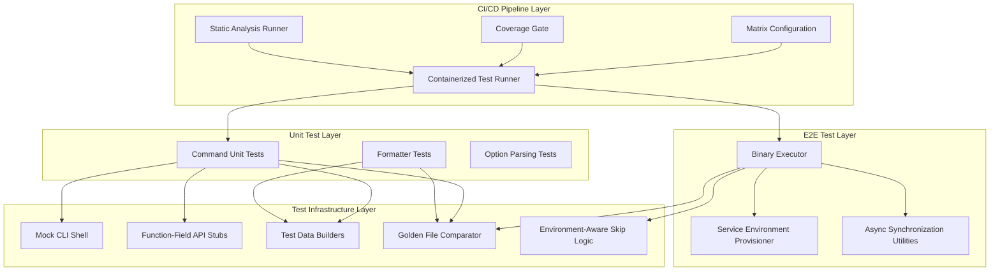
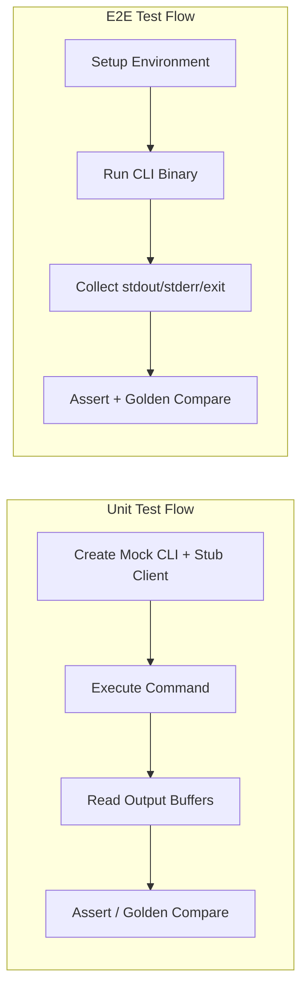

# Technical Design

> Generated by architect-synthesizer for a resource-management CLI testing system

## Design Overview

**Recommended Style:** Layered test architecture with three tiers -- unit (mock-based), integration (golden file), and end-to-end (real service).

**Organization Pattern:** Tests colocated with source code (white-box), shared test infrastructure in a central internal test package, E2E tests in a separate directory tree mirroring the source structure.

**Key Insight:** The most effective CLI testing pattern uses a "thin fake" approach where the CLI shell (streams, config, client) is replaced with an in-memory double, and each resource domain has its own function-field stub client. This avoids code generation, minimizes coupling, and lets each test specify only the behavior it cares about.

---

## Architectural Diagram



---

## Component Design

### Component: Mock CLI Shell

**Role:** Provides an in-memory replacement for the full CLI interface, capturing stdout/stderr into buffers while accepting a pluggable API client.

**Responsibility:** Replace the real CLI's I/O streams, configuration, and API client with test-controllable substitutes so that command logic can be exercised without any real infrastructure.

**Public Interface:**
```
// Pseudocode -- technology-agnostic
interface MockCLIShell {
  // Construction
  create(apiClient: APIClient, ...options: ConfigOption[]): MockCLIShell

  // Stream access
  stdout(): OutputStream
  stderr(): OutputStream
  stdin(): InputStream

  // Buffer inspection (test-only)
  stdoutBuffer(): StringBuffer   // captured stdout content
  stderrBuffer(): StringBuffer   // captured stderr content
  resetBuffers(): void           // clear captured output

  // Configuration
  configFile(): ConfigFile
  setConfigFile(config: ConfigFile): void
  currentContext(): string
  setCurrentContext(name: string): void

  // Client access
  client(): APIClient
  serverInfo(): ServerInfo
}
```

**Internal Structure:**
- **Stream Buffers**: In-memory byte buffers wrapped in the application's stream abstraction (for stdout and stderr).
- **Input Stream**: A no-op or string-backed readable stream for stdin.
- **Config Holder**: A minimal config file object initialized with an empty filename (prevents filesystem side effects).
- **Client Slot**: Holds a reference to the injected API client stub.
- **Context/Endpoint**: Stores context and endpoint configuration with sane defaults.

**Dependencies:**
- Depends on: Application's CLI interface definition (to satisfy it), Stream abstractions
- Depended on by: All command unit tests

**Implementation Notes:**
- The mock MUST implement the same interface as the real CLI so it can be passed to command constructors.
- Use the functional options pattern for construction: `create(client, WithConfigFile(...), WithContext(...))`.
- Default the current context to a well-known "default" value.
- Initialize config with an empty filename to avoid creating real config files during tests.
- Embed or delegate to the real CLI type for methods that are not overridden, using structural embedding (or equivalent in the target language).

**Source Reference:** See the reference implementation's `internal/test/cli.go` (`FakeCli` type) for the complete pattern.

---

### Component: Function-Field API Stubs

**Role:** Per-resource-domain fake API clients where every API method has a corresponding function field. Tests assign only the fields they need; all others return safe zero-value defaults.

**Responsibility:** Enable fine-grained, per-test control of API responses without external mock libraries or code generation.

**Public Interface:**
```
// Pseudocode -- one stub per resource domain
struct ContainerAPIStub {
  // Function fields -- one per API operation
  listFunc:       (options: ListOptions) -> (ListResult, Error)
  inspectFunc:    (id: string) -> (InspectResult, Error)
  createFunc:     (options: CreateOptions) -> (CreateResult, Error)
  startFunc:      (id: string, options: StartOptions) -> (StartResult, Error)
  stopFunc:       (id: string, options: StopOptions) -> (StopResult, Error)
  removeFunc:     (id: string, options: RemoveOptions) -> (RemoveResult, Error)
  logsFunc:       (id: string, options: LogOptions) -> (ReadStream, Error)
  waitFunc:       (id: string) -> WaitResult
  // ... additional operations
  versionField:   string  // for version-sensitive tests

  // Each method checks if its function field is set:
  // - If set: delegates to the function field
  // - If nil: returns a zero-value result with no error
}
```

**Internal Structure:**
- **Base Client Embedding**: Embed the real client type (or a no-op base) so that unimplemented methods compile and return safe defaults rather than panicking.
- **Function Fields**: One exported function field per API method, named consistently (e.g., `{operationName}Func`).
- **Method Implementations**: Each method checks `if stub.{operation}Func != nil` before delegating; otherwise returns the zero value.

**Dependencies:**
- Depends on: API client interface definition
- Depended on by: Mock CLI Shell (injected as the API client), command unit tests

**Implementation Notes:**
- Create one stub struct per resource domain: Container, Image, Network, Volume, Service, Node, Secret, Config, System, Plugin, Swarm, etc. This keeps each stub focused and manageable.
- Each stub is defined in the test file of the package that uses it (e.g., `client_test.go` inside the container command package). This keeps stubs close to tests and avoids creating a shared "god mock."
- The nil-check-then-delegate pattern is critical: it means tests only need to set up behavior for the specific API calls their scenario exercises. This dramatically reduces test setup boilerplate.
- For streaming results (logs, events, attach), provide helper functions that create in-memory stream results from strings.
- The stub struct should embed the real client type so that any API methods not represented by function fields will compile with default no-op behavior rather than causing undefined method errors.

**Source Reference:** See the reference implementation's `cli/command/container/client_test.go` (`fakeClient` struct and its method implementations).

---

### Component: Test Data Builders

**Role:** Construct complex domain objects (resource representations) using the functional options pattern, producing valid default instances that tests can selectively customize.

**Responsibility:** Eliminate repetitive struct literal construction in tests by providing named builder functions for each resource type with composable modifier functions.

**Public Interface:**
```
// Pseudocode -- builder pattern for each resource type

// Factory function with required field + optional modifiers
Container(name: string, ...modifiers: ContainerModifier[]): ContainerSummary
Service(...modifiers: ServiceModifier[]): Service
Network(name: string, ...modifiers: NetworkModifier[]): NetworkResource
Volume(name: string, ...modifiers: VolumeModifier[]): Volume
Node(...modifiers: NodeModifier[]): Node
Task(...modifiers: TaskModifier[]): Task
Secret(...modifiers: SecretModifier[]): Secret
Config(...modifiers: ConfigModifier[]): Config

// Example modifier functions for Container:
WithLabel(key: string, value: string): ContainerModifier
WithPort(private: uint16, public: uint16, ...portModifiers): ContainerModifier
WithSize(bytes: int64): ContainerModifier
WithName(name: string): ContainerModifier
WithStatus(status: string): ContainerModifier
```

**Internal Structure:**
- **Factory Functions**: One per resource type. Each creates a default instance, then applies all modifier functions in order.
- **Modifier Functions**: Small closures that mutate a single field or nested structure. Named with `With{Property}` prefix for clarity.
- **Default Values**: Each factory populates sensible defaults (e.g., a container has an ID, name, image, status, and creation time by default).
- **Nested Builders**: Some modifiers accept their own modifier chain (e.g., `WithPort` accepts port-specific modifiers for protocol, IP address).

**Dependencies:**
- Depends on: Domain model types (API response structs)
- Depended on by: Command unit tests, formatter tests, golden file tests

**Implementation Notes:**
- Place all builders in a shared package within the internal test directory (e.g., `internal/test/builders/`).
- The modifier function pattern is more composable than method chaining because modifiers can be stored in variables, combined in slices, and reused across tests.
- For resource types with required identifiers, accept them as positional parameters (like `name` for Container).
- For resource types where identity is optional or tests need full control, accept all configuration through modifiers only (like Service).
- Default values should produce valid, renderable objects so that formatter tests can use them directly.
- Some builders apply defaults first, then user-supplied modifiers. This allows tests to override any default.

**Source Reference:** See the reference implementation's `internal/test/builders/` directory, especially `container.go` and `service.go` for the two common patterns.

---

### Component: Golden File Comparator

**Role:** Compare command output against version-controlled reference files, with an automated update workflow.

**Responsibility:** Enable snapshot testing where the expected output of a command is stored in a file. When output format changes intentionally, a single flag regenerates all golden files.

**Public Interface:**
```
// Pseudocode
interface GoldenFileComparator {
  // Assert that actual content matches the golden file
  assertEqual(t: TestContext, actual: string, goldenFileName: string): void

  // Assert actual content matches golden file as a substring
  assertSubstring(t: TestContext, actual: string, goldenFileName: string): void

  // Read golden file content directly
  read(t: TestContext, goldenFileName: string): string

  // Check if update mode is active (controlled by environment variable)
  isUpdateMode(): bool
}

// Convention: golden files stored in testdata/ relative to the test file
// Update trigger: environment variable (e.g., UPDATE_GOLDEN=1)
```

**Internal Structure:**
- **File Resolution**: Locate golden files in a `testdata/` subdirectory relative to the calling test file.
- **Update Logic**: When the update environment variable is set, write actual output to the golden file instead of comparing.
- **Comparison Engine**: Perform exact string comparison (or normalized comparison for platform differences).
- **Error Reporting**: On mismatch, produce a diff showing expected vs actual for clear diagnosis.

**Dependencies:**
- Depends on: Filesystem access, test context for error reporting
- Depended on by: Command unit tests, formatter tests, E2E tests

**Implementation Notes:**
- The `testdata/` directory convention is important because many build tools and test frameworks automatically ignore this directory during compilation but include it in test binaries.
- Golden files should use a `.golden` extension for clarity.
- The update mechanism should be an environment variable (e.g., `UPDATE_GOLDEN=1`) rather than a flag, because environment variables work across all test invocations without modifying test commands.
- Consider normalizing line endings (CRLF vs LF) to prevent cross-platform failures.
- Name golden files descriptively after the test scenario: `{resource}-{operation}-{variant}.golden`.

**Source Reference:** The reference implementation uses `gotest.tools/v3/golden` which provides `Assert`, `String`, and `FlagUpdate()`. The pattern of `golden.Assert(t, cli.OutBuffer().String(), "filename.golden")` is idiomatic.

---

### Component: Environment-Aware Skip Logic

**Role:** Conditionally skip tests based on runtime environment, backend capabilities, API versions, and feature flags.

**Responsibility:** Ensure tests only run in environments where they can succeed, preventing false failures without hiding real issues.

**Public Interface:**
```
// Pseudocode
interface TestEnvironment {
  // Setup reads environment variables and configures test state
  setup(): Error

  // Skip predicates (each skips the test if condition is true)
  skipIfRemoteDaemon(t: TestContext): void
  skipIfDaemonNotLinux(t: TestContext): void
  skipIfNotPlatform(t: TestContext, platform: string): void
  skipIfNotExperimental(t: TestContext): void
  skipIfAPIVersionBelow(t: TestContext, minVersion: string): void
  skipIfFeatureNotSupported(t: TestContext, feature: string): void

  // Environment queries
  isRemoteDaemon(): bool
  daemonAPIVersion(t: TestContext): string
  daemonPlatform(t: TestContext): string

  // Polling defaults for async operations
  defaultPollSettings(): PollSettings
}
```

**Internal Structure:**
- **Environment Variable Reader**: Reads `TEST_DOCKER_HOST`, `TEST_REMOTE_DAEMON`, `TEST_SKIP_PLUGIN_TESTS`, etc.
- **Capability Probes**: Queries the running backend (via CLI binary or API) for OS type, API version, experimental status, feature support.
- **Skip Integration**: Uses the test framework's skip mechanism so skipped tests are reported (not silently ignored).

**Dependencies:**
- Depends on: Test framework's skip facility, environment variables, optionally the CLI binary
- Depended on by: E2E tests, integration tests that require specific capabilities

**Implementation Notes:**
- Environment setup should happen once in a `TestMain` function for E2E test packages.
- Use the test framework's native skip mechanism (e.g., `t.Skip()`) rather than conditional `if` blocks, so that test runners report skipped tests.
- Capability probes should cache results for the duration of a test run to avoid repeated subprocess calls.
- Define environment variable names as constants for consistency.

**Source Reference:** See the reference implementation's `internal/test/environment/testenv.go` for the skip pattern.

---

### Component: Binary Executor (E2E)

**Role:** Executes the compiled CLI binary as a subprocess and captures its output, exit code, and side effects for E2E validation.

**Responsibility:** Run the real CLI binary against real backend services and assert on the full end-to-end behavior including output formatting, error messages, and exit codes.

**Public Interface:**
```
// Pseudocode
interface BinaryExecutor {
  // Run CLI command and capture result
  runCommand(args: string[]): CommandResult
  runCommandWithStdin(args: string[], stdin: string): CommandResult
  runCommandWithTimeout(args: string[], timeout: Duration): CommandResult

  // Result inspection
  CommandResult {
    stdout: string
    stderr: string
    exitCode: int
    assert(t: TestContext, expected: ExpectedResult): void
  }

  ExpectedResult {
    exitCode?: int
    stdoutContains?: string
    stderrContains?: string
    stdoutEmpty?: bool
    stderrEmpty?: bool
  }
}
```

**Internal Structure:**
- **Process Spawner**: Uses OS subprocess facilities to launch the CLI binary.
- **Output Capture**: Captures stdout and stderr into separate buffers.
- **Timeout Management**: Wraps execution in a context with deadline or similar mechanism.
- **Result Assertion**: Provides fluent assertion methods on the captured result.

**Dependencies:**
- Depends on: Compiled CLI binary, Service Environment Provisioner
- Depended on by: All E2E tests

**Implementation Notes:**
- E2E tests should use a `TestMain` function to set up the environment (connection to backend, environment variables) before any tests run.
- The CLI binary path should be configurable, defaulting to the one on `$PATH`.
- Support both synchronous execution (run and wait) and asynchronous patterns (start, interact, wait) for interactive commands.

---

### Component: Service Environment Provisioner

**Role:** Provisions and manages the backend service environment (via container orchestration) that E2E tests run against.

**Responsibility:** Bring up the required backend services (API server, supporting services like registries) with configurable versions, and tear them down after tests complete.

**Public Interface:**
```
// Pseudocode
interface ServiceProvisioner {
  // Provisioning (typically handled by Makefile/CI)
  provisionEnvironment(config: EnvironmentConfig): Environment
  teardownEnvironment(env: Environment): void

  EnvironmentConfig {
    backendVersion: string       // e.g., "28", "29", "rc"
    baseImage: string            // e.g., "alpine", "debian"
    connectionType: string       // e.g., "local", "ssh"
    experimentalEnabled: bool
  }
}
```

**Internal Structure:**
- **Compose Files**: Container orchestration definitions for the test environment, including the backend API server and auxiliary services (registry, etc.).
- **Version Matrix**: Parameterized backend version for testing compatibility.
- **Connection Variants**: Support for different connection methods (local socket, SSH tunneling).
- **Docker-in-Docker**: The E2E environment runs a separate instance of the backend inside a container to isolate from the host.

**Dependencies:**
- Depends on: Container orchestration tool (e.g., Docker Compose), CI matrix configuration
- Depended on by: Binary Executor, E2E tests

**Implementation Notes:**
- Use Makefile targets as the primary interface for provisioning (`test-e2e-local`, `test-e2e-ssh`, etc.).
- Pass backend version and base image as environment variables to the orchestration files.
- The test environment should be hermetic -- E2E tests must not depend on or modify the developer's local environment.
- Support at least these matrix dimensions: backend version (latest, previous, LTS), connection type (local, SSH), and base image variant.

**Source Reference:** The reference implementation uses `docker.Makefile` targets and Compose files (`compose-env.yaml`, `compose-env.connhelper-ssh.yaml`) with a CI matrix of 4 engine versions x 2 base images x 2 connection types.

---

### Component: Async Synchronization Utilities

**Role:** Provides patterns for testing asynchronous and eventually-consistent operations in both unit and E2E tests.

**Responsibility:** Offer timeout-safe channel operations, polling loops, and write-hook synchronization to prevent flaky tests.

**Public Interface:**
```
// Pseudocode
interface AsyncTestUtils {
  // Polling: retry a check until it succeeds or times out
  waitOn(t: TestContext, check: PollCheck, ...settings: PollSetting[]): void

  PollCheck: (logContext: LogContext) -> PollResult  // Success or Continue
  PollResult: Success | Continue(message: string)

  PollSetting:
    withDelay(d: Duration)       // delay between polls
    withTimeout(d: Duration)     // maximum wait time

  // Channel-based timeout pattern (inline in tests)
  // done := make(chan result)
  // go func() { done <- longOperation() }()
  // select { case r := <-done: ... case <-time.After(timeout): t.Fatal("timeout") }
}
```

**Internal Structure:**
- **Poll Loop**: Repeatedly executes a check function with configurable delay and timeout. Fails the test on timeout.
- **Channel+Select Pattern**: Documented pattern (not a library) for timeout-safe goroutine synchronization.
- **Default Poll Settings**: Centralized defaults (e.g., 100ms delay) that tests can override.

**Dependencies:**
- Depends on: Test framework's failure reporting
- Depended on by: E2E tests (container status checks, event waiting), unit tests with streaming operations

**Implementation Notes:**
- Polling is the preferred pattern for "wait until resource reaches state X" scenarios. It is simpler and more reliable than event-based waiting.
- Default poll delay should be 100ms (fast enough for tests, slow enough to avoid CPU spinning).
- Default timeout should be 5-30 seconds depending on the operation.
- The channel+select pattern should be used for wrapping goroutine-based operations with a timeout. Document this as a recommended pattern rather than providing a helper, since the pattern is simple and explicit.

**Source Reference:** The reference implementation uses `gotest.tools/v3/poll` for polling (`poll.WaitOn`, `poll.WithDelay`, `poll.WithTimeout`) and raw `chan`/`select` for goroutine synchronization. See `e2e/container/run_test.go` and `e2e/container/kill_test.go`.

---

## Data Model

### Entity: CommandResult

```
CommandResult {
  stdout: string          // captured standard output
  stderr: string          // captured standard error
  exitCode: int           // process exit code (E2E) or error state (unit)
  duration: Duration      // wall-clock execution time (optional)

  // Invariants:
  // - exitCode 0 indicates success
  // - stdout and stderr are never nil (empty string if no output)
}
```

### Entity: GoldenFile

```
GoldenFile {
  path: string            // relative path within testdata/ directory
  content: string         // expected output content
  extension: ".golden"    // conventional file extension

  // Invariants:
  // - path is relative to the test file's directory
  // - content uses LF line endings (normalized)
  // - file is version-controlled alongside test code
}
```

### Entity: TestEnvironmentConfig

```
TestEnvironmentConfig {
  backendHost: string         // API endpoint URL
  backendVersion: string      // engine version under test
  connectionType: string      // "local" | "ssh"
  isRemote: bool              // remote daemon flag
  isExperimental: bool        // experimental features enabled
  certPath: string            // TLS certificate path (optional)
  skipPluginTests: bool       // skip plugin-dependent tests

  // Invariants:
  // - backendHost must be set for E2E tests
  // - connectionType determines available features
}
```

### Data Flow



---

## Integration Design

### Internal Communication

| From | To | Pattern | Notes |
|------|-----|---------|-------|
| Command Test | Mock CLI Shell | Sync (constructor injection) | Inject mock at test setup, call command synchronously |
| Command Test | Function-Field Stub | Sync (function field) | Set function field in struct literal, called during command execution |
| Command Test | Golden Comparator | Sync (assertion) | Compare captured buffer content against golden file |
| E2E Test | Binary Executor | Sync (subprocess) | Launch CLI binary, wait for completion, inspect result |
| E2E Test | Async Utilities | Async (polling) | Poll for resource state changes after command execution |
| CI Pipeline | Test Runner | Async (container exec) | Run test suite inside build container, collect results |

### External APIs

**Inbound:**
- None (testing infrastructure is consumed internally by test code)

**Outbound:**
- **Backend API**: E2E tests connect to a real API server provisioned via container orchestration
- **Container Registry**: E2E tests that involve push/pull operations connect to a test registry

---

## Technology Recommendations

### Language-Agnostic Patterns

These patterns apply regardless of technology choice:

1. **Function-Field Stubs over Mock Frameworks**: Define fake implementations using function fields (or equivalent callbacks) rather than generated mocks. This avoids build-time code generation, is IDE-friendly, and makes test setup explicit.

2. **Functional Options for Builders**: Use the functional options pattern (closures that mutate a struct) rather than method chaining or constructor overloading. This is more composable and extensible.

3. **Golden Files for Output Stability**: Store expected output in version-controlled files rather than inline strings. This separates the "what" (expected output) from the "how" (test logic) and makes format changes reviewable.

4. **Polling over Events for E2E**: Use polling loops with timeouts rather than event subscriptions for checking eventual consistency. Polling is simpler, more portable, and less prone to race conditions in tests.

5. **White-Box Unit Tests**: Place unit tests in the same package/module as the code under test. This enables testing of internal state and avoids the need to export symbols solely for testing.

6. **Table-Driven Tests**: Structure tests as data tables with subtests. Each row defines inputs and expected outputs. This reduces boilerplate and makes it easy to add new cases.

7. **Environment-Variable-Driven Skipping**: Use environment variables (not build flags) to control which tests run. This works across all CI systems and local development.

### Technology Options

#### Need: Test Runner

| Option | Pros | Cons | Best For |
|--------|------|------|----------|
| Native test framework (go test, pytest, jest) | Zero dependencies, built-in | Limited output formatting | Simple projects |
| Enhanced runner (gotestsum, pytest-xdist) | Better output, parallel execution, JUnit XML | Additional dependency | CI environments |

**Recommendation:** Use an enhanced test runner for CI (JUnit output, better failure reporting) while ensuring tests also work with the native runner.

#### Need: Assertion Library

| Option | Pros | Cons | Best For |
|--------|------|------|----------|
| Native assertions (testing.T, assert module) | No dependencies | Verbose, limited comparisons | Simple assertions |
| Rich assertion library (gotest.tools, assertj) | Better diffs, composable checks | Additional dependency | Complex comparisons |

**Recommendation:** Use a rich assertion library that provides deep comparison, error unwrapping, and composable checks. The reference implementation uses `gotest.tools/v3/assert` with `cmp` sub-package for composable comparisons.

#### Need: Golden File Library

| Option | Pros | Cons | Best For |
|--------|------|------|----------|
| Hand-rolled (read file, compare string) | No dependencies | Manual update logic | Simple cases |
| Library support (gotest.tools/golden, jest snapshots) | Update flag, diff output | Dependency | Output-heavy CLIs |

**Recommendation:** Use a golden file library or equivalent that provides automatic update mode and clear diff output on mismatch.

#### Need: E2E Environment

| Option | Pros | Cons | Best For |
|--------|------|------|----------|
| Docker Compose | Declarative, versioned, portable | Requires Docker | Multi-service environments |
| Testcontainers | Programmatic, language-native | Library dependency, less portable | Single-service tests |
| External environment | Shared, always-on | Not hermetic, state leakage | Pre-production validation |

**Recommendation:** Docker Compose (or equivalent orchestration) for hermetic, versioned test environments. Use Docker-in-Docker or equivalent isolation to prevent test pollution.

---

## Key Decisions

### Decision 1: Stub Placement -- Shared vs Per-Package

**Context:** Each resource domain needs a fake API client. Where should these stubs live?

**Options:**
| Option | Description | Pros | Cons |
|--------|-------------|------|------|
| A: Per-package (colocated) | Each command package defines its own `fakeClient` in `client_test.go` | Each stub has only the methods that package needs; no shared dependency; white-box testing | Some duplication of method signatures across packages |
| B: Shared central stubs | One `fakeClient` in `internal/test/` with all API methods | Single definition; no duplication | Becomes a "god object"; changes affect all packages; includes unused methods per test |
| C: Interface-per-resource | Define small interfaces per resource, each with its own stub | Clean separation; dependency inversion | Requires refactoring the API client interface; more types to maintain |

**Recommendation:** Option A (per-package stubs) because it keeps each stub minimal and focused. The reference implementation demonstrates this approach across 19 packages. The minor duplication of method signatures is outweighed by the benefits of locality and minimal scope.

**Impact:** Each command package has a `client_test.go` with its own stub struct. Changes to the API client interface only require updating stubs in packages that use the changed methods.

---

### Decision 2: Golden File Update Mechanism

**Context:** When output format changes intentionally, golden files must be regenerated. How should this be triggered?

**Options:**
| Option | Description | Pros | Cons |
|--------|-------------|------|------|
| A: Environment variable | Set `UPDATE_GOLDEN=1` when running tests | Works with any test command; CI-friendly | Must remember the variable name |
| B: Test flag | Pass `-update` flag to test binary | Standard flag interface | Different invocation per language/tool |
| C: Separate command | Dedicated `make update-golden` target | Discoverable; simple | Another target to maintain |

**Recommendation:** Option A (environment variable) as the primary mechanism, with Option C as a convenience wrapper. The environment variable is the most portable approach and works identically in CI and local development.

**Impact:** CI never sets the update variable (ensuring golden files are validated). Developers run `UPDATE_GOLDEN=1 go test ./...` (or equivalent) to regenerate.

---

### Decision 3: E2E Test Isolation Strategy

**Context:** E2E tests modify real backend state. How do we prevent interference between tests?

**Options:**
| Option | Description | Pros | Cons |
|--------|-------------|------|------|
| A: Unique naming | Each test uses unique resource names (random suffix) | Simple; allows parallelism | Cleanup on failure; namespace pollution |
| B: Per-test environment | Each test gets its own backend instance | Perfect isolation | Slow; resource-heavy |
| C: Sequential execution | Run E2E tests serially with cleanup | Predictable; simple | Slow; no parallelism |
| D: Hybrid | Unique naming + parallel execution + cleanup in `t.Cleanup` | Fast; isolated enough; automatic cleanup | Slightly more complex setup |

**Recommendation:** Option D (hybrid) because it balances speed and isolation. Use random or test-name-based resource identifiers, run tests in parallel where safe, and register cleanup functions to remove resources even on test failure.

**Impact:** E2E tests must generate unique resource names and register cleanup handlers. Test helper functions should handle both resource creation and cleanup registration.

---

### Decision 4: Coverage Enforcement Scope

**Context:** What minimum coverage should be enforced, and at what granularity?

**Options:**
| Option | Description | Pros | Cons |
|--------|-------------|------|------|
| A: Patch coverage only | Enforce minimum coverage on new/changed lines (e.g., 50%) | Encourages testing new code; does not penalize legacy code | Existing gaps remain |
| B: Overall minimum | Enforce minimum total coverage (e.g., 60%) | Prevents coverage decay | Hard to achieve for legacy codebases |
| C: Both | Patch minimum + overall minimum | Comprehensive | More complex to configure |

**Recommendation:** Option A (patch coverage at 50% minimum) to start, with aspirational overall targets. This approach encourages testing new code without blocking PRs due to existing untested code.

**Impact:** CI configuration must include a coverage tool that can compute patch-level coverage (e.g., Codecov).

---

## Risk Areas

### Risk: Golden File Maintenance Burden

**Description:** As the number of golden files grows, format changes require updating many files. Developers may be tempted to blindly update all golden files without reviewing changes.

**Likelihood:** Medium
**Impact:** Medium
**Mitigation:** (1) Keep golden files focused (one per specific scenario, not monolithic). (2) Review golden file diffs in PRs just like code changes. (3) Consider adding a CI check that warns when many golden files change in a single PR.

### Risk: Function-Field Stub Drift

**Description:** When the API client interface evolves (methods added/changed), per-package stubs may fall out of sync, either failing to compile (good) or silently returning wrong defaults (bad).

**Likelihood:** Low (compilation catches most issues)
**Impact:** Medium
**Mitigation:** (1) Embed the real client type in stubs so unimplemented methods compile. (2) Ensure stubs implement the full interface type (compiler verification). (3) Periodically audit stubs as part of API client upgrades.

### Risk: E2E Test Flakiness

**Description:** E2E tests depend on real services and are inherently more prone to timing issues, resource contention, and environmental differences.

**Likelihood:** High
**Impact:** Medium
**Mitigation:** (1) Use polling with reasonable timeouts rather than fixed sleeps. (2) Retry transient failures at the CI level. (3) Use the skip mechanism for environment-specific tests. (4) Maintain a separate "known flaky" label/tracking for quarantine.

### Risk: CI Pipeline Speed

**Description:** The full matrix (multiple backend versions x connection types x platforms) can lead to very long CI times.

**Likelihood:** Medium
**Impact:** Medium
**Mitigation:** (1) Run unit tests and linting in parallel with E2E tests. (2) Use CI concurrency controls to cancel superseded runs. (3) Consider running the full matrix only on merge, with a reduced matrix on PRs. (4) Cache Docker images and build artifacts.

---

## Design Patterns to Apply

| Pattern | Where | Purpose |
|---------|-------|---------|
| Functional Options | Mock CLI Shell constructor, Test Data Builders | Composable, extensible configuration without constructor explosion |
| Function-Field Delegation | API Stubs | Test-specific behavior without mock frameworks or code generation |
| Builder (functional) | Test Data Builders | Construct complex domain objects with sensible defaults |
| Null Object | Stub default returns | Unset function fields return zero-value results instead of errors |
| Template Method | E2E TestMain | Common setup/teardown with test-specific execution |
| Table-Driven Tests | All unit tests | Minimize boilerplate, maximize case coverage |
| Golden Master | Output assertions | Detect unintended output changes |
| Polling | E2E async verification | Wait for eventual consistency without race conditions |

---

## Anti-Patterns to Avoid

| Anti-Pattern | Why | Alternative |
|--------------|-----|-------------|
| Mock framework code generation | Adds build complexity; generated code is hard to read and debug | Function-field stubs (explicit, readable, no generation step) |
| Shared mutable test state | Causes ordering-dependent failures and prevents parallelism | Per-test setup with fresh mock instances |
| Fixed sleep in async tests | Flaky (too short on slow CI, wastes time when fast) | Polling with timeout or channel+select pattern |
| Inline expected output strings | Hard to maintain for multi-line output; clutters test logic | Golden files in testdata/ directory |
| God mock (one mock for everything) | Changes to any API method affect all tests; bloated setup | Per-domain stubs with only relevant methods |
| Testing implementation details | Brittle tests that break on refactoring | Test behavior through the command's public interface (arguments in, output/side-effects out) |
| Ignoring test cleanup | Resource leaks in E2E; flaky subsequent tests | Use framework's cleanup hooks (t.Cleanup, defer, afterEach) |

---

## Migration/Adaptation Strategy

If building this testing system incrementally:

### Phase 1: Core Infrastructure
Build the Mock CLI Shell, one Function-Field Stub (for the most common resource domain), and the Golden File Comparator. Write a single end-to-end example test for one command (e.g., "list resources"). This phase establishes the patterns that all subsequent tests will follow.

**Deliverables:** Mock CLI, one stub, golden file support, 1 example command test.

### Phase 2: Resource Domain Coverage
Add Function-Field Stubs and Test Data Builders for all remaining resource domains. Write unit tests for all commands using the established patterns. Focus on the most critical commands first (CRUD operations).

**Deliverables:** All stubs, all builders, unit tests for all commands.

### Phase 3: E2E Foundation
Build the Service Environment Provisioner and Binary Executor. Write E2E tests for the critical path (create, run, inspect, list, remove for the primary resource type). Set up the CI pipeline with at least one backend version.

**Deliverables:** E2E infrastructure, critical path E2E tests, basic CI pipeline.

### Phase 4: CI/CD Maturity
Expand the E2E matrix to multiple backend versions, connection types, and platforms. Add coverage enforcement, static analysis, and the full validation pipeline. Add Environment-Aware Skip Logic for all capability-dependent tests.

**Deliverables:** Full CI matrix, coverage gates, static analysis, skip logic.

### Phase 5: Async and Advanced Patterns
Add Async Synchronization Utilities for streaming and long-running operations. Write tests for interactive commands (attach, exec), event streams, and concurrent operations.

**Deliverables:** Async test utilities, streaming/interactive tests.

---

## Testability Considerations

- **Seam: CLI Interface**: The primary testability seam is the CLI interface itself. All command functions accept the CLI interface, making it trivial to inject the Mock CLI Shell.

- **Seam: API Client**: The API client is injected into the CLI, creating a natural seam for Function-Field Stubs. Commands never construct their own API clients.

- **Seam: Streams**: Input/output streams are abstracted behind interfaces on the CLI, enabling buffer-based capture without filesystem operations.

- **Seam: Configuration**: The config file is an injectable object, not a global or singleton. Tests provide minimal in-memory configs.

- **Integration Testing**: For commands that orchestrate multiple API calls (e.g., "run" = create + start + attach + wait), unit tests should verify the orchestration logic by having stubs record call sequences. Golden files verify the output formatting independently.

- **E2E Test Doubles**: E2E tests should NOT use test doubles. They validate the compiled binary against real services. Any test that needs a double is a unit test by definition.

- **Test Helpers**: Common setup patterns (create a mock CLI with a specific stub configuration) should be extracted into test helper functions. Use `t.Helper()` (or equivalent) so failure messages reference the calling test, not the helper.

---

## Test Organization Summary

```
project/
  cli/command/
    container/
      run.go                      # Command implementation
      run_test.go                 # Unit tests (same package)
      client_test.go              # Function-field API stub
      testdata/
        container-run-success.golden
        container-run-error.golden
    image/
      pull.go
      pull_test.go
      client_test.go
      testdata/
        image-pull-progress.golden
  internal/test/
    cli.go                        # Mock CLI Shell
    builders/
      container.go                # Container builder
      service.go                  # Service builder
      ...                         # One file per resource type
    environment/
      testenv.go                  # Environment-aware skip logic
  e2e/
    container/
      run_test.go                 # E2E tests for container run
      main_test.go                # TestMain with environment setup
      testdata/
        run-output.golden
    testutils/
      helpers.go                  # Shared E2E utilities
```

This organization ensures:
- Unit tests are discoverable (next to their source)
- Shared infrastructure is centralized (internal/test/)
- E2E tests are separate but mirror the source structure
- Golden files are colocated with their tests
- The entire pattern is learnable from a single resource domain example
