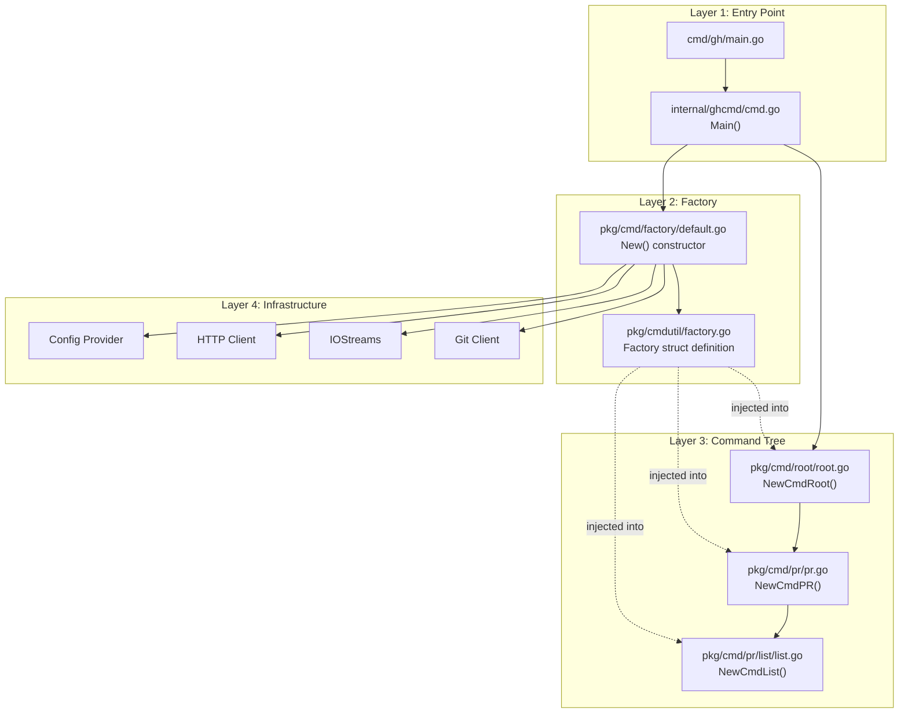
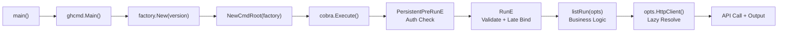
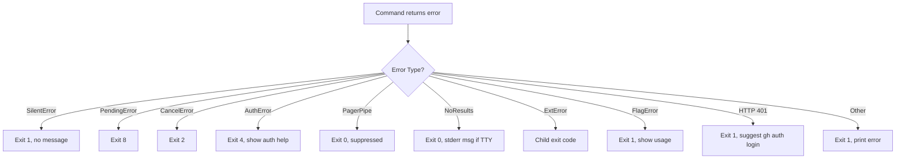
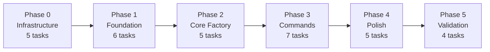

# Command Factory Adaptation PRD

> **Feature:** Command Factory Implementation and Usage for Building New Command Options
>
> **Source Repository:** github.com/cli/cli/v2 (GitHub CLI)
>
> **Entry Points:** `pkg/cmd/factory/default.go`, `pkg/cmd/pr/list/list.go`
>
> **Date:** 2026-01-28

---

## 1. Executive Summary

The GitHub CLI (`gh`) employs a **struct-based dependency injection system** known as the Command Factory pattern. At its core, the `cmdutil.Factory` struct serves as a centralized container holding 13 dependencies -- ranging from terminal I/O streams and HTTP clients to git operations and browser launchers. This Factory is constructed once at application startup, threaded through the entire command tree, and consumed by 100+ leaf commands that each extract only the dependencies they need into per-command Options structs.

The pattern's primary innovation is the **two-struct separation**: the Factory (DI container) paired with per-command Options structs (command configuration). This separation achieves three critical goals: (1) commands are self-documenting because their Options struct declares every dependency and flag, (2) commands are independently testable because the run function depends only on the Options struct, and (3) commands are decoupled from dependency lifecycle because lazy closures defer expensive operations until a command actually needs them.

This PRD synthesizes findings from 12 supplemental analysis documents covering codebase structure, architecture, design patterns, entry points, dependencies, I/O handling, error handling, testing strategy, API surface, infrastructure, product requirements, technical design, and implementation planning. It is designed as a self-contained adaptation guide for developers who want to replicate or adapt this pattern in other codebases and languages.

**Key Metrics:**
- **13 Factory fields** (7 eager + 6 lazy closures)
- **100+ leaf commands** consuming the Factory
- **8 design patterns** identified (Factory, Builder/Options, Strategy, Template Method, Late Binding, Test Double Injection, Shallow Copy Specialization, Shared Utilities)
- **32 implementation tasks** across 6 phases for full adaptation
- **Estimated 6-8 weeks** for a solo developer to adapt the complete pattern

---

## 2. Source Analysis Summary

### 2.1 Codebase Overview

The GitHub CLI is a Go application (~98% Go) organized as a single-binary CLI tool built on the Cobra command framework. The repository follows a feature-based directory structure where each CLI command lives in its own package under `pkg/cmd/`. The codebase spans 1,000+ files with 30+ command groups and hundreds of subcommands, all sharing a common dependency injection mechanism through the Factory pattern.

The Factory pattern is implemented across three key packages that form a clean separation of concerns. The `pkg/cmdutil/` package defines the Factory struct -- the contract that all commands depend on. The `pkg/cmd/factory/` package constructs the Factory with ordered dependency wiring. And `pkg/cmd/root/` assembles the complete command tree, applying Factory specialization where needed. This three-package separation ensures leaf commands import only the struct definition, never the construction logic, keeping the dependency graph clean and preventing circular imports.

The project uses Go modules for dependency management with Go 1.25.5 as the minimum version. External dependencies are minimal for the Factory pattern itself: Cobra v1.10.2 for the command framework, pflag v1.0.10 for flag parsing, go-gh v2.13.0 for GitHub API access, and testify v1.11.1 for testing. The build system uses GNU Make with Go build scripts for cross-platform support, and GoReleaser for release packaging.

```
Repository Structure (Factory-Relevant):

pkg/cmdutil/
  factory.go              # Factory struct definition (THE contract)
  errors.go               # Error types (FlagError, SilentError, etc.)
  flags.go                # Custom flag helpers
  json_flags.go           # JSON export system
  repo_override.go        # -R flag implementation

pkg/cmd/factory/
  default.go              # Factory constructor (New()) + all providers
  remote_resolver.go      # Remote filtering and resolution

pkg/cmd/root/
  root.go                 # Command tree assembly + Factory specialization

pkg/cmd/<group>/<sub>/
  <sub>.go                # Leaf command (NewCmd*, Options, runFunc)
  <sub>_test.go           # Co-located tests
```

### 2.2 Architecture

The architecture follows a **layered model with dependency injection** where each layer has a well-defined responsibility and communication pattern.



**Layer communication is strictly top-down:** Layer 1 creates the Factory and passes it to Layer 3. Layer 3 passes the Factory by pointer through the command hierarchy. Layer 4 is accessed only through lazy closures stored in the Factory or Options structs. Leaf commands never import factory construction code -- they depend on the struct definition only.

The architecture makes seven key decisions that shape the pattern: (1) Factory is a concrete struct, not an interface, because Go's zero-value semantics allow partial initialization in tests; (2) lazy closures over eager initialization for five of thirteen fields, deferring expensive operations; (3) per-command Options structs that cherry-pick dependencies; (4) `runF` test injection on every command; (5) Factory specialization via shallow struct copy for the smart repository resolver; (6) runtime field mutation for the `-R` repo override; and (7) separation of Factory definition from construction across different packages.

Quality assessment rates the architecture 8/10 for modularity, 9/10 for testability, 9/10 for extensibility, and 7/10 for maintainability (the Factory approaches "God Object" territory with 13+ fields).

### 2.3 Key Patterns

Eight design patterns work together to form the complete Command Factory system.

**Pattern 1: Factory (DI Container).** The `cmdutil.Factory` struct holds all shared dependencies as a mix of eager concrete types and lazy closures. Eager fields (`IOStreams`, `GitClient`, `Browser`, `Prompter`) are cheap to create and needed by nearly all commands. Lazy fields (`HttpClient`, `Config`, `BaseRepo`, `Remotes`, `Branch`) are `func() (T, error)` closures that defer expensive operations (network, filesystem, git) until actually invoked.

**Pattern 2: Builder/Options Struct.** Every leaf command defines its own Options struct that accumulates configuration from three sources: Factory dependencies (copied at construction), Cobra flag variables (bound during registration), and test injection points (with production defaults). The Options struct is the single source of truth passed to the run function.

**Pattern 3: Template Method (NewCmd* + runF).** Every command constructor follows the signature `func NewCmdList(f *cmdutil.Factory, runF func(*ListOptions) error) *cobra.Command`. The constructor handles Phase 1 (dependency extraction and flag registration), the `RunE` closure handles Phase 2 (validation and late binding), and the run function handles Phase 3 (business logic). The `runF` parameter enables test injection without modifying production code.

**Pattern 4: Late Binding.** `BaseRepo` is intentionally assigned in `RunE` (not in the constructor) because `EnableRepoOverride` mutates `f.BaseRepo` in a `PersistentPreRunE` hook. This late binding enables the `-R owner/repo` flag to work transparently across all commands without per-command override code.

**Pattern 5: Shallow Copy Specialization.** The root command creates a Factory variant via `repoResolvingCmdFactory := *f` (shallow struct copy) and replaces `BaseRepo` with `SmartBaseRepoFunc`. This gives repo-aware commands (pr, issue, repo) API-aware fork resolution while commands that don't need it (auth, config, gist) use the simpler `BaseRepoFunc`.

**Pattern 6: Strategy (Exporter).** Commands support pluggable output formatting through the `Exporter` interface, registered via `AddJSONFlags`. When `opts.Exporter != nil`, commands output JSON; otherwise they render human-readable tables.

**Pattern 7: Test Double Injection.** The `runF` parameter enables tests to intercept after flag parsing but before business logic. Tests either capture the Options for assertion or wrap the real run function with additional test doubles (e.g., injecting a fake `Detector` or `Now` time provider).

**Pattern 8: Shared Utilities.** Each command group maintains a `shared/` package (e.g., `pkg/cmd/pr/shared/`) containing cross-command utilities like display formatters, query builders, and PR finders. These packages are domain-isolated -- PR shared utilities never leak into issue commands.

### 2.4 Entry Points

The application bootstrap follows a strict initialization sequence designed to avoid circular dependencies and defer expensive operations.



The `factory.New()` function initializes dependencies in topological order across four levels:

- **Level 0** (no dependencies): `AppVersion`, `ExecutableName`, `Config` (lazy closure)
- **Level 1** (depends on Config): `IOStreams`
- **Level 2** (depends on Levels 0-1): `HttpClient`, `PlainHttpClient`, `GitClient`, `Prompter`, `Browser`
- **Level 3** (depends on Levels 0-2): `Remotes`, `ExtensionManager`
- **Level 4** (depends on Levels 0-3): `BaseRepo`, `Branch`

The ordering is explicit in code with inline comments. Critically, **no I/O or network operations occur during factory construction** -- all expensive work is deferred to lazy closures that evaluate only when a command actually calls them. This keeps CLI startup fast even for simple operations like `gh --version`.

The two-phase command creation pattern (construction at startup, execution on invocation) enables flag completion to work without full initialization and help text generation without expensive operations. The `RunE` closure serves as the bridge between Cobra's execution model and the command's business logic, performing late binding (`opts.BaseRepo = f.BaseRepo`), validation, and delegation to `runF` (test) or the real run function (production).

---

## 3. Feature Deep Dive

### 3.1 Product Perspective

The Command Factory system serves four distinct user personas. **CLI Command Developers** build new subcommands using the factory to obtain pre-configured dependencies. **CLI Test Authors** write tests by injecting mock dependencies through the factory pattern and `runF` override. **CLI Framework Maintainers** extend the factory itself, adding new shared dependencies or changing initialization order. **Extension Developers** build external commands that receive factory-provided services for consistency with core commands.

The system provides seven core features organized by priority:

1. **Centralized Dependency Injection Container** (Must Have): The Factory struct with 13 fields providing pre-configured dependencies, lazy evaluation, and application metadata access.

2. **Options Struct Pattern** (Must Have): Per-command structs declaring exact dependencies, binding flag values directly to struct fields, and supporting test injection points.

3. **Test Double Injection via runF** (Must Have): Every command accepting an optional `runF func(*Options) error` parameter for surgical test interception.

4. **Repository Resolution Strategies** (Must Have): Basic resolution (`BaseRepoFunc` -- first remote) and smart resolution (`SmartBaseRepoFunc` -- API-aware fork handling with prompting).

5. **Consistent Command Structure** (Must Have): Three-phase pattern (construction, validation, execution) enforced across 100+ commands.

6. **Factory Construction with Ordered Wiring** (Must Have): Topological initialization order with memoized config and deferred evaluation.

7. **Structured Error Handling** (Should Have): Error type hierarchy mapping to exit codes (0=OK, 1=Error, 2=Cancel, 4=Auth, 8=Pending).

Supporting features include custom flag types (`StringEnumFlag`, `NilBoolFlag`, `AddJSONFlags`), TTY-adaptive output, authentication pre-check, extension/alias registration, and shared utility packages.

Non-functional requirements specify that factory construction must not perform I/O, commands must be testable without real HTTP/git/terminal operations, adding a new command must not require modifying the factory struct, and lazy dependency failures must propagate as errors (never panics).

### 3.2 Technical Perspective

The Factory struct is the technical centerpiece. Its 13 fields divide into two categories:

```go
type Factory struct {
    // Eager fields (concrete, set at construction)
    AppVersion       string
    ExecutableName   string
    Browser          browser.Browser
    ExtensionManager extensions.ExtensionManager
    GitClient        *git.Client
    IOStreams         *iostreams.IOStreams
    Prompter         prompter.Prompter

    // Lazy fields (closures, evaluated on demand)
    BaseRepo        func() (ghrepo.Interface, error)
    Branch          func() (string, error)
    Config          func() (gh.Config, error)
    HttpClient      func() (*http.Client, error)
    PlainHttpClient func() (*http.Client, error)
    Remotes         func() (context.Remotes, error)
}
```

The lazy closure pattern is the key technical innovation. Each closure captures the factory pointer `f`, enabling it to access other factory fields when evaluated. The `Config` closure uses memoization (caches after first call), while `HttpClient` creates a fresh client each call (reading the cached config). This design allows factory construction to be fast (no I/O) while supporting dynamic behavior (repo override via `-R` flag).

The three-phase command pattern is best understood through the reference implementation `pkg/cmd/pr/list/list.go`:

**Phase 1 -- Construction** (in `NewCmdList`):
```go
opts := &ListOptions{
    IO:         f.IOStreams,       // Eager: copy concrete value
    HttpClient: f.HttpClient,     // Lazy: copy closure reference
    Browser:    f.Browser,        // Eager: copy concrete value
    Now:        time.Now,         // Test injection: production default
}
// Register flags that bind directly to opts fields
cmd.Flags().IntVarP(&opts.LimitResults, "limit", "L", 30, "...")
```

**Phase 2 -- Validation** (in `RunE` closure):
```go
RunE: func(cmd *cobra.Command, args []string) error {
    opts.BaseRepo = f.BaseRepo    // Late binding for -R support
    if opts.LimitResults < 1 {
        return cmdutil.FlagErrorf("invalid value for --limit: %v", opts.LimitResults)
    }
    if runF != nil { return runF(opts) }  // Test injection
    return listRun(opts)                   // Production path
}
```

**Phase 3 -- Execution** (in `listRun`):
```go
func listRun(opts *ListOptions) error {
    httpClient, err := opts.HttpClient()  // Lazy: triggers Config() evaluation
    if err != nil { return err }
    baseRepo, err := opts.BaseRepo()      // Lazy: triggers Remotes() evaluation
    if err != nil { return err }
    // ... business logic using only Options fields ...
}
```

The Factory specialization mechanism in `NewCmdRoot` uses Go's value semantics for struct copy:

```go
// Standard commands use original factory
cmd.AddCommand(authCmd.NewCmdAuth(f))

// Repo-aware commands use specialized factory
repoResolvingCmdFactory := *f  // Shallow copy (all fields copied)
repoResolvingCmdFactory.BaseRepo = factory.SmartBaseRepoFunc(f)
cmd.AddCommand(prCmd.NewCmdPR(&repoResolvingCmdFactory))
```

This creates a second Factory where `BaseRepo` uses API calls to resolve fork relationships. The shallow copy shares all other fields, so changes to eager fields (like IOStreams settings) affect both variants. This works because only `BaseRepo` differs between the two.

### 3.3 API Surface

The public API surface of the Factory system spans 40+ types across several packages.

**Core Types:**

| Type | Package | Role |
|------|---------|------|
| `Factory` | `pkg/cmdutil` | DI container (13 fields) |
| `NewCmd*` | Per-command packages | Command constructor signature |
| `*Options` | Per-command packages | Per-command configuration struct |
| `Exporter` | `pkg/cmdutil` | JSON export interface (`Fields()`, `Write()`) |

**Flag Helpers:**

| Helper | Purpose | Example |
|--------|---------|---------|
| `StringEnumFlag` | Validated enum values with completion | `--state open\|closed\|merged\|all` |
| `NilBoolFlag` | Tri-state: unset / true / false | `--draft` (nil vs `*true` vs `*false`) |
| `NilStringFlag` | Tri-state: unset / empty / value | `--milestone` |
| `AddJSONFlags` | Register `--json`, `--jq`, `--template` | Structured output for scripting |
| `RegisterBranchCompletionFlags` | Tab completion for branch names | `--base`, `--head` |
| `MutuallyExclusive` | Validate flag conflicts | `--editor` vs `--web` |

**Error Types:**

| Error | Exit Code | Behavior |
|-------|-----------|----------|
| `FlagError` | 1 | Shows error + usage text |
| `SilentError` | 1 | No message (already displayed) |
| `CancelError` | 2 | User cancelled (Ctrl+C) |
| `AuthError` | 4 | Shows auth help text |
| `PendingError` | 8 | Operation pending |
| `NoResultsError` | 0 | Message on stderr if TTY only |
| `ErrClosedPagerPipe` | 0 | Pager closed (suppressed) |

**Interfaces:**

| Interface | Methods | Purpose |
|-----------|---------|---------|
| `browser.Browser` | `Browse(url) error` | URL opener (+ `Stub` for tests) |
| `prompter.Prompter` | `Select`, `Input`, `Confirm`, etc. | User interaction (survey + accessible backends) |
| `ghrepo.Interface` | `RepoName()`, `RepoOwner()`, `RepoHost()` | Repository abstraction |
| `extensions.ExtensionManager` | `List()`, `Install()`, `Dispatch()` | Plugin system |
| `fd.Detector` | Feature detection methods | GHES vs github.com capability detection |

### 3.4 I/O and Error Handling

The IOStreams struct is the terminal I/O abstraction layer wrapping stdin, stdout, and stderr with TTY detection, color support, pager management, and progress indicators.

**stdout vs stderr separation** is strictly enforced: stdout (`IO.Out`) receives only data output (tables, JSON), while stderr (`IO.ErrOut`) receives status messages, progress spinners, warnings, and errors. This enables clean piping and redirection.

**TTY detection** drives multiple behavioral differences: pager activation (only when stdout is TTY), progress indicators (only when both stdout and stderr are TTY), prompting (requires both stdin and stdout to be TTY), output formatting (table headers only in TTY mode, extra columns in non-TTY), and NoResultsError display (message on stderr only when stdout is TTY).

**The pager pattern** redirects stdout through a subprocess (e.g., `less`). A custom `pagerWriter` wraps EPIPE errors as `ErrClosedPagerPipe`, which the top-level error handler maps to exit code 0 -- pressing `q` in `less` is not an error. Pager failure is non-fatal: if the pager cannot start, the command logs a warning to stderr and continues without paging.

**Error handling** uses a multi-tier strategy. Commands return typed errors (`FlagError`, `SilentError`, `CancelError`, `PendingError`, `NoResultsError`). The `ghcmd.Main()` function maps these to exit codes in a single switch statement. HTTP errors are enriched with scope suggestions and SSO URLs. The `printError` function provides DNS-specific messages with a status page URL and shows usage text for flag errors.



The `Test()` constructor for IOStreams returns buffer-backed streams with TTY override capability, enabling tests to capture stdout/stderr output and control TTY behavior deterministically.

---

## 4. Dependencies and Infrastructure

### 4.1 External Dependencies

The Factory pattern has a narrow external dependency footprint:

| Dependency | Version | Criticality | Purpose |
|------------|---------|-------------|---------|
| `spf13/cobra` | v1.10.2 | Essential | Command structure, flags, help, subcommands |
| `spf13/pflag` | v1.0.10 | Essential | POSIX flag parsing (tightly coupled with Cobra) |
| `cli/go-gh/v2` | v2.13.0 | Essential | GitHub API transport, GraphQL, token management |
| `cli/oauth` | v1.2.1 | Essential | OAuth device flow for `gh auth login` |
| `stretchr/testify` | v1.11.1 | Dev only | Test assertions and helpers |

Additional dependencies support specific capabilities: `survey/v2` and `charmbracelet/huh` for user prompts (two backends for standard and accessible modes), `charmbracelet/glamour` for markdown rendering, `mattn/go-isatty` and `mattn/go-colorable` for terminal detection, `zalando/go-keyring` for credential storage, and `gopkg.in/yaml.v3` for config parsing.

The Factory's lazy initialization pattern means most external dependencies are only exercised when a command actually needs them. A command like `gh config list` never creates an HTTP client or queries git remotes, even though the Factory holds closures for those operations.

Replacement difficulty varies: Cobra and pflag are "very difficult" to replace (every command would need rewriting), go-gh is "moderate" (alternative GitHub API clients exist), and the internal packages (IOStreams, config, git, browser, prompter) are "moderate" to "easy" since they are interface-based.

### 4.2 Build and Infrastructure

The build system uses a two-layer architecture: Make targets for portable task definitions and Go build scripts (`script/build.go`) for cross-platform execution. Version and OAuth credentials are injected at build time via `-ldflags`:

```bash
go build -trimpath \
  -ldflags "-X .../build.Version=v2.45.0 -X .../build.Date=2026-01-28" \
  -o bin/gh ./cmd/gh
```

CI/CD runs on GitHub Actions with three primary workflows: unit/integration tests (`go.yml` with cross-platform matrix), linting (`lint.yml` with golangci-lint v2.6.0), and deployment (`deployment.yml` with GoReleaser v2.13.1). The test suite runs with `-race` flag for race condition detection. Acceptance tests require real GitHub credentials and use `.txtar` script format.

Build performance is optimized with incremental compilation (only rebuilds on source changes), `TCELL_MINIMIZE=1` for 30-40ms startup improvement, and `-trimpath` for reproducible builds. Cross-compilation targets Linux (amd64, arm64), macOS (amd64, arm64), and Windows (amd64, arm64, 386).

### 4.3 Testing Strategy

The testing architecture follows a pyramid with three tiers.

**Tier 1: Unit Tests (Foundation).** Each command has co-located tests (`list.go` + `list_test.go`). Tests construct partial Factory structs with only needed fields, use `iostreams.Test()` for buffer-backed I/O, `httpmock.Registry` as `http.RoundTripper` for API stubbing, and `browser.Stub` for verifiable browser operations. The `runF` parameter enables testing flag parsing separately from business logic.

The canonical test helper pattern (`runCommand`) constructs a minimal Factory, creates the command with a `runF` that injects test doubles, parses arguments with `shlex.Split`, and captures output:

```go
func runCommand(rt http.RoundTripper, isTTY bool, cli string) (*test.CmdOut, error) {
    ios, _, stdout, stderr := iostreams.Test()
    ios.SetStdoutTTY(isTTY)
    factory := &cmdutil.Factory{
        IOStreams: ios,
        HttpClient: func() (*http.Client, error) {
            return &http.Client{Transport: rt}, nil
        },
        BaseRepo: func() (ghrepo.Interface, error) {
            return ghrepo.New("OWNER", "REPO"), nil
        },
    }
    cmd := NewCmdList(factory, func(opts *ListOptions) error {
        opts.Now = func() time.Time { return fixedTime }
        return listRun(opts)
    })
    cmd.SetArgs(shlex.Split(cli))
    _, err := cmd.ExecuteC()
    return &test.CmdOut{OutBuf: stdout, ErrBuf: stderr}, err
}
```

**Tier 2: Integration Tests.** HTTP-level tests with `httpmock` verify request construction, pagination, and error handling. Cross-command tests verify interactions.

**Tier 3: Acceptance Tests.** End-to-end workflows against real GitHub API using `.txtar` scripts. These require credentials and are gated by build tags (`-tags=acceptance`).

Table-driven tests are the dominant pattern for testing flag combinations, TTY vs non-TTY output, and error cases. GraphQL response fixtures are stored as JSON files in `./fixtures/` directories alongside tests.

---

## 5. Adaptation Guide

### 5.1 Technical Design Recommendations

When adapting this pattern, preserve these elements in order of importance:

1. **Two-Struct Separation (Factory + Options):** This is the single most valuable pattern. The Factory holds shared dependencies; the Options struct declares per-command needs. The run function depends only on Options, never on Factory. This achieves compile-time documentation of each command's dependencies and enables focused testing.

2. **Lazy Closure Fields:** Wrap expensive dependencies in provider functions/lambdas that return `(value, error)`. This defers initialization, enables runtime replacement (repo override), and ensures commands that don't need a dependency never pay for it.

3. **Test Function Injection (runF):** Every command constructor must accept an optional run override. This is the key to high test coverage without slow integration tests. Tests use it to intercept after flag parsing, inject test doubles, and assert on Options state.

4. **Late Binding for Override Support:** Assign `BaseRepo` (or equivalent overridable fields) in `RunE`, not in the constructor. This enables pre-run hooks to modify the Factory before the command reads the field.

5. **Ordered Construction with Explicit Dependencies:** Initialize Factory fields in topological order. Document the dependency graph in comments or better, enforce it with a build graph tool.

**Language-specific adaptations:**

| Language | Factory Type | Lazy Mechanism | Test Injection |
|----------|-------------|----------------|----------------|
| Go | Concrete struct with public fields | `func() (T, error)` closures | `runF func(*Opts) error` parameter |
| Python | `@dataclass` | `Callable[[], T]` or `@cached_property` | Default parameter `run_f=None` |
| TypeScript | Interface + class | `get` accessor with backing field, `Promise<T>` | Optional `runF?: (opts) => Promise<void>` |
| Rust | Struct with `Box<dyn Fn>` fields | `Box<dyn Fn() -> Result<T>>` or `OnceCell` | `run_f: Option<Box<dyn Fn>>` |

**Key decisions to make:**

- **Struct vs Interface for Factory:** Use struct in Go (zero values enable partial initialization in tests). Use interface in Java/TypeScript/C# where partial initialization is not ergonomic.
- **Closures vs Lazy Wrappers:** Use plain closures in Go. Use `Lazy<T>` or `OnceCell<T>` in Rust. Use `@cached_property` in Python.
- **Factory Specialization:** Shallow struct copy works for 1-2 variants. Use a builder pattern (`f.WithBaseRepo(smartFunc)`) if you need 3+ variants.

### 5.2 Implementation Plan

The implementation plan defines 32 tasks across 6 phases with a critical path of 11 sequential tasks.



**Phase 0: Shared Infrastructure** (all tasks parallelizable)
- T001: Error types and sentinel values (S)
- T002: IOStreams abstraction with System/Test constructors (M)
- T003: HTTP mock registry as RoundTripper (M)
- T004: Browser interface and test stub (S)
- T005: Test helpers package (S)

**Phase 1: Foundation** (depends on Phase 0)
- T006: Config interface with caching provider (M)
- T007: Git client wrapper (M)
- T008: Prompter interface with two backends (M)
- T009: Repository interface (ghrepo) (S)
- T029: Remote resolver with host filtering (M)
- T032: Context package with Remotes type (S)

**Phase 2: Core Factory** (depends on Phase 1)
- T010: API client and HTTP provider (L)
- T011: Factory struct definition with all 13 fields (S)
- T012: Factory constructor with ordered wiring (L) -- **critical path**
- T013: Smart repository resolution (M)
- T014: Repository override mechanism (-R flag) (M)

**Phase 3: Command Framework** (depends on Phase 2)
- T015: Root command builder with auth check and dual factory (L)
- T016: Custom flag helpers (M)
- T017: Auth check utilities (S)
- T018: First command group (pr) (S)
- T019: First leaf command (pr list) -- **reference implementation** (L)
- T030: Feature detection interface (S)
- T031: Extension manager interface stub (S)

**Phase 4: Polish** (depends on Phase 3)
- T020: Application entry point and error-to-exit-code handler (M)
- T021: Shared utilities package (pr/shared) (M)
- T022: Second leaf command (pr view) -- validates pattern (M)
- T023: Command group organization utilities (S)
- T024: DetermineEditor utility (S)

**Phase 5: Validation** (depends on Phase 4)
- T025: Integration test suite (M)
- T026: Pattern validation with third command (S)
- T027: Test coverage audit (S)
- T028: Final documentation and pattern guide (S)

**Complexity distribution:** 14 Small (2-4 hours), 13 Medium (1-2 days), 5 Large (3-5 days).

**Critical path:** T002 -> T006 -> T010 -> T012 -> T015 -> T018 -> T019 -> T022 -> T025 -> T027 -> T028 (11 sequential tasks). With parallelization, this reduces to ~9 effective steps.

**Milestones:**
| Milestone | After | What Works |
|-----------|-------|------------|
| M1: Test Infrastructure | T001-T005 | Can write tests with mocked I/O, HTTP, browser |
| M2: Domain Model | T006-T009 | Config loads, git client wraps CLI, repo abstraction exists |
| M3: Factory Operational | T010-T014 | `factory.New()` produces a fully wired Factory |
| M4: First Command | T015-T019 | `gh pr list` executes end-to-end with mocked API |
| M5: Production Ready | T020-T024 | Entry point, error handling, second command |
| M6: Validated | T025-T028 | Integration tests pass, pattern documented |

### 5.3 Risk Assessment

| Risk | Likelihood | Impact | Mitigation |
|------|-----------|--------|------------|
| **Factory growth (God Object)** | High | Medium | Split into sub-factories (UIFactory, RepoFactory, APIFactory) when field count exceeds ~20 |
| **Initialization order fragility** | Medium | High | Document dependency graph explicitly; add integration test that constructs Factory and calls every lazy provider |
| **Runtime Factory mutation** | Low | High | Limit mutation to one well-documented point (repo override); consider immutable Factory with explicit override passing |
| **Lazy provider error confusion** | Medium | Medium | Establish convention: every lazy provider call must have explicit error handling with early return; lint with `errcheck` |
| **Platform-specific IOStreams** | Medium | Medium | Build IOStreams in Phase 0 and test on all target platforms before proceeding; use CI matrix testing |
| **Pattern friction on first command** | Medium | High | T019 (pr list) is the canary; if friction is found, refactor before building more commands |
| **Test double leakage** | Low | Low | Prefer capturing Options for assertion over modifying-then-forwarding in `runF` |

**Anti-patterns to avoid:**
- Run function depending on Factory (couples business logic to DI container)
- Evaluating lazy providers in constructor (defeats lazy initialization)
- Global mutable state (the `ssoHeader` package variable is a known weakness)
- Mutating Factory fields from multiple locations (only `BaseRepo` should be mutated)
- Large Options structs with >25 fields (indicates the command is doing too much)
- Skipping `runF` parameter (makes command untestable at the flag-parsing level)

---

## 6. Supplemental Documents

The following supplemental analysis documents provide detailed coverage of specific aspects of the Command Factory pattern. Each is self-contained and can be referenced independently.

### Phase 1: Discovery

| Document | File | Focus |
|----------|------|-------|
| Codebase Structure | `codebase-structure.md` | Repository overview, Factory pattern layers, directory structure, dependency injection details, testing mechanisms, design principles |
| Dependency Catalog | `dependency-catalog.md` | 4 external + 8 internal dependencies, dependency graph, lazy initialization pattern, language-specific adaptation stacks |
| Entry Points | `entry-points.md` | `main()` -> `Main()` -> `New()` -> `NewCmdRoot()` initialization sequence, command execution flow, handler registration, two-phase creation rationale |

### Phase 2: Deep Analysis

| Document | File | Focus |
|----------|------|-------|
| Architecture | `architecture.md` | Component diagram, layer architecture, data flow, 6 component catalog entries, 7 architectural decisions, quality assessment |
| Patterns | `patterns.md` | 8 design patterns with code examples, coding conventions, flag registration patterns, error handling, testing patterns, consistency assessment |
| I/O & Error Handling | `io-error-handling.md` | IOStreams architecture, stdout/stderr separation, TTY detection, pager pattern, progress indicators, error type hierarchy, exit code mapping, HTTP error enrichment |
| Testing Strategy | `testing-strategy.md` | Test pyramid, `runCommand` helper pattern, httpmock Registry, iostreams.Test(), table-driven tests, fixture pattern, coverage approach |
| API Surface | `api-surface.md` | 40+ public types/interfaces, Factory fields, NewCmd* signature, Options pattern, flag helpers, Exporter interface, error types, auth utilities |
| Infrastructure | `infrastructure.md` | Two-layer build system, version injection, golangci-lint config, GitHub Actions workflows, GoReleaser, cross-platform support, reproducible builds |

### Phase 3: Synthesis

| Document | File | Focus |
|----------|------|-------|
| Product Requirements | `product-requirements.md` | 7 core features with user stories and acceptance criteria, supporting features, non-functional requirements, feature priority matrix, constraints, glossary |
| Technical Design | `technical-design.md` | Architecture diagram, 5 component designs, data model, integration design, 5 key decisions, language-specific adaptation (Go/Python/TypeScript/Rust), risk areas |
| Implementation Plan | `implementation-plan.md` | 32 tasks across 6 phases, dependency graph, solo developer sequence, team parallelization, milestones, critical path, risk mitigation |

---

## 7. Quick Start for Implementers

This section provides a step-by-step guide for the most common adaptation tasks.

### Adding a New Command (Using the Existing Factory)

**Step 1: Create the package**
```
pkg/cmd/<group>/<subcommand>/
  <subcommand>.go
  <subcommand>_test.go
  fixtures/           # Optional: test response fixtures
```

**Step 2: Define the Options struct**
```go
type ListOptions struct {
    // Factory dependencies (assign in constructor)
    HttpClient func() (*http.Client, error)
    IO         *iostreams.IOStreams
    Browser    browser.Browser

    // Late-bound dependencies (assign in RunE)
    BaseRepo   func() (ghrepo.Interface, error)

    // Flag-bound values (populated by Cobra)
    State      string
    Limit      int
    WebMode    bool

    // JSON export (populated by AddJSONFlags)
    Exporter   cmdutil.Exporter

    // Test injection (set production default in constructor)
    Now        func() time.Time
}
```

**Step 3: Create the command constructor**
```go
func NewCmdList(f *cmdutil.Factory, runF func(*ListOptions) error) *cobra.Command {
    opts := &ListOptions{
        IO:         f.IOStreams,
        HttpClient: f.HttpClient,
        Browser:    f.Browser,
        Now:        time.Now,
    }

    cmd := &cobra.Command{
        Use:   "list",
        Short: "List items in a repository",
        Args:  cmdutil.NoArgsQuoteReminder,
        RunE: func(cmd *cobra.Command, args []string) error {
            // Late binding
            opts.BaseRepo = f.BaseRepo

            // Validation
            if opts.Limit < 1 {
                return cmdutil.FlagErrorf("invalid value for --limit: %v", opts.Limit)
            }

            // Dispatch
            if runF != nil {
                return runF(opts)
            }
            return listRun(opts)
        },
    }

    // Register flags
    cmd.Flags().IntVarP(&opts.Limit, "limit", "L", 30, "Maximum number of items")
    cmd.Flags().BoolVarP(&opts.WebMode, "web", "w", false, "Open in browser")
    cmdutil.StringEnumFlag(cmd, &opts.State, "state", "s", "open",
        []string{"open", "closed", "all"}, "Filter by state")
    cmdutil.AddJSONFlags(cmd, &opts.Exporter, fieldNames)

    return cmd
}
```

**Step 4: Implement the run function**
```go
func listRun(opts *ListOptions) error {
    // Resolve lazy dependencies
    httpClient, err := opts.HttpClient()
    if err != nil { return err }
    baseRepo, err := opts.BaseRepo()
    if err != nil { return err }

    // Web mode
    if opts.WebMode {
        url := buildURL(baseRepo, opts.State)
        if opts.IO.IsStdoutTTY() {
            fmt.Fprintf(opts.IO.ErrOut, "Opening %s in your browser.\n", url)
        }
        return opts.Browser.Browse(url)
    }

    // Fetch data
    apiClient := api.NewClientFromHTTP(httpClient)
    results, err := fetchItems(apiClient, baseRepo, opts.State, opts.Limit)
    if err != nil { return err }

    // JSON export
    if opts.Exporter != nil {
        return opts.Exporter.Write(opts.IO, results)
    }

    // Table output
    if len(results) == 0 {
        return cmdutil.NewNoResultsError("no items found")
    }
    // ... render table to opts.IO.Out ...
    return nil
}
```

**Step 5: Register in the parent group**
```go
// In pkg/cmd/<group>/<group>.go
cmd.AddCommand(list.NewCmdList(f, nil))
```

### Writing Tests for a Command

**Test 1: Flag parsing (via runF capture)**
```go
func TestNewCmdList(t *testing.T) {
    f := &cmdutil.Factory{IOStreams: iostreams.Test().IOStreams}
    var gotOpts *ListOptions
    cmd := NewCmdList(f, func(opts *ListOptions) error {
        gotOpts = opts
        return nil
    })
    cmd.SetArgs([]string{"--state", "closed", "--limit", "10"})
    cmd.Execute()
    assert.Equal(t, "closed", gotOpts.State)
    assert.Equal(t, 10, gotOpts.Limit)
}
```

**Test 2: Business logic (via runCommand helper)**
```go
func TestListRun(t *testing.T) {
    http := &httpmock.Registry{}
    defer http.Verify(t)
    http.Register(httpmock.GraphQL(`query ItemList\b`),
        httpmock.FileResponse("./fixtures/itemList.json"))

    output, err := runCommand(http, true, "--state open")
    require.NoError(t, err)
    assert.Contains(t, output.String(), "Expected item title")
}
```

**Test 3: Error validation (no mocks needed)**
```go
func TestListInvalidLimit(t *testing.T) {
    f := &cmdutil.Factory{IOStreams: iostreams.Test().IOStreams}
    cmd := NewCmdList(f, nil)
    cmd.SetArgs([]string{"--limit", "0"})
    _, err := cmd.ExecuteC()
    var flagErr *cmdutil.FlagError
    assert.True(t, errors.As(err, &flagErr))
}
```

### Adding a New Factory Dependency

This is less common but sometimes necessary. It requires changes in three packages:

1. **Add the field to the Factory struct** (`pkg/cmdutil/factory.go`):
```go
type Factory struct {
    // ... existing fields ...
    NewDep  func() (NewDepType, error)  // New lazy dependency
}
```

2. **Wire it in the constructor** (`pkg/cmd/factory/default.go`):
```go
func New(appVersion string) *cmdutil.Factory {
    // ... existing wiring ...
    f.NewDep = newDepFunc(f)  // Add at correct dependency level
    return f
}

func newDepFunc(f *cmdutil.Factory) func() (NewDepType, error) {
    return func() (NewDepType, error) {
        cfg, err := f.Config()  // Use existing deps
        if err != nil { return nil, err }
        return createNewDep(cfg), nil
    }
}
```

3. **Consume in commands** (per-command Options struct):
```go
type MyOptions struct {
    NewDep func() (NewDepType, error)  // Extract from factory
}
// In NewCmdMy: opts.NewDep = f.NewDep
```

### Common Pitfalls

1. **Evaluating lazy providers in the constructor.** Never call `f.HttpClient()` or `f.Config()` inside `NewCmd*`. These must be called only in `RunE` or the run function. Calling them at construction time defeats lazy initialization and slows startup.

2. **Forgetting late binding for BaseRepo.** Always assign `opts.BaseRepo = f.BaseRepo` in `RunE`, not in the constructor. This ensures the `-R` flag override takes effect.

3. **Skipping the runF parameter.** Every command must accept `runF func(*Options) error` even if current tests do not use it. Future tests will need it.

4. **Run function depending on Factory.** The run function must receive only the Options struct, never the Factory pointer. This ensures testability and self-documentation.

5. **Mutating Factory beyond BaseRepo.** Only `BaseRepo` should be modified at runtime (via `EnableRepoOverride`). Other mutations break assumptions about shared factory state.

6. **Not handling lazy provider errors.** Every call to `opts.HttpClient()`, `opts.BaseRepo()`, etc. must check the returned error and return early on failure.

---

*This document synthesizes analysis from 12 supplemental documents examining the GitHub CLI codebase. It is designed to be self-contained -- an implementer should be able to adapt the Command Factory pattern to a new codebase using only this PRD and the supplemental documents for detailed reference.*
