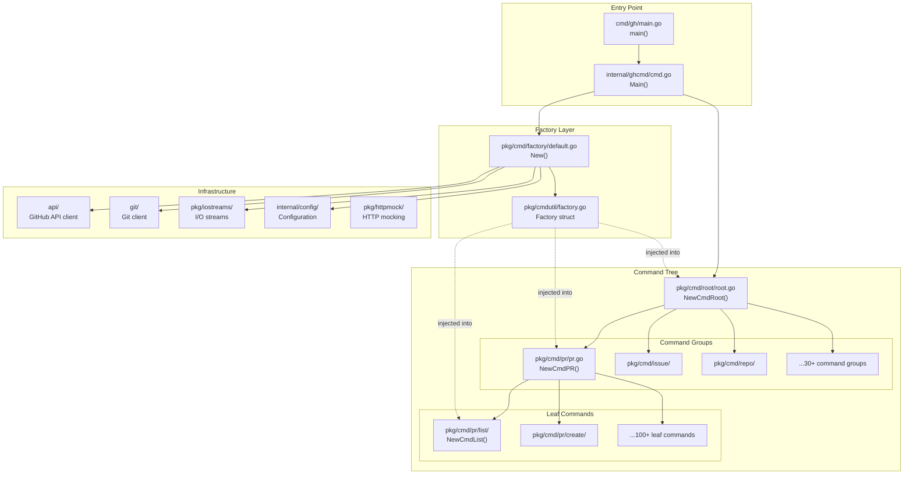
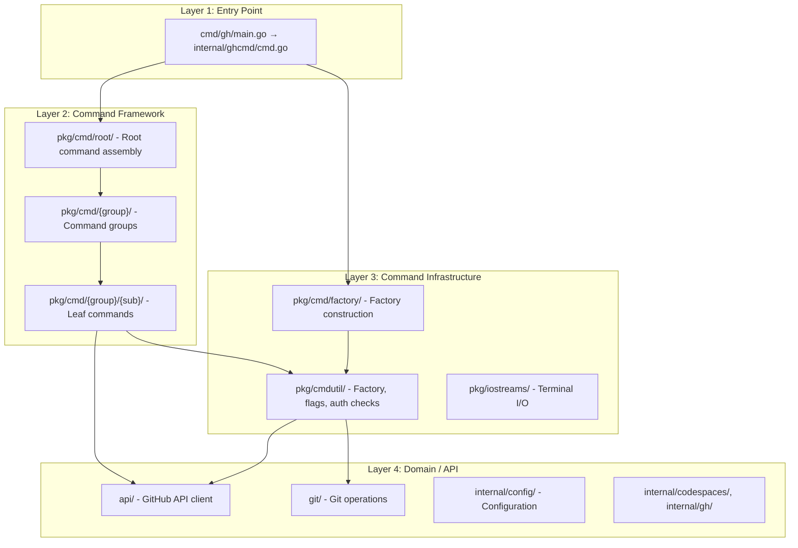

# Architecture Analysis

> Generated by architecture-analyzer for github/cli (gh)

## Architecture Overview

```
Style: Layered with Dependency Injection
Deployment: Single CLI binary (monolith)
Key Pattern: Factory-based Dependency Injection with Lazy Initialization
```

The GitHub CLI uses a **Command Factory** pattern to wire dependencies into a tree of cobra commands. A single `cmdutil.Factory` struct serves as the dependency injection container, constructed once at startup with ordered wiring of lazy-initialized closures. This factory is threaded through the entire command hierarchy, enabling each leaf command to extract only the dependencies it needs.

---

## Component Diagram



---

## Component Catalog

### 1. Factory Struct (`cmdutil.Factory`)

- **Location**: `/Users/andrew/Code/vendor/github/cli/pkg/cmdutil/factory.go`
- **Responsibility**: Dependency injection container holding all shared services needed by CLI commands
- **Dependencies**: Interfaces from `browser`, `extensions`, `git`, `iostreams`, `prompter`, `ghrepo`, `gh.Config`, `context.Remotes`
- **Dependents**: Every command constructor (`NewCmd*` functions)
- **Public Interface**:
  ```go
  type Factory struct {
      // Eager values (set at construction)
      AppVersion     string
      ExecutableName string
      Browser          browser.Browser
      ExtensionManager extensions.ExtensionManager
      GitClient        *git.Client
      IOStreams        *iostreams.IOStreams
      Prompter         prompter.Prompter

      // Lazy closures (called on demand)
      BaseRepo       func() (ghrepo.Interface, error)
      Branch         func() (string, error)
      Config         func() (gh.Config, error)
      HttpClient     func() (*http.Client, error)
      PlainHttpClient func() (*http.Client, error)
      Remotes        func() (context.Remotes, error)
  }
  ```

**Design Decisions**:
- **Two categories of fields**: Concrete values (Browser, GitClient, IOStreams, Prompter) vs. lazy closures (BaseRepo, Config, HttpClient, Remotes, Branch). The lazy closures defer expensive operations (network, filesystem, git) until actually needed by a command.
- **PlainHttpClient** exists separately from HttpClient because some commands (e.g., login flows) must control their own auth headers rather than using the auto-authenticated client.

### 2. Factory Constructor (`factory.New`)

- **Location**: `/Users/andrew/Code/vendor/github/cli/pkg/cmd/factory/default.go`
- **Responsibility**: Constructs the Factory with ordered dependency wiring
- **Dependencies**: `cmdutil.Factory` (struct), all infrastructure packages
- **Dependents**: `ghcmd.Main()` (single call site)
- **Public Interface**: `func New(appVersion string) *cmdutil.Factory`

**Wiring Order** (dependencies flow downward):
```
Config         (no factory deps)
IOStreams       (depends on Config)
HttpClient     (depends on Config, IOStreams)
PlainHttpClient(depends on IOStreams)
GitClient      (depends on IOStreams, Executable)
Remotes        (depends on Config, GitClient)
BaseRepo       (depends on Remotes)
Prompter       (depends on Config, IOStreams)
Browser        (depends on Config, IOStreams)
ExtensionMgr   (depends on Config, HttpClient, IOStreams)
Branch         (depends on GitClient)
```

This ordering is explicit in the code with inline comments documenting each dependency. The wiring uses closures that capture the factory pointer `f`, enabling lazy resolution through the factory's own fields.

### 3. Root Command Builder (`root.NewCmdRoot`)

- **Location**: `/Users/andrew/Code/vendor/github/cli/pkg/cmd/root/root.go`
- **Responsibility**: Assembles the complete command tree, applying two different Factory configurations
- **Dependencies**: `cmdutil.Factory`, all command group packages, version info
- **Dependents**: `ghcmd.Main()`
- **Public Interface**: `func NewCmdRoot(f *cmdutil.Factory, version, buildDate string) (*cobra.Command, error)`

**Key Design Pattern -- Dual Factory Strategy**:
```go
// Commands using simple repo resolution
cmd.AddCommand(authCmd.NewCmdAuth(f))
cmd.AddCommand(configCmd.NewCmdConfig(f))

// Commands using API-aware "smart" repo resolution
repoResolvingCmdFactory := *f  // shallow copy
repoResolvingCmdFactory.BaseRepo = factory.SmartBaseRepoFunc(f)
cmd.AddCommand(prCmd.NewCmdPR(&repoResolvingCmdFactory))
cmd.AddCommand(issueCmd.NewCmdIssue(&repoResolvingCmdFactory))
```

This creates a second Factory variant (via struct copy) where `BaseRepo` uses API calls to resolve which remote corresponds to the "base" repository (handling forks). Commands that do not operate on repositories (auth, config, gist, etc.) use the original factory with the simpler `BaseRepoFunc`.

### 4. Command Group Builder (e.g., `pr.NewCmdPR`)

- **Location**: `/Users/andrew/Code/vendor/github/cli/pkg/cmd/pr/pr.go`
- **Responsibility**: Groups related subcommands under a parent command
- **Dependencies**: `cmdutil.Factory`, all subcommand packages
- **Dependents**: `root.NewCmdRoot()`
- **Public Interface**: `func NewCmdPR(f *cmdutil.Factory) *cobra.Command`

**Pattern**: Group builders pass the Factory and `nil` as the `runF` parameter to each leaf command constructor:
```go
cmdList.NewCmdList(f, nil)   // nil runF = use real implementation
cmdCreate.NewCmdCreate(f, nil)
```

The `nil` second argument means "use the real `listRun` function." In tests, a custom `runF` is provided for interception.

### 5. Leaf Command Builder (e.g., `pr/list.NewCmdList`)

- **Location**: `/Users/andrew/Code/vendor/github/cli/pkg/cmd/pr/list/list.go`
- **Responsibility**: Defines a single CLI command with its flags, validation, and execution logic
- **Dependencies**: `cmdutil.Factory` (for dependency extraction), `runF` (for test injection)
- **Dependents**: Parent command group
- **Public Interface**: `func NewCmdList(f *cmdutil.Factory, runF func(*ListOptions) error) *cobra.Command`

**Three-Phase Pattern** every leaf command follows:

1. **Construction phase** (in `NewCmdList`): Extract dependencies from Factory into an Options struct
   ```go
   opts := &ListOptions{
       IO:         f.IOStreams,
       HttpClient: f.HttpClient,
       Browser:    f.Browser,
   }
   ```

2. **Validation phase** (in `RunE` closure): Validate flags, set deferred dependencies
   ```go
   RunE: func(cmd *cobra.Command, args []string) error {
       opts.BaseRepo = f.BaseRepo  // deferred until command runs
       if runF != nil {
           return runF(opts)       // test interception point
       }
       return listRun(opts)        // real execution
   }
   ```

3. **Execution phase** (in `listRun`): Business logic using only the Options struct
   ```go
   func listRun(opts *ListOptions) error {
       httpClient, err := opts.HttpClient()  // lazy resolution
       baseRepo, err := opts.BaseRepo()      // lazy resolution
       // ... business logic ...
   }
   ```

### 6. Repo Override Mechanism (`cmdutil.EnableRepoOverride`)

- **Location**: `/Users/andrew/Code/vendor/github/cli/pkg/cmdutil/repo_override.go`
- **Responsibility**: Enables the `-R/--repo` flag on command groups, dynamically replacing `Factory.BaseRepo`
- **Dependencies**: `cmdutil.Factory`
- **Dependents**: Command groups that operate on repositories (pr, issue, repo, etc.)

**Pattern**: Mutates the factory's `BaseRepo` field at runtime in a `PersistentPreRunE` hook:
```go
func EnableRepoOverride(cmd *cobra.Command, f *Factory) {
    cmd.PersistentPreRunE = func(cmd *cobra.Command, args []string) error {
        repoOverride, _ := cmd.Flags().GetString("repo")
        f.BaseRepo = OverrideBaseRepoFunc(f, repoOverride)
        return nil
    }
}
```

This demonstrates how Factory fields can be dynamically replaced at any point before the leaf command's `RunE` executes, thanks to the lazy closure pattern.

---

## Layer Architecture



**Layer Boundaries:**
- Layer 1 creates the Factory and passes it to Layer 2. It also handles top-level error mapping and update checks.
- Layer 2 passes the Factory by pointer; command groups forward it to leaf commands.
- Layer 3 defines the Factory contract (struct) separately from its construction (different packages). Leaf commands depend on the struct definition but not the constructor.
- Layer 4 is accessed only through lazy closures stored in the Factory or Options structs. Leaf commands never import factory construction code.

---

## Data Flow

```mermaid
flowchart LR
    CLI["CLI args<br/>os.Args"] --> MAIN["ghcmd.Main()"]
    MAIN --> CTOR["factory.New()<br/>Build Factory"]
    CTOR --> ROOT["NewCmdRoot()<br/>Assemble tree"]
    ROOT --> COBRA["cobra.Execute()<br/>Route command"]
    COBRA --> LEAF["NewCmdList.RunE<br/>Validate + dispatch"]
    LEAF --> RUN["listRun(opts)<br/>Business logic"]
    RUN --> LAZY["opts.HttpClient()<br/>Lazy resolve"]
    LAZY --> API["api.Client<br/>GitHub API"]
    API --> RESPONSE["HTTP Response"]
    RESPONSE --> FORMAT["Table/JSON<br/>Formatter"]
    FORMAT --> OUTPUT["IOStreams<br/>stdout"]
```



**Key Flows:**

1. **Startup flow**: `main()` -> `ghcmd.Main()` -> `factory.New(version)` -> `root.NewCmdRoot(factory)` -> `cobra.ExecuteContextC()`. The Factory is constructed once, the command tree is assembled, then cobra routes to the appropriate leaf command.

2. **Command execution flow**: `RunE` closure validates flags -> copies deferred Factory fields into Options -> calls `runF` (test) or `listRun` (prod) -> lazy closures resolve HTTP client, base repo on demand -> API calls -> format output to IOStreams.

3. **Repo resolution flow**: Two strategies diverge at `NewCmdRoot`:
   - **Simple** (`BaseRepoFunc`): Takes first git remote. Used by commands that do not need fork awareness.
   - **Smart** (`SmartBaseRepoFunc`): Calls GitHub API to resolve fork relationships. Used by pr, issue, repo, release, run, workflow, etc.

4. **Repo override flow**: When `-R owner/repo` flag is provided, `EnableRepoOverride` replaces `Factory.BaseRepo` in a `PersistentPreRunE` hook before the leaf command runs, so the override takes effect transparently.

---

## Communication Patterns

| From | To | Pattern | Purpose |
|------|-----|---------|---------|
| `ghcmd.Main` | `factory.New` | Synchronous call | One-time factory construction |
| `NewCmdRoot` | `NewCmdPR`, etc. | Synchronous, pass-by-pointer | Thread factory through command tree |
| `NewCmdPR` | `NewCmdList` | Synchronous, pass factory + nil runF | Build subcommand with shared deps |
| Leaf `RunE` | `listRun` | Synchronous function call | Dispatch to business logic |
| `listRun` | `Factory.HttpClient()` | Lazy closure invocation | Deferred resource acquisition |
| `listRun` | `Factory.BaseRepo()` | Lazy closure invocation | Deferred repo resolution |
| `EnableRepoOverride` | `Factory.BaseRepo` | Field mutation (pre-run hook) | Dynamic dependency replacement |
| Root `PersistentPreRunE` | Auth check | Synchronous, pre-command | Gate unauthenticated access |

---

## Cross-Cutting Concerns

**Authentication**: Checked globally via `PersistentPreRunE` in the root command. Commands opt out with `cmdutil.DisableAuthCheck(cmd)`. Auth tokens are injected into HTTP clients via `api.HTTPClientOptions.Config` (from the `Authentication()` config method). SSO errors are captured via response header extraction (`X-GitHub-SSO`).

**Error Handling**: Multi-tier strategy:
- Leaf commands return typed errors (`NoResultsError`, `FlagError`, `SilentError`, `PendingError`)
- `ghcmd.Main()` maps error types to exit codes (0=OK, 1=Error, 2=Cancel, 4=Auth, 8=Pending)
- HTTP 401 errors trigger auth suggestions; SAML errors show browser URLs

**Configuration**: Loaded lazily via `Factory.Config()` closure. The config system supports migration (e.g., multi-account migration in `Main()`). Config influences browser choice, prompt behavior, color support, and pager settings.

**I/O and TTY Detection**: `pkg/iostreams.IOStreams` handles stdout/stderr/stdin with TTY detection, color support, and pager integration. Commands adapt output format based on `IsStdoutTTY()` (e.g., table headers only in TTY mode).

**Logging**: HTTP request/response logging controlled by `GH_DEBUG` environment variable, routed through `IOStreams.ErrOut`.

---

## Architectural Decisions

1. **Factory is a struct, not an interface**: The Factory uses a concrete struct with public fields rather than an interface. This simplifies test construction (partial initialization is valid in Go) but means the injection contract is implicit rather than enforced by the compiler.

2. **Lazy closures over eager initialization**: Five of the thirteen Factory fields are `func() (T, error)` closures. This ensures expensive operations (HTTP client setup, git remote discovery, config file I/O) only run for commands that need them, improving startup time for simple commands.

3. **Options struct per command**: Each leaf command defines its own Options struct that cherry-picks dependencies from the Factory. The `listRun` function depends only on `ListOptions`, not on the Factory. This achieves the principle of depending on what you use, not what you are given.

4. **runF test injection**: Every `NewCmd*` function accepts an optional `runF func(*Options) error` parameter. When non-nil, it replaces the real run function. This allows tests to intercept execution after flag parsing and validation but before business logic, enabling tests to inject additional mocks (e.g., `Detector`, `Now`) into the Options struct.

5. **Struct copy for Factory variants**: `NewCmdRoot` creates a second Factory variant by shallow-copying the struct (`repoResolvingCmdFactory := *f`) and replacing `BaseRepo`. This avoids interfaces or builder patterns while allowing different command groups to have different resolution strategies.

6. **Runtime field mutation for --repo override**: `EnableRepoOverride` mutates `Factory.BaseRepo` in a cobra pre-run hook. This works because leaf commands defer reading `BaseRepo` until their `RunE` closure executes (after hooks run). This is an elegant use of Go's closure semantics but requires careful ordering awareness.

7. **Separation of Factory definition from construction**: `cmdutil.Factory` (definition) lives in `pkg/cmdutil/`, while `factory.New()` (construction) lives in `pkg/cmd/factory/`. This means leaf commands import only the struct definition, never the construction logic, keeping the dependency graph clean.

---

## Quality Assessment

| Attribute | Rating | Notes |
|-----------|--------|-------|
| Modularity | 8/10 | Each command is self-contained in its own package. The Options struct pattern decouples business logic from the DI container. The only coupling is the shared Factory struct type. |
| Testability | 9/10 | Exceptional. The runF injection, Options struct isolation, httpmock package, and iostreams.Test() make leaf commands trivially testable without any real I/O, HTTP, or git. Tests construct partial Factory structs with only needed fields. |
| Extensibility | 9/10 | Adding a new command requires: (1) create package with NewCmd*/Options/run pattern, (2) add one line in parent group or root. No framework code changes needed. Extensions system further allows out-of-tree commands. |
| Maintainability | 7/10 | Consistent patterns make commands predictable. However, the Factory struct is a God Object (13 fields, growing), and runtime field mutation (repo override) can be surprising. The ordered wiring in New() is fragile if dependencies change. |
| Scalability | 7/10 | Pattern scales well for number of commands (100+), but the Factory grows with each new shared dependency. The two-variant factory (simple vs smart BaseRepo) is a one-off; adding more variants would not scale. |

---

## Adaptation Recommendations

### Preserve

- **Options struct per command**: This is the single most valuable pattern. It provides compile-time documentation of each command's dependencies, enables focused testing, and decouples business logic from the DI framework.
- **Lazy closure fields**: Deferring expensive operations via closures is essential for CLI responsiveness. A command like `gh config list` should not initialize git clients or HTTP clients.
- **runF test injection**: The `func(*Options) error` parameter elegantly separates flag parsing/validation testing from business logic testing.
- **Package-per-command structure**: Self-contained packages with `NewCmd*`, Options struct, and run function provide clear ownership boundaries.

### Consider Changing

- **Factory struct growth**: With 13+ fields, the Factory is approaching God Object territory. Consider splitting into focused sub-factories (e.g., `GitFactory`, `APIFactory`, `UIFactory`) or using a service locator with typed getters.
- **Implicit wiring order**: The ordered construction in `New()` relies on comments to document dependencies. A more explicit dependency graph (or functional options pattern) would make ordering violations compile-time errors rather than runtime bugs.
- **Runtime field mutation**: `EnableRepoOverride` mutating `Factory.BaseRepo` at runtime via pre-run hooks is clever but implicit. An explicit pipeline or middleware pattern would make the override chain visible.
- **Two-variant factory approach**: The struct-copy approach for `repoResolvingCmdFactory` is ad-hoc. If more variants are needed, consider a builder or decorator pattern.

### Risk Areas

- **Factory field additions**: Any new shared dependency requires modifying the Factory struct (definition), `New()` (construction), and potentially `NewCmdRoot()` (if variant-specific). This is a coordination cost across three files in three packages.
- **Pre-run hook ordering**: `EnableRepoOverride` sets a `PersistentPreRunE` that must execute before leaf command `RunE`. Cobra's hook execution order is well-defined but not always intuitive with nested command groups. The `executeParentHooks` helper mitigates this.
- **Closure capture semantics**: Factory wiring captures `f` by pointer. If a closure reads a Factory field that another closure lazily initializes, execution order matters. This is currently correct but could regress if wiring order changes.
