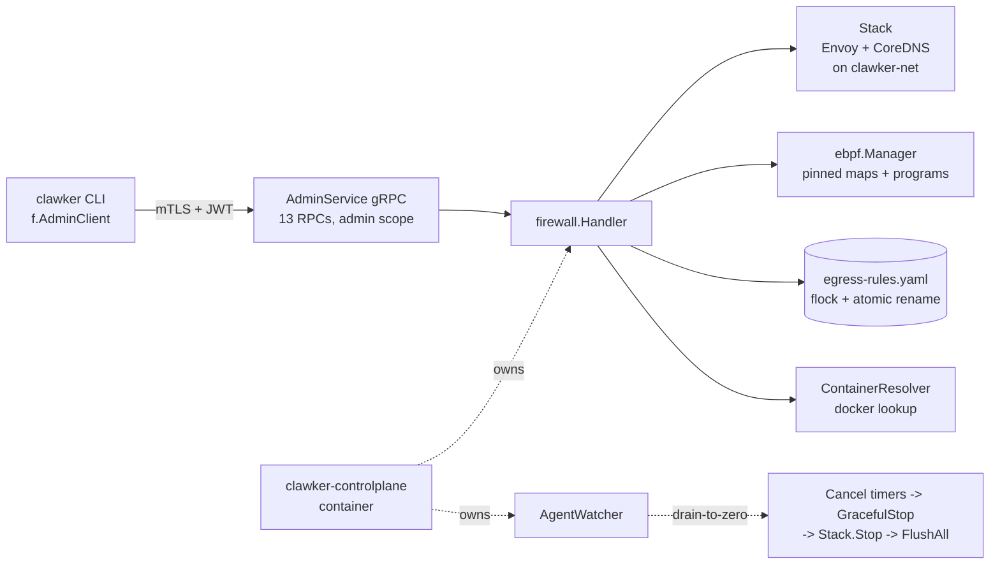

# CP Owns the Firewall (Branch 2)

> **Status**: landed on `feat/firewall-cp-migration` (commits `6d1a5c0a..fc253a6c`).
> **Spec**: `.correctless/specs/cp-initiative/branch-2-cp-owns-firewall.md`
> **Verification**: `.correctless/verification/branch-2-cp-owns-firewall-verification.md` — PASS, 0 blocking, 5 weak items, 0 open drift (after `/cdocs`).

## What it does

Branch 2 inverts firewall ownership. Before B2, a host-side `internal/firewall/` package ran a daemon that managed Envoy, CoreDNS, and eBPF state. The CLI called into that package directly. After B2, the **clawker control plane** container is the single owner of that state, and CLI commands speak the `AdminService` gRPC surface (13 methods, mTLS + OAuth2 JWT) to operate it.

The host-side daemon is gone. `internal/firewall/` is deleted. There is no firewall PID file. The CP self-starts when a CLI command first needs it and self-terminates when the last agent container drains.

## Why it matters

1. **One owner for security state.** eBPF programs, MITM CA, and Envoy/CoreDNS containers live behind a single authenticated gRPC surface instead of a shared host directory a CLI process races with.
2. **mTLS + OAuth2 by default.** Every firewall operation goes through the uniform `admin` scope; an unmapped RPC fails closed at compile time (`TestAdminMethodScopes_CoversAllRPCs` reflects over `AdminService_ServiceDesc`).
3. **Drain-to-zero lifecycle.** The CP watches agent count and self-shuts-down when the last agent exits — no stale daemons, no PID files to leak. `on-failure` restart policy does not retrigger on a clean exit.
4. **Clean layering.** `internal/auth/` is now a primitives-only leaf (no `api/admin/v1` import); the admin-dial helper lives in `internal/controlplane/adminclient/`.

## How to use it

Day-to-day, nothing changes. Any firewall command auto-bootstraps the CP:

```bash
clawker firewall status    # auto-starts CP on first call
clawker firewall add docs.clawker.dev
clawker firewall bypass 5m --agent dev
```

Break-glass CP lifecycle commands are new:

```bash
clawker controlplane up      # start the CP container (idempotent)
clawker controlplane status  # CP health + best-effort firewall status
clawker controlplane down    # stop the CP — drains firewall + eBPF, no orphans
```

`controlplane down` sends SIGTERM to the CP, whose own shutdown path stops Envoy + CoreDNS and flushes per-container eBPF state before exiting. No prerequisite verbs, no orphan containers, no stale BPF map entries.

## Architecture



**Invariants** (see spec for full list):

- **INV-B2-007** drain-to-zero ordering: `CancelAllBypassTimers` -> `GracefulStop` -> `Stack.Stop` -> `ebpf.Manager.FlushAll`.
- **INV-B2-009** uniform `admin` scope: every AdminService RPC requires one scope; unmapped methods fail closed.
- **INV-B2-013** defensive startup cleanup: `ebpf.Manager.CleanupStaleBypass` runs before `orchestrator.SetReady`.
- **INV-B2-016** drift guard: `FirewallEnable` always re-resolves `container_id -> cgroup_path` via Docker; returns `FailedPrecondition` when the container is gone.

## Key components

| Component | Path | Role |
|-----------|------|------|
| Composite admin server | `internal/controlplane/server.go` | Embeds `*firewall.Handler` via Go method promotion |
| Firewall handler | `internal/controlplane/firewall/handler.go` | 13 RPCs + bypass timer management |
| Envoy/CoreDNS stack | `internal/controlplane/firewall/stack.go` | DooD container lifecycle on `clawker-net` |
| Agent watcher | `internal/controlplane/watcher.go` | Drain-to-zero callback (INV-B2-007) |
| Host-side bootstrap | `internal/controlplane/bootstrap.go` | `EnsureRunning` / `Stop` / `CPRunning` |
| CP Manager noun | `internal/controlplane/manager.go` | Factory-facing `f.ControlPlane()` |
| Admin dial helper | `internal/controlplane/adminclient/dial.go` | mTLS + JWT client dial (leaf-clean) |
| Break-glass CLI | `internal/cmd/controlplane/` | `up`/`down`/`status` |

## Configuration

No new user-facing config. The firewall YAML schema (`security.firewall.*`) is unchanged. All CP ports remain under `settings.yaml -> controlplane.*` (AdminPort 7443, HealthPort 7080, Hydra 4444, etc., all published to `127.0.0.1` only).

## Known limitations

- Real-Docker integration test for the B1→B2 RO→RW mount upgrade path is not present. Unit coverage is strong (`TestEnsureRunning_MountDivergence_RecreatesContainer`).
- Module-root AST `boundary_test.go` mirroring `TestNoMobyImportOutsideWhail` is not yet written. INV-B2-001/002 compliance is by-inspection today.
- One-domain-per-TCP/SSH-port limitation from pre-B2 still applies (tracked in `#235`).

## Related documents

- Spec: `.correctless/specs/cp-initiative/branch-2-cp-owns-firewall.md`
- Verification: `.correctless/verification/branch-2-cp-owns-firewall-verification.md`
- CP package reference: `internal/controlplane/CLAUDE.md`
- Firewall subpackage reference: `internal/controlplane/firewall/CLAUDE.md`
- Break-glass CLI reference: `internal/cmd/controlplane/CLAUDE.md`
- Architecture: `.claude/docs/ARCHITECTURE.md` § Control Plane
