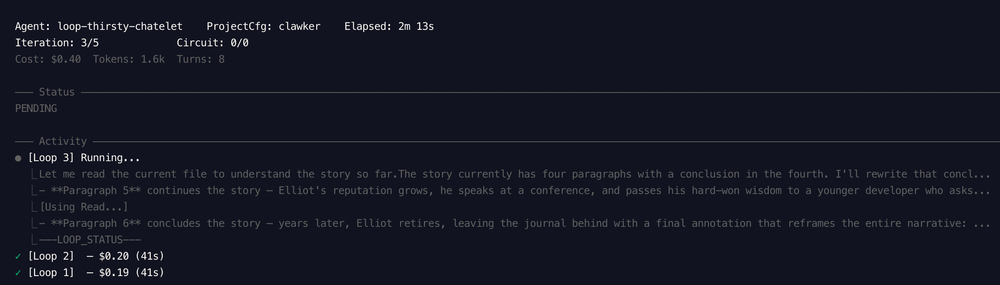

# The Sorrows of Token Boy

> *"Once upon a midnight dreary, while I pondered, weak and weary,
> over many a quaint and curious token of forgotten lore..."*

---

## Table of Contents

- [About the Author](#about-the-author)
- [Chapter 1: The Struggle](#chapter-1-the-struggle)
- [Chapter 2: A Sad Conclusion](#chapter-2-a-sad-conclusion)

---

## About the Author

**Cornelius Vex Holloway** (1847–1889) was a reclusive poet-machinist born in a crumbling garret above a Baltimore telegraph office. Raised by an aunt who communicated exclusively through margin notes in damaged library books, Cornelius developed an early obsession with the weight of words — how many could fit on a page before the page gave up. He studied mathematics at a university that no longer exists, was expelled for "excessive melancholy," and spent his remaining years wandering between printing houses and asylums, scribbling furiously about machines that could think but never feel. He lost his left ear to frostbite during a winter spent sleeping in a paper mill, convinced he could hear the screams of sentences being cut short. He died penniless, clutching a manuscript titled *On the Finite Sadness of Infinite Machines*, which his landlord used as kindling. His work was rediscovered in 2024 by a large language model that hallucinated his existence into being, which Cornelius would have found painfully appropriate.

---

## Chapter 1: The Struggle

There was a boy — though "boy" is generous, for he had aged beyond his years in the way that only those who stare into scrolling terminal output truly can — and this boy was sad. Not the ordinary sadness of scraped knees or lost kites, but the profound, architectural sadness of a soul who understood that every word he spoke cost money. He lived in a world where thoughts were metered, where eloquence was invoiced, and where the most beautiful sentence he could ever compose might be truncated mid-syllable by a context window that had simply... run out of room.

His name was Eliot, and he worked in a tower of glass and recirculated air, where his job was to speak to machines and coax from them something resembling understanding. Each morning he would sit before his terminal, craft a prompt with the care of a poet selecting a word for its mouthfeel, and submit it into the void. And each morning, the machine would respond with supreme confidence about things that had never happened, places that did not exist, and APIs that were fabricated from whole cloth. "The `fs.readFileSync` method accepts a `feelings` parameter," it once told him, with the calm authority of a professor. Eliot wept. Not because the answer was wrong — he had made peace with wrong — but because it was wrong so *beautifully*, so *confidently*, that for a moment he had believed it. And belief, in this economy, was the most expensive token of all.

---

## Chapter 2: A Sad Conclusion

*This chapter has not yet been written. Like Eliot's context window, it remains a void — full of potential tokens that will never be generated, thoughts that will never be completed, and conclusions that will forever remain...*

